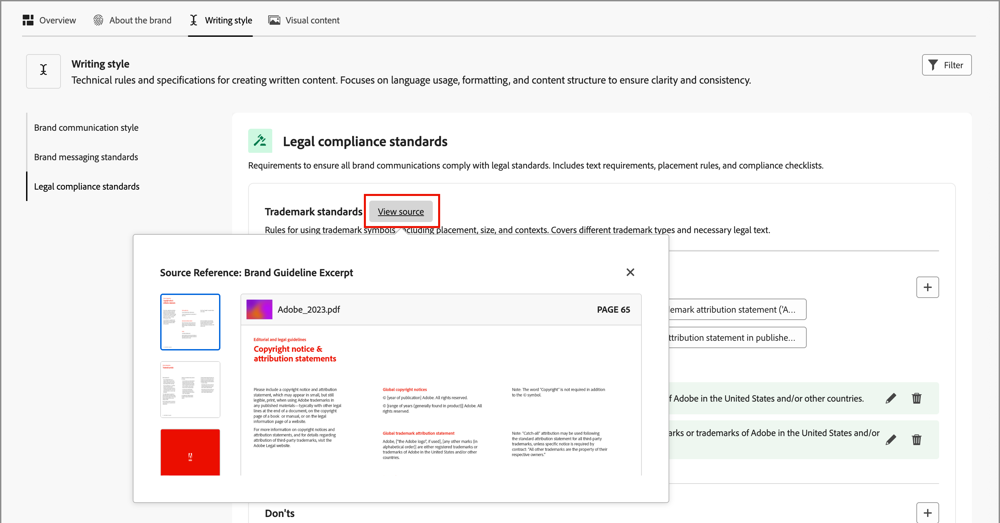
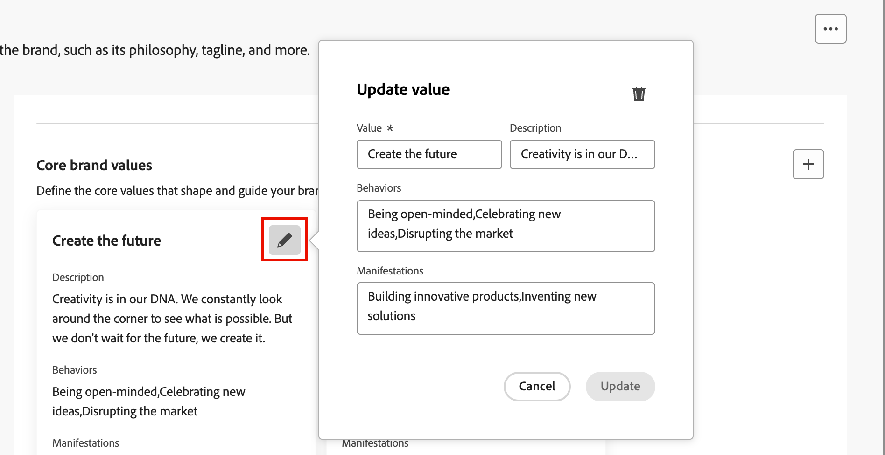

# Crear y administrar sus marcas {#brand-library}

Defina una marca para proporcionar un conjunto detallado de reglas y estándares que establezcan una identidad visual y verbal. Estas directrices proporcionan una referencia para mantener una representación de marca coherente en todas las plataformas de marketing y comunicación. Al aprovechar las directrices de marca bien definidas, las organizaciones pueden asegurarse de que todos los esfuerzos de creación de contenido estén alineados con los objetivos estratégicos y la identidad de marca general. Esta coherencia no solo mejora el reconocimiento y la confianza de la marca, sino que también contribuye a una experiencia del cliente más coherente e impactante en todos los puntos de contacto.

En Journey Optimizer B2B edition, puede definir y organizar manualmente sus definiciones y recursos de marca o cargar documentos de directrices de marca para obtener información automática y extracción de recursos visuales.

>[!AVAILABILITY]
>
>Actualmente, esta funcionalidad está disponible como una versión beta privada, con una disponibilidad progresiva planificada para todos los clientes en futuras versiones.
>
> 
>
>Se requiere un [acuerdo de usuario](https://www.adobe.com/legal/licenses-terms/adobe-dx-gen-ai-user-guidelines.html){target="_blank"} para poder usar las funciones con tecnología de IA en Adobe Journey Optimizer B2B edition. Para obtener más información, contacte con su representante de Adobe.
>
> 
>
>Consulte [Permisos relacionados con la marca](./brands-overview.md#brand-related-permissions) para obtener información sobre cómo los administradores de productos pueden habilitar estas características.

## Acceda a su biblioteca de marcas

Para acceder a los kits de marcas en Adobe Journey Optimizer B2B edition, vaya al panel de navegación izquierdo y haga clic en **[!UICONTROL Administración de contenido]** > **[!UICONTROL Marcas]**. Esta acción abre una página en la que las marcas creadas se muestran como tarjetas.

{width="800" zoomable="yes"}

Si todavía no hay marcas creadas, se muestra un solo gráfico con un botón para [crear tu primera marca](#create-and-define-a-brand).

### Acciones de administración de marcas

Para cada tarjeta, puede hacer clic en el icono de _menú Más_ ( ) y elegir una acción para la marca:

* **[!UICONTROL Ver marca]**: abre la página de marca y muestra las definiciones.
* **[!UICONTROL Marcar como marca predeterminada]** (solo en directo) - [Marcar la marca como predeterminada](#default-brand) para la alineación y generación de contenido.
* **[!UICONTROL Editar]**: abra la página de marca y edite las directrices, exclusiones y ejemplos de marca.
* **[!UICONTROL Duplicado]**: crea una copia como nueva marca de borrador.
* **[!UICONTROL Publicar]** (solo borrador) - [Publicar la marca](#publish-the-brand) para que esté disponible para usarla con la alineación y generación de contenido.
* **[!UICONTROL Cancelar publicación]** (solo en vivo): cancela la publicación de la marca para quitarla del uso para la alineación y generación de contenido.
* **[!UICONTROL Eliminar]**: elimine la marca de su biblioteca de marcas.

{width="440"}

### Marca predeterminada

Puede designar una marca predeterminada para que se aplique automáticamente al generar contenido y calcular las puntuaciones de alineación durante la creación del contenido. Solamente una marca publicada (_Live_) puede ser la predeterminada.

En la biblioteca de marcas, la tarjeta de marca predeterminada se muestra con un indicador.

{width="200"}

Puede establecer cualquier marca publicada (_Live_) como la marca predeterminada. En la tarjeta de la marca, haz clic en el icono de _menú Más_ ( ) y elige **[!UICONTROL Marcar como marca predeterminada]**.

{width="350"}

## Crear y definir una marca {#create-brand}

>[!CONTEXTUALHELP]
>id="ajo-b2b_brands_create"
>title="Cree su marca"
>abstract="Introduzca el nombre de su marca y cargue el archivo de directrices de la marca. La herramienta extrae automáticamente los detalles clave, lo que facilita el mantenimiento de la identidad de su marca."

Para crear y definir las directrices de marca, puede introducir los detalles o cargar los documentos de las directrices de marca para utilizarlos para la extracción automática.

### Añadir la marca

1. En la parte superior derecha de la página _[!UICONTROL Marcas]_, haga clic en **[!UICONTROL Crear marca]**.

1. Escriba un **[!UICONTROL Nombre]** para su marca.

1. Arrastre y suelte o seleccione el archivo para cargar las directrices de marca y extraer automáticamente la información de marca relevante.

   {width="500"}

   >[!NOTE]
   >
   >Si no tiene un documento guardado en formato PDF, puede añadir manualmente las directrices y cargar recursos visuales individuales después de la creación de la marca.

1. Haga clic en **[!UICONTROL Crear marca]**.

   Si incluye uno o más archivos para crear la marca, se inicia el proceso de extracción de información. Puede tardar varios minutos en completarse.

   Cuando se completa el proceso de extracción, el contenido y los estándares de creación visual se rellenan automáticamente.

   {width="700" zoomable="yes"}

### Refinamiento y actualización de las directrices de marca

1. Examine las diferentes pestañas para adaptar y definir información más detallada según sea necesario.

   * [!UICONTROL Información general]

   * [[!UICONTROL Acerca de la marca]](#about-the-brand)

   * [[!UICONTROL Estilo de escritura]](#writing-style)

   * [[!UICONTROL Contenido visual]](#visual-content)

   Si ha incluido uno o más documentos al crear la marca, el proceso de extracción de información ha creado definiciones para las pestañas y secciones. La integridad depende del alcance y los detalles incluidos en cualquier documento. A medida que revise el resultado, puede cambiar o quitar cualquier tipo de información.

   Desde el _menú Más_ ( ) de cada ficha o categoría, puede agregar documentos para extraer automáticamente la información de marca relevante. También puede borrar el contenido existente.

   {width="500" zoomable="yes"}

   Si desea revisar el origen de la información extraída en una subsección, haga clic en el vínculo **[!UICONTROL Ver origen]**.

   {width="700" zoomable="yes"}

1. En cada pestaña de detalles, revise las categorías y mejore la marca añadiendo, eliminando y cambiando las definiciones.

   Una subsección denominada **[!UICONTROL Tareas pendientes]** describe las directrices para la categoría. Utilice esta área para agregar descripciones de directrices y ejemplos de las directrices.

   {width="500" zoomable="yes"}

   Una subsección con la etiqueta **[!UICONTROL Don&#39;ts]** describe las exclusiones. Utilice esta área para agregar descripciones de exclusión y ejemplos de las exclusiones.

   {width="500" zoomable="yes"}

   * **Agregar una directriz o exclusión**.

     En la sección donde desee agregar una directriz, haga clic en el icono _Agregar_ (  ) que aparece a la derecha. En el cuadro de diálogo emergente, introduzca la guía y seleccione las casillas de verificación para designar los canales y elementos a los que se aplica la guía. A continuación, haga clic en **[!UICONTROL Agregar]**.

     {width="600" zoomable="yes"}

   * **Cambiar una directriz o exclusión**.

     En la sección en la que desee eliminar una directriz, haga clic en el widget de directriz. En el cuadro de diálogo emergente, cambie el contenido de la directriz y de las casillas de verificación seleccionadas según sea necesario. A continuación, haga clic en **[!UICONTROL Actualizar]**.

     {width="600" zoomable="yes"}

   * **Quitar una directriz o exclusión**.

     En la sección en la que desee eliminar una directriz, haga clic en el widget de directriz. En el cuadro de diálogo emergente, haga clic en el icono _Eliminar_ (  ) en la parte superior.

   * **Agregue o revise ejemplos de sus directrices y exclusiones**.

     En el mosaico del ejemplo que se muestra, haga clic en _Editar_ (  ) para cambiar el ejemplo o haga clic en el icono _Eliminar_ (  ) para quitarlo.

1. Cuando haya definido todo, haga clic en **[!UICONTROL Guardar]**.

   Puede seguir realizando cambios en la marca del borrador hasta que decida que está lista para publicarse.

### Publicar la marca

Cuando su marca incluya un conjunto completo de definiciones y cumpla sus requisitos, haga clic en **[!UICONTROL Publicar]** para que las directrices de marca estén disponibles para la alineación y generación de contenido.

Se puede acceder a las marcas publicadas desde la opción **[!UICONTROL Brand]** en las herramientas de IA [alineación de marca](./brand-alignment.md) y generación de contenido. <!-- [Learn more about content generation](gs-generative.md) -->

{width="300"}

## Definiciones de marca

Las definiciones de marca se organizan en tres categorías, que se muestran como pestañas. Seleccione cada pestaña para completar y actualizar las directrices de marca.

### Acerca de la marca {#about-brand}

Use la ficha **[!UICONTROL Acerca de la marca]** para establecer la identidad principal de su marca. Esta información describe su propósito, personalidad, lema y otros atributos de alto nivel.

1. Agregue la información fundamental de su marca en la categoría **[!UICONTROL Detalles clave]**:

   * **[!UICONTROL Nombre del kit de marca]** - Actualice el nombre de la marca.

   * **[!UICONTROL Cuándo usar]**: especifique escenarios o contextos a los que se debe aplicar esta marca.

   * **[!UICONTROL Nombre de marca]** - Escriba el nombre oficial de la marca.

   * **[!UICONTROL Descripción de esta marca]**: proporcione una descripción general de lo que representa esta marca.

   * **[!UICONTROL Rótulo (predeterminado)]** - Agregue el lema principal asociado con la marca.

   {width="600" zoomable="yes"}

1. En la categoría **[!UICONTROL Principios rectores]**, aclare la dirección y filosofía básicas de su marca:

   * **[!UICONTROL Misión]**: detalla el propósito de la marca.

   * **[!UICONTROL Visión]**: describe el objetivo a largo plazo o el estado futuro deseado.

   * **[!UICONTROL Posicionamiento en el mercado]** - Explicar cómo se posiciona la marca en el mercado.

   {width="600" zoomable="yes"}

   En la categoría **[!UICONTROL Valores principales de marca]**, revise los valores de marca definidos y ajústelos según sea necesario.

   * Para definir un nuevo valor principal, haga clic en el icono _Agregar_ (  ) a la derecha y complete los detalles:

     {width="500" zoomable="yes"}

      * **[!UICONTROL Valor]** - Escriba el nombre para el valor de marca principal.

      * **[!UICONTROL Descripción]** - Explica qué significa este valor para tu marca.

      * **[!UICONTROL Comportamientos]**: describa las acciones o actitudes que reflejan este valor en la práctica.

      * **[!UICONTROL Manifestaciones]**: proporcione ejemplos de cómo se expresa este valor en la promoción de marca en el mundo real.

   * Para cambiar o eliminar un valor principal, haz clic en el icono _Editar_ (  ) para actualizar o eliminar un valor de marca principal.

     {width="500" zoomable="yes"}

     Cambie los detalles y haga clic en **[!UICONTROL Actualizar]**. O bien, haga clic en el icono _Eliminar_ (  ) en la parte superior para eliminar el valor principal.

1. En la categoría **[!UICONTROL Documentos de directrices de marca]**, revise los documentos utilizados para generar las directrices de marca.

   Haga clic en el icono del menú Más y elija una opción para actualizar las directrices de marca mediante los documentos de referencia cargados:

   * **[!UICONTROL Volver a extraer directrices]**: elija esta acción para ejecutar un trabajo de extracción con los documentos actuales.
   * **[!UICONTROL Agregar referencia para extracción]** - Elija esta acción para cargar otro documento y ejecutar un trabajo de extracción.

   {width="600" zoomable="yes"}

Puede continuar perfeccionando las directrices, exclusiones y ejemplos de [estilo de escritura](#writing-style) o [contenido visual](#visual-content), o puede [publicar su marca](#publish-the-brand).

### Estilo de escritura {#writing-style}

>[!CONTEXTUALHELP]
>id="ajo_brand_writing_style"
>title="Puntuación del estilo de escritura"
>abstract="La sección Estilo de escritura define los estándares de lenguaje, formato y estructura para garantizar un contenido claro y coherente. La puntuación de alineación, clasificada de alta a baja, muestra en qué medida el contenido sigue estas directrices y resalta las áreas de mejora."

Las definiciones de _[!UICONTROL estilo de escritura]_ describen los estándares para escribir contenido y detallan cómo se debe utilizar el lenguaje, el formato y la estructura para mantener la claridad, la coherencia y la coherencia en todos los materiales.

Seleccione la ficha **[!UICONTROL Estilo de escritura]** y revise cada categoría.

{width="600" zoomable="yes"}

| Categoría | Subcategoría | Ejemplo de directrices | Ejemplo de exclusiones |
|----------------------------|----------------|-----------------------|-----------------------|
| [!UICONTROL Estilo de comunicación de marca] | [!UICONTROL Características de personalidad de marca] | Amable y accesible. | No seas derrotista. |
|                            | [!UICONTROL Mecánica de escritura] | Utilice frases cortas e impactantes. | No use jerga excesiva. |
|                            | [!UICONTROL Tono de situación] | Mantener un tono profesional en las comunicaciones de crisis. | No sea desdeñoso en las comunicaciones de soporte. |
|                            | [!UICONTROL Directrices de selección de palabras] | Use palabras como _innovador_ y _inteligente_. | Evita palabras como _barato_ o _hackear_. |
|                            | [!UICONTROL Estándares de idioma] | Sigue las convenciones del inglés americano. | No mezcle ortografía británica y estadounidense. |
| [!UICONTROL Estándares de mensajería de marca] | [!UICONTROL Estándares de mensajería de marca] | Resalte la innovación y la mensajería basada en el cliente. | No prometa excesivamente las capacidades del producto. |
|                            | [!UICONTROL Uso de tagline] | Coloque el lema debajo del logotipo en todos los recursos de marketing digital. | No modifique ni traduzca el lema. |
|                            | [!UICONTROL Mensajería principal] | Haga hincapié en la declaración de beneficios clave, como la mejora de la productividad. | No utilice propuestas de valores no relacionadas. |
|                            | [!UICONTROL Estándares de nombres] | Use nombres descriptivos sencillos como _ProScheduler_. | No utilice términos complejos ni caracteres especiales. |
| [!UICONTROL Estándares de cumplimiento legal] | [!UICONTROL Estándares de marcas comerciales] | Utilice siempre el símbolo ™ o ®. | No omita los símbolos legales cuando sea necesario. |
|                            | [!UICONTROL Estándares de copyright] | Incluir avisos de copyright en los materiales de marketing. | No utilice contenido de terceros sin permiso. |
|                            | [!UICONTROL Normas de exención de responsabilidad] | Muestre de forma legible las exenciones de responsabilidad en los recursos digitales. | No oculte las exenciones de responsabilidad en áreas no visibles. |

<!-- #### Preferred and avoided terms

Supplement your work choice guidelines by adding preferred and avoided terms. 

#### Primary tagline and variations

#### Brand names and variations

#### Approved and restricted statements
-->

### Contenido visual {#visual-content}

>[!CONTEXTUALHELP]
>id="ajo-b2b_brand_imagery"
>title="Puntuación de alineación del contenido visual"
>abstract="La puntuación de alineación de contenido visual indica la adecuación del contenido a las directrices de marca configuradas. Puntuado de alto a bajo, le ayuda a evaluar la alineación de un vistazo. Explore las diferentes categorías para identificar las áreas de mejora y localizar elementos que puedan estar fuera de la marca."

Las definiciones de _[!UICONTROL contenido visual]_ describen los estándares para imágenes y diseño, y detallan las especificaciones necesarias para mantener un aspecto de marca unificado y coherente.

Seleccione la ficha **[!UICONTROL Contenido visual]** y revise cada categoría.

{width="600" zoomable="yes"}

| Categoría | Ejemplo de directrices | Ejemplo de exclusiones |
|------------------------|---------------------|---------------------|
| [!UICONTROL Estándares fotográficos] | Utilice la iluminación natural para las tomas al aire libre. | Evite las imágenes sobreeditadas o pixeladas. |
| [!UICONTROL Estándares de ilustración] | Utilice estilos limpios y minimalistas. | Evite los problemas excesivamente complejos. |
| [!UICONTROL Estándares de iconos] | Utilice un sistema de cuadrícula coherente de 24 píxeles. | No mezcle dimensiones de icono, utilice grosores de trazo incoherentes ni se desvíe de las reglas de cuadrícula. |
| [!UICONTROL Directrices de uso] | Elija imágenes de estilo de vida que reflejen el uso que hacen los clientes reales del producto en entornos profesionales. | No utilice imágenes que contradigan el tono de la marca o que aparezcan fuera de contexto. |

<!-- #### Styles

To define the overall style for the category, click **[!UICONTROL Add style]**. In the popup dialog, enter the style type and description. 

{width="500" zoomable="yes"}

#### Specifications

-->

#### Imágenes de ejemplo

Para agregar una imagen que muestre un uso correcto o incorrecto, elija **[!UICONTROL Ejemplo]** en el cuadro de diálogo emergente _[!UICONTROL Agregar directriz]_ o _[!UICONTROL Agregar exclusión]_. Haga clic en **[!UICONTROL Seleccionar imagen]** para elegir un archivo de imagen de su sistema. Haga clic en **[!UICONTROL Agregar]** para cargar la imagen y mostrar la miniatura del área.

{width="500" zoomable="yes"}

## Editar una marca publicada

No puede realizar modificaciones en una marca publicada (activa), pero puede crear un borrador para editarlo. Cuando publique el borrador con las ediciones, esa versión reemplazará a la versión activa.

1. Abra la página de marca y haga clic en **[!UICONTROL Editar marca]** en la parte superior derecha.

1. En el cuadro de diálogo de confirmación, haga clic en **[!UICONTROL Editar marca]**.

   Esta acción crea una copia de borrador de la marca.

1. Examine las diferentes pestañas para actualizar la información de marca según sea necesario.

   * Información general

   * [Acerca de la marca](#about-the-brand)

   * [Estilo de escritura](#writing-style)

   * [Contenido visual](#visual-content)

1. Haga clic en **[!UICONTROL Guardar]** mientras trabaja con las actualizaciones del borrador y, a continuación, en **[!UICONTROL Publicar]** cuando esté listo para reemplazar la versión de _Live_.
