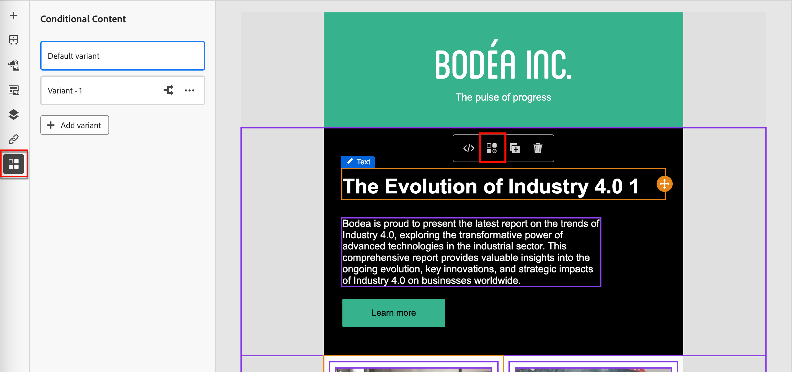

# Contenido condicional

El contenido condicional le permite adaptar el correo electrónico y el contenido del fragmento en función de reglas condicionales. Estas reglas se definen mediante atributos de perfil o eventos contextuales. Puede crear reglas condicionales en el generador de reglas y almacenarlas para su reutilización en los recorridos de la cuenta.

Para agregar contenido condicional a los fragmentos y mensajes de correo electrónico, Adobe Journey Optimizer le permite aplicar reglas condicionales almacenadas en la biblioteca _Conditions_. Aplique reglas condicionales dentro del espacio de diseño visual a medida que crea [contenido de correo electrónico para un recorrido de cuenta](./email-authoring.md) o un [fragmento visual](./fragment-authoring.md).

## Añadir contenido condicional {#email-fragment-content}

>[!CONTEXTUALHELP]
>id="ajo-b2b_conditional_content"
>title="Contenido condicional"
>abstract="Utilice reglas condicionales para crear varias variantes de un componente de contenido. Si no se cumple ninguna de las condiciones al enviar el mensaje, se muestra el contenido de la variante predeterminada."

>[!CONTEXTUALHELP]
>id="ajo-b2b_conditional_rule_select"
>title="Contenido condicional"
>abstract="Utilice una regla condicional guardada en la biblioteca o cree una nueva."

Cuando cree un fragmento o un correo electrónico en el espacio de diseño visual, utilice reglas condicionales para definir varias variantes para un componente de contenido.

1. Seleccione un componente de contenido y haga clic en el icono **[!UICONTROL Habilitar contenido condicional]** de la barra de herramientas de componentes.

   El componente se destaca en naranja para indicar que se activa como componente condicional. El panel **[!UICONTROL Contenido condicional]** se muestra a la izquierda con la _variante predeterminada_ y la _Variante - 1_.

   {width="700" zoomable="yes"}

   El contenido original que seleccionó y activó es el predeterminado y se aplica cuando ninguna de las reglas condicionales se cumple para ninguna de las variantes que defina.

   Desde este panel, puede definir varias variantes para el componente de contenido seleccionado mediante reglas condicionales.

1. Pase el ratón sobre la primera variante (_Variante - 1_) y haga clic en el icono _Seleccionar condición_ ( ).

   {width="700" zoomable="yes"}

   Se abre el cuadro de diálogo _[!UICONTROL Seleccionar condición]_ y muestra la biblioteca de condiciones.

   Si desea ver los detalles de una condición para asegurarse de que es lo que desea, haga clic en el icono de _menú Más_ (**...**) y elija **[!UICONTROL Ver información]**.

   {width="600" zoomable="yes"}

   Si la condición que necesita no existe, [cree una regla condicional](#create-condition) haciendo clic en **[!UICONTROL Crear nuevo]**.

1. Seleccione la regla condicional y haga clic en **[!UICONTROL Seleccionar]** para asociarla con la variante.

   Para revisar la condición asociada, haga clic en el icono _Más menú_ (**...**) de la variante y elija **[!UICONTROL Ver condición]**.

   {width="600" zoomable="yes"}

   Haga clic en X en la parte superior derecha para cerrar la ventana emergente.

   {width="500"}

1. Para facilitar la lectura, cambie el nombre de la variante haciendo clic en el icono _Más menú_ (**...**) de la variante y eligiendo **[!UICONTROL Cambiar nombre]**.

   Introduzca un nombre significativo para la variante que le ayude a identificar la variante y su intención.

   {width="600" zoomable="yes"}

1. Con la variante seleccionada en el panel izquierdo, cambie el componente para modificar cómo aparece en el mensaje de correo electrónico cuando la condición sea verdadera.

   En este ejemplo, la variante del componente de texto utiliza una descripción diferente en función de la región del destinatario.

   {width="600" zoomable="yes"}

1. Si es necesario, defina otra variante haciendo clic en **[!UICONTROL Agregar variante]**.

   Repita los pasos 2-5 para seleccionar una condición, cambiar el nombre de la variante y cambiar el componente de la variante.

   Puede agregar tantas variantes como sea necesario para el componente de contenido. Cambie la variante seleccionada en el panel izquierdo en cualquier momento para comprobar cómo aparece el componente de contenido para la condición.

   >[!IMPORTANT]
   >
   >El contenido condicional se evalúa según las reglas asociadas en el orden en que se enumeran las variantes. La primera variante con una condición que se evalúa como verdadera se utiliza para el componente.
   >
   >Si ninguna de las condiciones de variante definidas se evalúa como verdadera al enviar el correo electrónico, el componente de contenido aparece según la **[!UICONTROL variante predeterminada]**.

1. Para eliminar una variante, haga clic en el icono de _menú Más_ (**...**) de la variante y elija **[!UICONTROL Eliminar]**.

   Haga clic en **[!UICONTROL Eliminar]** en el cuadro de diálogo de confirmación.

## Reglas condicionales

Las reglas condicionales son un conjunto de expresiones condicionales que pueden evaluarse como verdaderas o falsas. Puede utilizar estas reglas para determinar qué variante de contenido se mostrará en un mensaje de correo electrónico en función de varios filtros, como atributos de perfil o eventos contextuales.
Las reglas se almacenan en la biblioteca de condiciones, donde están disponibles para su reutilización en el correo electrónico y en el contenido de fragmentos de su organización.
<!--
>[!NOTE]
>
>You need the [Manage Library Items](../administration/ootb-product-profiles.md) permission to save or delete conditional rules. Saved conditions are available for use by all users within an organization.-->

### Filtros de condición {#condition-filters}

| Tipo de condición | Filtros | Descripción |
| -------------- | ------- | ----------- |
| **Cuenta** | Atributos de la cuenta | Atributos del perfil de cuenta, incluidos: <li>Ingresos anuales</li><li>Ciudad</li><li>País</li><li>Cantidad de empleados</li><li>Industria</li><li>Nombre</li><li>Código SIC</li><li>Estado</li> |
| | [!UICONTROL Filtros especiales] > [!UICONTROL Tiene grupo de compra] | La cuenta tiene o no miembros de grupos compradores. El filtro también se puede evaluar con uno o más de los siguientes criterios: <li>Interés de solución</li><li>Estado del grupo de compra</li><li>Puntuación de integridad</li><li>Puntaje de participación</li> |
| **Persona** | [!UICONTROL Historial de actividades] > [!UICONTROL Correo electrónico] | Actividades de correo electrónico asociadas con el recorrido: <li>[!UICONTROL Se hizo clic en el vínculo del correo electrónico]</li><li>Abrió el email</li><li>Se entregó el email</li><li>Se envió email</li> Estas condiciones se evalúan utilizando un mensaje de correo electrónico seleccionado de anteriormente en el recorrido. |
|  | [!UICONTROL Atributos de persona] | Atributos del perfil de la persona, incluidos: <li>Ciudad</li><li>País</li><li>Fecha de nacimiento</li><li>Dirección de correo electrónico</li><li>Email no válido</li><li>Email suspendido</li><li>Nombre</li><li>Región del estado inferida</li><li>Cargo</li><li>Apellido</li><li>Número de teléfono móvil</li><li>Número de teléfono</li><li>Código postal</li><li>Estado</li><li>Suscripción cancelada</li><li>Razón de la cancelación de la suscripción</li> |
| | [!UICONTROL Filtros especiales] > [!UICONTROL Miembro del grupo comprador] | La persona es o no un miembro del grupo comprador evaluado según uno o más de los siguientes criterios: <li>Interés de solución</li><li>Estado del grupo de compra</li><li>Puntuación de integridad</li><li>Puntaje de participación</li><li>Función</li> |

### Creación de una regla condicional {#create-condition}

>[!CONTEXTUALHELP]
>id="ajo-b2b_conditions_rule_editor"
>title="Crear condición"
>abstract="Combine atributos y eventos contextuales para crear reglas que determinen qué variante de contenido se mostrará en los mensajes de correo electrónico."

Puede acceder al generador de reglas condicionales desde el espacio de diseño de correo electrónico cuando seleccione una condición para una variante de componente.

1. En el cuadro de diálogo _[!UICONTROL Seleccionar condición]_, haga clic en **[!UICONTROL Crear nuevo]** y elija el tipo de condición:

   * **[!UICONTROL Condición de persona]**: elija este tipo para generar la regla de condición mediante atributos de persona y eventos contextuales.
   * **[!UICONTROL Condición de la cuenta]**: elija este tipo para generar la regla condicional con atributos de cuenta.

   {width="600" zoomable="yes"}

1. Genere la regla condicional según sus necesidades.

   Para cada atributo o evento que desee incluir en la regla, arrastre y suelte el elemento en el lienzo de reglas. Expanda el filtro y complete la expresión.

   {width="600" zoomable="yes"}

   Si incluye más de un filtro, establezca la **[!UICONTROL lógica de filtro]**:

   * **[!UICONTROL Aplicar todos los filtros]** - La regla se evalúa como verdadera si **todos** los filtros son verdaderos.
   * **[!UICONTROL Aplicar cualquier filtro]** - La regla se evalúa como verdadera si **cualquiera** de los filtros es verdadero.

1. A la derecha, escriba **[!UICONTROL Name]** y **[!UICONTROL Description]** (opcional) para la regla.

   Utilice un nombre significativo y una descripción útil para ayudar a otros miembros de su organización a reutilizarla en lugar de crear otra condición duplicada.

   {width="600" zoomable="yes"}

1. Una vez completada la regla de condición, haga clic en **[!UICONTROL Guardar]**.

   La regla condicional se guarda en la biblioteca y puede seleccionarla para la variante actual. También se incluye en la biblioteca para que la utilice cualquier otra variante de contenido dinámico en los recorridos de la cuenta.

### Duplicación de una regla

No se pueden modificar las reglas condicionales guardadas en la biblioteca. Sin embargo, puede duplicar una regla existente y cambiarla para crear una nueva.

1. Haga clic en el icono _Más menú_ (**...**) de la variante y elija **[!UICONTROL Duplicado]**.

   Se abre un duplicado de la regla en el generador de reglas. Utilice el duplicado como punto de partida para la regla que desea crear.

   {width="600" zoomable="yes"}

1. En el generador de reglas, cambie, agregue o elimine condiciones según lo que necesite.

1. Cambie el nombre y la descripción para que coincidan con el propósito o los elementos de la regla.

1. Una vez completada la regla de condición, haga clic en **[!UICONTROL Guardar]**.
