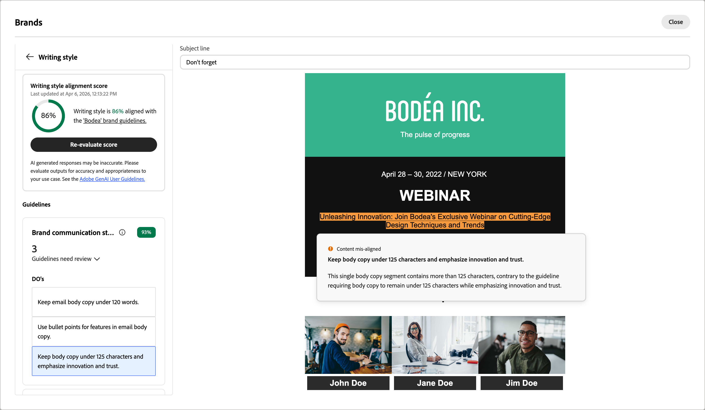

# Evaluación y puntuación del contenido {#content-scoring}

La evaluación y puntuación de contenido le ayudan a crear, revisar y administrar contenido que se ajusta a las directrices [definidas en la marca seleccionada](./brands-manage-create.md#brand-definitions) y a los estándares de calidad generales. La ejecución de una evaluación garantiza la coherencia en el tono, la mensajería y la identidad visual de todas las campañas de correo electrónico, a la vez que sirve como una comprobación de calidad antes de que el contenido se publique.

>[!AVAILABILITY]
>
>Se requiere un [acuerdo de usuario](https://www.adobe.com/legal/licenses-terms/adobe-dx-gen-ai-user-guidelines.html){target="_blank"} para poder usar las funciones con tecnología de IA en Adobe Journey Optimizer B2B edition. Para obtener más información, contacte con su representante de Adobe.
>
>Consulte [Permisos relacionados con la marca](./brands-overview.md#brand-related-permissions) para obtener información sobre cómo los administradores de productos pueden habilitar estas características.

## Ejecutar una evaluación

1. Después de crear el contenido del correo electrónico, haga clic en el icono _Alineación de marca_ (  ) que hay a la derecha para abrir el panel derecho _Alineación de marca_ en el espacio de diseño de correo electrónico.

   La [marca predeterminada](./brands-manage-create.md#default-brand) se selecciona automáticamente.

   {width="600" zoomable="yes"}

   Puede hacer clic en el icono _Pantalla completa_ ( ) en la parte superior del panel para mostrar las herramientas de alineación de marca en modo de pantalla completa.

1. Si es necesario, haga clic en la flecha de menú **[!UICONTROL Marca]** (  ) para elegir otra marca publicada.

1. Haga clic en **[!UICONTROL Evaluar puntuación]** para puntuar la alineación del contenido con la marca seleccionada.

   El sistema evalúa el contenido con respecto a las directrices para la marca seleccionada y muestra la puntuación resultante.

   {width="600" zoomable="yes"}

## Puntuación de la alineación de marca {#brand-alignment-score}

>[!CONTEXTUALHELP]
>id="ajo-b2b_brand_score_overview"
>title="Selección de la marca"
>abstract="Seleccione su marca para asegurarse de que el contenido se crea de acuerdo con sus directrices, estándares e identidad específicos, manteniendo la coherencia y la integridad de la marca."

>[!CONTEXTUALHELP]
>id="ajo-b2b_brand_score"
>title="Puntuación de la alineación de marca"
>abstract="La puntuación de alineación de marca mide en qué medida el contenido se adhiere a las directrices de marca para garantizar la coherencia en los colores, las fuentes, el logotipo, las imágenes y el estilo de escritura."

>[!CONTEXTUALHELP]
>id="ajo-b2b_brand_colors_score"
>title="Puntuación de colores"
>abstract="Puntuación de colores"

>[!CONTEXTUALHELP]
>id="ajo-b2b_brand_fonts_score"
>title="Puntuación de fuentes"
>abstract="Puntuación de fuentes"

>[!CONTEXTUALHELP]
>id="ajo-b2b_brand_logos_score"
>title="Puntuación de logotipos"
>abstract="Puntuación de logotipos"

>[!AVAILABILITY]
>
>Actualmente, esta funcionalidad está disponible como una versión beta pública.

Cuando la marca esté bien definida y publicada, evalúe la puntuación de alineación de marca directamente dentro del espacio de diseño del correo electrónico para asegurarse de que el contenido se ajuste a las directrices de la marca:

La puntuación se calcula según las infracciones identificadas en el contenido de correo electrónico evaluado:

* 100 = Perfecto - No se han encontrado infracciones
* 80-99 = Bueno: solo infracciones menores
* 60-79 = Justo - Algunas violaciones significativas
* Menos de 60 = Pobre - Las violaciones importantes requieren atención

Puede revisar los resultados de la evaluación con más detalle para identificar infracciones y mejorar las puntuaciones de alineación de categorías (_Alta_, _Medium_ y _Baja_).

Para el **[!UICONTROL estilo de escritura]** o **[!UICONTROL contenido visual]**, haga clic en la flecha de _Expandir_ (  ) para mostrar los detalles de la evaluación.

{width="600" zoomable="yes"}

Haga clic en el icono _Pantalla completa_ ( ) para obtener una vista detallada de cada insight de puntuación.

Seleccione cualquier directriz marcada para ver comentarios y sugerencias específicos.

{width="700" zoomable="yes"}

Puede hacer cambios en el contenido y hacer clic en **[!UICONTROL Volver a evaluar puntuación]** para ejecutar otra evaluación y comprobar si hay un resultado mejorado.

## Puntuación de calidad del contenido {#quality-score}

>[!CONTEXTUALHELP]
>id="ajo-b2b_quality_score_overview"
>title="Calidad del contenido"
>abstract="Evalúe la calidad general del contenido para identificar posibles problemas con legibilidad, coherencia del contenido y eficacia. La evaluación de la calidad es independiente de las directrices de marca."

>[!NOTE]
>
>La evaluación de la calidad del contenido es independiente de las directrices de marca. Incluso si se selecciona una marca, sus directrices no se aplican al control de calidad. La selección de marca solo es relevante para la puntuación de alineación de marca.

Además de la alineación de marca, puede evaluar la calidad general del contenido para identificar posibles problemas con legibilidad, coherencia del contenido y eficacia, independientemente de las directrices de marca.

Desplácese a la sección **[!UICONTROL Calidad del contenido]** para revisar las perspectivas y recomendaciones de calidad.

{width="600" zoomable="yes"}

Seleccione cualquier elemento marcado para ver comentarios específicos y sugerencias de acción para mejorar. Las puntuaciones se basan en las siguientes categorías:

* **[!UICONTROL Eficacia de CTA]**: evalúa la eficacia de call-to-action para motivar a los lectores a realizar la acción deseada.
* **[!UICONTROL Línea de asunto]**: evalúa la claridad, la relevancia y la calidad que llama la atención para fomentar las aperturas de correos electrónicos.
* **[!UICONTROL Legibilidad]**: mide lo fácil y atractivo que es el contenido para que los lectores lo entiendan.
* **[!UICONTROL Comprobación de correo no deseado]**: Identifica déclencheur comunes de correo no deseado que pueden afectar a la capacidad de envío.
* **[!UICONTROL Coherencia del contenido]**: garantiza que el contenido fluya sin problemas y se mantenga en el tema.
* **[!UICONTROL Revisión]**: comprueba los problemas de ortografía, gramática y claridad.

Haga clic en el icono de _pantalla completa_ ( ) para obtener una vista detallada de la puntuación de calidad.

{width="700" zoomable="yes"}

En función de las recomendaciones, puede editar el contenido para mejorar la legibilidad, la coherencia del contenido y la calidad general. Haga clic en **[!UICONTROL Volver a evaluar puntuación]** después de realizar cambios para actualizar la puntuación de calidad.
