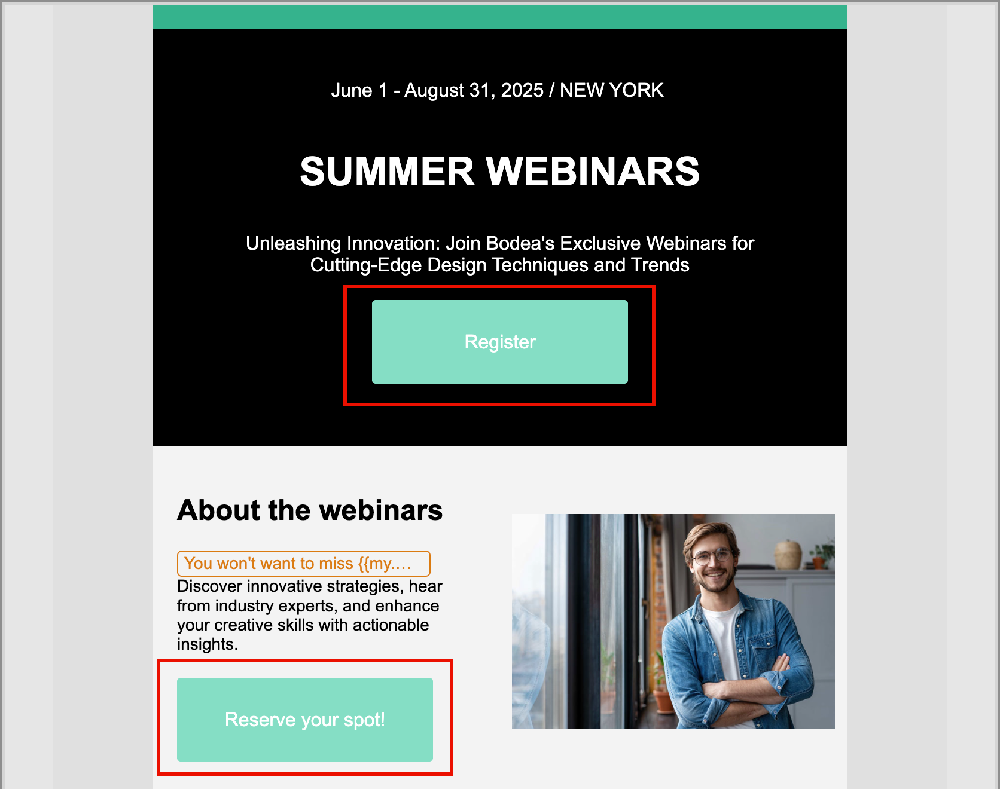

# Añadir CSS personalizado al contenido

Puede agregar su propio CSS personalizado directamente en el espacio de diseño del correo electrónico o de la página de aterrizaje. Utilice CSS personalizado para aplicar un estilo avanzado y específico, para una mayor flexibilidad y control sobre el aspecto del contenido.

El CSS personalizado se anexa a la sección `<head>` dentro de una etiqueta `<style>` con el atributo `data-name="global-custom"`. Esta estructura garantiza que los estilos personalizados se apliquen globalmente al contenido.

+++ Implementación de ejemplo

```html
<!DOCTYPE html>
<html>
  <head>
    <meta charset="utf-8">
    <meta name="content-version" content="3.3.31">
    <meta name="x-apple-disable-message-reformatting">
    <meta name="viewport" content="width=device-width,initial-scale=1.0">
    <style data-name="default" type="text/css">
      td { padding: 0; }
      th { font-weight: normal; }
    </style>
    <style data-name="grid" type="text/css">
      .acr-grid-table { width: 100%; }
    </style>
    <style data-name="acr-theme" type="text/css" data-theme="default" data-variant="0">
      body { margin: 0; font-family: Arial; }
    </style>
    <style data-name="media-default-max-width-500px" type="text/css">
      @media screen and (max-width: 500px) {
        body { width: 100% !important; }
      }
    </style>
    <style data-name="global-custom" type="text/css">
      /* Add you custom CSS here */
    </style>
  </head>
  <body>
    <!-- Minimal content -->
  </body>
</html>
```

+++

>[!NOTE]
>
>El CSS personalizado no se refleja ni valida en el panel _[!UICONTROL Estilos]_ de un componente seleccionado. Es totalmente independiente y solo se puede modificar mediante la opción [!UICONTROL Agregar CSS personalizado] en el nivel de componente Cuerpo.

## Añada su CSS personalizado

1. Con al menos un componente de contenido agregado en el lienzo, selecciona el componente **[!UICONTROL Cuerpo]** en el panel de navegación izquierdo.

1. Seleccione la ficha _Estilos_ a la derecha y haga clic en **[!UICONTROL Agregar CSS personalizado]**.

   {width="800" zoomable="yes"}

   >[!NOTE]
   >
   >El botón _[!UICONTROL Agregar CSS personalizado]_ solo está disponible cuando se selecciona el componente _[!UICONTROL Cuerpo]_. Sin embargo, puede aplicar estilos CSS personalizados a todos sus componentes.

   El editor emergente _[!UICONTROL Agregar CSS]_ personalizado se muestra con comentarios de código de marcador de posición.

1. Introduzca su código CSS en el editor.

   Asegúrese de que CSS personalizado es válido y sigue la sintaxis adecuada. Si el CSS introducido no es válido, se muestra un mensaje de error y no se puede guardar el CSS. Para obtener más información, consulte [Validez de CSS](#css-validity).

   {width="450"}

1. Haga clic en **[!UICONTROL Guardar]** para guardar el CSS personalizado.

   La hoja de estilos personalizada se aplica al contenido existente. Puede comprobar que el CSS personalizado se aplica según sus necesidades. Para obtener información sobre cómo realizar cambios y ajustar la aplicación de hojas de estilos, vea [Solución de problemas](#troubleshooting).

   {width="600" zoomable="yes"}

## Validez de CSS

>[!CAUTION]
>
>Los usuarios son responsables de la seguridad de su CSS personalizado. Asegúrese de que CSS no introduzca vulnerabilidades ni conflictos con el contenido existente.
>
>Evite utilizar CSS que pudiera romper involuntariamente el diseño o la funcionalidad del contenido.

+++ Ejemplos de CSS válido

```css
.acr-component[data-component-id="form"] {
  display: flex;
  justify-content: center;
  background: none;
}

.acr-Form {
  width: 100%;
  padding: 20px 100px;
  border-spacing: 0px 8px;
  box-sizing: border-box;
  margin: 0;
}

.acr-Form .spectrum-FieldLabel {
  width: 20%;
}

.acr-Form.spectrum-Form--labelsAbove .spectrum-FieldLabel,
.acr-Form [data-form-item="checkbox"] .spectrum-FieldLabel {
  width: auto;
}

.acr-Form .spectrum-Textfield {
  width: 100%;
}

#acr-form-error,
#acr-form-confirmation {
  width: 100%;
  padding: var(--spectrum-global-dimension-static-size-500);
  display: flex;
  align-items: center;
  flex-direction: column;
  justify-content: center;
  gap: var(--spectrum-global-dimension-static-size-200);
}

.spectrum-Form-item.is-required .spectrum-FieldLabel:after{
  content: '*';
  font-size: 1.25rem;
  margin-left: 5px;
  position: absolute;
}

/* Error field placeholder */
.spectrum-HelpText {
  display: none !important;
}

.spectrum-HelpText.is-invalid,
.is-invalid ~ .spectrum-HelpText {
  display: flex !important;
}
```

```css
@media only screen and (min-width: 600px) {
  .acr-paragraph-1 {
    width: 100% !important;
  }
}
```

+++

+++ Ejemplos de CSS no válido

No se acepta el uso de etiquetas `<style>`:

```html
<style type="text/css">
  .acr-Form {
    width: 100%;
    padding: 20px 100px;
    border-spacing: 0px 8px;
    box-sizing: border-box;
    margin: 0;
  }
</style>
```

No se acepta sintaxis no válida como llaves que faltan:

```css
body {
  background: red;
```

+++

## CSS en contenido importado

Si desea utilizar CSS personalizado con contenido importado en el espacio de diseño del correo electrónico o de la página de aterrizaje, tenga en cuenta lo siguiente:

* Si importa contenido externo de HTML, incluido CSS, <!-- unless converting that content, -->se rellena en [!UICONTROL modo de compatibilidad] y la sección [!UICONTROL estilos CSS] no está disponible.

* Si importa contenido que se creó originalmente en el espacio de diseño de la página de aterrizaje o el correo electrónico, incluido CSS aplicado a través de la opción [!UICONTROL Agregar CSS personalizado], el CSS aplicado será visible y editable desde la misma opción.

## Resolución de problemas

Si el CSS personalizado no se aplica según lo esperado, utilice las herramientas para desarrolladores del explorador para inspeccionar el contenido y verificar que el CSS está dirigiéndose a los selectores correctos. Cuando revise el código de estilo, tenga en cuenta lo siguiente:

* Compruebe que el CSS sea válido y esté libre de errores de sintaxis (como llaves que faltan, nombres de propiedad incorrectos).

* Compruebe que su CSS se haya agregado a la etiqueta `<style>` con el atributo `data-name="global-custom"`.

* Compruebe si la etiqueta de estilo `global-custom` tiene el atributo `data-disabled` establecido en true, como:

  `<style data-name="global-custom" type="text/css" data-disabled="true"> body: { color: red; } </style>`

* Compruebe que el CSS no se sobrescriba en ninguna parte del contenido, como cuando se aplica un estilo dentro de la línea.

* Agregue `!important` a sus declaraciones para asegurarse de que tienen prioridad, como:

  ```
  .acr-Form {
  background: red !important;
  }
  ```

