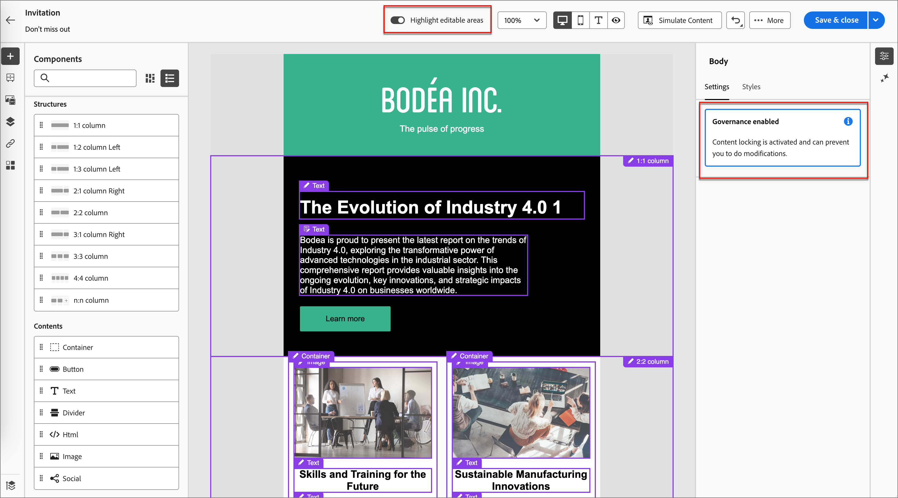
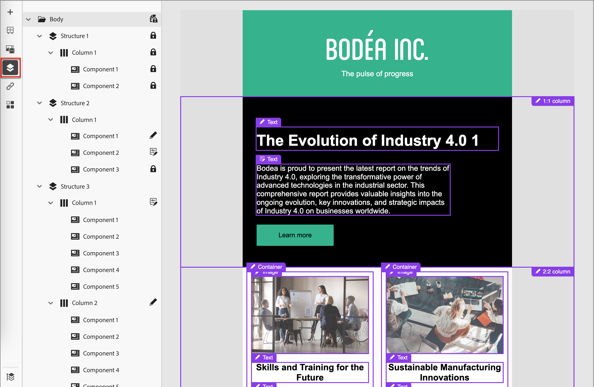

# Crear a partir de una plantilla controlada

Los diseñadores de contenido pueden habilitar el [control (_bloqueo de contenido_)](./template-content-governance.md) al crear plantillas de correo electrónico. Las funciones de control les permiten designar las partes del diseño que no se pueden cambiar cuando se utilizan en un recorrido de cuentas. Cuando [selecciona una plantilla guardada](./email-authoring.md#select-a-template) para crear un mensaje de correo electrónico, el espacio de diseño visual carga la plantilla para que pueda utilizarla como base para el correo electrónico.

Si la plantilla tiene el control habilitado, se muestra una alerta en el panel de propiedades de la derecha. Puede activar **[!UICONTROL Resaltar áreas editables]** en la parte superior del lienzo para ver qué componentes y elementos de contenido se pueden editar para usarlos en el recorrido.

{width="800" zoomable="yes"}

También puede determinar los elementos que están bloqueados o son editables mediante el _árbol de navegación_. Haga clic en el icono _Árbol de navegación_ (  ) a la izquierda del lienzo para mostrar el árbol.

{width="600" zoomable="yes"}

Los iconos indican la configuración de bloqueo del contenido aplicada.

| Ícono | Nombre | Descripción |
|------|------|-------------|
|  | Solo lectura | El componente está bloqueado y no se puede editar. Cuando se aplican en el nivel raíz (_[!UICONTROL Body]_), todos los componentes secundarios están bloqueados y no se pueden editar. |
|  | Bloqueo de contenido | El bloqueo de contenido se aplica en el nivel de componente. |
|  | Editable | El componente es totalmente editable. Sin embargo, es posible que no pueda eliminar el elemento. |
|  | Editable: solo contenido | El componente y el estilo son estáticos, pero puede cambiar el contenido (como texto o imagen). |
