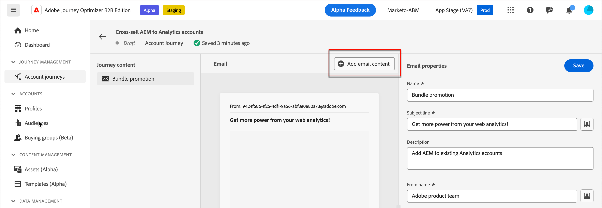
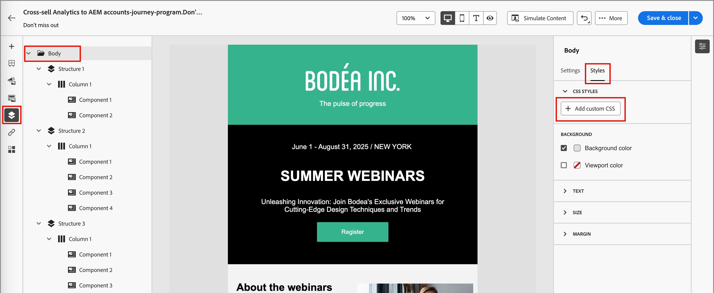

# Creación de mensajes de correo electrónico

Después de [agregar un recurso de correo electrónico a un nodo de acción de recorrido](./add-email.md), puede definir el contenido del mensaje de correo electrónico.

Haga clic en **[!UICONTROL Editar contenido del correo electrónico]** en la ficha _[!UICONTROL Detalles]_ del panel derecho.

{width="700" zoomable="yes"}

Esta acción inicia las herramientas de diseño de correo electrónico, donde puede elegir cómo desea diseñar el correo electrónico entre las siguientes opciones:

* [Diseñe su correo electrónico desde cero](#design-your-email-from-scratch) con la interfaz de diseño visual.

* [Importe contenido de HTML existente](#import-existing-html-content) desde un archivo o una carpeta .zip.

* [Seleccione una plantilla existente](#select-a-template) de una lista de plantillas de correo electrónico integradas o personalizadas.

Después de crear y personalizar el contenido del correo electrónico, puede exportarlo para su validación o uso posterior. Haga clic en **[!UICONTROL Exportar HTML]** para guardar el contenido como un archivo .zip que incluya su HTML y sus recursos.

>[!TIP]
>
>Utilice el asistente de IA en Adobe Journey Optimizer B2B edition, con tecnología de IA generativa, para mejorar el contenido. El asistente de IA puede ayudarle a optimizar el impacto de sus envíos generando correos electrónicos completos, contenido de texto de destino y obteniendo recomendaciones del asistente de IA para imágenes que resuenen con su audiencia. [Más información](./ai-assistant-emails.md)

## Diseñe el correo electrónico desde cero {#design-from-scratch}

Utilice el espacio de diseño de contenido visual para definir la estructura y el contenido del correo electrónico. Al añadir y mover componentes estructurales con sencillas acciones de arrastrar y soltar, puede diseñar el diseño y la organización del contenido del correo electrónico en cuestión de segundos.

1. En la página de inicio de _[!UICONTROL Diseña tu plantilla]_, selecciona la opción **[!UICONTROL Diseñar desde cero]**.

1. En el cuadro de diálogo _[!UICONTROL Crear correo electrónico]_, elija el tipo de contenido de correo electrónico que desea crear.

   * **[!UICONTROL Usar temas]** - Elija esta opción para crear el correo electrónico en _Modo de temas_. En este modo, puede utilizar un tema de marca definido para optimizar el proceso de creación de contenido y asegurarse de que el diseño se ajuste a los estándares definidos.

   * **[!UICONTROL Estilo manual]**: elija esta opción para crear el correo electrónico en _modo manual_. En este modo, se establece manualmente el estilo para todos los componentes de estructura y contenido que se añaden al lienzo en blanco.

1. [Agregar estructura y contenido](./email-authoring.md#add-structure-and-content) a la plantilla.

1. [Revisar y actualizar vínculos](#preview-and-edit-linked-urls).

1. [Probar el correo electrónico](#check-and-test-the-email).

<!--
 If needed, you can further personalize your email by clicking **[!UICONTROL Switch to code editor]** from the advanced menu. The code editor allows you to edit the email source code, such as adding tracking or custom HTML tags.

>[!CAUTION]
>
>You cannot revert back to the visual design space for this email after switching to the code editor. 
-->

Cuando esté satisfecho con el contenido, haga clic en **[!UICONTROL Guardar]**.

## Importar contenido existente de HTML

{{$include /help/_includes/content-design-import.md}}

{width="500"}

>[!NOTE]
>
>El uso de una etiqueta `<table>` como primera capa de un archivo HTML puede causar la pérdida de estilo, incluida la configuración del fondo y el ancho en la etiqueta de la capa superior.

Puede personalizar el contenido importado según sea necesario con las herramientas visuales del editor de correo electrónico.

## Seleccionar una plantilla

{{$include /help/_includes/content-design-select-template.md}}

>[!NOTE]
>
> Las plantillas guardadas pueden tener configuraciones de gobernanza (bloqueo de contenido) aplicadas a uno o varios componentes. El espacio de diseño visual proporciona directrices sobre los componentes bloqueados cuando [crea un correo electrónico a partir de una plantilla controlada](./email-authoring-governance.md).

## Añadir estructura y contenido {#structure-content}

{{$include /help/_includes/content-design-components.md}}

### Añadir CSS personalizado

Puede agregar su propio CSS personalizado directamente en el espacio de diseño de correo electrónico. Utilice CSS personalizado para aplicar un estilo avanzado y específico, para una mayor flexibilidad y control sobre el aspecto del contenido. Se recomienda añadir este estilo de nivel superior antes de incluir componentes de contenido, como imágenes, botones y texto.

Con al menos un componente de contenido en el lienzo, selecciona el componente **[!UICONTROL Cuerpo]** en el árbol de navegación izquierdo para acceder al editor CSS personalizado.

>[!NOTE]
>
>Si el mensaje de correo electrónico está diseñado con una [plantilla con contenido bloqueado](./template-content-governance.md), no podrá agregar CSS personalizado al contenido. La etiqueta del botón cambia a **[!UICONTROL Ver CSS personalizado]** y cualquier CSS personalizado que ya esté presente en el contenido es de solo lectura.

{width="800" zoomable="yes"}

{{$include /help/_includes/content-design-custom-css.md}}

### Añadir fragmentos

>[!NOTE]
>
>Los fragmentos no son compatibles entre el _modo de tema_ y el _modo manual_ del contenido del correo electrónico. Para utilizar un fragmento en el contenido del correo electrónico donde se aplique un tema, el fragmento también debe crearse en _Modo de tema_.

{{$include /help/_includes/content-design-use-fragments.md}}

Una vez guardado el correo electrónico, aparecerá en la página de detalles del fragmento al seleccionar la pestaña _[!UICONTROL Utilizado por]_ en el resumen.

### Añadir recursos de imagen

{{$include /help/_includes/content-design-assets.md}}

### Desplazamiento por las capas, la configuración y los estilos

{{$include /help/_includes/content-design-navigation.md}}

### Personalización del contenido

{{$include /help/_includes/content-design-personalization-email.md}}

>[!NOTE]
>
>Si _[!UICONTROL Mis tokens]_ están definidos para el recorrido de la cuenta, también puede usar estos tokens específicos del recorrido para el contenido del correo electrónico. Consulte [Tokens personalizados para personalización de correo electrónico](./personalization-my-tokens.md) para obtener más información.

### Editar seguimiento de URL vinculadas

{{$include /help/_includes/content-design-links.md}}

### Aplicar estilo de modo oscuro

Use _Modo oscuro_ para revisar la visualización del correo electrónico en busca de un tema oscuro en un cliente de correo electrónico. Un modo o tema oscuro permite a un cliente de correo electrónico o a una aplicación de soporte mostrar correos electrónicos con fondos más oscuros y colores más claros para el texto, los botones y otros elementos visuales. En la parte superior derecha del lienzo de diseño, cambie el selector a _Modo oscuro_ (  ). A continuación, obtenga una vista previa y defina la configuración personalizada específica que los clientes de correo electrónico de soporte utilizarán para la visualización cuando se active su tema oscuro.

{width="700" zoomable="yes"}

Para obtener más información acerca del estilo en modo oscuro y las prácticas recomendadas, consulte [Modo oscuro para el contenido de correo electrónico](./email-dark-mode.md).

### Ver opciones

Aproveche las opciones de vista y validación de contenido disponibles en el editor de correo electrónico visual.

* Acercar/alejar el contenido en las opciones de zoom preestablecidas.

* Cambie entre ver el contenido en equipos de escritorio, dispositivos móviles o solo texto/texto sin formato.
   * Haz clic en el icono _Ver_ para obtener una vista previa del contenido entre dispositivos.
   * Seleccione uno de los dispositivos predefinidos o introduzca dimensiones personalizadas para obtener una vista previa del contenido.

## Más opciones

En el menú _[!UICONTROL Más...]_ de la parte superior del espacio de diseño visual, puede realizar las siguientes acciones:

{width="500"}

* **[!UICONTROL Restablecer correo electrónico]**: haga clic en esta opción para borrar el lienzo del diseño del correo electrónico y reiniciar la creación del contenido.
* **[!UICONTROL Guardar como fragmento]**: guarde todo o parte del correo electrónico como un fragmento para reutilizarlo en varios correos electrónicos o plantillas de correo electrónico. Proporcione un nombre y una descripción para el fragmento y guárdelo en la lista de fragmentos disponibles.
* **[!UICONTROL Cambia tu diseño]** - Vuelve a la página _Diseña tu correo electrónico_. Desde allí, puede elegir otra plantilla para reiniciar el proceso de diseño. También puede diseñar el contenido desde cero con un lienzo en blanco (_Modo clásico_) o con un [tema de marca](./brand-themes.md) (_Modo de tema_).
* **[!UICONTROL Guardar como plantilla de contenido]** - Guarde el cuerpo del correo electrónico como una plantilla de correo electrónico para reutilizarla en varios correos electrónicos o plantillas de correo electrónico. Proporcione un nombre y una descripción para la plantilla y guárdela en la lista de plantillas de correo electrónico guardadas.
* **[!UICONTROL Exportar HTML]**: descargue el contenido del lienzo visual en su sistema local en formato HTML empaquetado como archivo zip.

## Compruebe y pruebe el correo electrónico {#email-testing}

Cuando se define el contenido del mensaje, puede utilizar perfiles de prueba para previsualizarlo, enviar pruebas y revisar su procesamiento en las relaciones de aspecto del escritorio y del dispositivo móvil. Si ha insertado contenido personalizado, puede obtener una vista previa de cómo se muestra este contenido en el mensaje mediante los datos del perfil de prueba.

Para [obtener una vista previa del contenido del correo electrónico](./email-simulate-content.md), haga clic en **[!UICONTROL Simular contenido]** y seleccione un perfil de prueba para comprobar el mensaje con los datos del perfil de la persona.

{width="700" zoomable="yes"}

Para validar y revisar el contenido del correo electrónico, acceda a herramientas adicionales:

* [Envío de una prueba](./email-simulate-content.md#send-proofs)
* [Prueba de procesamiento en clientes de correo electrónico](./email-test-rendering.md)
<!-- * Generate a spam report -->
