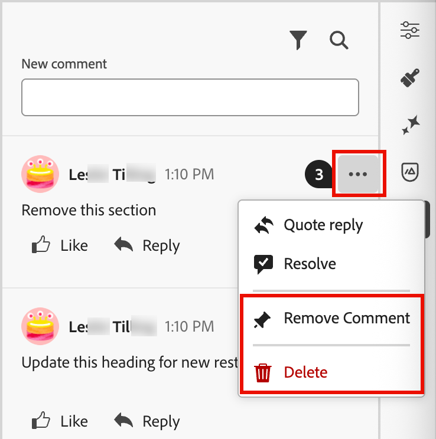

# Herramientas de colaboración por correo electrónico

El [espacio de diseño de correo electrónico](./email-authoring.md) incluye herramientas de colaboración para realizar comentarios y resolver problemas de manera que los equipos de marketing puedan revisar, discutir y finalizar recursos de correo electrónico sin problemas directamente en [!DNL Journey Optimizer B2B Edition]. En lugar de compartir borradores con herramientas externas (como el chat, hilos de correo electrónico u hojas de cálculo), los usuarios pueden realizar comentarios, sugerir ediciones y resolver comentarios dentro del espacio de diseño del correo electrónico. Utilice estas herramientas para optimizar el flujo de trabajo, reducir los errores y garantizar que las partes interesadas estén alineadas antes de iniciar la campaña de correo electrónico dentro de un recorrido de cuenta:

* **_Comentarios centralizados_**: recopile y rastree todos los comentarios en un solo lugar.

* **_Revisiones más rápidas_**: los colaboradores pueden revisar la copia de correo electrónico y los recursos dentro del entorno de creación.

* **_Precisión mejorada_**: reduce el riesgo de comunicaciones incorrectas al mantener todas las ediciones vinculadas al propio correo electrónico.

* **_Transparencia_**: todos los comentarios y resoluciones permanecen registrados, lo que deja en claro qué cambios se sugirieron e implementaron.

* **_Collaboration en contexto_**: revise la copia del cuerpo del correo electrónico, las imágenes y los elementos de call-to-action (CTA) dentro del diseño.

<!-- Enable asynchronous collaboration between team members for an email asset
Allow users to attach comments to specific design elements
Provide a unified interface for viewing and managing all comments within a project
Support comment placement, editing, deleting, and navigation
Display visual indicators (badges) for elements with associated comments -->

## Habilitar herramientas de colaboración por correo electrónico para revisores

Los administradores de productos pueden habilitar el acceso a las herramientas de colaboración por correo electrónico asignando el permiso **[!UICONTROL Administrar correos electrónicos B2B]** a través de la interfaz de usuario de _Permisos_ en Adobe Experience Cloud.

+++ Habilitar permisos de correo electrónico

1. En la aplicación Permisos, vaya a la pestaña **[!UICONTROL Roles]** y seleccione el [rol](https://experienceleague.adobe.com/en/docs/experience-platform/access-control/abac/permissions-ui/roles?lang=es){target="_blank"} que desee.

1. Haga clic en **[!UICONTROL Editar]** para modificar los permisos.

1. Agregue el recurso **[!UICONTROL B2B Assets]** y, a continuación, seleccione **[!UICONTROL Administrar correos electrónicos B2B]**.

   {width="700" zoomable="yes"}

1. Haga clic en **[!UICONTROL Guardar]** para aplicar los cambios.

   Los permisos se actualizan automáticamente para cualquier usuario que ya esté asignado a la función.

1. Para asignar este rol a nuevos usuarios, seleccione la ficha **[!UICONTROL Usuarios]** en el panel _[!UICONTROL Roles]_ y haga clic en **[!UICONTROL Agregar usuario]**.

   * Introduzca el nombre de usuario y la dirección de correo electrónico, o bien elija un usuario existente de la lista.

     Si el usuario aún no se ha creado, consulte la [documentación de Experience Platform](https://experienceleague.adobe.com/es/docs/experience-platform/access-control/abac/permissions-ui/users){target="_blank"}.

   * Haga clic en **[!UICONTROL Guardar]** para aplicar los cambios.

+++

## Mostrar herramientas de colaboración y comentarios

Al crear, editar o revisar contenido en el espacio de diseño del correo electrónico, puede acceder al panel _Collaboration_ para agregar o administrar comentarios para el contenido del correo electrónico.

Haga clic en el icono _Collaboration_ ( ) en el panel de navegación derecho.

{width="700" zoomable="yes"}

## Flujo de trabajo de Collaboration

Puede utilizar las herramientas de colaboración para seguir un flujo de trabajo de contenido estándar:

1. [Invite](#invite-collaborators-and-reviewers) a sus colaboradores y revisores.
1. Los revisores [agregan comentarios](#add-comments).
1. Lea comentarios, [agregue respuestas](#reply-to-a-comment) para discutir comentarios y realizar las ediciones necesarias.
1. Revisores o autores [resuelven comentarios](#resolve-comments).

>[!BEGINSHADEBOX]

**Prácticas recomendadas para usar las herramientas de colaboración**

* Use el etiquetado `@` para que los comentarios lleguen rápidamente al miembro del equipo correcto.

* Agrupe los comentarios relacionados en un único hilo de comentarios en lugar de en varias notas dispersas.

* Resuelva siempre los comentarios en cuanto se dirijan para mantener un flujo de trabajo limpio.

* Guardar una versión aprobada final para fines de cumplimiento/auditoría.

>[!ENDSHADEBOX]

### Invitar a colaboradores y revisores

1. Seleccione el cuerpo del correo electrónico.

1. Haga clic en el icono _Collaboration_ ( ) en el panel de navegación derecho.

1. En la parte superior del panel derecho, introduzca el texto de invitación para que los usuarios colaboren y proporcionen comentarios.

   Utilice el símbolo `@` para dirigirse a los usuarios y notificarlos. Estos usuarios reciben notificaciones de impulsos por correo electrónico y en el producto.

   A medida que introduce las primeras letras del nombre después del símbolo, aparece una lista emergente con los nombres de usuario coincidentes. Puede escribir más letras en el nombre para mejorar los resultados.

   {width="550"}

   Seleccione el nombre que desee añadir para la notificación.

   Añada tantos colaboradores o revisores como desee incluir en la invitación.

   {width="700" zoomable="yes"}

1. Haga clic en **[!UICONTROL Enviar]**.

### Añadir comentarios

Como colaborador o revisor de correo electrónico, abra el correo electrónico en el espacio de diseño y añada sus comentarios. Puede escribir comentarios generales en el panel _Collaboration_ o seleccionar componentes en el lienzo y agregar un comentario que sea específico para ese elemento de diseño. Etiquete compañeros de equipo que usen `@`, como _@John Doe Actualice la copia de CTA_.

Cada nuevo comentario inicia un subproceso donde los colaboradores pueden usar _Responder_ para continuar la discusión. Cada comentario o subproceso asociado a un elemento de diseño se numera para que pueda identificar fácilmente el elemento donde se aplica.

#### Comentarios y sugerencias generales

En el panel _Collaboration_, utilice el campo de texto de la parte superior para escribir un comentario general sobre el contenido del correo electrónico. Utilice el símbolo `@` para dirigirse a los usuarios y notificarlos.

{width="400"}

Haga clic en **[!UICONTROL Enviar]** para registrar el comentario y enviar notificaciones a los usuarios etiquetados.

#### Comentarios sobre componentes

1. Seleccione una estructura o un componente de contenido.

1. En la barra de herramientas, haga clic en la herramienta _Collaboration_.

   {width="600"}

1. Introduzca su comentario en el campo de texto.

1. Haga clic en **[!UICONTROL Enviar]**.

Los colaboradores pueden hacer clic en el icono de pin numerado del lienzo del correo electrónico para ver los comentarios.

{width="450"}

#### Responder a un comentario

Para cada comentario, puede usar la función _[!UICONTROL Responder]_ para continuar una discusión o responder a una pregunta.

Haz clic en **[!UICONTROL Responder]** al final del comentario e introduce el texto de tu respuesta. Para incluir una cita del comentario actual en su respuesta, haga clic en el icono _Más menú_ ( **...** ) y elija **[!UICONTROL Citar respuesta]**.

{width="350"}

### Resolver comentarios

Como autor o diseñador, evalúe los comentarios de los revisores y determine qué cambios desea realizar. Cuando se hayan completado los cambios y se haya satisfecho la solicitud, haga clic en el icono _Más menú_ ( **...** ) y seleccione **[!UICONTROL Resolver]**.

{width="350"}

En el cuadro de diálogo de confirmación, haga clic en **[!UICONTROL Resolver]**.

## Administrar comentarios

Administre los comentarios y los hilos para evaluar el estado del esfuerzo de colaboración.

### Colocar un comentario

Si un comentario no está asociado con un elemento del lienzo del correo electrónico, puede _fijar_ el comentario a un elemento según sea necesario. Haga clic en el icono _Menú más_ (**...** ) y elija **[!UICONTROL Colocar el comentario]**. A continuación, seleccione el componente de diseño en el lienzo.

{width="350"}

### Eliminar o eliminar comentarios

Puede limpiar el registro de comentarios eliminándolos y eliminándolos. Haga clic en el icono _Más menú_ ( **...** ) y elija **[!UICONTROL Quitar comentario]** o **[!UICONTROL Eliminar]**.

{width="350"}

* Al eliminar un comentario, la acción desvincula ese comentario del elemento de diseño (seleccionado cuando se creó el comentario). El comentario sigue formando parte del registro de comentarios del correo electrónico.

* Al eliminar un comentario, la acción lo elimina permanentemente del registro.

### Comentarios resueltos

De forma predeterminada, los comentarios resueltos están ocultos en el panel _Collaboration_. Puede mostrar los comentarios resueltos en cualquier momento borrando el filtro. Haga clic en el icono _Filtro_ (  ) y borre la casilla de verificación **[!UICONTROL Ocultar comentarios resueltos]**.

{width="350"}

Los comentarios resueltos incluyen un icono _Anular resolución_ (  ). Si determina que un comentario o subproceso no se ha resuelto y que son necesarios más cambios, haga clic en el icono para quitar la designación _[!UICONTROL Resuelto]_.

{width="300"}
