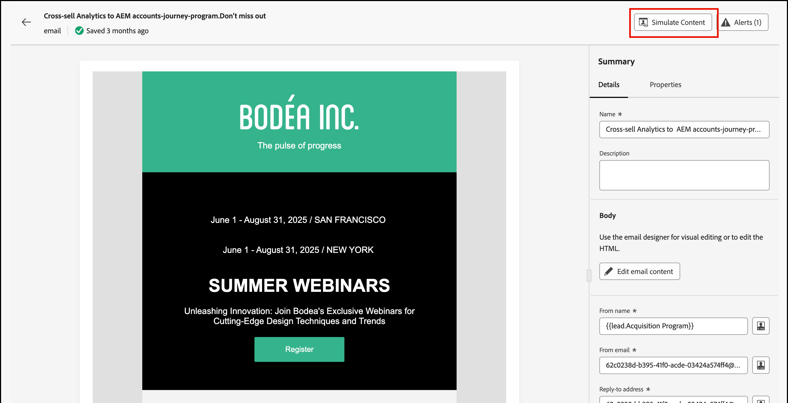

# Previsualización y prueba del contenido del correo electrónico {#preview-simulate}

>[!CONTEXTUALHELP]
>id="ajo-b2b_email_preview_simulate"
>title="Compruebe cómo se representa el contenido"
>abstract="Una vez definido el contenido, puede previsualizarlo y comprobar si el procesamiento es correcto según el canal que utilice."

Utilice la función _Simular contenido_ para obtener una vista previa del contenido del correo electrónico y enviar envíos de prueba a destinatarios específicos. Deben definirse los campos de correo electrónico necesarios, entre ellos _[!UICONTROL Nombre de remitente]_, _[!UICONTROL Dirección de origen]_, _[!UICONTROL Dirección de respuesta]_ y _[!UICONTROL Línea de asunto]_, para tener acceso a las características de vista previa y prueba.

>[!IMPORTANT]
>
>No puede obtener una vista previa del correo electrónico si hay errores. Compruebe _Alertas_ para asegurarse de que no hay errores que bloqueen las funciones de vista previa. Las advertencias no bloquean la vista previa, pero debe dirigirse a ellas antes de publicar el recorrido que déclencheur la entrega de correo electrónico.

## Mostrar vista previa del correo electrónico

Puede acceder a la vista previa de procesamiento desde el [espacio de diseño de correo electrónico](./email-authoring.md) o desde el _[!UICONTROL Resumen]_ cuando [abra un correo electrónico desde la lista Correos electrónicos](./emails-list.md#edit-emails).

1. Haga clic en **[!UICONTROL Simular contenido]** en la parte superior.

   {width="800" zoomable="yes"}

   >[!NOTE]
   >
   >Este botón no está disponible si hay errores o si los campos obligatorios no están definidos para el correo electrónico.

1. En la página _[!UICONTROL Simular]_, seleccione un perfil de persona en la lista **[!UICONTROL Personas]** para usar para procesar el correo electrónico.

   En la vista previa de contenido, los elementos personalizados se rellenan según el perfil de persona seleccionado.

   {width="800" zoomable="yes"}

   Si la lista _[!UICONTROL Personas]_ de la izquierda está vacía, [agregue personas](#add-people-to-the-profiles-list) mediante contactos de la instancia de Marketo Engage conectada.

   >[!TIP]
   >
   >También puede usar la integración de procesamiento de prueba [Litmus](./email-test-rendering.md) para comprobar el procesamiento de mensajes de correo electrónico en clientes populares basados en escritorio, móviles y web.

## Ajuste de las opciones de visualización

Utilice las herramientas de visualización para cambiar la previsualización según el tipo de dispositivo o el nivel de zoom:

* Seleccione el icono _Escritorio_ (  ) para mostrar la vista previa usando el estilo y la proporción de aspecto del escritorio.
* Seleccione el icono _Móvil_ (  ) para mostrar la vista previa usando el estilo y la proporción de aspecto del dispositivo móvil.
* Haga clic en la flecha _Nivel de zoom_ y seleccione un porcentaje de zoom para revisar cómo cambia el contenido según el nivel de zoom.

{width="600" zoomable="yes"}

## Envío de pruebas

Una prueba es un mensaje de prueba enviado que permite al usuario y a los integrantes del equipo revisar un mensaje de correo electrónico antes de enviarlo a los miembros de una audiencia. Los destinatarios de la prueba pueden comprobar la renderización del mensaje, el contenido, la configuración de personalización y la configuración. Puede enviar pruebas utilizando un perfil de prueba seleccionado.

1. Haga clic en **[!UICONTROL Enviar revisión]** en la parte superior derecha.

   {width="500"}

1. En la página _Enviar prueba_, escriba la dirección de correo electrónico del primer destinatario.

1. Para cada destinatario adicional que desee incluir en la revisión, haga clic en **[!UICONTROL Agregar destinatario]** e introduzca su dirección de correo electrónico en el campo **[!UICONTROL Enviar a]**.

   Puede añadir hasta diez destinatarios para la entrega de prueba.

1. Para cada destinatario, establezca el campo **[!UICONTROL Simular como]** seleccionando un perfil de prueba para usar para personalizar el contenido del mensaje.

   {width="700" zoomable="yes"}

1. Haga clic en **[!UICONTROL Enviar revisión]**.

## Añadir personas a la lista de perfiles

1. En la parte superior de la lista _[!UICONTROL Personas]_, haga clic en **[!UICONTROL Agregar personas]**.

   {width="500"}

1. En el cuadro de diálogo _[!UICONTROL Agregar personas para probar]_, escriba la dirección de correo electrónico completa del contacto.

   Para agregar varios contactos, escriba varias direcciones separadas por una coma.

1. Seleccione la casilla de verificación de cada contacto coincidente que desee agregar a la lista de perfiles de prueba.

   {width="700" zoomable="yes"}

1. Haga clic en **[!UICONTROL Agregar]** en la parte superior derecha.
