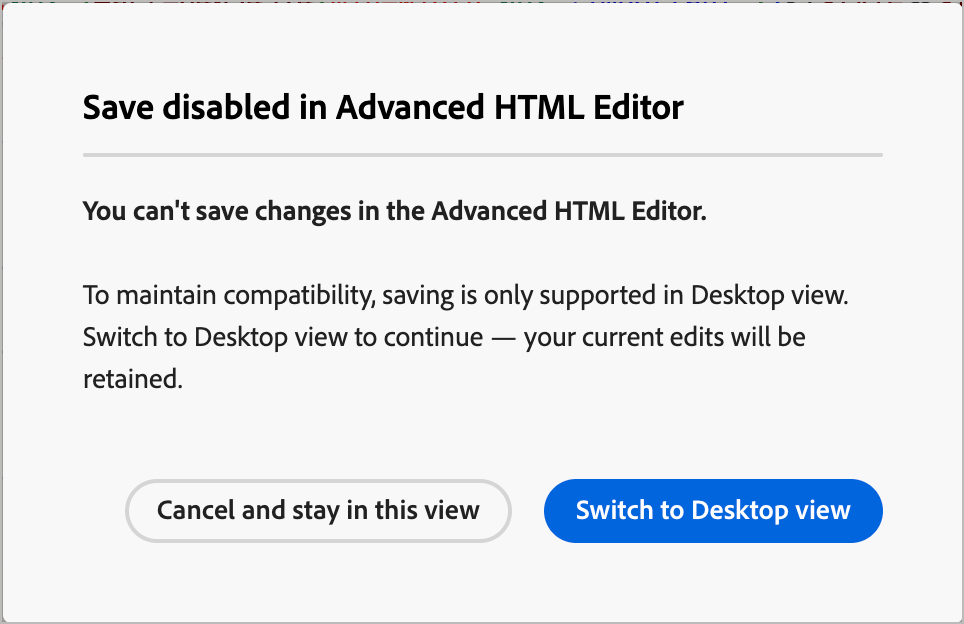

# Modo de HTML avanzado para el diseño de plantillas de correo electrónico

_El modo de HTML avanzado_ proporciona una vista que permite a los usuarios con experiencia ver y editar directamente el código fuente sin procesar del contenido de las plantillas de correo electrónico. Este modo es ideal cuando desea insertar expresiones sofisticadas, como lógica condicional, directamente en el origen. También es útil para hacer ajustes estructurales que van más allá de lo que exponen las herramientas de diseño visual.

<!-- We don't have the code editor at this point 
>[!NOTE]
>
>_Advanced HTML mode_ is different from the code editor option that is available when you start a new design. The code editor does not allow you to change to the visual design space. With _advanced HTML mode_, you can toggle back and forth between the HTML source view and the visual design view at any time. -->

>[!AVAILABILITY]
>
>Esta característica se encuentra actualmente en _disponibilidad limitada_ y no está disponible para todos los usuarios.

## Limitaciones importantes

Antes de usar el modo avanzado de HTML para la creación de plantillas de correo electrónico [1}, asegúrese de comprender las siguientes limitaciones:](./email-template-authoring.md)

* **Sin validación**: el editor de HTML no realiza la comprobación de sintaxis ni la verificación del diseño. Revise el código detenidamente antes de guardarlo.

* **Actualizaciones de contenido**: los cambios futuros en el sistema pueden afectar o sobrescribir las modificaciones realizadas en el marcado predeterminado en el modo avanzado de HTML. Compruebe el contenido después de las actualizaciones del producto para asegurarse de que se representa según lo esperado.

* **Compatibilidad limitada**: Adobe no puede solucionar problemas de procesamiento ni errores de contenido que se deriven de modificaciones de código personalizado realizadas en el modo avanzado de HTML.

* **Restricciones de vista previa**: la simulación de contenido (vista previa con perfiles) solo está disponible en la vista de escritorio, no directamente desde la vista de origen de HTML.

### Acceso al modo avanzado de HTML

Se puede acceder al modo avanzado de HTML desde la barra de herramientas situada en la parte superior del espacio de diseño visual cuando se tiene una plantilla de correo electrónico cargada en el lienzo.

1. Abra o [cree una plantilla de correo electrónico](./email-templates.md#create-an-email-template) y abra el espacio de diseño para editar el contenido.

1. En el espacio de diseño, haga clic en el icono _[!UICONTROL HTML]_ (  ) de la barra de herramientas.

   {width="750" zoomable="yes"}

   Si es la primera vez que abre el modo avanzado de HTML (o si ha transcurrido un mes o más), se muestra un mensaje de advertencia. Revise la información y haga clic en **[!UICONTROL Aceptar]** para continuar.

   {width="500"}

   El lienzo de diseño cambia a la vista de origen de HTML sin procesar.

1. Revise el código y añada los cambios que desee al contenido del correo electrónico.

   En _Modo de HTML avanzado_, tiene acceso directo a la fuente completa de HTML del contenido de su plantilla de correo electrónico:

   * Permite ver y modificar cualquier parte del marcado de HTML sin procesar.
   * Inserte [expresiones de personalización](./personalization.md) avanzadas directamente en el origen.
   * Agregar la lógica [contenido condicional](./conditional-content.md) mediante sintaxis de expresión.
   * Agregue atributos HTML personalizados, etiquetas de seguimiento u otro marcado que no esté disponible a través de los controles del editor visual.

   {width="800" zoomable="yes"}

   >[!IMPORTANT]
   >
   >Asegúrese de introducir el código HTML y CSS correcto; Adobe no proporciona validación de sintaxis ni compatibilidad con el código personalizado.

   La simulación y el guardado de contenido no están disponibles en el modo de HTML avanzado por motivos de compatibilidad. Puede volver a la vista de escritorio para obtener una vista previa del contenido y guardar la plantilla. Las ediciones que realice se conservarán cuando cambie entre la vista Código fuente de HTML y la vista Diseño visual.

   Si hace clic en **[!UICONTROL Guardar]** o **[!UICONTROL Guardar y cerrar]** en la parte superior derecha mientras se encuentra en el modo avanzado de HTML, aparecerá un cuadro de diálogo de alerta para informarle de que debe salir del modo avanzado de HTML antes de guardar la plantilla y salir del espacio de diseño.

   {width="500"}

1. Haga clic en el icono _[!UICONTROL Escritorio]_ ( ) de la barra de herramientas para cambiar del modo avanzado de HTML (la vista de origen de HTML) al lienzo de diseño visual.

   Las ediciones se conservan al cambiar de vista.
