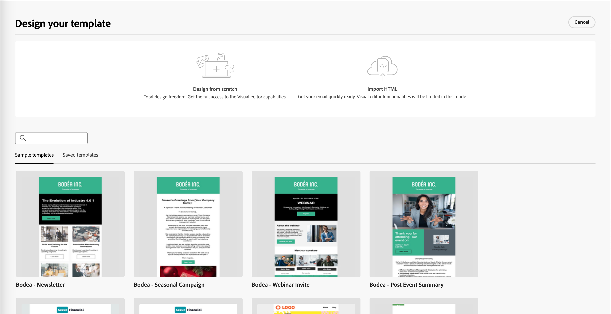
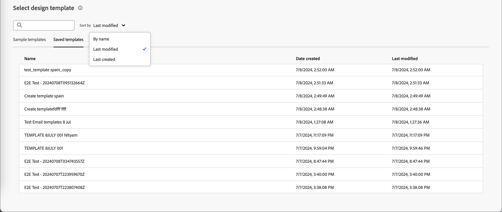
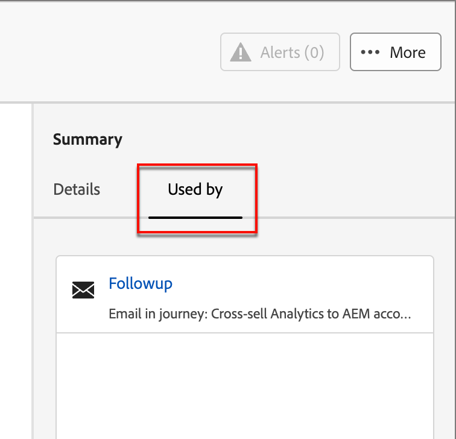

# Plantillas de correo electrónico

Para un proceso de diseño acelerado y mejorado, puede crear plantillas de correo electrónico independientes para reutilizar el contenido personalizado en los recorridos de cuenta de Adobe Journey Optimizer B2B Edition. A través de las plantillas, los integrantes del equipo orientados al contenido pueden trabajar en el contenido del correo electrónico fuera de los recorridos. Los estrategas de marketing pueden reutilizar y adaptar estas plantillas independientes dentro de sus recorridos de cuenta. Por ejemplo, un miembro del equipo está a cargo solo del contenido, sin acceso a los recorridos de la cuenta. Sin embargo, pueden crear una plantilla de correo electrónico que los especialistas en marketing pueden seleccionar como punto de partida para las comunicaciones por correo electrónico y personalizarla según los requisitos del recorrido.

## Acceso y administración de plantillas de correo electrónico

Para acceder a las plantillas de correo electrónico en Adobe Journey Optimizer edición B2B, vaya a la navegación izquierda y haga clic en **[!UICONTROL Administración de contenido]** > **[!UICONTROL Plantillas]**. Esta acción abre una página de lista con todas las plantillas de correo electrónico creadas en la instancia enumeradas en una tabla.

La tabla está ordenada por la columna _[!UICONTROL Modificado]_, con las plantillas actualizadas más recientemente en la parte superior de la lista de forma predeterminada. Haga clic en el título de la columna para cambiar entre ascendente y descendente.

Para buscar una plantilla por nombre, escriba una cadena de texto en la barra de búsqueda. Haga clic en el icono _Filtro_ en la parte superior izquierda para filtrar la lista según las fechas de creación o modificación, y las plantillas que haya creado o modificado.

{width="700" zoomable="yes"}

Personalice las columnas que desee mostrar en la tabla haciendo clic en el icono _Personalizar tabla_ de la parte superior derecha. Seleccione las columnas que desea mostrar y haga clic en **[!UICONTROL Aplicar]**.

Desde la página del listado, puede realizar las acciones descritas en las siguientes secciones.

## Crear plantillas de correo electrónico

Puede crear una nueva plantilla de correo electrónico a partir de la página de lista de plantillas de correo electrónico haciendo clic en **[!UICONTROL Crear plantilla]** en la parte superior derecha.

1. En el cuadro de diálogo, escriba un **[!UICONTROL Nombre]** y una **[!UICONTROL Descripción]** útiles (opcionales).

   {width="400"}

1. Establezca el **[!UICONTROL origen de imagen]** inicial.

   Si tiene una suscripción al as a Cloud Service de Experience Manager Assets junto con el Adobe Marketo Engage Design Studio predeterminado, puede elegir recursos de imagen de cualquier origen. Para ello, debe seleccionar el origen de la imagen en el momento de la creación de una plantilla de correo electrónico o fragmento visual. Sin embargo, también puede seleccionar el origen de la imagen cuando edite el contenido.

   Para obtener más información sobre los orígenes de imagen, consulte [Assets](./assets-overview.md).

1. Haga clic en **[!UICONTROL Crear]**.

Se abre la página _[!UICONTROL Diseña tu plantilla]_ y proporciona varias opciones para crearla: _[!UICONTROL Diseña desde cero]_, _[!UICONTROL HTML de importación]_ o _[!UICONTROL Selecciona una plantilla de diseño]_.

{width="800" zoomable="yes"}

### Diseñe desde cero

Utilice el diseñador de correo electrónico para definir la estructura del contenido del correo electrónico. Al agregar y mover componentes estructurales con sencillas acciones de arrastrar y soltar, puede diseñar la forma del contenido del correo electrónico reutilizable en cuestión de segundos.

1. En la página de inicio de _[!UICONTROL Diseña tu plantilla]_, selecciona la opción **[!UICONTROL Diseñar desde cero]**.

1. Para diseñar el contenido, arrastre y suelte los componentes en el lienzo para definir el diseño estructural del correo electrónico.

   Las herramientas de diseño disponibles equivalen a las herramientas utilizadas para la creación de [correos electrónicos](./email-authoring.md). La diferencia es que este contenido se guarda como una plantilla que se puede reutilizar en varios nodos de correo electrónico de envío dentro de los recorridos de la cuenta.

### Importar HTML

Adobe Journey Optimizer B2B Edition le permite importar contenido existente del HTML para diseñar sus plantillas de correo electrónico. Este contenido puede ser:

* Archivo de HTML con una hoja de estilos incorporada.
* Archivo .zip que incluye un archivo de HTML, la hoja de estilos (.css) y las imágenes

  >[!NOTE]
  >
  >No hay restricciones en la estructura de archivos .zip. Sin embargo, las referencias deben ser relativas y ajustarse a la estructura de árbol de la carpeta .zip.

_Para importar un archivo que contenga contenido de HTML:_

1. En la página de inicio de _[!UICONTROL Diseña tu plantilla]_, selecciona la opción **[!UICONTROL Importar HTML]**.

1. Arrastre y suelte el archivo HTML o .zip que contiene el contenido del HTML y haga clic en **[!UICONTROL Importar]**.

   Una vez cargado el contenido del HTML, el contenido se encuentra en _modo de compatibilidad_. En este modo, solo puede personalizar el texto, agregar vínculos o incluir recursos en el contenido.

1. Para usar los componentes de contenido del diseñador de correo electrónico, haga clic en la ficha **[!UICONTROL convertidor de HTML]** y luego en **[!UICONTROL Convertir]**.

>[!NOTE]
>
>El uso de una etiqueta `<table>` como primera capa en un archivo de HTML puede causar la pérdida de estilo, incluida la configuración del fondo y el ancho en la etiqueta de capa superior.

Puede personalizar el contenido importado según sea necesario con las herramientas visuales del editor de correo electrónico.

### Seleccionar una plantilla de diseño

Desde la página de inicio de _[!UICONTROL Diseña tu plantilla]_, usa la sección Seleccionar plantilla de diseño para empezar a crear tu contenido a partir de una plantilla. Puede utilizar una plantilla de ejemplo o una plantilla de correo electrónico guardada desde la instancia de Journey Optimizer B2B Edition.

>[!BEGINTABS]

>[!TAB Plantillas guardadas]

En la página de inicio de _Diseño de la plantilla_, la ficha _Plantillas de ejemplo_ está seleccionada de forma predeterminada. Para usar una plantilla personalizada, selecciona la pestaña **[!UICONTROL Plantillas guardadas]**.

Se muestra la lista de todas las plantillas de correo electrónico creadas en la zona protegida actual. Puede ordenarlos por _[!UICONTROL Nombre]_, _[!UICONTROL Última modificación]_ y _[!UICONTROL Última creación]_.

{width="800" zoomable="yes"}

Seleccione la plantilla que desee en la lista.

Después de la selección, se muestra una previsualización de la plantilla. En el modo de vista previa, puede desplazarse entre todas las plantillas de una categoría (de ejemplo o guardadas, según su selección) utilizando las flechas derecha e izquierda.

{width="800" zoomable="yes"}

Cuando la pantalla coincida con lo que desea usar, haga clic en **[!UICONTROL Usar esta plantilla]** en la parte superior derecha de la ventana de vista previa.

Esta acción copia el contenido en el diseñador de contenido visual, donde puede editarlo según sea necesario.

>[!TAB Plantilla de muestra]

Adobe Journey Optimizer B2B Edition ofrece una selección de plantillas de correo electrónico _listas para usar_, que se pueden usar para crear correos electrónicos y plantillas de correo electrónico.

{width="800" zoomable="yes"}

>[!ENDTABS]

## Añadir estructura y contenido

Para diseñar el contenido, arrastre y suelte las estructuras del menú **[!UICONTROL Componentes]** en el lienzo para definir el diseño del correo electrónico.

Añada tantas estructuras como sea necesario y edite su configuración en las propiedades del elemento de la derecha.

Seleccione el componente _[!UICONTROL n:n column]_ para definir el número de columnas que desee (entre tres y 10). Defina la anchura de cada columna moviendo las flechas en la parte inferior.

>[!NOTE]
>
>Cada tamaño de columna no puede ser inferior al 10 % de la anchura total del componente de estructura. Solo puede quitar columnas vacías.

Expanda la sección **[!UICONTROL Contenido]** y agregue tantos elementos como necesite a uno o más componentes de estructura.

Cada componente se puede personalizar aún más mediante las fichas _[!UICONTROL Configuración]_ o _[!UICONTROL Estilo]_ del panel derecho. Por ejemplo, puede cambiar el estilo del texto, el relleno o el margen de cada componente.

### Desplazamiento por las capas, configuración y estilo

En el ejemplo siguiente se describen los pasos para ajustar el relleno y la alineación vertical dentro de un componente de estructura compuesto por tres columnas.

1. Seleccione el componente de estructura directamente en el correo electrónico o mediante el árbol de navegación disponible en el menú de la izquierda.

1. En la barra de herramientas, haga clic en **[!UICONTROL Seleccionar una columna]** y elija la que desee editar.

   {width="800" zoomable="yes"}

   También puede seleccionarlo en el árbol de estructura. Los parámetros editables para esa columna se muestran en la ficha _[!UICONTROL Estilos]_.

1. En **[!UICONTROL Alineación]**, seleccione el icono _Superior_, _Centro_ o _Inferior_.

1. En **[!UICONTROL Relleno]**, defina el relleno para todos los lados.

   Seleccione **[!UICONTROL relleno diferente para cada lado]** si desea ajustar el relleno. Haga clic en el icono de bloqueo para interrumpir la sincronización.

1. Si es necesario, ajuste la alineación y el relleno de las demás columnas.

1. Guarde los cambios.

### Personalizar contenido

En el siguiente ejemplo se describen los pasos para personalizar el contenido de la plantilla mediante atributos de cliente potencial/cuenta y tokens del sistema.

1. Seleccione el componente de texto y haga clic en el icono _Agregar personalización_ de la barra de herramientas.

   {width="500"}

   Esta acción abre el diálogo _Editar Personalization_.

1. Haga clic en **+** o **...** para agregar un token al espacio en blanco.

   {width="700" zoomable="yes"}

1. Haga clic en **[!UICONTROL Guardar]**.

### Añadir fragmentos

En el editor de contenido visual, el icono _Fragmentos_ se muestra a la izquierda. En el siguiente ejemplo se describen los pasos para agregar fragmentos al contenido de la plantilla.

1. Para abrir la lista de fragmentos, haga clic en el icono _Fragmentos_.

   Puede hacer lo siguiente:

   * Ordenar el listado.
   * Examine, busque o filtre la lista.
   * Cambiar entre las vistas Miniaturas y Lista.
   * Actualice la lista para reflejar cualquiera de los fragmentos creados recientemente.

   {width="700" zoomable="yes"}

1. Arrastre y suelte cualquier fragmento en el marcador de posición del componente de estructura.

   El editor procesa el fragmento dentro de la sección o el elemento de la estructura de correo electrónico.

El contenido del fragmento se actualiza dinámicamente dentro de la estructura para procesar una representación visual de cómo aparece el contenido en el correo electrónico.

Si desea agregar el fragmento para que ocupe todo el diseño horizontal dentro del correo electrónico, agregue una estructura de columna 1:1 y, a continuación, arrastre y suelte el fragmento en él.

Una vez guardado el correo electrónico, aparecerá en la página de detalles del fragmento al seleccionar la pestaña _[!UICONTROL Utilizado por]_ en el resumen. Los fragmentos agregados a una plantilla de correo electrónico no se pueden editar dentro de la plantilla (el contenido se define mediante el fragmento de origen).

### Añadir recursos

En el editor de contenido visual, seleccione el icono _Assets_ que se muestra a la izquierda.

>[!NOTE]
>
>Si tiene una suscripción al as a Cloud Service de Experience Manager Assets junto con el Adobe Marketo Engage Design Studio predeterminado, puede elegir recursos de imagen del origen seleccionado en la página de detalles de la plantilla.

En el siguiente ejemplo se describen los pasos para agregar recursos al contenido de la plantilla:

1. Para abrir la biblioteca de recursos, haga clic en el icono _Assets_.

   Desde el selector de recursos, puede seleccionar directamente los recursos almacenados en la biblioteca de origen.

1. Añada un nuevo recurso arrastrando y soltando el recurso de imagen en un componente de estructura.

1. Reemplace un recurso de imagen seleccionándolo en el lienzo y haga clic en **[!UICONTROL Seleccionar un recurso]** en las herramientas de origen de imagen.

   {width="700" zoomable="yes"}

### Previsualización y edición de direcciones URL

1. Haga clic en el icono _[!UICONTROL Links]_ de la izquierda para mostrar todas las direcciones URL del contenido que se va a rastrear.

1. Si es necesario, haz clic en el icono _Editar_ (lápiz), modifica el _Tipo de seguimiento_ o _Etiqueta_ y agrega _Etiquetas_ para un vínculo.

{width="500"}

### Ver opciones

Aproveche las opciones de vista y validación de contenido disponibles en el editor de correo electrónico visual.

* Acercar/alejar el contenido en las opciones de zoom preestablecidas.

* Cambie la visualización del contenido en Escritorio, Móvil o Solo texto/Texto sin formato.
   * Haz clic en el icono _Ojo_ para obtener una vista previa del contenido en varios dispositivos.
   * Seleccione uno de los dispositivos predeterminados o introduzca dimensiones personalizadas para obtener una vista previa del contenido.

### Más opciones

Desde el selector _Más opciones_ del editor de contenido visual, puede realizar las siguientes acciones:

{width="500"}

* **Restablecer plantilla**: haga clic en esta opción para borrar el lienzo visual del diseñador de correo electrónico a una pizarra en blanco y reiniciar la creación de contenido.
* **Guardar como fragmento**: guarde todo o parte de él como un fragmento para reutilizarlo en varios correos electrónicos o plantillas de correo electrónico. Proporcione un nombre y una descripción para los fragmentos y agréguelos a la lista de fragmentos disponibles.
* **Cambia tu diseño** - Vuelve a la página _Diseña tu plantilla_. Desde aquí, puede realizar cualquier acción como se describe en la sección &quot;Crear plantillas de correo electrónico&quot;.
* **HTML de exportación**: descargue el contenido del lienzo visual en su sistema local en formato de HTML empaquetado como archivo zip.

## Ver detalles de plantilla de correo electrónico

En la página de lista Plantillas, haga clic en el nombre de una plantilla de correo electrónico para abrir la página de detalles de la plantilla de correo electrónico. Desde aquí puede ver las propiedades básicas de la plantilla de correo electrónico y acceder al editor de contenido visual para realizar cambios en el contenido de la plantilla.

{width="700" zoomable="yes"}

* Ver los detalles de la plantilla de correo electrónico, como el nombre y la descripción. Esta configuración se puede editar. Haga clic fuera del cuadro de descripción para guardar los cambios automáticamente.

* Vea las propiedades de la plantilla de correo electrónico, como creada por, creada el, actualizada por última vez el y modificada por.

* Haga clic en **[!UICONTROL Más]** en la parte superior derecha para realizar acciones rápidas en la plantilla de correo electrónico, como _Duplicar_ y _Eliminar_.

* Si hay alertas activas (errores y advertencias para la plantilla de correo electrónico), haga clic en **[!UICONTROL Alertas]** en la parte superior derecha para ver la información.

  Aunque estas alertas no prohíben el uso de la plantilla de correo electrónico para la creación de correos electrónicos, esta información proporciona visibilidad a los especialistas en marketing de su equipo sobre lo que podría no funcionar y las actualizaciones necesarias antes de que se pueda utilizar para la entrega.

## Ver plantilla de correo electrónico utilizada por referencias

En la página de detalles de las plantillas de correo electrónico, haga clic en la ficha **[!UICONTROL Utilizada por]** para ver los detalles de dónde se utiliza esta plantilla de correo electrónico en los correos electrónicos de los recorridos de la cuenta.

{width="400"}

Los correos electrónicos de Journey Optimizer B2B Edition están incrustados y creados en recorrido, por lo que el recorrido principal del correo electrónico que utiliza la plantilla se muestra en las referencias.

* Al hacer clic en el vínculo, se le redirige al correo electrónico de recorrido correspondiente donde se utiliza la plantilla de correo electrónico.

* Salga de la vista en cualquier momento haciendo clic en la flecha Atrás, que le devuelve a la página del listado.

## Editar plantillas de correo electrónico

Esta acción se puede realizar desde:

* La página de detalles: haga clic en **[!UICONTROL Editar plantilla de correo electrónico]**.
* La página del listado: haga clic en los puntos suspensivos (**...**) junto a una plantilla de correo electrónico y elija **[!UICONTROL Editar]**.

Esta acción lo lleva a la página _Diseñar su plantilla_ o a la página del editor de contenido visual en función del último estado guardado de la plantilla de correo electrónico. Desde aquí puede editar el contenido de su plantilla de correo electrónico según sea necesario. Consulte [Crear plantillas de correo electrónico](#create-email-templates) para obtener información sobre las opciones de edición.

## Duplicar plantillas de correo electrónico

Puede duplicar una plantilla de correo electrónico mediante cualquiera de los siguientes métodos:

* En los detalles de la plantilla de correo electrónico de la derecha, expanda **[!UICONTROL Más]** y haga clic en **[!UICONTROL Duplicar]**.

  {width="400"}

* En la página de lista _Plantillas de correo electrónico_, haga clic en los puntos suspensivos (...) junto a la plantilla y elija **[!UICONTROL Duplicado]**.

En el cuadro de diálogo, introduzca un nombre útil (único) y una descripción. Haga clic en **[!UICONTROL Duplicar]** para completar la acción.

La plantilla duplicada (nueva) de correo electrónico aparece en el listado de _Plantillas de correo electrónico_.

## Eliminar plantillas de correo electrónico

La eliminación de una plantilla de correo electrónico no se puede deshacer, por lo que debe comprobarla antes de iniciar una acción de eliminación. Puede eliminar una plantilla de correo electrónico mediante cualquiera de los siguientes métodos:

* En los detalles de la plantilla a la derecha, expanda **[!UICONTROL Más]** y haga clic en **[!UICONTROL Eliminar]**.
* En la página de lista _Plantillas de correo electrónico_, haga clic en los puntos suspensivos (...) junto a la plantilla y elija **[!UICONTROL Eliminar]**.

  {width="500"}

Esta acción abre un cuadro de diálogo de confirmación. Puede anular el proceso haciendo clic en **[!UICONTROL Cancelar]** o en **[!UICONTROL Eliminar]** para confirmar la eliminación.

## Realizar acciones masivas

En la página de lista de plantillas de correo electrónico, seleccione varias plantillas a la vez seleccionando las casillas de verificación de la izquierda. Aparece un banner en la parte inferior cuando selecciona varias plantillas.

{width="600"}

**[!UICONTROL Eliminar]**: puede eliminar hasta un máximo de 20 plantillas al mismo tiempo. Un cuadro de diálogo de confirmación le permite anular la acción o confirmar la eliminación de las plantillas.

## Creación de un correo electrónico a partir de una plantilla guardada

Desde la pantalla _Crear tu correo electrónico_, usa la sección _Seleccionar plantilla de diseño_ para empezar a crear tu contenido a partir de una plantilla.

Para empezar a crear contenido con una de las plantillas de correo electrónico creadas, siga estos pasos:

1. Acceda al Designer de correo electrónico desde la página _Editar contenido_.

   En la página _Crear su correo electrónico_, la pestaña _Plantillas de ejemplo_ está seleccionada de forma predeterminada.

1. Para usar una plantilla de correo electrónico personalizada, selecciona la pestaña **[!UICONTROL Plantillas guardadas]**.

   Esta pestaña muestra una lista de todas las plantillas de correo electrónico creadas en la zona protegida. Puede ordenarlos _Por nombre_, _Última modificación_ y _Última creación_.

1. Seleccione la plantilla que desee en la lista.

   Después de la selección, se muestra una previsualización de la plantilla. En el modo de vista previa, puede desplazarse entre todas las plantillas de una categoría (de ejemplo o guardadas, según su selección) utilizando las flechas derecha e izquierda.

1. Haga clic en **[!UICONTROL Usar esta plantilla]** en la parte superior derecha.

1. Desde el diseñador de contenido visual, edite el contenido según sea necesario.
