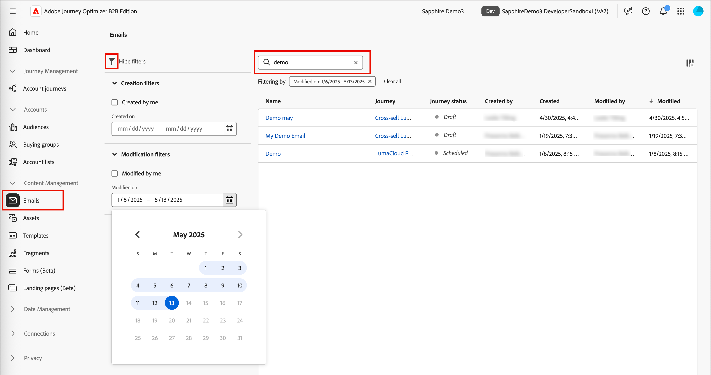

# Correos electrónicos

Cuando [crea mensajes de correo electrónico](./add-email.md), los agrega en el contexto de un nodo de recorrido. Cuando quiera trabajar con contenido de correo electrónico fuera del mapa de recorrido, utilice la lista _[!UICONTROL Correos electrónicos]_ para localizar y actualizar el correo electrónico. Puede revisar los correos electrónicos o actualizar la configuración y el contenido.

## Acceso y administración de correos electrónicos

Para acceder a los correos electrónicos en Adobe Journey Optimizer B2B edition, vaya a la navegación izquierda y haga clic en **[!UICONTROL Administración de contenido]** > **[!UICONTROL Correos electrónicos]**. Esta acción abre una página de lista con todos los correos electrónicos creados para la instancia enumerados en una tabla.

La tabla está ordenada por la columna _[!UICONTROL Modificado]_ de forma predeterminada, con los correos electrónicos actualizados más recientemente en la parte superior. Haga clic en el título de la columna para cambiar entre ascendente y descendente.

Para buscar un correo electrónico por su nombre, introduzca una cadena de texto en la barra de búsqueda. Haga clic en el icono _Filtro_ (  ) en la parte superior izquierda para filtrar los correos electrónicos mostrados por fechas de creación y modificación. También puede limitar la lista a los correos electrónicos que ha creado o modificado.

{width="700" zoomable="yes"}

## Apertura y edición de correos electrónicos

Haga clic en el nombre del correo electrónico en la lista para abrirlo. Puede revisar y cambiar la [configuración de correo electrónico](./add-email.md#define-the-email-settings). Haga clic en **[!UICONTROL Editar contenido del correo electrónico]** para hacer [actualizaciones del contenido](./email-authoring.md).

Si se muestran [alertas](./add-email.md#check-alerts) en la parte superior derecha de la página, haga clic para revisar las advertencias o errores y dirigir los elementos según sea necesario.

{width="700" zoomable="yes"}

También puede acceder a la ventana [_[!UICONTROL Simular contenido]_](./email-simulate-content.md). Utilice estas herramientas para previsualizar el contenido mediante un perfil de prueba, enviar pruebas y probar el correo electrónico para la entrega y el procesamiento del cliente de correo electrónico.
