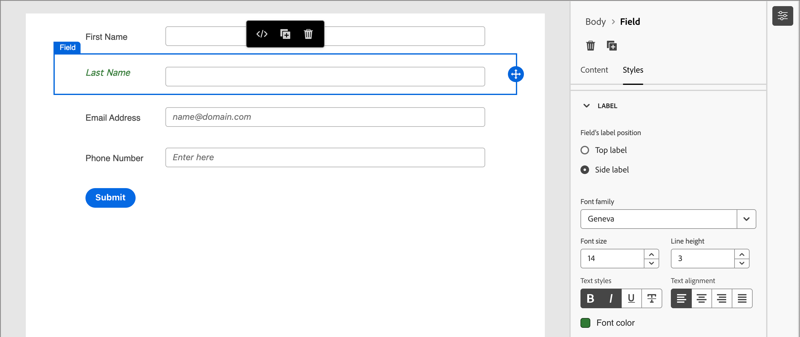
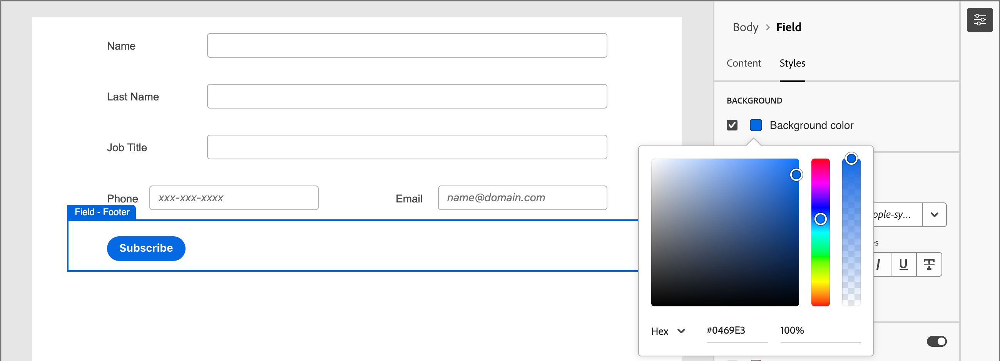

# Diseño de formulario

Después de [crear un formulario](./forms.md#create-forms), el espacio de diseño visual abre un borrador con una definición de formulario básica predeterminada. En el panel _[!UICONTROL Resumen]_ de la derecha, haga clic en **[!UICONTROL Editar formulario]** y use el espacio de diseño visual para definir el estilo del formulario y los componentes de campo.

{width="700" zoomable="yes"}

## Campos

Los campos de formulario se utilizan para recopilar datos de perfil de la persona que se pueden utilizar para dirigirse a personas y asociarlas a cuentas y grupos de compra. Todos los formularios nuevos comienzan con los siguientes campos en un diseño de una sola columna:

* Nombre
* Apellido
* Dirección de correo electrónico

Utilice las herramientas de diseño de campos para construir el conjunto de campos y el diseño que necesita para recopilar los datos que necesita para sus actividades de marketing basadas en cuentas.

### Añadir un campo {#add-field}

1. En el panel _[!UICONTROL Componentes]_ de la izquierda, arrastre el componente de contenido **[!UICONTROL Campo]** y suéltelo en el lienzo.

   {width="700" zoomable="yes"}

1. Haga clic en **[!UICONTROL Seleccionar atributo de campo]**.

1. En el cuadro de diálogo _[!UICONTROL Seleccionar atributo de campo]_, seleccione la casilla de verificación del atributo de perfil de persona que desee utilizar para el campo y haga clic en **[!UICONTROL Seleccionar]**.

   Los [esquemas empresariales XDM](../data/field-mapping.md#xdm-business-person-attributes) determinan los atributos disponibles.  También están disponibles todos los campos personalizados definidos para la instancia de Journey Optimizer B2B edition. Utilice el cuadro de texto Buscar para filtrar la lista por nombre o haga clic en el icono Filtrar para filtrar la lista por esquema/tipo de datos.

   {width="700" zoomable="yes"}

   En el lienzo, la etiqueta de campo predeterminada del atributo seleccionado se rellena en el lienzo. Los **[!UICONTROL detalles del campo]** se muestran en el panel de la derecha.

1. Si es necesario, cambie el texto **[!UICONTROL Label]**.

   Este texto se muestra junto al campo en el formulario. El texto predeterminado se rellena desde el atributo de campo.

1. Establezca **[!UICONTROL Tipo de campo]** según el tipo de datos del campo:

   | Tipo de campo | Uso | Ejemplo |
   | ---------- | ----- | ------- |
   | **[!UICONTROL Casilla de verificación]** | Use este tipo para que los visitantes puedan seleccionar un valor _true_ (marcado) o _false_ (desmarcado). | |
   | **[!UICONTROL Grupo de casillas de verificación]** | Use este tipo para que los visitantes puedan seleccionar un valor _true_ (marcado) o _false_ (desmarcado) para varios elementos. | |
   | **[!UICONTROL Moneda]** | Utilice este tipo para permitir un campo flotante que represente el tipo de moneda predeterminado seleccionado para la instancia de Journey Optimizer B2B edition. | |
   | **[!UICONTROL Fecha]** | Utilice este tipo para restringir la entrada a un formato de fecha y proporcionar un selector de calendario en el campo. | |
   | **[!UICONTROL Doble]** |  | |
   | **[!UICONTROL Correo electrónico]** | Utilice este tipo para restringir la entrada a un formato de dirección de correo electrónico. | |
   | **[!UICONTROL Número]** | Utilice este tipo para restringir el campo a un valor numérico. | |
   | **[!UICONTROL Grupo de radio]** | Utilice este tipo para permitir que los visitantes seleccionen una de un conjunto de opciones. | |
   | **[!UICONTROL Seleccionar]** | Utilice este tipo para permitir que los visitantes seleccionen una de un conjunto de opciones mediante una lista desplegable. | |
   | **[!UICONTROL Regulador]** | Utilice este tipo para permitir que los visitantes establezcan un valor numérico con un control deslizante. | |
   | **[!UICONTROL Teléfono]** | Utilice este tipo para un campo de entrada de número de teléfono. | |
   | **[!UICONTROL Texto]** | Utilice este tipo para un campo de entrada de texto estándar (cadena). | |
   | **[!UICONTROL Área de texto]** | Utilice este tipo para admitir entradas de texto más largas. | |
   | **[!UICONTROL Dirección URL]** | Utilice este tipo para restringir la entrada de texto a una dirección URL, incluido el protocolo de URL estándar. | |

1. Según el tipo de campo seleccionado, defina las demás opciones para la entrada y validación del campo:

   {width="400" zoomable="yes"}

   * **[!UICONTROL Marcador de posición]**: el valor del marcador de posición del campo que proporciona al visitante un ejemplo de lo que se espera para el campo.

   * **[!UICONTROL Instrucciones]**: texto instructivo que ayuda al visitante a completar el campo. Escriba el texto que desea mostrar como _texto de desplazamiento_ para el campo.

     >[!TIP]
     >
     >_Instrucciones vs. texto de marcador de posición_ 
     >
     >Utilice estas dos propiedades para guiar a los visitantes para que rellenen el campo. El texto de la instrucción aparece como información del objeto o texto emergente al pasar el puntero por encima del campo. El texto del marcador de posición aparece _atenuado_ dentro del campo y desaparece cuando el visitante introduce su texto en el campo. Puede utilizar ambos métodos o solo uno.

   * **[!UICONTROL Valor predeterminado]**: utilice esta opción para especificar un valor predeterminado para el campo.

   * **[!UICONTROL Mensaje de validación]**: utilice esta opción para especificar un mensaje de validación para el campo. Este mensaje se muestra si el visitante introduce un valor no válido para el campo. El mensaje _[!UICONTROL Standard]_ está establecido de manera predeterminada. Elige **[!UICONTROL Personalizado]** y escribe tu propio mensaje.

   * **Longitud máxima**: escriba el número máximo de caracteres que se pueden introducir en el campo.

1. Establezca los **[!UICONTROL comportamientos de campo]** según sea necesario:

   * **Obligatorio**: seleccione la casilla de verificación para que la entrada del campo sea necesaria para enviar el formulario.

   * **Habilitar máscara de entrada**: seleccione la casilla de verificación para restringir la entrada del visitante mediante una máscara de entrada. Por ejemplo, es posible que desee que los visitantes especifiquen números de teléfono en un formato específico. En el cuadro de diálogo, escriba la máscara con `9` para cualquier número, `a` para cualquier carta y `*` para cualquiera de los dos. Haga clic en Guardar para habilitar la máscara de entrada especificada.

     {width="500" zoomable="yes"}

### Cambiar estilo de campo {#field-styling}

Seleccione la ficha **[!UICONTROL Estilos]** en el panel derecho para cambiar el estilo del campo seleccionado.

* **[!UICONTROL Fondo]**: seleccione la casilla de verificación para aplicar un color de fondo al campo. El blanco es el color predeterminado. Haga clic en el cuadrado **[!UICONTROL Color de fondo]** para abrir el selector de color emergente y elegir un color para el fondo del campo.

  {width="600" zoomable="yes"}

* **[!UICONTROL Etiqueta]**: el estilo de la etiqueta controla las características visuales del texto que se muestra junto al campo. Seleccione una visualización de etiqueta superior o lateral relativa al campo. Puede establecer el tamaño de fuente, el alto de línea, el estilo de texto y la alineación del texto. Haga clic en el cuadrado **[!UICONTROL Color de fuente]** para abrir el selector de color emergente y elegir un color para el texto de la etiqueta.

  {width="600" zoomable="yes"}

* **[!UICONTROL Borde]**: haga clic en el cuadrado **[!UICONTROL Color del borde]** para abrir el selector de color emergente y elegir un color para el borde. Puede definir un borde para el campo, incluidos el color y el ancho de línea. Desactive la casilla de verificación para quitar el borde del campo mostrado. También puede cambiar el tamaño del borde (ancho de píxel), el estilo y el radio de las esquinas.

  {width="600" zoomable="yes"}

* **[!UICONTROL Tamaño]**: seleccione un valor de tamaño para determinar el ancho de visualización del campo. Elija _[!UICONTROL Anchura completa]_, _[!UICONTROL Anchura media]_ o _[!UICONTROL Automática]_.

* **[!UICONTROL Margen]**: establezca los márgenes (en píxeles) alrededor del campo. Puede establecer el mismo margen en los cuatro lados o seleccionar la casilla de verificación **[!UICONTROL Margen diferente para cada lado]** para establecer los márgenes horizontal y vertical por separado.

* **[!UICONTROL Relleno]**: establezca el relleno (en píxeles) alrededor del campo. Puede establecer el mismo margen en los cuatro lados o seleccionar la casilla de verificación **[!UICONTROL Margen diferente para cada lado]** para establecer los márgenes horizontal y vertical por separado.

  {width="600" zoomable="yes"}

### Reordenar campos {#field-reorder}

Puede mover campos de formulario directamente en el espacio de trabajo visual. Haga clic en la herramienta _Mover_ en el borde derecho del campo seleccionado y arrástrela a una nueva ubicación.

Agregue componentes estructurales al formulario y mueva campos a columnas para agruparlos y cambiar el diseño. Haga clic en la herramienta _Mover_ en el borde izquierdo del componente de columna seleccionado y arrástrela a una nueva ubicación dentro del formulario.

{width="500"}

### Eliminar o duplicar un campo {#field-delete-duplicate}

Haga clic en el icono _Eliminar_ (  ) en la barra de herramientas o en el panel derecho para eliminar un campo seleccionado. En el cuadro de diálogo de confirmación, haga clic en **[!UICONTROL Eliminar]**.

Haga clic en el icono _Duplicar_ (  ) en la barra de herramientas o en el panel derecho para duplicar un campo seleccionado. El nuevo campo se muestra justo debajo del campo original. Haga clic en **[!UICONTROL Seleccionar atributo de campo]** para establecer el atributo del campo. Establezca el tipo de campo, los detalles y los estilos según sea necesario.

{width="600" zoomable="yes"}

## Botón Enviar

El botón de envío (campo de pie de página) forma parte del formulario de forma predeterminada y no se puede quitar. Seleccione el componente botón/pie de página del formulario para cambiar el texto y el estilo del botón.

### Edición del contenido del botón {#button-content}

Con la ficha _[!UICONTROL Contenido]_ mostrada en el panel derecho, cambie el texto en el campo **[!UICONTROL Texto del botón]**. El tamaño del botón se ajusta para ajustarse a la longitud del texto.

{width="600" zoomable="yes"}

### Estilo del botón Enviar {#button-styles}

Seleccione la ficha **[!UICONTROL Estilos]** en el panel derecho para cambiar el estilo del componente de botón/pie de página seleccionado.

* **[!UICONTROL Fondo]**: seleccione la casilla de verificación para aplicar un color de fondo al botón. Azul es el color predeterminado. Haga clic en el cuadrado **[!UICONTROL Color de fondo]** para abrir el selector de color emergente y elegir un color para el fondo del botón.

  {width="600" zoomable="yes"}

* **[!UICONTROL Etiqueta]**: el estilo de etiqueta controla las características visuales del texto dentro del botón. Puede establecer el tamaño de fuente, el alto de línea, el estilo de texto y la alineación del texto. Haga clic en el cuadrado **[!UICONTROL Color de fuente]** para abrir el selector de color emergente y elegir un color para el texto de la etiqueta.

* **[!UICONTROL Borde]**: haga clic en el cuadrado **[!UICONTROL Color del borde]** para abrir el selector de color emergente y elegir un color para el borde. Puede definir un borde para el botón, incluidos el color y el ancho de línea. Desactive la casilla de verificación para quitar el borde del botón mostrado. También puede cambiar el tamaño del borde (ancho de píxel), el estilo y el radio para las esquinas redondeadas.

* **[!UICONTROL Tamaño]**: seleccione un valor de tamaño para determinar el ancho de visualización del botón. Elija _[!UICONTROL Anchura completa]_, _[!UICONTROL Anchura media]_ o _[!UICONTROL Automática]_. El relleno se ajusta según el tamaño y la configuración de alineación.

  {width="600" zoomable="yes"}

* **[!UICONTROL Alineación de botón]**: cuando elija un tamaño de _Media anchura_ o _Automático_ para el botón, establezca la alineación a la izquierda, a la derecha o en el centro. El relleno se ajusta según el tamaño y la configuración de alineación.

* **[!UICONTROL Margen]**: establezca los márgenes (en píxeles) alrededor del campo. Puede establecer el mismo margen en los cuatro lados o seleccionar la casilla de verificación **[!UICONTROL Margen diferente para cada lado]** para establecer los márgenes horizontal y vertical por separado.

* **[!UICONTROL Relleno]**: establezca el relleno (en píxeles) alrededor del campo. Puede establecer el mismo margen en los cuatro lados o seleccionar la casilla de verificación **[!UICONTROL Margen diferente para cada lado]** para establecer los márgenes horizontal y vertical por separado. El relleno se ajusta si cambia la configuración de tamaño y alineación.

  {width="600" zoomable="yes"}

## Estilo de formulario {#form-styling}

Puede cambiar los estilos del área de formulario al hacer clic fuera de los componentes estructurales o de formulario. Los componentes de formulario (campos y botones) heredan los estilos _Body_ definidos en los estilos de nivel superior, a menos que se definan otros estilos en el nivel de campo o de botón/pie de página.

{width="600" zoomable="yes"}

### Estilos CSS

Los nuevos formularios utilizan el CSS predeterminado para el estilo. Si desea cambiar los estilos modificando el CSS, puede copiarlo y, a continuación, utilizarlo para definir un CSS personalizado para el formulario.

_Para definir un CSS personalizado para el formulario :_

1. Haga clic en **[!UICONTROL Ver CSS]** en el panel derecho para revisar el código CSS.

   {width="450" zoomable="yes"}

1. Seleccione el código CSS en la ventana de desplazamiento y cópielo en el portapapeles.

1. Haga clic en **[!UICONTROL Cerrar]**.

1. (Opcional) Pegue el código copiado en su herramienta CSS favorita y edite el CSS para reflejar el estilo que desee.

1. Haga clic en **[!UICONTROL Agregar CSS personalizado]** en el panel derecho.

1. Pegue el código CSS en la ventana.

   {width="450" zoomable="yes"}

   Puede editar el texto pegado en esta ventana.

1. Haga clic en **[!UICONTROL Guardar]**.

### Estilo manual

Cambie la configuración en el panel derecho para definir la visualización de todo el formulario.

* **[!UICONTROL Color de fondo]**: seleccione la casilla de verificación para aplicar un color de fondo alrededor del área del formulario. El blanco es el color predeterminado. Haga clic en el cuadrado de color para abrir el selector de color emergente y elegir un color para el fondo del formulario.

* **[!UICONTROL Fondo de ventanilla]**: seleccione la casilla de verificación para aplicar un color de fondo a todos los componentes del formulario. El valor predeterminado es ningún color (se hereda del fondo exterior). Haga clic en el cuadrado de color para abrir el selector de color emergente y elegir un color para los componentes estructurales del formulario.

  {width="600" zoomable="yes"}

* **[!UICONTROL Texto]** - Elija una **[!UICONTROL familia de fuentes]** para el formulario, que afecta las etiquetas, la sugerencia y el texto de marcador de posición de los campos del formulario. También afecta al texto del botón de envío predeterminado.

* **[!UICONTROL Tamaño]**: cambie el tamaño (ancho) del formulario en píxeles.

* **[!UICONTROL Margen]**: establezca márgenes (en píxeles) alrededor de los componentes del formulario. Puede establecer el mismo margen en los cuatro lados o seleccionar la casilla de verificación **[!UICONTROL Margen diferente para cada lado]** para establecer los márgenes horizontal y vertical por separado.

  {width="600" zoomable="yes"}
