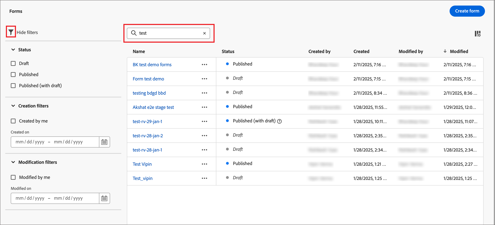
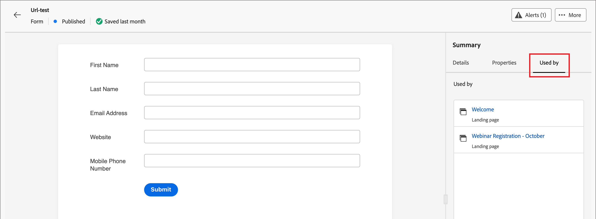

# Formularios

Para capturar información de los visitantes de una página web, cree formularios y agréguelos a las páginas de aterrizaje. Un formulario es un conjunto de campos que los visitantes de la página completan y envían para obtener algún tipo de contenido u oferta, como un documento técnico, un seminario web bajo demanda o una prueba gratuita.

La cantidad de información que debe capturar el formulario depende del valor del contenido o la oferta. Si ofrece algo simple, como un documento técnico, solo debe recopilar información mínima, como el nombre, el correo electrónico y la compañía. Si la oferta tiene un valor mayor, como una demostración o una prueba gratuita, puede recopilar más información. El requisito de solicitar un formulario enviado para permitir la visualización de contenido se denomina _contenido cerrado_. Su organización decide qué contenido debe actualizarse y cuál no (_gratis_). La práctica recomendada es permitir cierto contenido de forma gratuita y bloquear solo el contenido premium o de alta demanda.

## Acceso y administración de formularios

Para acceder a los formularios en Journey Optimizer B2B edition, vaya a la navegación izquierda y haga clic en **[!UICONTROL Administración de contenido]** > **[!UICONTROL Forms]**. Esta acción abre una página de lista con todos los formularios creados en la instancia enumerados en una tabla.

{width="700" zoomable="yes"}

La tabla está ordenada por la columna _[!UICONTROL Modificado]_, con los formularios actualizados más recientemente en la parte superior de forma predeterminada. Haga clic en el título de la columna para cambiar entre ascendente y descendente.

### Estado del formulario y ciclo vital

El estado del formulario determina su disponibilidad para utilizarlo en una página de aterrizaje o plantilla de página de aterrizaje, y los cambios que puede realizar en él.

| Estado | Descripción |
| -------------------- | ----------- |
| Borrador | Al crear un formulario, se encuentra en estado de borrador. Permanece en este estado a medida que define o edita los campos hasta que lo publica para utilizarlo en una página de aterrizaje o plantilla de página de aterrizaje. Acciones disponibles: <ul><li>Editar todos los detalles<li>Editar en el espacio de diseño visual<li>Publicación<li>Duplicado<li>Eliminar |
| Publicadas | Al publicar un formulario, pasa a estar disponible para su uso en una página de aterrizaje o plantilla de página de aterrizaje. El contenido del formulario publicado no se puede modificar en el espacio de diseño visual. Acciones disponibles: <ul><li>Editar nombre, descripción o página de agradecimiento<li>Añadir a una página de aterrizaje o plantilla de página de aterrizaje<li>Crear versión de borrador<li>Duplicado<li>Eliminar (si no está en uso)<li>Código incrustado |
| Publicado con borrador | Cuando crea un borrador a partir de un formulario publicado, la versión publicada permanece disponible para su uso en una página de aterrizaje o plantilla de página de aterrizaje, y el contenido del borrador se puede modificar en el espacio de diseño visual. Si publica la versión de borrador, reemplazará la versión publicada actual y el contenido se actualizará en las páginas de aterrizaje o en las plantillas de página de aterrizaje en las que esté en uso. Acciones disponibles: <ul><li>Editar nombre, descripción o páginas de agradecimiento<li>Añadir a una página de aterrizaje o plantilla de página de aterrizaje<li>Editar versión de borrador en el espacio de diseño visual<li>Publicar versión de borrador<li>Duplicado<li>Eliminar (si no está en uso)<li>Código incrustado |

{zoomable="yes"}

### Filtrado de la lista de formularios

Para buscar un formulario por nombre, introduzca una cadena de texto en la barra de búsqueda para buscar una coincidencia. Haga clic en el icono _Filtro_ (  ) para mostrar las opciones de filtro disponibles y cambiar la configuración para filtrar los elementos mostrados según los criterios especificados.

{width="700" zoomable="yes"}

### Personalización de la visualización de columnas

Personalice las columnas que desee mostrar en la tabla haciendo clic en el icono _Personalizar tabla_ (  ) en la parte superior derecha.

En el cuadro de diálogo, seleccione las columnas que desea mostrar y haga clic en **[!UICONTROL Aplicar]**.

{width="300"}

## Creación de formularios

Antes de empezar a crear formularios reutilizables en Journey Optimizer B2B edition, hay que tener en cuenta lo siguiente:

* Determine qué formularios necesita.

  Es posible utilizar solo cuatro formularios estándar. Uno para acceder a contenido descargable, otro para acceder a páginas web premium, otro para ver vídeos y otro para registrarse en cosas como seminarios web. Si alguna vez necesita cambiar un campo en un formulario, es más fácil actualizar cuatro formularios estándar que se utilizan globalmente en lugar de cambiar varios formularios distribuidos en todos los programas de marketing. <!-- Global forms also make progressive profiling much easier to implement. -->

* Para cada formulario estándar, determine qué campos utilizar y cómo presentarlos.

  Considere utilizar formularios más cortos, ya que se ha comprobado que son mejores para las conversiones. Cuando revise cada formulario, decida qué campos son razonables y necesarios para su propósito.

  Tenga en cuenta si debe rellenar previamente los campos de formulario para que la información básica, como el nombre y el correo electrónico, se rellene previamente. Pero otra información, como el cargo y el tamaño de la organización, no lo son. De este modo, el visitante solo debe rellenar dos campos y enviar el formulario. También puede utilizar un formulario social para rellenarlo con datos de Facebook o Twitter.

* Planifique qué página de seguimiento se mostrará después de que un visitante envíe un formulario (página _gracias_).

  ¿Todos obtienen la misma página o es dinámica y se basa en sus datos? Por ejemplo, alguien en la industria de la atención médica podría ver un contenido de página diferente a alguien en la industria tecnológica.

* Considere si desea omitir un formulario por completo si ya tiene la información que necesita.

  Cuando permite que se omita un formulario para una persona conocida que visita la página de aterrizaje, simplemente puede acceder al contenido directamente. Omitir el formulario ofrece una experiencia de visitante más ágil.

### Añadir un nuevo formulario

Puede crear un formulario en Journey Optimizer B2B edition haciendo clic en **[!UICONTROL Crear formulario]** en la parte superior derecha de la página de lista de _[!UICONTROL Forms]_.

1. En el cuadro de diálogo _[!UICONTROL Crear formulario]_, escriba un **[!UICONTROL Nombre]** (obligatorio) y una **[!UICONTROL Descripción]** (opcional) útiles.

   Requisitos de formulario:

   * Nombre: máximo de 100 caracteres, debe ser único, sin distinción de mayúsculas y minúsculas

   * Descripción: máximo de 300 caracteres

   * Se permiten caracteres Alpha, numéricos y especiales

   * Los caracteres reservados **_no se permiten_**: `\ / : * ? " < > |`

   {width="400"}

1. Haga clic en **[!UICONTROL Crear]**.

   Se abrirá la página de detalles del formulario con una definición de formulario básica predeterminada.

   {width="700" zoomable="yes"}

### Cambiar el diseño de formulario predeterminado

Utilice las herramientas de diseño visual para cambiar el contenido del formulario según sea necesario:

* [Añadir campos](./form-design.md#add-a-field)
* [Cambiar estilo de campo](./form-design.md#change-field-styling)
* [Reordenar campos](./form-design.md#reorder-fields)
* [Cambiar texto y estilo del botón de envío](./form-design.md#edit-and-style-the-submit-button)
* [Cambio del estilo del formulario](./form-design.md#change-form-styling)

Haga clic en **[!UICONTROL Guardar y cerrar]** para guardar los cambios de diseño del contenido del formulario y vaya a los detalles del formulario.

### Configurar la página de agradecimiento

En el panel _[!UICONTROL Resumen]_ de la derecha, desplácese hasta la sección **[!UICONTROL Página de agradecimiento]** y use la configuración **[!UICONTROL Realizar seguimiento con]** para definir lo que sucede cuando un visitante envía el formulario:

* **[!UICONTROL Permanecer en la página]**: elija esta opción para mantener al visitante en la misma página cuando se envíe el formulario.

* **[!UICONTROL Página de aterrizaje]**: elija esta opción para seleccionar cualquier página de aterrizaje de Journey Optimizer B2B edition o Marketo Engage como seguimiento.

* **[!UICONTROL Dirección URL externa]**: elija esta opción para especificar cualquier dirección URL como página de seguimiento. Una vez que el visitante envía el formulario, el explorador carga la dirección URL designada.

  >[!TIP]
  >
  >Si desea que el usuario utilice el formulario para descargar un archivo, puede especificar una URL para el archivo alojado. Con esta configuración, el botón de envío funciona como un botón de descarga.

### Publicar el borrador del formulario

Cuando esté listo para que el formulario esté disponible para usarlo en una página de aterrizaje o plantilla de página de aterrizaje, haga clic en **[!UICONTROL Publicar]**.

{width="400"}

Esta acción abre un cuadro de diálogo de confirmación. Puede anular el proceso de publicación haciendo clic en **[!UICONTROL Cancelar]** o en **[!UICONTROL Publicar]** para confirmar.

## Ver detalles del formulario

Haga clic en el nombre de cualquier formulario de la página de lista para abrir la página de detalles del fragmento. Puede editar el formulario, cambiarle el nombre o actualizar su descripción. Realice actualizaciones y haga clic fuera del nombre o del campo de descripción para guardar automáticamente los cambios.

>[!NOTE]
>
>Si una página de aterrizaje o plantilla de página de aterrizaje está utilizando un formulario publicado, no puede editar el contenido ni cambiar la página de agradecimiento. Puede crear una versión de borrador si desea realizar cambios en los formularios

{width="600" zoomable="yes"}

Haga clic en **[!UICONTROL Editar formulario]** para abrir el fragmento en el espacio de diseño visual.

Salga de la vista en cualquier momento haciendo clic en la flecha _Atrás_ en la parte superior izquierda, que le lleva a la página de lista _[!UICONTROL Forms]_.

## Ver formulario utilizado por referencias

En el panel _[!UICONTROL Resumen]_ de la derecha, haga clic en la pestaña **[!UICONTROL Utilizado por]** para ver los detalles de dónde se utiliza actualmente el formulario en Journey Optimizer B2B edition, en las páginas de aterrizaje y en las plantillas de páginas de aterrizaje.

>[!IMPORTANT]
>
>No se puede eliminar ningún formulario que esté en uso actualmente en una página de aterrizaje o plantilla de página de aterrizaje.

{width="600" zoomable="yes"}

Las referencias se muestran según la categoría: _Página de aterrizaje_ o _Plantilla de página de aterrizaje_. Haga clic en el vínculo para abrir la página o plantilla correspondiente donde se utiliza el formulario.

## Eliminar formularios

No se puede eliminar ningún formulario que una página de aterrizaje o plantilla de página de aterrizaje esté utilizando en ese momento. Puede comprobar las referencias _utilizadas por_ antes de iniciar la eliminación de un formulario. Además, una eliminación no se puede deshacer, por lo que debe comprobarla antes de iniciar una acción de eliminación.

Puede eliminar un formulario mediante cualquiera de los siguientes métodos:

* En la parte superior derecha, haga clic en **[!UICONTROL ... Más]** y elige **[!UICONTROL Eliminar]**.
* En la página de lista _[!UICONTROL Forms]_, haga clic en los puntos suspensivos junto al nombre del formulario y elija **[!UICONTROL Eliminar]**.

Esta acción abre un cuadro de diálogo de confirmación. Puede anular el proceso haciendo clic en **[!UICONTROL Cancelar]** o en **[!UICONTROL Eliminar]** para confirmar la eliminación.

{width="400"}

Si el formulario está en uso, la acción abre un cuadro de diálogo informativo que le avisa de que no se puede eliminar. Haga clic en **[!UICONTROL Aceptar]**, lo que anula la acción de eliminación.

{width="400"}

## Formularios duplicados

Duplique un formulario como una forma rápida y sencilla de crear un formulario nuevo utilizando un formulario existente como punto de partida para el diseño de formulario.

Puede duplicar un formulario mediante cualquiera de los siguientes métodos:

* En la parte superior derecha de la página de detalles del formulario, haga clic en **[!UICONTROL ... Más]** y elige **[!UICONTROL Duplicar]**.
* En la página de lista _[!UICONTROL Forms]_, haga clic en los puntos suspensivos junto al nombre del formulario y elija **[!UICONTROL Duplicar]**.

{width="450"}

En el cuadro de diálogo, introduzca un nombre útil (único) y una descripción. Haga clic en **[!UICONTROL Duplicar]** para completar la acción.

{width="400"}

Edite el formulario duplicado para cambiar el nombre según sea necesario y modificar el formulario para el uso previsto.

## Editar formularios

Los cambios realizados en un formulario dependen de su estado actual:

* Cuando un formulario está en estado _Borrador_, puede editar cualquiera de sus detalles y contenido (campos, botón y estilo).
* Cuando un formulario se encuentra en estado _Publicado_, puede editar el nombre o la descripción del formulario. No puede editar el contenido.
* Cuando un formulario se encuentra en _Publicado con el estado Borrador_, puede editar el nombre o la descripción del formulario. En la versión de borrador, también puede editar el contenido y la página de agradecimiento.

>[!BEGINTABS]

>[!TAB Borrador]

1. En la página de lista _[!UICONTROL Forms]_, haga clic en el nombre del formulario para abrirlo.

   Se muestra una vista previa del contenido del formulario, con los detalles del formulario a la derecha.

1. Modifique cualquiera de los detalles, como el nombre y la descripción.

   {width="600" zoomable="yes"}

1. Para realizar cambios en el formulario en el espacio de diseño visual, haga clic en **[!UICONTROL Editar formulario]**.

   Utilice las herramientas de diseño visual según sea necesario:

   * [Añadir campos](./form-design.md#add-a-field)
   * [Cambiar estilo de campo](./form-design.md#change-field-styling)
   * [Reordenar campos](./form-design.md#reorder-fields)
   * [Cambiar texto y estilo del botón de envío](./form-design.md#submit-button)
   * [Cambio del estilo del formulario](./form-design.md#change-form-styling)

   Haga clic en **[!UICONTROL Guardar y cerrar]** para volver a los detalles del formulario.

1. Cuando el formulario cumpla sus criterios y desee que esté disponible para usarlo en una página de aterrizaje o plantilla de página de aterrizaje, haga clic en **[!UICONTROL Publicar]**.

>[!TAB Publicado]

1. En la página de lista _[!UICONTROL Forms]_, haga clic en el nombre del formulario para abrirlo.

   Se muestra una vista previa del contenido del formulario, con los detalles del formulario a la derecha.

1. Para crear una versión de borrador para editar el formulario, haga clic en **[!UICONTROL Editar formulario]** en el panel _[!UICONTROL Resumen]_ de la derecha.

1. Haga clic en **[!UICONTROL Crear versión de borrador]** en el cuadro de diálogo para abrir la versión de borrador en el espacio de diseño visual.

   {width="400"}

1. Utilice las herramientas de diseño visual que sean necesarias para actualizar el contenido del formulario:

   * [Añadir campos](./form-design.md#add-a-field)
   * [Cambiar estilo de campo](./form-design.md#change-field-styling)
   * [Reordenar campos](./form-design.md#reorder-fields)
   * [Cambiar texto y estilo del botón de envío](./form-design.md#submit-button)
   * [Cambio del estilo del formulario](./form-design.md#change-form-styling)

   Haga clic en **[!UICONTROL Guardar y cerrar]** para volver a los detalles del formulario.

1. Cuando el borrador del formulario cumpla con sus criterios y desee que los cambios estén disponibles para usarlos en una página de aterrizaje o plantilla de página de aterrizaje, haga clic en **[!UICONTROL Publicar]**.

   Cuando publica la versión de borrador, reemplaza la versión publicada actual y el contenido del formulario se actualiza en las páginas de aterrizaje o en las plantillas de página de aterrizaje donde ya se utiliza.

>[!TAB Publicado con borrador]

1. Haga clic en el nombre del formulario para abrirlo.

1. Seleccione la ficha **[!UICONTROL Borrador]**.

   Se muestra una vista previa del contenido del formulario de la versión del borrador, con los detalles del formulario a la derecha.

   {width="700" zoomable="yes"}

1. Haga clic en **[!UICONTROL Editar formulario]** en el panel _[!UICONTROL Resumen]_ de la derecha y use las herramientas de diseño visual según sea necesario:

   * [Añadir campos](./form-design.md#add-a-field)
   * [Cambiar estilo de campo](./form-design.md#change-field-styling)
   * [Reordenar campos](./form-design.md#reorder-fields)
   * [Cambiar texto y estilo del botón de envío](./form-design.md#submit-button)
   * [Cambio del estilo del formulario](./form-design.md#change-form-styling)

   Haga clic en **[!UICONTROL Guardar y cerrar]** para volver a los detalles del formulario.

1. Cuando el borrador del formulario cumpla con sus criterios y desee que los cambios estén disponibles para usarlos en páginas de aterrizaje y plantillas de páginas de aterrizaje, haga clic en **[!UICONTROL Publicar]**.

   Cuando publique la versión de borrador, reemplazará la versión publicada actual y el formulario se actualizará en las páginas de aterrizaje y plantillas donde ya esté en uso.

>[!ENDTABS]

## Agregar formularios a una página de aterrizaje o plantilla

Forms están diseñados para ser reutilizados y se pueden insertar al diseñar una [página de aterrizaje](./landing-page-design.md) o [plantilla de página de aterrizaje](./landing-page-templates.md).

{{$include /help/_includes/content-design-add-forms.md}}

## Acciones de formulario para la creación de páginas y plantillas

Cuando se incluye un formulario en una página de aterrizaje o plantilla de página de aterrizaje, el contenido del formulario no se puede cambiar dentro de la página o plantilla. Sin embargo, puede aplicar las siguientes acciones:

* **[!UICONTROL Eliminar]**: esta acción quita el formulario del contenido de la página o plantilla actual (el origen del fragmento no se ve afectado).
* **[!UICONTROL Duplicado]**: esta acción duplica el formulario en la misma página o plantilla dentro del editor, con las mismas dimensiones y se agrega justo debajo de él.
* **[!UICONTROL Ver HTML]**: esta acción abre una ventana emergente con la HTML para el formulario. Puede editar HTML o copiarlo para utilizarlo en otro contenido web.
* **[!UICONTROL Editar formulario]**: esta acción abre una nueva pestaña del explorador con la página del editor de formularios y los detalles.

Al seleccionar el formulario en el espacio de diseño de la página de aterrizaje, estas acciones están disponibles en la barra de herramientas de contexto y en el panel de propiedades de la derecha.

{width="600" zoomable="yes"}
