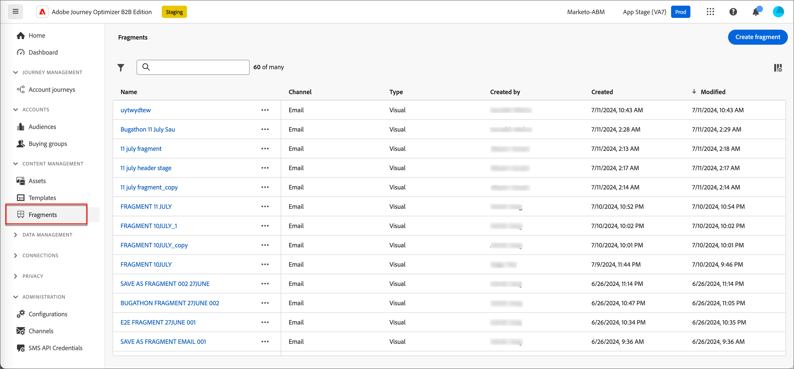

# Fragmentos

Un fragmento es un componente reutilizable al que se puede hacer referencia en uno o varios correos electrónicos y plantillas de correo electrónico en Adobe Journey Optimizer B2B Edition. Normalmente es un bloque de contenido (texto, imagen o ambos) que se puede crear previamente e insertar rápidamente en un correo electrónico o plantilla de correo electrónico. Con esta funcionalidad, puede generar varios bloques de contenido personalizados para que los utilicen los integrantes del equipo de marketing a fin de combinar el contenido del correo electrónico para mejorar el proceso de diseño. Los casos de uso comunes incluyen bloques de contenido de encabezado/pie de página para correo electrónico, banners de invitación a eventos y saludos de temporada.

Para aprovechar al máximo los fragmentos de sus flujos de trabajo:

* _Cree sus propios fragmentos_: cree fragmentos visuales desde cero o guarde contenido como un fragmento desde el editor de contenido visual.
* _Reutilizar fragmentos_: utilícelos tantas veces como sea necesario en el contenido.

## Fragmentos visuales

Los fragmentos visuales son bloques visuales predefinidos creados con el editor de contenido visual que se pueden reutilizar en varios correos electrónicos o plantillas de correo electrónico. El ámbito actual de Journey Optimizer B2B Edition y esta documentación son solo los fragmentos visuales. Los fragmentos basados en expresiones aún no son compatibles con Journey Optimizer B2B Edition.

## Acceso y administración de fragmentos

Para acceder a los fragmentos visuales en Adobe Journey Optimizer B2B Edition, vaya a la navegación izquierda y haga clic en **[!UICONTROL Administración de contenido]** > **[!UICONTROL Fragmentos]**. Esta acción abre una página de lista con todos los fragmentos creados en la instancia enumerados en una tabla.

{width="700" zoomable="yes"}

La tabla está ordenada por la columna _[!UICONTROL Modificado]_, con los fragmentos actualizados más recientemente en la parte superior de forma predeterminada. Haga clic en el título de la columna para cambiar entre ascendente y descendente.

Para buscar un fragmento por nombre, introduzca una cadena de texto en la barra de búsqueda para una coincidencia. Haga clic en el icono _Filtrar_ para filtrar los elementos mostrados según los criterios especificados.

{width="700" zoomable="yes"}

Personalice las columnas que desee mostrar en la tabla haciendo clic en el icono _Personalizar tabla_ de la parte superior derecha. Seleccione las columnas que desea mostrar y haga clic en **[!UICONTROL Aplicar]**.

## Creación de fragmentos

Puede crear nuevos fragmentos visuales en Journey Optimizer B2B Edition haciendo clic en **[!UICONTROL Crear fragmento]** en la parte superior derecha.

1. En el cuadro de diálogo _[!UICONTROL Crear fragmento]_, escriba un **[!UICONTROL Nombre]** y una **[!UICONTROL Descripción]** útiles (opcional).

   Requisitos de fragmento:

   * Nombre: máximo de 100 caracteres, debe ser único, sin distinción de mayúsculas y minúsculas

   * Descripción: máximo de 300 caracteres

   * Se permiten caracteres Alpha, numéricos y especiales

   * Los caracteres reservados **_no se permiten_**: `\ / : * ? " < > |`

   {width="400"}

1. Haga clic en **[!UICONTROL Crear]**.

   El editor de contenido visual se abre con un lienzo vacío.

<!-- To be linked to the corresponding sections on this page: Adobe Journey Optimizer B2B Edition - Email Templates

Adding structure and content
Adding assets
Navigating the layers
Previewing & editing URLs
View options
More options -->

### Añadir estructura y contenido {#design-fragment}

>[!CONTEXTUALHELP]
>id="ajo-b2b_structure_components_fragment"
>title="Adición de componentes de estructura"
>abstract="Los componentes de estructura definen el diseño del fragmento. Arrastre y suelte un componente **Estructura** en el lienzo para empezar a diseñar el contenido del fragmento."

>[!CONTEXTUALHELP]
>id="ajo-b2b_content_components_fragment"
>title="Acerca de los componentes de contenido"
>abstract="Los componentes de contenido son marcadores de posición de contenido vacíos que se pueden utilizar para crear el diseño de un fragmento."

{{$include /help/_includes/content-design-components.md}}

### Añadir recursos

{{$include /help/_includes/content-design-assets.md}}

### Desplazamiento por las capas, la configuración y los estilos

{{$include /help/_includes/content-design-navigation.md}}

### Personalizar contenido

{{$include /help/_includes/content-design-personalization.md}}

### Editar seguimiento de URL vinculadas

{{$include /help/_includes/content-design-links.md}}

## Ver detalles del fragmento

Haga clic en el nombre de cualquier fragmento de la página de lista para abrir la página de detalles del fragmento. Puede editar el fragmento, cambiarle el nombre o actualizar su descripción. Realice actualizaciones y haga clic fuera del nombre o del campo de descripción para guardar automáticamente los cambios.

>[!NOTE]
>
>Si un fragmento publicado está siendo utilizado por una plantilla de correo electrónico o de correo electrónico, no puede cambiar el nombre ni editar el contenido. Puede crear una versión de borrador si desea realizar cambios en el fragmento.

{width="600" zoomable="yes"}

Haga clic en **[!UICONTROL Editar fragmento]** para abrir el fragmento en el editor de contenido visual.

Salga de la vista en cualquier momento haciendo clic en la flecha _Atrás_ en la parte superior izquierda, que le devuelve a la página de lista _Fragmentos_.

## Ver fragmento utilizado por referencias

En la página de detalles del fragmento, haga clic en la ficha **[!UICONTROL Utilizado por]** para ver los detalles de dónde se utiliza actualmente el fragmento en Journey Optimizer B2B Edition, en correos electrónicos, plantillas de correo electrónico y fragmentos.

>[!IMPORTANT]
>
>No se puede eliminar ningún fragmento que esté en uso actualmente en ningún correo electrónico o plantilla de correo electrónico.

Las referencias se muestran según la categoría: _Correo electrónico_ o _Plantilla de correo electrónico_. Los correos electrónicos de Journey Optimizer B2B Edition están incrustados y creados en recorridos de cuenta, por lo que el recorrido principal del correo electrónico que utiliza el fragmento se muestra en las referencias.

{width="600" zoomable="yes"}

Haga clic en el vínculo para abrir el correo electrónico o la plantilla de correo electrónico correspondiente donde se utiliza el fragmento.

## Eliminar fragmentos

No se puede eliminar ningún fragmento que esté en uso actualmente en ninguna plantilla de correo electrónico o correo electrónico, por lo que asegúrese de comprobar las referencias de _usado por_ antes de iniciar la eliminación de un fragmento. Además, una eliminación no se puede deshacer, por lo que debe comprobarla antes de iniciar una acción de eliminación.

Puede eliminar un fragmento mediante cualquiera de los siguientes métodos:

* En los detalles del fragmento a la derecha, haga clic en **[!UICONTROL Eliminar]**.
* En la página de lista _[!UICONTROL Fragmentos]_, haga clic en los puntos suspensivos junto al fragmento y elija **[!UICONTROL Eliminar]**.

Esta acción abre un cuadro de diálogo de confirmación. Puede anular el proceso haciendo clic en **[!UICONTROL Cancelar]** o en **[!UICONTROL Eliminar]** para confirmar la eliminación.

{width="400"}

Si el fragmento está en uso, la acción abre un cuadro de diálogo informativo que le advierte de que no se puede eliminar. Haga clic en **[!UICONTROL Aceptar]**, lo que anula la acción de eliminación.

{width="400"}

## Editar fragmentos

Puede editar un fragmento mediante cualquiera de los siguientes métodos:

* En los detalles del fragmento a la derecha, haga clic en **[!UICONTROL Editar]**.
* En la página de lista _[!UICONTROL Fragmentos]_, haga clic en los puntos suspensivos junto al fragmento y elija **[!UICONTROL Editar]**.

Esta acción abre el fragmento en un editor de contenido visual, donde puede editarlo con cualquiera de las características de [creando un fragmento](#create-fragments).

## Duplicar fragmentos

Puede duplicar un fragmento mediante cualquiera de los siguientes métodos:

* En la página de listado de _[!UICONTROL Fragmentos]_, haga clic en el icono _Más_ (**...**) que aparece junto al nombre del fragmento y elija **[!UICONTROL Duplicado]**.
* En la parte superior derecha de la página de detalles del fragmento, haga clic en **[!UICONTROL ... Más]** y elige **[!UICONTROL Duplicar]**.

{width="600" zoomable="yes"}

En el cuadro de diálogo, introduzca un nombre útil (único) y una descripción. Haga clic en **[!UICONTROL Duplicar]** para completar la acción.

{width="400"}

El fragmento duplicado (nuevo) aparece en la lista _Fragmentos_.

## Guardar un fragmento del contenido de un correo electrónico o plantilla

Al crear o editar un correo electrónico o una plantilla de correo electrónico en el editor de contenido visual, puede elegir guardar todo o parte del contenido como un fragmento para que esté disponible para reutilizarlo.

1. Cuando tenga contenido para guardar como fragmento, haga clic en **[!UICONTROL Más]** y elija **[!UICONTROL Guardar como fragmento]**.

1. Seleccione los diferentes elementos que desea incluir en el fragmento.

   Para seleccionar varias estructuras, mantenga pulsado el botón Mayús o Control.

   Solo se pueden seleccionar estructuras adyacentes entre sí y la interfaz no permite seleccionar elementos no adyacentes.

1. Con el contenido seleccionado, haz clic en **[!UICONTROL Crear]** en la parte superior derecha.

1. En el cuadro de diálogo, introduzca un nombre y una descripción útiles para el fragmento. Luego haga clic en **[!UICONTROL Crear]**.

   A continuación, el nuevo fragmento se mostrará en la página de lista _Fragmentos_ y también estará disponible para su uso en correos electrónicos y plantillas de correo electrónico.

## Añadir fragmentos visuales al contenido del correo electrónico o de la plantilla

Los fragmentos están diseñados para su reutilización y se pueden insertar para la creación de plantillas de correo electrónico y correo electrónico. Puede añadir hasta 30 fragmentos en un correo electrónico o plantilla. Los fragmentos se pueden anidar hasta un solo nivel.

>[!BEGINTABS]

>[!TAB Agregar fragmentos a un correo electrónico]

1. Vaya a **[!UICONTROL Recorridos de cuenta]** y abra un recorrido recorrido existente o cree uno nuevo.

1. Crear un nodo [_[!UICONTROL Enviar correo electrónico ]_](./email-authoring.md#add-an-email-action-in-an-account-journey).

1. Cree o edite el contenido de [correo electrónico para el nodo](./email-authoring.md#create-the-email-content).

1. Arrastre y suelte un elemento del menú **[!UICONTROL Componentes]** para proporcionar una _estructura_ para el fragmento.

1. Para abrir la lista de fragmentos publicados, haga clic en el icono _Fragmentos_.

   Puede hacer lo siguiente:
   * Ordenar el listado.
   * Examine, busque y filtre la lista.
   * Cambiar entre las vistas de tarjeta (miniatura) y de lista.
   * Actualice la lista para reflejar cualquiera de los fragmentos creados recientemente.

   {width="600"}

1. Arrastre y suelte cualquier fragmento en el marcador de posición del componente de estructura.

   El editor procesa el fragmento dentro de la sección o el elemento de la estructura de correo electrónico.

El contenido del fragmento se actualiza dinámicamente dentro de la estructura para procesar una representación visual de cómo aparece el contenido en el correo electrónico.

>[!TIP]
>
>Si desea que el fragmento ocupe todo el diseño horizontal del correo electrónico, agregue una estructura de columna [!UICONTROL 1:1] y, a continuación, arrastre y suelte el fragmento en él.

Una vez guardado el correo electrónico, aparecerá en la página de detalles del fragmento cuando la pestaña _[!UICONTROL Utilizado por]_ esté seleccionada. Los fragmentos agregados a un correo electrónico no se pueden editar dentro del correo electrónico o la plantilla: el fragmento de origen publicado define el contenido.

>[!TAB Agregar fragmentos a una plantilla de correo electrónico]

1. En el panel de navegación izquierdo, haga clic en **[!UICONTROL Administración de contenido]** > **[!UICONTROL Plantillas]**.

1. Cree una nueva plantilla o abra una plantilla de correo electrónico existente y haga clic en **[!UICONTROL Editar plantilla de correo electrónico]**.

1. Arrastre y suelte un elemento del menú **[!UICONTROL Componentes]** para proporcionar una _estructura_ para el fragmento.

1. Para abrir la lista de fragmentos, haga clic en el icono _Fragmentos_.

   Puede hacer lo siguiente:
   * Ordenar el listado.
   * Examine, busque y filtre la lista.
   * Cambiar entre las vistas de tarjeta (miniatura) y de lista.
   * Actualice la lista para reflejar cualquiera de los fragmentos creados recientemente.

   {width="600"}

1. Arrastre y suelte cualquier fragmento en el marcador de posición del componente de estructura.

   El editor procesa el fragmento dentro de la sección o el elemento de la estructura de la plantilla de correo electrónico.

1. Arrastre y suelte cualquier fragmento en el marcador de posición del componente de estructura.

   El editor procesa el fragmento dentro de la sección o el elemento de la estructura de la plantilla de correo electrónico.

>[!TIP]
>
>Si desea que el fragmento ocupe todo el diseño horizontal de la plantilla de correo electrónico, agregue una estructura de columna _[!UICONTROL 1:1]_ y, a continuación, arrastre y suelte el fragmento en ella.

Una vez guardada la plantilla de correo electrónico, aparece en la página de detalles del fragmento cuando se selecciona la pestaña _[!UICONTROL Utilizado por]_. Los fragmentos agregados a una plantilla de correo electrónico no se pueden editar dentro de la plantilla: el fragmento de origen publicado define el contenido.

>[!ENDTABS]

## Acciones de fragmento durante la creación de correos electrónicos y plantillas

Cuando se agrega un fragmento a un correo electrónico o a una plantilla de correo electrónico, el contenido del fragmento no se puede editar dentro del correo electrónico o la plantilla. Sin embargo, puede aplicar las siguientes acciones:

* **[!UICONTROL Eliminar]**: esta acción elimina el fragmento del contenido actual del correo electrónico o de la plantilla de correo electrónico (el origen del fragmento no se ve afectado).
* **[!UICONTROL Actualizar]**: esta acción actualiza el contenido del fragmento en el correo electrónico o la plantilla de correo electrónico actual. La actualización es útil cuando desea reflejar cualquier edición reciente en el fragmento después de la adición al correo electrónico o a la plantilla de correo electrónico.
* **[!UICONTROL Duplicado]**: esta acción duplica el fragmento dentro del mismo correo electrónico o plantilla de correo electrónico dentro del editor, con las mismas dimensiones y se agrega justo debajo de él.
* **[!UICONTROL Abrir fragmento]**: esta acción abre una nueva pestaña del explorador con la página del editor de fragmentos y los detalles.
* **[!UICONTROL Romper herencia]**: esta acción interrumpe la herencia del fragmento (y sus cambios) del origen. Utilice esta acción para que el contenido del fragmento esté disponible como contenido independiente y editable dentro del correo electrónico o la plantilla de correo electrónico. Esta acción también quita el correo electrónico o la plantilla de correo electrónico de la referencia _Utilizada por_ para el fragmento original.

Al seleccionar el fragmento en la página del editor, estas acciones están disponibles en la barra de herramientas contextual y en el panel de propiedades de la derecha.

{width="600" zoomable="yes"}