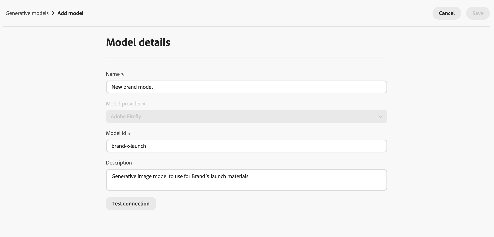

# Modelos de IA generativos para la alineación de marca

Amplíe sus capacidades de creación de imágenes de IA con modelos integrados, modelos de Firefly personalizados y proveedores de generación de imágenes de terceros para satisfacer sus necesidades específicas y mejorar la alineación de marca:

- El **[!UICONTROL modelo Adobe]** con tecnología Firefly Image Model 4 está listo para usarse y listo para usarse para generar imágenes inmediatamente sin necesidad de configuración adicional.
- **[!UICONTROL Modelo de socio]**, con tecnología Gemini 2.5 Flash, ofrece capacidades especializadas para casos de uso específicos.
- **[!UICONTROL Los modelos personalizados]** son modelos específicos de tu marca, entrenados en tus propios recursos y añadidos por tu organización.

Obtenga información acerca de los modelos personalizados en la [documentación de Adobe Firefly](https://helpx.adobe.com/firefly/web/work-with-enterprise-features/train-custom-models/custom-models-overview.html){target="_blank"}.

Los especialistas en marketing pueden seleccionar cualquiera de los modelos generativos habilitados al generar imágenes para el contenido de su correo electrónico o página de aterrizaje.

## Administración de modelos generativos

Desde una ubicación central, puede ver todos los modelos disponibles, filtrar y buscar modelos específicos y configurar las opciones de los modelos de sus marcas.

1. En el panel de navegación izquierdo, vaya a **[!UICONTROL Administración de contenido]** > **[!UICONTROL Marcas]**.

1. En la página, seleccione la pestaña **[!UICONTROL Modelos generativos]**.

{width="800" zoomable="yes"}

### Filtrar y buscar en la lista

Haga clic en el icono _Filtro_  para acceder al menú de filtros. Filtrar modelos por **[!UICONTROL tipo]** o **[!UICONTROL estado]**.

{width="700" zoomable="yes"}

También puede utilizar la barra de búsqueda para buscar un modelo generativo específico por nombre.

### Acciones de modelo

Para un modelo personalizado de la lista, haz clic en el icono de _menú Más_ . Puede elegir **[!UICONTROL Habilitar]** o **[!UICONTROL Deshabilitar]** para cambiar el estado de disponibilidad del modelo, o bien elegir **[!UICONTROL Eliminar]** para eliminar el modelo de la lista.

{width="450"}

Para un modelo integrado, haga clic en el icono _Habilitar_ (  ) o _Deshabilitar_ (  ) para cambiar la disponibilidad del modelo para la generación de imágenes.

>[!NOTE]
>
>Solo se pueden eliminar los modelos personalizados.

## Añadir un modelo generativo

Cree modelos de Firefly personalizados o conecte proveedores de generación de imágenes de terceros para ampliar sus capacidades de IA generativa.

>[!NOTE]
>
>La creación de modelos de Firefly personalizados requiere un acuerdo de Firefly ETLA.

1. En la ficha _[!UICONTROL Modelos generativos]_, haga clic en **[!UICONTROL Agregar modelo]**.

1. Escriba un **[!UICONTROL Nombre]** para el modelo.

<!-- 1. Select a **[!UICONTROL Model provider]**. future development -->

1. Escriba el **[!UICONTROL ID de modelo]**.

   Para encontrar el ID de modelo, acceda al sitio web de Firefly y vaya a los modelos formados. El identificador único está disponible en la sección de administración del modelo una vez publicado. Para obtener más información, consulte la [documentación de modelos personalizados de Firefly](https://helpx.adobe.com/firefly/web/work-with-enterprise-features/train-custom-models/custom-models-overview.html){target="_blank"}.

1. Opcionalmente, escriba una **[!UICONTROL Descripción]** para ayudar a identificar el modelo y su uso previsto.

   {width="550" zoomable="yes"}

1. Haga clic en **[!UICONTROL Probar conexión]** para comprobar la configuración del modelo.

1. Cuando la prueba de conexión se realice correctamente, haga clic en **[!UICONTROL Guardar]** para guardar la configuración del modelo.

   Al guardar el modelo, se agrega a la lista de modelos generativos, donde puede habilitarlo para que lo utilicen los especialistas en marketing. También puede desactivarla o eliminarla en cualquier momento.

   {width="600" zoomable="yes"}
