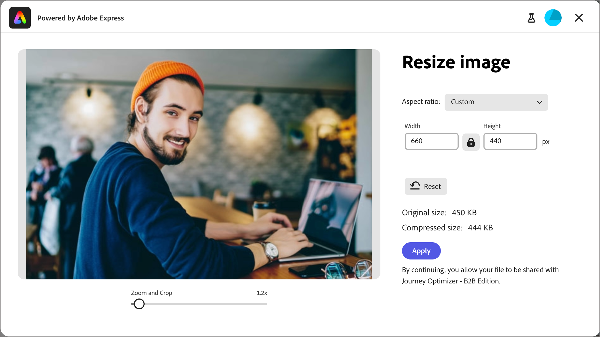

# Edición de imágenes con Adobe Express {#edit-images-adobe-express}

>[!CONTEXTUALHELP]
>id="ajo-b2b_assets_edit_adobe_express"
>title="Edición de imágenes en Adobe Express"
>abstract="Las herramientas de edición de imágenes sencillas e intuitivas, con tecnología de Adobe Express, están disponibles directamente en Adobe Journey Optimizer B2B Edition para aumentar la velocidad de contenido."

Adobe Journey Optimizer B2B edition se integra de forma nativa con Adobe Express y le permite acceder a un conjunto de herramientas de edición de imágenes de Adobe Express. Puede utilizar estas herramientas para modificar las imágenes almacenadas en el repositorio de recursos de Journey Optimizer B2B edition. La integración ofrece las siguientes ventajas clave:

* Se ha aumentado la reutilización del contenido mediante la edición y el guardado de nuevos recursos de imagen en Journey Optimizer B2B edition.

* Se ha reducido el tiempo y el esfuerzo para actualizar los recursos de imagen o crear nuevas versiones de los recursos de imagen existentes.

>[!NOTE]
>
>Las autorizaciones para las funciones de edición de Adobe Express se incluyen en todas las suscripciones a Journey Optimizer B2B edition.

Las funciones de Adobe Express admiten los formatos de archivo de imagen PNG y JPEG.

_Para modificar una imagen :_

1. Vaya a la navegación de la izquierda y haga clic en **[!UICONTROL Administración de contenido]** > **[!UICONTROL Assets]**.

Esta acción abre una página de lista con todos los recursos enumerados.

1. Busque la imagen que desea modificar o utilizar como original para crear un nuevo recurso.

   * Para ver los recursos por carpeta, abra la estructura haciendo clic en el icono _Mostrar carpetas_ en la parte superior izquierda.

   * Para ordenar la tabla por cualquiera de las columnas, haga clic en el título de la columna. La flecha de la fila de título indica la columna de ordenación y el orden actuales.

   * Para buscar un recurso de imagen dentro de la carpeta seleccionada, introduzca una cadena de texto en la barra de búsqueda.

   {width="800" zoomable="yes"}

1. Haga clic en el nombre del recurso de imagen para abrirlo y ver sus detalles.

   >[!TIP]
   >
   >Se recomienda seleccionar [la ficha _[!UICONTROL Utilizada por]_](./internal-image-assets.md#view-asset-used-by-references) en los detalles de la imagen y revisar el contenido donde se utiliza actualmente la imagen antes de continuar con las ediciones en el archivo de imagen.

1. En la imagen _[!UICONTROL Detalles]_ de la derecha, haz clic en **[!UICONTROL Editar con Adobe Express]**.

   {width="600" zoomable="yes"}

   Si la imagen está en uso, aparece un cuadro de diálogo de alerta para informarle de que los cambios afectan a ese contenido. Haga clic en **[!UICONTROL Continuar]** para continuar con el editor de Adobe Express.

   {width="300"}

## Licencia de Adobe Express Enterprise

Si tiene una licencia Enterprise para Adobe Express, puede acceder y utilizar el editor Express. Estas funciones de edición incluyen operaciones para ajustes de imagen, como color, brillo, nitidez, contrastes y recorte. También incluyen _magia de IA_ operaciones, como quitar fondos, insertar y quitar objetos y borrar partes de la imagen.

>[!NOTE]
>
>La licencia empresarial de Adobe Express debe adquirirse en la misma organización de IMS para acceder a estas funciones completas de editor para Journey Optimizer B2B edition. Como miembro individual de la organización IMS, necesita una licencia asignada en la instancia de Adobe Express. De lo contrario, su acceso a Adobe Express estará restringido a [acciones rápidas en Adobe Express](#quick-actions-in-adobe-express) desde Journey Optimizer B2B edition.

{width="600" zoomable="yes"}

La [Guía del usuario de Adobe Express](https://helpx.adobe.com/express/web.html){target="_blank"} proporciona información detallada sobre las funciones de edición disponibles.

## Acciones rápidas en Adobe Express

Si no dispone de una licencia de Adobe Express Enterprise, puede acceder al editor de acciones rápidas de Adobe Express.

1. En el editor de acciones rápidas de Adobe Express, seleccione cualquiera de las funciones de modificación de imágenes para modificar la imagen.

   * [**[!UICONTROL Cambiar tamaño de imagen]**](#resize-image)
   * [**[!UICONTROL Quitar fondo]**](#remove-background)
   * [**[!UICONTROL Recortar imagen]**](#crop-image)
   * [**[!UICONTROL Convertir a PNG]**](#convert-file-format) (cuando se carga una imagen de JPEG)
   * [**[!UICONTROL Convertir a JPEG]**](#convert-file-format) (cuando se carga una imagen PNG)

   {width="600" zoomable="yes"}

1. Cuando vuelva al editor principal de acciones rápidas de Adobe Express, haga clic en **[!UICONTROL Guardar]** para guardar el archivo de imagen modificado en el repositorio de recursos de Journey Optimizer B2B edition con el mismo nombre de archivo.

## Redimensionar imagen

1. Utilice la configuración de cambio de tamaño para reducir o expandir la imagen:

   * Seleccione una opción **[!UICONTROL Proporción de aspecto]**. Use un tamaño estándar para el contenido digital o elija **[!UICONTROL Personalizado]** si desea introducir valores para **[!UICONTROL Anchura]** y **[!UICONTROL Altura]** para satisfacer sus necesidades.

   * Los _[!UICONTROL tamaños originales]_ y _[!UICONTROL tamaños comprimidos]_ mostrados muestran los cambios de tamaño que se producen si aplica los cambios. La herramienta **[!UICONTROL Zoom y recorte]** permite inspeccionar más de cerca partes de la imagen mostrada.

   * Si desea devolver la imagen a su estado original, haga clic en **[!UICONTROL Restablecer]**.

   {width="600" zoomable="yes"}

1. Cuando esté satisfecho con el resultado, haga clic en **[!UICONTROL Aplicar]**.

## Quitar fondo

{width="600" zoomable="yes"}

Adobe Express realiza una eliminación automática del fondo para aislar el objeto principal de la imagen. Si está satisfecho con el resultado, haga clic en **[!UICONTROL Aplicar]**.

## Recortar imagen

1. Arrastre los controladores de las esquinas de la imagen para eliminar las áreas exteriores que no desee incluir en el recurso de imagen.

   {width="600" zoomable="yes"}

1. Cuando esté satisfecho con el resultado, haga clic en **[!UICONTROL Aplicar]**.

## Convertir formato de archivo

* **[!UICONTROL Convertir a JPEG]**: para una imagen PNG, puede convertir la imagen en un archivo de imagen JPEG y guardarla como un nuevo recurso.
* **[!UICONTROL Convertir a PNG]**: para una imagen de JPEG, puede convertir la imagen en un archivo de imagen PNG y guardarla como un nuevo recurso.

{width="600" zoomable="yes"}

1. Haga clic en **[!UICONTROL Aplicar]**.
