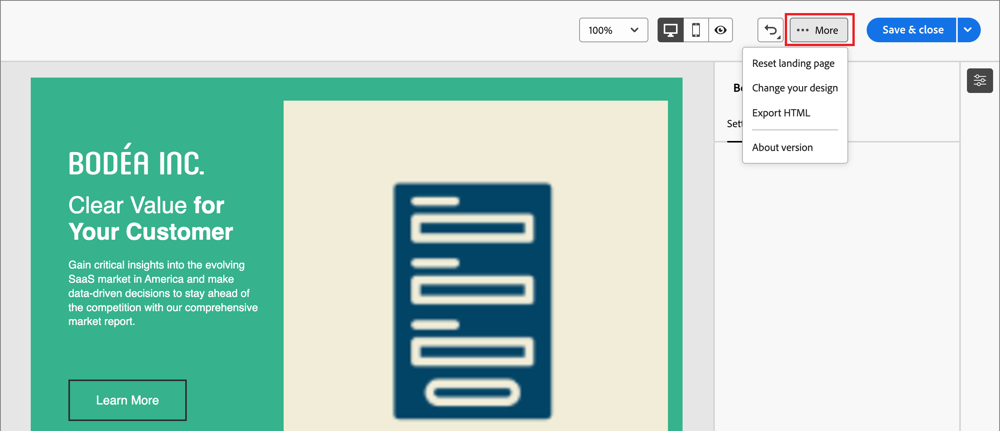

# Diseño de plantilla de la página de destino

Después de [crear una plantilla de página de aterrizaje](./landing-page-templates.md#create-a-landing-page-template), use el espacio de diseño visual para crear los componentes estructurales y de contenido en la plantilla de página.

## Añadir estructura y contenido {#structure-content-landing-page}

{{$include /help/_includes/content-design-components.md}}

### Añadir CSS personalizado

Puede agregar su propio CSS personalizado directamente en el espacio de diseño de la página de aterrizaje. Utilice CSS personalizado para aplicar un estilo avanzado y específico, para una mayor flexibilidad y control sobre el aspecto del contenido. Se recomienda añadir este estilo de nivel superior antes de incluir componentes como imágenes, botones y texto.

Con al menos un componente de contenido en el lienzo, selecciona el componente **[!UICONTROL Cuerpo]** en el árbol de navegación izquierdo para acceder al editor CSS personalizado.

{width="800" zoomable="yes"}

{{$include /help/_includes/content-design-custom-css.md}}

### Añadir recursos

{{$include /help/_includes/content-design-assets.md}}

### Añadir formularios

{{$include /help/_includes/content-design-add-forms.md}}

### Desplazamiento por las capas, la configuración y los estilos

{{$include /help/_includes/content-design-navigation.md}}

### Personalización del contenido

{{$include /help/_includes/content-design-personalization.md}}

### Editar seguimiento de URL vinculadas

{{$include /help/_includes/content-design-links.md}}

### Guarde el trabajo

Haga clic en **[!UICONTROL Guardar]** en cualquier momento para guardar la plantilla de la página de aterrizaje.
<!--
You can continue to make edits to the draft page template. When you are ready to make it available for using in page creation, you can [publish the template](./landing-page-templates.md#). -->

### Ver opciones

Aproveche las opciones de vista y validación de contenido disponibles en el espacio de diseño visual.

* Acercar/alejar el contenido en las opciones de zoom preestablecidas.

* Cambie la visualización del contenido en Escritorio, Móvil o Solo texto/Texto sin formato.
   * Haz clic en el icono _Ver_ para obtener una vista previa del contenido entre dispositivos.
   * Seleccione uno de los dispositivos predeterminados o introduzca dimensiones personalizadas para obtener una vista previa del contenido.

### Más opciones

En el menú _[!UICONTROL Más...]_ de la parte superior del espacio de diseño visual, puede realizar las siguientes acciones:

{width="500"}

* **[!UICONTROL Restablecer página de aterrizaje]**: haga clic en esta opción para borrar el lienzo de diseño visual de una pizarra en blanco y reiniciar la creación del contenido de la página.
* **[!UICONTROL Cambia tu diseño]** - Vuelve a la página de inicio de _[!UICONTROL Crear tu página de aterrizaje principal]_. Desde allí, puede elegir otra plantilla para reiniciar el proceso de diseño o elegir diseñar la página desde cero en un lienzo en blanco.
<!--- * **[!UICONTROL Save as content template]** - Save the page body as a landing page template to be reused across multiple landing pages. You provide a name and description for the template and save it to the list of saved  landing page templates. -->
* **[!UICONTROL Exportar HTML]**: descargue el contenido del lienzo visual en su sistema local en formato HTML empaquetado como archivo zip.
