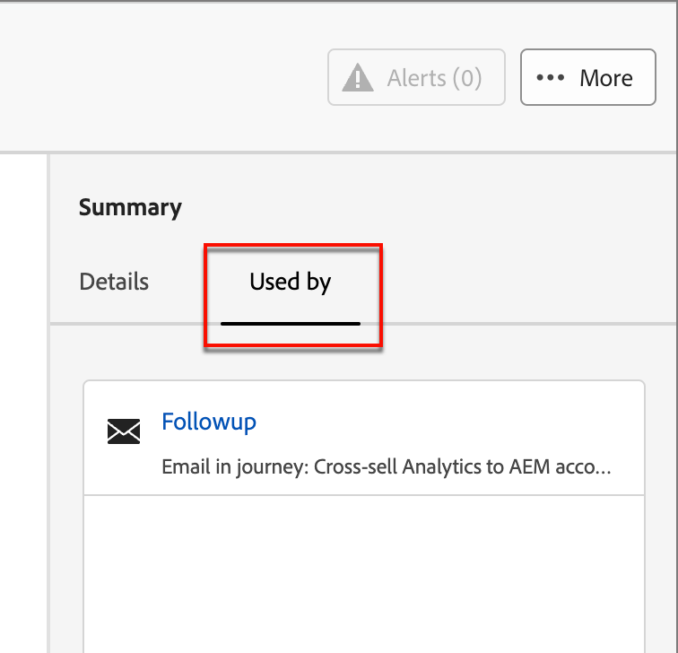

# Plantillas de página de aterrizaje

Para un proceso de diseño acelerado y mejorado, puede crear plantillas de página de aterrizaje independientes para estandarizar el diseño de la página y el contenido. Los estrategas de marketing pueden reutilizar las páginas y adaptarlas para adaptarlas al uso en campañas y recorridos.

## Acceso y administración de plantillas de página de aterrizaje

Para acceder a las plantillas de página de aterrizaje de Adobe Journey Optimizer B2B edition, ve a **[!UICONTROL Administración de contenido]** > **[!UICONTROL Plantillas]**. En _[!UICONTROL WEB]_ del panel de navegación, seleccione **[!UICONTROL Plantillas de página de aterrizaje]**.

La página de lista mostrada incluye todas las plantillas de página de aterrizaje creadas en la instancia que aparece en formato de tabla. La tabla está ordenada por la columna _[!UICONTROL Modificada]_ de forma predeterminada, con las plantillas actualizadas más recientemente en la parte superior. Haga clic en el título de la columna para cambiar entre ascendente y descendente.

Para buscar una plantilla por nombre, escriba una cadena de texto en la barra de búsqueda.

{width="700" zoomable="yes"}

Haga clic en el icono _Filtro_ (  ) en la parte superior izquierda para filtrar la lista según las fechas de creación o modificación, y las plantillas que haya creado o modificado.

Personalice las columnas que desee mostrar en la tabla haciendo clic en el icono _Personalizar tabla_ (  ) en la parte superior derecha. Seleccione las columnas que desea mostrar y haga clic en **[!UICONTROL Aplicar]**.

Desde la lista mostrada de plantillas, puede realizar las acciones descritas en las secciones siguientes.

## Creación de una plantilla de página de aterrizaje

Puede crear una plantilla de página de aterrizaje a partir de la página de lista de plantillas de página de aterrizaje haciendo clic en **[!UICONTROL Crear plantilla]** en la parte superior derecha.

1. En el cuadro de diálogo, escriba un **[!UICONTROL Nombre]** único (obligatorio) y una **[!UICONTROL Descripción]** útil (opcional).

   {width="400"}

1. Haga clic en **[!UICONTROL Crear]**.

Se abre la página de aterrizaje _[!UICONTROL Crear tu página de aterrizaje principal]_ y proporciona opciones para crear la plantilla: _[!UICONTROL Diseñar desde cero]_, _[!UICONTROL Importar HTML]_ o seleccionar una de las _[!UICONTROL plantillas guardadas]_.

{width="800" zoomable="yes"}

Después de seleccionar el método que desea usar para iniciar el diseño de la plantilla, use el espacio de diseño visual para [diseñar el contenido de la plantilla de la página de aterrizaje](./landing-page-design.md).

### Diseñe desde cero

Utilice el espacio de diseño visual para definir la estructura del contenido de la página de aterrizaje. Al agregar y mover componentes estructurales con sencillas acciones de arrastrar y soltar, puede diseñar la forma del contenido de la página reutilizable en cuestión de segundos.

>[!NOTE]
>
>Las herramientas de diseño disponibles son equivalentes a las herramientas utilizadas para el diseño de páginas de aterrizaje. La diferencia es que este contenido se guarda como una plantilla que se puede reutilizar en varias páginas de aterrizaje.

1. En la página de inicio de _[!UICONTROL Diseña tu plantilla]_, selecciona la opción **[!UICONTROL Diseñar desde cero]**.

1. [Agregar estructura y contenido](./landing-page-design.md#add-structure-and-content) a la plantilla.

### Importar HTML

Adobe Journey Optimizer B2B edition le permite importar contenido existente de HTML para diseñar las plantillas de página de aterrizaje.

{{$include /help/_includes/content-design-import.md}}

{width="500"}

>[!NOTE]
>
>El uso de una etiqueta `<table>` como primera capa de un archivo HTML puede causar la pérdida de estilo, incluida la configuración del fondo y el ancho en la etiqueta de la capa superior.

Puede personalizar el contenido importado según sea necesario con el espacio de diseño visual.

### Seleccionar una plantilla de diseño

{{$include /help/_includes/content-design-select-template.md}}

## Ver detalles de plantilla de página

En la página de listado _Plantillas de página de aterrizaje_, haga clic en el nombre de una plantilla de página de aterrizaje para abrir la página de detalles. Desde aquí puede ver las propiedades básicas de la plantilla de página de aterrizaje y acceder al espacio de diseño visual para realizar cambios en el contenido de la plantilla.

{width="700" zoomable="yes"}

* Ver los detalles de la plantilla, como el nombre y la descripción. Esta configuración se puede editar. Haga clic fuera del cuadro de descripción para guardar los cambios automáticamente.

* Vea las propiedades de la plantilla, como creada por, creada el, actualizada por última vez el y modificada por.

* Haga clic en **[!UICONTROL Más]** en la parte superior derecha para realizar acciones rápidas en la plantilla de la página de aterrizaje, como _Duplicar_ y _Eliminar_.

* Si hay alertas activas (errores y advertencias para la plantilla de página de aterrizaje), haga clic en **[!UICONTROL Alertas]** en la parte superior derecha para ver la información.

  Estas alertas no prohíben el uso de la plantilla de página de aterrizaje para la creación de páginas de aterrizaje. La información proporciona a los especialistas en marketing de su equipo visibilidad sobre lo que podría no funcionar y las actualizaciones necesarias para poder utilizarlo en la entrega.

## Ver plantilla utilizada por referencias

En la página de detalles de plantillas, haga clic en la ficha **[!UICONTROL Utilizado por]** para ver detalles sobre dónde se utiliza esta plantilla en una página de aterrizaje.

{width="400"}

* Al hacer clic en el vínculo, se le redirige a la página de aterrizaje correspondiente donde se utiliza la plantilla.

* Salga de la vista en cualquier momento haciendo clic en la flecha hacia atrás, que le devuelve a la página del listado.

## Editar plantillas de página de aterrizaje

Esta acción se puede realizar desde:

* La página de detalles: haga clic en **[!UICONTROL Editar plantilla de página de aterrizaje]**.
* La página del listado: haga clic en los puntos suspensivos (**...**) junto a una plantilla y elija **[!UICONTROL Editar]**.

Esta acción lo lleva a la página _Diseñar su plantilla_ o a la página del editor de contenido visual (según el último estado guardado de la plantilla de página de aterrizaje). Desde aquí puede editar el contenido de la plantilla de la página de aterrizaje según sea necesario. Consulte [Crear una plantilla de página de aterrizaje](#create-a-landing-page-template) para obtener información sobre las opciones de edición.

## Duplicar plantillas de página de aterrizaje

Puede duplicar una plantilla de página de aterrizaje mediante cualquiera de los siguientes métodos:

* En los detalles de la plantilla a la derecha, expanda **[!UICONTROL Más]** y haga clic en **[!UICONTROL Duplicar]**.

  {width="400"}

* En la página de listado _[!UICONTROL Plantillas de página de aterrizaje]_, haga clic en los puntos suspensivos (...) junto a la plantilla y elija **[!UICONTROL Duplicar]**.

En el cuadro de diálogo, introduzca un nombre útil (único) y una descripción. Haga clic en **[!UICONTROL Duplicar]** para completar la acción.

La plantilla duplicada (nueva) de página de aterrizaje aparece en el listado de _plantillas de página de aterrizaje_.

## Eliminar plantillas de página de aterrizaje

La eliminación de una plantilla de página de aterrizaje no se puede deshacer, por lo que debe comprobarse antes de iniciar una acción de eliminación. Puede eliminar una plantilla de página de aterrizaje mediante cualquiera de los siguientes métodos:

* En los detalles de la plantilla a la derecha, expanda **[!UICONTROL Más]** y haga clic en **[!UICONTROL Eliminar]**.
* En la página de listado _Plantillas de página de aterrizaje_, haga clic en los puntos suspensivos (...) junto a la plantilla y elija **[!UICONTROL Eliminar]**.

  {width="500"}

Esta acción abre un cuadro de diálogo de confirmación. Puede anular el proceso haciendo clic en **[!UICONTROL Cancelar]** o en **[!UICONTROL Eliminar]** para confirmar la eliminación.

## Realizar acciones masivas

En la página de lista de plantillas de página de aterrizaje, seleccione varias plantillas a la vez seleccionando las casillas de verificación de la izquierda. Aparece un banner en la parte inferior cuando selecciona varias plantillas.

{width="600"}

**[!UICONTROL Eliminar]**: puede eliminar hasta un máximo de 20 plantillas al mismo tiempo. Un cuadro de diálogo de confirmación le permite anular la acción o confirmar la eliminación de las plantillas.

## Crear una página de aterrizaje a partir de una plantilla guardada

Desde la página _Crear su página de aterrizaje_, use la sección _Seleccionar plantilla de diseño_ para empezar a crear su contenido a partir de una plantilla.

Para empezar a crear contenido con una de las plantillas de página de aterrizaje creadas, siga estos pasos:

1. Acceda al espacio de diseño visual desde la página _Editar contenido_.

   En la página _Crear su página de aterrizaje_, la pestaña _Plantillas de muestra_ está seleccionada de manera predeterminada.

1. Para usar una plantilla de página de aterrizaje personalizada, selecciona la pestaña **[!UICONTROL Plantillas guardadas]**.

   Esta pestaña muestra una lista de todas las plantillas de página de aterrizaje creadas en la zona protegida. Puede ordenarlos _Por nombre_, _Última modificación_ y _Última creación_.

1. Seleccione la plantilla que desee en la lista.

   Después de la selección, se muestra una previsualización de la plantilla. En el modo de vista previa, puede desplazarse entre todas las plantillas de una categoría (de ejemplo o guardadas, según su selección) utilizando las flechas derecha e izquierda.

1. Haga clic en **[!UICONTROL Usar esta plantilla]** en la parte superior derecha.

1. Desde el diseñador de contenido visual, edite el contenido según sea necesario.
