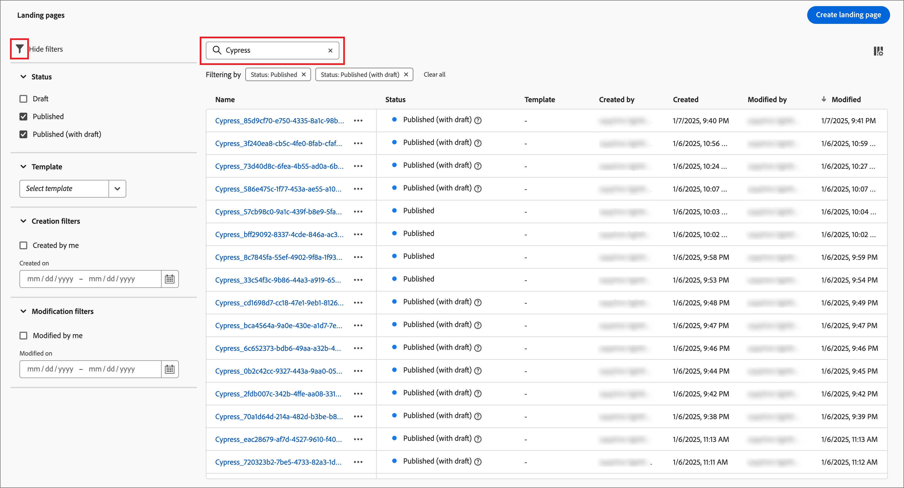

# Páginas de destino

Una página de aterrizaje es una página web independiente en la que puede dirigir a contactos y clientes después de hacer clic en un elemento vinculado en un correo electrónico, un mensaje SMS o cualquier ubicación digital. Puede incorporar estas páginas en los recorridos de su cuenta para que sus clientes potenciales y clientes vean sus mensajes en la web y progresen en los recorridos de su cuenta. Puede crear, personalizar y previsualizar páginas de aterrizaje en el espacio de diseño visual de la página de aterrizaje.

Para dirigir a los clientes a una página web definida cuando hagan clic en un vínculo específico, cree una página de aterrizaje en Journey Optimizer B2B edition.

* Creación de la página
* Diseño de la página de aterrizaje y creación de contenido
* Prueba de la página
* Publicación de la página
* Vínculo a la página desde el contenido del recorrido

Por ejemplo, puede crear y diseñar páginas de aterrizaje para dirigir a los usuarios a la información en línea. La página puede incluir un formulario en el que pueden optar por su inclusión o exclusión en la recepción de comunicaciones. O podría ser una oportunidad para suscribirse a una comunicación recurrente, como un boletín informativo.

Puede crear, personalizar y previsualizar páginas de aterrizaje en el espacio de diseño visual.
<!-- 
For the Beta phase, you can only design landing pages from scratch and publish your landing pages. The landing pages will be served on adobe hosted domain for the Beta phase. The capability to define your branded domains for hosting will be delivered in a future release. -->

## Acceso y administración de páginas de aterrizaje

Para acceder a las páginas de aterrizaje de Adobe Journey Optimizer B2B edition, vaya a la navegación izquierda y haga clic en **[!UICONTROL Administración de contenido]** > **[!UICONTROL Páginas de aterrizaje]**. Esta acción abre una página de lista con todas las páginas de aterrizaje creadas en la instancia enumeradas en una tabla.

{width="800" zoomable="yes"}

La tabla está ordenada por la columna _[!UICONTROL Modificado]_, con los elementos actualizados más recientemente en la parte superior de forma predeterminada. Haga clic en el título de la columna para cambiar entre ascendente y descendente.

### Filtrado de la lista de páginas de aterrizaje

Para buscar una página de aterrizaje por nombre, introduzca una cadena de texto en la barra de búsqueda para buscar una coincidencia. Haga clic en el icono _Filtro_ (  ) para mostrar las opciones de filtro disponibles y cambiar la configuración para filtrar los elementos mostrados según los criterios especificados.

{width="700" zoomable="yes"}

### Personalización de la visualización de columnas

Personalice las columnas que desee mostrar en la tabla haciendo clic en el icono _Personalizar tabla_ (  ) en la parte superior derecha.

En el cuadro de diálogo, seleccione las columnas que desea mostrar y haga clic en **[!UICONTROL Aplicar]**.

{width="300"}

### Estado de la página de aterrizaje y ciclo vital

El estado de la página de aterrizaje determina su disponibilidad para la vinculación en el contenido del correo electrónico y SMS, y los cambios que puede realizar en él.

| Estado | Descripción |
| -------------------- | ----------- |
| Borrador | Cuando crea una página de aterrizaje, está en estado de borrador. Permanece en este estado a medida que define o edita el contenido visual y hasta que lo publica como una página alojada. Acciones disponibles: <ul><li>Editar nombre o descripción<li>Editar URL del vínculo<li>Editar en el espacio de diseño visual<li>Publicación<li>Duplicado<li>Eliminar |
| Publicadas | Al publicar una página de aterrizaje, esta se aloja en la instancia de Journey Optimizer B2B edition y está disponible para vincularse en el contenido de un mensaje de correo electrónico o SMS. Acciones disponibles: <ul><li>Editar nombre o descripción<li>Editar URL del vínculo<li>Añadir vínculo en el contenido del correo electrónico o del mensaje SMS<li>Crear versión de borrador<li>Duplicado<li>Eliminar |
| Publicado con borrador | Cuando crea un borrador a partir de una página de aterrizaje publicada, la versión publicada se mantiene y el contenido del borrador se puede modificar en el espacio de diseño visual. Si publica la versión de borrador, reemplazará la versión publicada actual y el contenido se actualizará en la página alojada. Acciones disponibles: <ul><li>Editar nombre o descripción<li>Editar URL del vínculo<li>Añadir vínculo en el contenido del correo electrónico o del mensaje SMS<li>Editar versión de borrador en el espacio de diseño visual<li>Publicar versión de borrador<li>Duplicado<li>Eliminar (elimina ambas versiones)<li>Descartar borrador (vuelve al estado publicado) |

{zoomable="yes"}

## Creación de una página de aterrizaje

Puede agregar una nueva página de aterrizaje en Journey Optimizer B2B edition haciendo clic en **[!UICONTROL Crear página de aterrizaje]** en la parte superior derecha.

1. En el cuadro de diálogo _[!UICONTROL Crear página de aterrizaje]_, escriba un **[!UICONTROL Nombre]** y una **[!UICONTROL Descripción]** útiles (opcional).

   Requisitos de la página de aterrizaje:

   * Nombre: máximo de 100 caracteres, debe ser único, sin distinción de mayúsculas y minúsculas

   * Descripción: máximo de 300 caracteres

   * Se permiten caracteres Alpha, numéricos y especiales

   * Los caracteres reservados **_no se permiten_**: `\ / : * ? " < > |`

   {width="400"}

1. Si es necesario y hay varios subdominios configurados, cambie el **[!UICONTROL subdominio]** que se utilizará en la página de aterrizaje.

1. Haga clic en **[!UICONTROL Crear]**.

   Se abre la página de inicio _[!UICONTROL Crear su página de aterrizaje principal]_ y proporciona varias opciones para crear la página: _[!UICONTROL Diseñar desde cero]_, _[!UICONTROL Importar HTML]_ o usar una plantilla guardada.

   {width="800" zoomable="yes"}

   Después de seleccionar el método que desea usar para iniciar el diseño de la página de aterrizaje, use el espacio de diseño visual para [diseñar la página](./landing-page-design.md).

### Diseñe desde cero

Utilice el editor de contenido visual para definir la estructura del contenido de la página de aterrizaje. Al agregar y mover componentes estructurales con sencillas acciones de arrastrar y soltar, puede diseñar la forma del contenido de la página en cuestión de segundos.

1. En la página de inicio _[!UICONTROL Crear su página de aterrizaje principal]_, seleccione la opción **[!UICONTROL Diseñar desde cero]**.

1. [Agregar estructura y contenido](./landing-page-design.md#add-structure-and-content) a la página.

### Importar HTML

Adobe Journey Optimizer B2B edition le permite importar contenido existente de HTML para diseñar sus páginas de aterrizaje.

{{$include /help/_includes/content-design-import.md}}

{width="500"}

>[!NOTE]
>
>El uso de una etiqueta `<table>` como primera capa de un archivo HTML puede causar la pérdida de estilo, incluida la configuración del fondo y el ancho en la etiqueta de la capa superior.

Puede personalizar el contenido importado según sea necesario con el espacio de diseño visual.

### Seleccione una plantilla guardada

Puede elegir entre:

* **Plantillas de ejemplo**. La interfaz de Journey Optimizer ofrece una colección de plantillas de página de aterrizaje integradas entre las que puede elegir.

* **Plantillas guardadas**. Usar una plantilla personalizada guardada creada por un miembro de su organización mediante el menú _[!UICONTROL Plantillas]_ <!-- or the _[!UICONTROL Save as content template]_ option when designing a landing page. -->

Utilice la sección _[!UICONTROL Seleccionar plantilla de diseño]_ para empezar a crear contenido a partir de una plantilla. Puede utilizar una plantilla de ejemplo o una plantilla de página de aterrizaje personalizada guardada desde la instancia de Journey Optimizer B2B edition.

>[!BEGINTABS]

>[!TAB Plantillas guardadas]

En la página de inicio _Crear su página de aterrizaje principal_, la ficha _Plantillas de ejemplo_ está seleccionada de forma predeterminada. Para usar una plantilla personalizada, selecciona la pestaña **[!UICONTROL Plantillas guardadas]**.

Se muestra la lista de todas las plantillas de página de aterrizaje guardadas. Puede ordenarlos por _[!UICONTROL Nombre]_, _[!UICONTROL Última modificación]_ y _[!UICONTROL Última creación]_.

{width="700" zoomable="yes"}

Seleccione la plantilla que desee en la lista.

Después de la selección, se muestra una previsualización de la plantilla. En el modo de vista previa, puede desplazarse entre todas las plantillas de una categoría (de ejemplo o guardadas, según su selección) utilizando las flechas derecha e izquierda.

{width="800" zoomable="yes"}

Cuando la pantalla coincida con lo que desea usar, haga clic en **[!UICONTROL Usar esta plantilla]** en la parte superior derecha de la ventana de vista previa.

Esta acción copia el contenido en el espacio de diseño visual, donde puede editarlo según sea necesario.

>[!TAB Plantillas de muestra]

Adobe Journey Optimizer B2B edition ofrece una selección de _plantillas de página de aterrizaje predeterminadas_, que se pueden usar para crear sus propias páginas de aterrizaje y plantillas de página de aterrizaje.

<!-- {width="800" zoomable="yes"} -->

>[!ENDTABS]

<!-- 
>[!NOTE]
>
> Saved templates may have governance (content locking) settings applied to one or more components. The visual designer provides guidelines about locked components when you [author an email from a governed template](./email-authoring-governance.md). -->

## Edición de una página de aterrizaje

Las ediciones realizadas en una página de aterrizaje dependen de su estado actual:

* Cuando una página de aterrizaje se encuentra en estado **_Borrador_**, puede editar cualquiera de sus detalles, la dirección URL y el contenido visual.
* Cuando una página de aterrizaje se encuentra en estado **_Publicado_**, puede editar la descripción, pero no el nombre. Para cambiar el contenido visual, debe crear una versión de borrador de la página.
* Cuando una página de aterrizaje se encuentra en **_Publicado con el estado Borrador_**, la edición de los detalles se limita a la descripción. También puede editar el contenido visual de la versión de borrador.

>[!BEGINTABS]

>[!TAB Borrador]

1. En la página de listado _[!UICONTROL Páginas de aterrizaje]_, haga clic en el nombre de la página de aterrizaje para abrirla.

   Se muestra una previsualización del contenido visual, con los detalles de la página de aterrizaje a la derecha.

1. Modifique cualquiera de los detalles, como el nombre y la descripción.

   {width="700" zoomable="yes"}

1. Para realizar cambios en el contenido en el espacio de diseño visual, haga clic en **[!UICONTROL Editar página de aterrizaje]**.

   Utilice las herramientas de diseño visual según sea necesario:

   * [Añadir estructura y contenido](./landing-page-design.md#add-structure-and-content)
   * [Añadir Assets](./landing-page-design.md#add-assets)
   * [Desplazamiento por las capas, la configuración y los estilos](./landing-page-design.md#navigate-the-layers-settings-and-styles)
   * [Personalizar contenido](./landing-page-design.md#personalize-content)
   * [Editar seguimiento de URL vinculadas](./landing-page-design.md#edit-linked-url-tracking)

1. Haga clic en **[!UICONTROL Guardar]** o **[!UICONTROL Guardar y cerrar]** para volver a los detalles de la página de aterrizaje.

1. Cuando la página cumpla sus criterios y desee que esté disponible para su visualización, haga clic en **[!UICONTROL Publicar]**.

>[!TAB Publicado]

1. En la página de lista _[!UICONTROL Página de aterrizaje]_, haga clic en el nombre de página para abrirla.

   Se muestra una previsualización del contenido visual, con los detalles de la página de aterrizaje a la derecha.

1. Modifique la descripción, si es necesario.

   No se pueden cambiar todos los demás detalles de una página de aterrizaje publicada.

1. Si desea actualizar el contenido, haga clic en **[!UICONTROL Editar página de aterrizaje]** a la derecha.

   Haga clic en **[!UICONTROL Crear versión de borrador]** en el cuadro de diálogo para abrir la versión de borrador en el espacio de diseño visual.

   {width="300"}

   Utilice las herramientas de diseño visual según sea necesario:

   * [Añadir estructura y contenido](./landing-page-design.md#add-structure-and-content)
   * [Añadir Assets](./landing-page-design.md#add-assets)
   * [Desplazamiento por las capas, la configuración y los estilos](./landing-page-design.md#navigate-the-layers-settings-and-styles)
   * [Personalizar contenido](./landing-page-design.md#personalize-content)
   * [Editar seguimiento de URL vinculadas](./landing-page-design.md#edit-linked-url-tracking)

1. Haga clic en **[!UICONTROL Guardar]** o **[!UICONTROL Guardar y cerrar]** para volver a los detalles de la página de aterrizaje.

1. Si el borrador de la página de aterrizaje cumple los criterios y desea que los cambios estén disponibles en la página publicada, haga clic en **[!UICONTROL Publicar]**.

   Cuando publica la versión de borrador, reemplaza la versión publicada actual y el contenido se actualiza para la dirección URL de la página.

>[!TAB Publicado con borrador]

Al abrir la página de aterrizaje, se muestra la versión de borrador de forma predeterminada. Las pestañas de la parte superior del espacio de vista previa permiten alternar la visualización entre las versiones publicadas y las de borrador. Las acciones de borrador y los detalles se muestran a la derecha.

{width="700" zoomable="yes"}

Para actualizar el contenido:

1. Haga clic en **[!UICONTROL Editar página de aterrizaje]** en la parte superior derecha. Utilice las herramientas de diseño visual según sea necesario:

   * [Añadir estructura y contenido](./landing-page-design.md#add-structure-and-content)
   * [Añadir Assets](./landing-page-design.md#add-assets)
   * [Desplazamiento por las capas, la configuración y los estilos](./landing-page-design.md#navigate-the-layers-settings-and-styles)
   * [Personalizar contenido](./landing-page-design.md#personalize-content)
   * [Editar seguimiento de URL vinculadas](./landing-page-design.md#edit-linked-url-tracking)

1. Haga clic en **[!UICONTROL Guardar]** o **[!UICONTROL Guardar y cerrar]** para volver a los detalles de la página de aterrizaje.

1. Cuando la página de borrador cumpla sus criterios y desee que los cambios estén disponibles, haga clic en **[!UICONTROL Publicar]**.

   Cuando publica la versión de borrador, reemplaza la versión publicada actual y el contenido se actualiza en la página alojada.

>[!ENDTABS]

### Comprobación de alertas

A medida que diseña el contenido de la página de aterrizaje, las alertas se muestran en la interfaz (parte superior derecha) cuando falta la configuración clave.

{width="250"}

Si no ve este botón, no se detectan problemas.

Se pueden detectar dos tipos de alertas:

* **_Advertencias_** que hacen referencia a recomendaciones y prácticas recomendadas, como:

   * `Placeholder links are present in the landing page body`: no olvide reemplazar los marcadores de posición con vínculos válidos.

   * `Text version of HTML is empty`: no se olvide de definir una versión de texto del cuerpo de la página, que se utilizará cuando no se pueda mostrar el contenido de HTML.

   * `Empty link is present in page body`: compruebe que todos los vínculos de la página sean correctos.

* **_Errores_** que impiden probar o activar el recorrido o la campaña siempre y cuando no se resuelvan, como:

   * `The landing page content is empty`: el contenido de la página es obligatorio.

## Duplicación de una página de aterrizaje

Puede duplicar una página de aterrizaje mediante cualquiera de los siguientes métodos:

* En la página de listado de _[!UICONTROL Página de aterrizaje]_, haga clic en el icono _Más_ (**...**) junto al nombre de la página de aterrizaje y elija **[!UICONTROL Duplicado]**.
* En la parte superior derecha de la página de aterrizaje, haga clic en **[!UICONTROL ... Más]** y elige **[!UICONTROL Duplicar]**.

{width="600" zoomable="yes"}

En el cuadro de diálogo, introduzca un nombre útil (único) y una descripción (opcional). Haga clic en **[!UICONTROL Duplicar]** para completar la acción.

{width="350"}

La página duplicada (nueva) aparece en el listado de _páginas de aterrizaje_.

## Eliminación de una página de aterrizaje

Puede eliminar una página de aterrizaje mediante cualquiera de los siguientes métodos:

* En la página de listado de _[!UICONTROL Página de aterrizaje]_, haga clic en el icono _Más_ (**...**) junto al nombre de la página de aterrizaje y elija **[!UICONTROL Eliminar]**.
* En la parte superior derecha de la página de aterrizaje, haga clic en **[!UICONTROL ... Más]** y elige **[!UICONTROL Eliminar]**.

Esta acción abre un cuadro de diálogo de confirmación. Puede anular el proceso haciendo clic en **[!UICONTROL Cancelar]** o en **[!UICONTROL Eliminar]** para confirmar la eliminación.

{width="400"}

## Vínculo a una página de aterrizaje

Como especialista en marketing o Designer que crea correo electrónico, fragmentos y contenido de páginas, puede incrustar vínculos a las páginas de aterrizaje publicadas (activas) que se crean en la instancia de Journey Optimizer B2B edition.

1. Cuando trabaje en el espacio de diseño visual para un fragmento, correo electrónico, página de aterrizaje o plantilla, seleccione un extracto de texto, un componente de botón o un componente de imagen para el vínculo.

   Las opciones de **[!UICONTROL Link]** se muestran en el panel derecho.

1. Para la opción **[!UICONTROL Type]**, elija **[!UICONTROL Página de aterrizaje]**.

   {width="700" zoomable="yes"}

1. Para la opción **[!UICONTROL Página de aterrizaje]**, haga clic en el icono _Seleccionar página_ (  ).

1. En el cuadro de diálogo Seleccionar página de aterrizaje, establezca **[!UICONTROL Origen de la página de aterrizaje]** como **[!UICONTROL Journey Optimizer B2B edition]**, seleccione la casilla de verificación de la página de aterrizaje en la lista de páginas publicadas y haga clic en **[!UICONTROL Seleccionar]**.

   {width="600" zoomable="yes"}

1. Para la opción **[!UICONTROL Target]**, elija el comportamiento de destino del vínculo:

   * **[!UICONTROL Ninguno]**: abre el vínculo con el comportamiento predeterminado del explorador.
   * **[!UICONTROL En blanco]**: abre el vínculo en una nueva ventana o ficha.
   * **[!UICONTROL Self]**: abre el vínculo en el mismo fotograma.
   * **[!UICONTROL Principal]**: abre el vínculo en el marco principal.
   * **[!UICONTROL Superior]**: abre el vínculo en todo el cuerpo de la ventana.

1. (Solo vínculo de texto) Si desea subrayar el texto vinculado, active la casilla de verificación **[!UICONTROL Subrayar vínculo]**.

   Puede establecer un estilo adicional para el texto del vínculo, incluido el color del vínculo, seleccionando la ficha **[!UICONTROL Estilos]** en el panel derecho.
