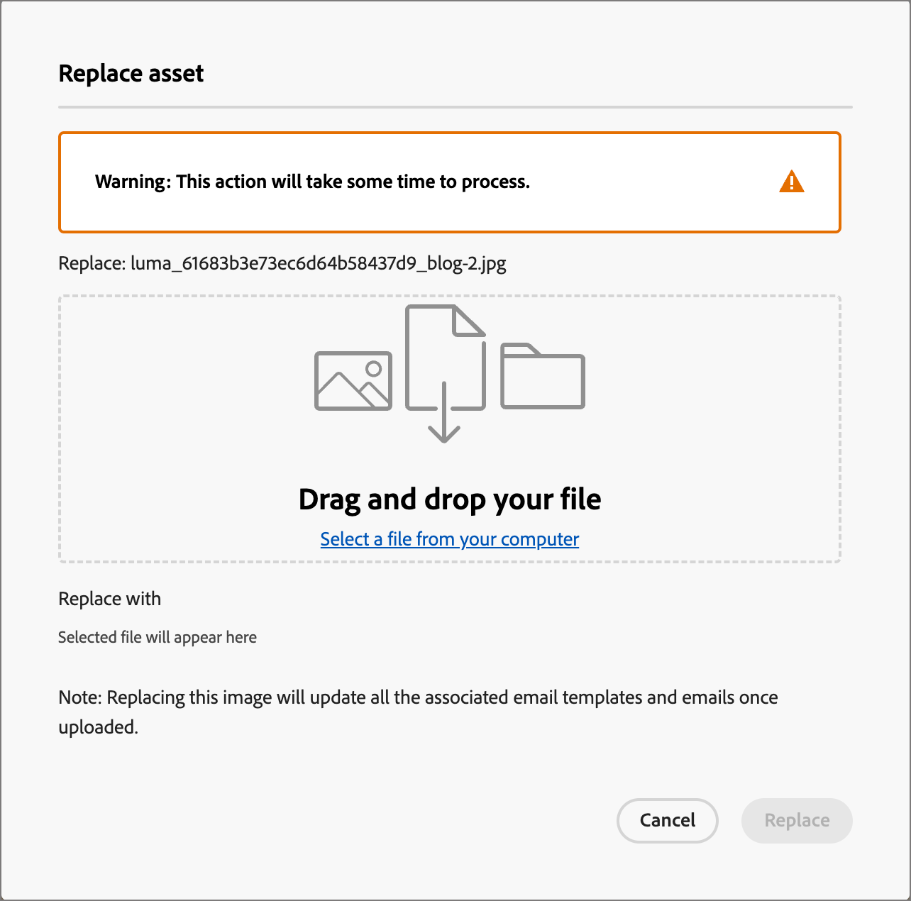

# Uso de recursos de Marketo Engage

Marketo Engage Design Studio es la fuente de recursos predeterminada para Journey Optimizer B2B Edition, y puede administrar y utilizar fácilmente los recursos disponibles en el contenido de los recorridos de su cuenta.

## Examen y acceso a recursos

Para acceder a los recursos de Adobe Marketo Engage Design Studio desde Journey Optimizer B2B Edition, vaya al panel de navegación izquierdo y haga clic en **[!UICONTROL Administración de contenido]** > **[!UICONTROL Assets]**. Esta acción abre una página de lista con todos los recursos enumerados.

{width="600" zoomable="yes"}

* Para ver los recursos por carpeta, abra la estructura de carpetas haciendo clic en el icono _Mostrar carpetas_ en la parte superior izquierda.

* Para ordenar la tabla por cualquiera de las columnas, haga clic en el título de la columna.

* Para buscar un recurso de imagen dentro de la carpeta seleccionada, introduzca una cadena de texto en la barra de búsqueda.

* Para personalizar las columnas que se muestran en la tabla, haga clic en el icono _Personalizar tabla_ en la parte superior derecha.

  Seleccione las columnas que desee mostrar en el listado y haga clic en **[!UICONTROL Aplicar]**.

## Ver detalles del recurso

Haga clic en el nombre de cualquier recurso para abrir la página de detalles del recurso.

## Ver recursos utilizados por referencias

En la página de detalles del recurso, haga clic en la ficha **[!UICONTROL Utilizado por]** para ver los detalles de dónde se utiliza actualmente el recurso en Journey Optimizer B2B Edition, en correos electrónicos, plantillas de correo electrónico y fragmentos.

>[!IMPORTANT]
>
>Cualquier recurso que esté _EN USO_ en cualquiera de los correos electrónicos, plantillas de correo electrónico o fragmentos **no se puede** eliminar.

Las referencias se muestran por categoría: _Correo electrónico_, _Plantilla de correo electrónico_ o _Fragmento_. Los correos electrónicos de Journey Optimizer B2B Edition están incrustados y creados en recorrido, por lo que el recorrido principal del correo electrónico que utiliza el recurso se muestra en las referencias.

Al hacer clic en el vínculo, se le redirige al correo electrónico, la plantilla de correo electrónico o el fragmento correspondiente donde se utiliza el recurso.

## Añadir recursos

Desde la página de lista de Assets, puede agregar recursos de imagen a Adobe Marketo Engage Design Studio.

1. Haga clic en **[!UICONTROL Agregar Assets]** en la parte superior derecha.

1. En el cuadro de diálogo _[!UICONTROL Agregar recursos]_, arrastre y suelte uno o más archivos del sistema en el cuadro de archivo.

   {width="500" zoomable="yes"}

   También puede hacer clic en el vínculo _[!UICONTROL Seleccionar un archivo del equipo]_ para usar el sistema de archivos local y buscar y seleccionar archivos.

   Puede cargar recursos desde el sistema local de hasta 10 archivos a la vez. El tamaño máximo de archivo es 100 MB.

   Los nombres de archivo de las imágenes seleccionadas se muestran en el cuadro de diálogo. Los nombres de los archivos de recursos deben ser únicos (en todas las carpetas) y, si ya existe un archivo con el nombre, se muestra un mensaje. Los nombres pueden tener un máximo de 100 caracteres y no pueden contener caracteres especiales (como `;`, `:`, `\` y `|`).

1. Seleccione la carpeta de destino para almacenar los recursos mediante el selector de carpetas.

1. Para sobrescribir (reemplazar) archivos al cargar uno o más archivos con un nombre de archivo existente, active la casilla de verificación **[!UICONTROL Sobrescribir archivos existentes]**.

1. Haga clic en **[!UICONTROL Agregar]**.

## Eliminar recursos

Cualquier recurso que esté actualmente en uso en cualquiera de los correos electrónicos, plantillas de correo electrónico o fragmentos no se puede eliminar. Compruebe las referencias de utilizadas antes de iniciar una eliminación de recursos. Además, una acción de eliminación no se puede deshacer, por lo que debe comprobarla antes de iniciar una acción de eliminación.

Puede eliminar un recurso mediante cualquiera de los siguientes métodos:

* Vaya a los detalles del recurso, haga clic en **[!UICONTROL ... Más]** en la parte superior derecha y elige **[!UICONTROL Eliminar]** de las opciones.

  {width="500" zoomable="yes"}

* En la página de listado de _[!UICONTROL Assets]_, haga clic en los _puntos suspensivos_ (**[!UICONTROL ...]**) junto al elemento del recurso y elija **[!UICONTROL Eliminar]** de las opciones.

  {width="500" zoomable="yes"}

Esta acción abre un cuadro de diálogo de confirmación. Puede anular el proceso haciendo clic en **[!UICONTROL Cancelar]** o en **[!UICONTROL Eliminar]** para confirmar la eliminación.

Si el recurso está en uso, la acción abre un cuadro de diálogo informativo que le advierte de que no se puede eliminar. Haga clic en **[!UICONTROL Aceptar]**, lo que anula la eliminación.

## Reemplazar recursos

Puede reemplazar un recurso mediante cualquiera de los siguientes métodos:

* Vaya a los detalles del recurso, haga clic en **[!UICONTROL ... Más]** en la parte superior derecha y elige **[!UICONTROL Reemplazar]** de las opciones.

* En la página de listado de _[!UICONTROL Assets]_, haga clic en los _puntos suspensivos_ (**[!UICONTROL ...]**) junto al elemento del recurso y elija **[!UICONTROL Reemplazar]** entre las opciones.

En el cuadro de diálogo _[!UICONTROL Reemplazar recurso]_, arrastre y suelte el archivo de reemplazo desde el sistema al cuadro de archivo. También puede hacer clic en el vínculo _[!UICONTROL Seleccionar un archivo del equipo]_ para usar el sistema de archivos local y seleccionar un archivo. (Si selecciona varios archivos en el sistema local, se utilizará el primer archivo seleccionado para el reemplazo.)

{width="520" zoomable="yes"}

Para continuar, haga clic en **[!UICONTROL Reemplazar]**. Puede anular el proceso haciendo clic en **[!UICONTROL Cancelar]**.

Si el archivo que se va a reemplazar está actualmente en uso, un cuadro de diálogo informativo le avisará de que el nuevo archivo de imagen reemplazará a la imagen en todos los lugares en los que se utilice (correos electrónicos, plantillas de correo electrónico y fragmentos).

## Descarga de recursos

Puede descargar un recurso mediante cualquiera de los siguientes métodos:

* Vaya a los detalles del recurso y haga clic en **[!UICONTROL Descargar]** en la parte superior derecha.

* En la página de listado de _[!UICONTROL Assets]_, haga clic en los _puntos suspensivos_ (**[!UICONTROL ...]**) junto al elemento del recurso y elija **[!UICONTROL Descargar]** de las opciones.

En el cuadro de diálogo de confirmación, haga clic en **[!UICONTROL Descargar]** para iniciar la descarga del recurso en su sistema local. Puede anular el proceso haciendo clic en **[!UICONTROL Cancelar]**.

## Aplicar acciones masivas a los recursos seleccionados

En la página del listado (_[!UICONTROL Administración de contenido]_ > _[!UICONTROL Assets]_), seleccione varios recursos a la vez seleccionando cada casilla de verificación a la izquierda. Aparece un banner de mensaje en la parte inferior al seleccionar varios recursos.

{width="700" zoomable="yes"}

Puede realizar las siguientes acciones masivas:

+++Mover recursos

1. En el banner de selección, haga clic en **Mover**.

   Esta acción abre el cuadro de diálogo _[!UICONTROL Mover Assets]_, que muestra los nombres de los recursos seleccionados y le permite seleccionar la carpeta _destino_ a la que desea mover estos recursos.

1. Seleccione una carpeta.

   La ruta de acceso se actualiza junto a _[!UICONTROL Los recursos seleccionados se moverán a:]_.

1. Haga clic en **[!UICONTROL Mover]**.

+++

+++Eliminar recursos

>[!NOTE]
>
>Puede aplicar una eliminación masiva para un máximo de 20 recursos seleccionados.

1. En el banner de selección, haga clic en **[!UICONTROL Eliminar]**.

1. En el cuadro de diálogo de confirmación, haga clic en **[!UICONTROL Eliminar]**.

   Si alguno de los recursos seleccionados está en uso, se anula la eliminación de ese recurso y se muestra un mensaje de alerta.

+++

## Crear una carpeta

1. En la página del listado de _[!UICONTROL Assets]_, haga clic en **[!UICONTROL Crear carpeta]** en la parte superior derecha.

1. En el cuadro de diálogo, introduzca el nombre de la carpeta y seleccione la carpeta de destino (principal) para la nueva carpeta.

   Los nombres de carpeta deben ser únicos, con un máximo de 100 caracteres, y no pueden contener caracteres especiales, como `;`, `:`, `\`, `|`.

   {width="500"}

1. Haga clic en **[!UICONTROL Agregar]**.

## Aplicar acciones de nivel de carpeta

Puede aplicar acciones a una carpeta o recursos dentro de la carpeta. Haga clic en el icono de puntos suspensivos (**...**) de la carpeta para mostrar las opciones de acciones que contiene.

{width="500"}

Puede realizar las siguientes acciones en el nivel de carpeta:

+++Añadir recursos

1. Elija **[!UICONTROL Agregar recursos]** para cargar archivos de imagen en la carpeta.

1. En el cuadro de diálogo _[!UICONTROL Agregar recursos]_, arrastre y suelte los archivos del sistema. También puede hacer clic en el vínculo para utilizar el sistema de archivos y seleccionar los archivos.

   Puede agregar recursos desde el sistema local de hasta 10 archivos a la vez. Tiene la opción de sobrescribir archivos al cargar uno o más archivos con un nombre de archivo existente.

   Los nombres de archivo de las imágenes seleccionadas se muestran en el cuadro de diálogo. Los nombres de los archivos de recursos deben ser únicos (en todas las carpetas) y, si ya existe un archivo con el nombre, se muestra un mensaje de error. Los nombres pueden tener un máximo de 100 caracteres y no pueden contener caracteres especiales (como `;`, `:`, `\` y `|`).

1. Haga clic en **[!UICONTROL Agregar]**.

+++

+++Crear una subcarpeta

1. Elija **[!UICONTROL Crear carpeta]**.

1. En el cuadro de diálogo, introduzca el nombre de la carpeta.

   Los nombres de carpeta deben ser únicos, con un máximo de 100 caracteres, y no pueden contener caracteres especiales, como `;`, `:`, `\`, `|`.

1. Haga clic en **[!UICONTROL Agregar]**.

+++

+++Cambie el nombre de la carpeta

1. Elija **[!UICONTROL Cambiar nombre]**.

1. En el cuadro de diálogo, introduzca el nuevo nombre de carpeta.

   Los nombres de carpeta deben ser únicos, con un máximo de 100 caracteres, y no pueden contener caracteres especiales, como `;`, `:`, `\`, `|`.

1. Haga clic en **[!UICONTROL Guardar]**.

+++

+++Mover la carpeta

1. Para mover la carpeta a otra carpeta principal, elige **[!UICONTROL Mover]**.

1. En el cuadro de diálogo, seleccione la carpeta de destino como el nuevo elemento principal de la subcarpeta.

1. Haga clic en **[!UICONTROL Mover]**.

   Si intenta mover una carpeta a una de sus subcarpetas (dentro de la estructura de la carpeta seleccionada), se muestra un mensaje de error y se cancela el movimiento.

+++

+++Elimine la carpeta

1. Elija **[!UICONTROL Eliminar]**.

1. En el cuadro de diálogo de confirmación, haga clic en **[!UICONTROL Eliminar]**.

Si alguno de los recursos de la carpeta está actualmente en uso, la acción abre un cuadro de diálogo de alerta para informarle de que no se puede eliminar. Haga clic en **[!UICONTROL Aceptar]**, lo que anula la eliminación.

+++

+++Convertir en una carpeta de archivo

Al archivar una carpeta, no se puede buscar en los archivos que contiene. Utilice la función de archivado para los archivos de recursos que no desee que utilicen los integrantes del equipo en adelante, como un distintivo promocional de evento obsoleto o contenido de temporada. Posteriormente, puede desarchivar una carpeta si desea que el contenido vuelva a estar disponible.

* Elija **[!UICONTROL Convertir en carpeta de archivo]**. Se muestra un banner de confirmación para confirmar que el estado de la carpeta cambia a archivado.

* Elija **[!UICONTROL Desarchivar carpeta]**. Se muestra un banner de confirmación para confirmar que el estado de la carpeta cambia a sin archivar.

+++

## Uso de recursos en el contenido del correo electrónico

Assets se puede utilizar en el correo electrónico de su equipo, en la creación de plantillas de correo electrónico o en la creación de fragmentos visuales desde el editor de contenido visual.

En la interfaz de usuario del editor visual, seleccione el icono _Selector de recursos_ en la barra lateral izquierda.

{width="700" zoomable="yes"}

Esta acción cambia el panel Herramientas que muestra una lista de los recursos disponibles. Existen varios métodos para agregar un recurso de imagen al lienzo visual:

* Arrastre y suelte una miniatura de imagen desde el panel de navegación izquierdo.

* Agregue un componente de imagen al lienzo y haga clic en **[!UICONTROL Examinar]** para abrir el cuadro de diálogo _[!UICONTROL Seleccionar recurso de Adobe Marketo Engage]_.

  {width="700" zoomable="yes"}

  En el cuadro de diálogo, puede elegir una imagen del repositorio seleccionado. Haga clic en **[!UICONTROL Seleccionar]** para agregar el recurso.

  Hay herramientas disponibles para ayudarle a localizar el recurso que necesita:

   * Haga clic en el icono _Filtrar_ en la parte superior izquierda para filtrar los elementos mostrados según sus criterios.

   * Escriba texto en el campo _Buscar_ para filtrar los elementos mostrados y buscar una coincidencia del nombre del recurso.

  {width="600" zoomable="yes"}
