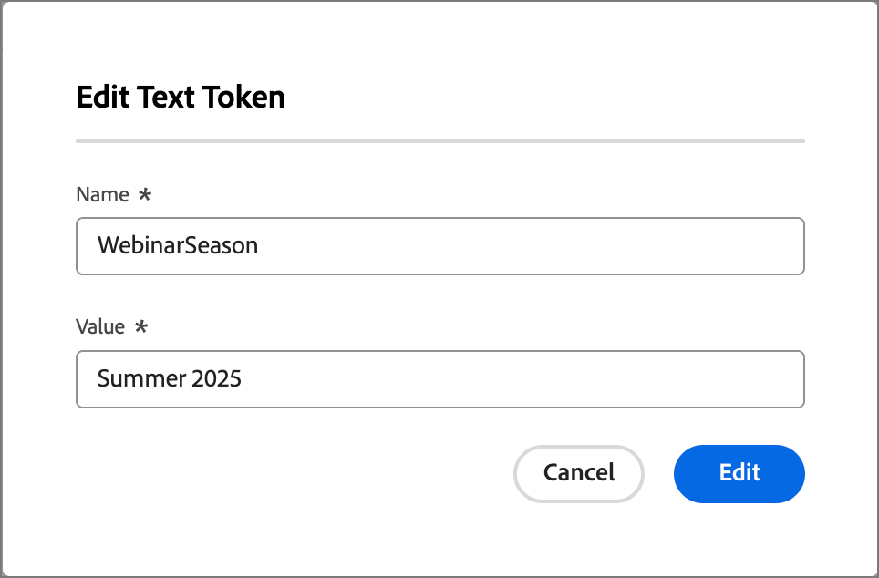

# Tokens personalizados para la personalización de correo electrónico

La personalización de contenido utiliza tokens como marcadores de posición o variables que se rellenan cuando se genera el artefacto de contenido. Los tokens de personalización estándar están disponibles para correos electrónicos, páginas de aterrizaje, fragmentos y plantillas. También puede definir un conjunto de tokens personalizados con valores específicos del recorrido de la cuenta. Este conjunto de tokens personalizados se denomina _Mis tokens_ y cualquiera de ellos se usa para personalizar al [crear correos electrónicos de recorrido](./email-authoring.md#content-authoring---personalization).

Además de _Mis tokens_, que son específicos del recorrido de la cuenta, puede usar cualquiera de los tokens estándar (integrados) para la personalización de correo electrónico.

## Administrar mis tokens {#my-tokens}

Los _Mis tokens_ son variables personalizadas que se crean o modifican para un recorrido de cuenta en estado de Borrador. Actualmente, este conjunto de tokens personalizados admite definiciones de tokens de texto y número.

Cuando agrega un token personalizado a un correo electrónico, se muestra como `{{my.TokenName}}`. Por ejemplo, podría tener `{{my.EventDate}}` o `{{my.WebinarSpeaker}}` tokens creados para administrar el contenido de los correos electrónicos relacionados con los próximos seminarios web.

_Para tener acceso a los tokens personalizados de un recorrido de cuenta :_

1. Abra el recorrido de cuenta provisional.

1. Haz clic en el menú **[!UICONTROL Más...]** en la parte superior derecha y elige **[!UICONTROL Mis tokens]**.

   {width="450"}

   La página _Mis tokens_ enumera todos los tokens personalizados definidos para el recorrido.

   {width="700" zoomable="yes"}

### Crear un token

1. En la página _[!UICONTROL Mis tokens]_, haga clic en **[!UICONTROL Crear]** y elija el tipo de token que desea definir:

   * **[!UICONTROL Texto]**: utilice este tipo para definir un token con un valor de cadena de texto básico.

   * **[!UICONTROL Número]**: utilice este tipo para definir un token con un valor numérico.

1. En el cuadro de diálogo, escriba **[!UICONTROL Nombre]** y **[!UICONTROL Valor]** para el token.

   {width="400"}

   No se pueden utilizar espacios ni caracteres especiales en el nombre del token. Puede usar _minúscula_, como `EventType`, para usar un nombre de varias palabras que se identifique fácilmente.

   Si está definiendo un token _Number_, el valor solo puede contener caracteres numéricos. Puede utilizar un valor decimal.

   {width="400"}

1. Haga clic en **[!UICONTROL Agregar]**.

### Edición de un token

Aunque el recorrido de la cuenta permanece en estado de borrador, puede editar cualquiera de los Mis tokens definidos.

1. En la página _[!UICONTROL Mis tokens]_, haga clic en el icono _Más acciones_ (**...**) junto al nombre del token y elija **[!UICONTROL Editar]**.

   {width="430"}

1. En el cuadro de diálogo, cambie **[!UICONTROL Nombre]** y **[!UICONTROL Valor]** según sea necesario para el recorrido.

   {width="400"}

1. Haga clic en **[!UICONTROL Editar]**.

### Eliminación de un token

Puede eliminar un token personalizado de la lista _Mis tokens_, pero debe asegurarse de que no lo esté utilizando actualmente en el contenido del correo electrónico de recorrido.

1. En la página _[!UICONTROL Mis tokens]_, haga clic en el icono _Más acciones_ (**...**) junto al nombre del token y elija **[!UICONTROL Eliminar]**.

1. En el cuadro de diálogo de confirmación, haga clic en **[!UICONTROL Eliminar]**.

## Uso de tokens personalizados en el contenido

Cuando esté creando contenido de correo electrónico para el recorrido de su cuenta, puede usar cualquiera de los tokens de la lista _Mis tokens_ al usar las herramientas de personalización en el espacio de diseño visual.

1. Seleccione el componente de texto y haga clic en el icono _Agregar personalización_ (  ) de la barra de herramientas.

   {width="600"}

   Esta acción abre el diálogo _Editar Personalization_. El cuadro de diálogo incluye una carpeta _[!UICONTROL Mis tokens]_ en la biblioteca _[!UICONTROL Personalization Tokens]_ si hay tokens personalizados definidos para el recorrido de la cuenta.

1. Expanda la carpeta **[!UICONTROL Mis tokens]** y, a continuación, haga clic en **+** o **...** para agregar uno de sus tokens personalizados al espacio en blanco.

   Puede agregar cualquier texto estático adicional que necesite.

   {width="700" zoomable="yes"}

1. Haga clic en **[!UICONTROL Guardar]**.
