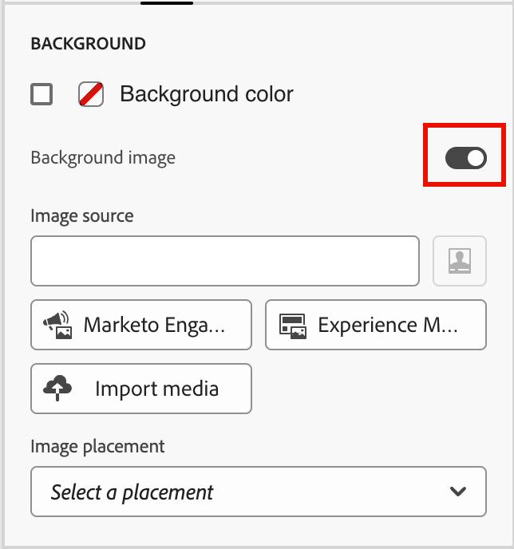
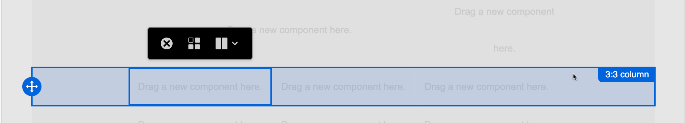

# Componentes de estructura {#structure-components}

>[!CONTEXTUALHELP]
>id="ajo-b2b_structure_components_email"
>title="Acerca de los componentes de estructura"
>abstract="Los componentes de estructura son elementos de diseño que se pueden utilizar para diseñar la estructura de un correo electrónico."

>[!CONTEXTUALHELP]
>id="ajo-b2b_structure_components_landing_page"
>title="Acerca de los componentes de estructura"
>abstract="Los componentes de estructura son elementos de diseño que se pueden utilizar para diseñar la estructura de una página."

>[!CONTEXTUALHELP]
>id="ajo-b2b_structure_components_fragment"
>title="Acerca de los componentes de estructura"
>abstract="Los componentes de estructura son elementos de diseño que se pueden utilizar para diseñar la estructura de un fragmento."

>[!CONTEXTUALHELP]
>id="ajo-b2b_structure_components_template"
>title="Acerca de los componentes de estructura"
>abstract="Los componentes de estructura son elementos de diseño que se pueden utilizar para diseñar la estructura de una plantilla."

Use los _componentes de estructura_ en el espacio de diseño visual para definir la estructura del contenido. Al agregar y mover elementos estructurales con sencillas acciones de arrastrar y soltar, puede definir rápidamente la forma del diseño de contenido. Cada componente de estructura ocupa el espacio horizontal y puede apilarlos para crear el diseño verticalmente. Divida cada componente en columnas para formar cada bloque de contenido que necesite.

## Biblioteca de estructura

En la parte superior de la biblioteca _[!UICONTROL Components]_, la sección **[!UICONTROL Structures]** muestra los componentes de estructura disponibles:

| Ícono | Componente. | Descripción |
| ----- | ----------- | ----------- |
|  | [!UICONTROL 1:1 columna] | Un contenedor de columna único que rellena el ancho del espacio. |
|  | [!UICONTROL 1:2 columna restante] | Contenedor de dos columnas que utiliza una relación 1:2 para rellenar el ancho del espacio. La primera columna (izquierda) ocupa un tercio de la anchura y la segunda (derecha) ocupa los dos tercios restantes. |
|  | [!UICONTROL 1:3 columna restante] | Contenedor de dos columnas que utiliza una relación 1:3 para rellenar el ancho del espacio. La primera columna (izquierda) ocupa una cuarta parte de la anchura y la segunda (derecha) ocupa las tres cuartas partes restantes. |
|  | [!UICONTROL 2:1 columna Derecha] | Contenedor de dos columnas que utiliza una relación 2:1 para rellenar el ancho del espacio. La primera columna (izquierda) ocupa dos tercios de la anchura y la segunda columna (derecha) ocupa el tercio restante. |
|  | [!UICONTROL 2:2 columna] | Contenedor de dos columnas que utiliza una relación 2:2 para rellenar el ancho del espacio. Las columnas izquierda y derecha tienen el mismo ancho. |
|  | [!UICONTROL 3:1 columna Derecha] | Contenedor de dos columnas que utiliza una relación 3:1 para rellenar el ancho del espacio. La primera columna (izquierda) ocupa las tres cuartas partes (75 %) de la anchura y la segunda (derecha) ocupa la cuarta parte restante (25 %). |
|  | [!UICONTROL 3:3 columna] | Contenedor de tres columnas que utiliza una relación 3:3 para rellenar el ancho del espacio. Las tres columnas tienen el mismo ancho. |
|  | [!UICONTROL 4:4 columna] | Contenedor de cuatro columnas que utiliza una relación 4:4 para rellenar el ancho del espacio. Las cuatro columnas tienen el mismo ancho. |
|  | [!UICONTROL n:n columna] | Estructura de columnas personalizable que rellena el espacio según las columnas definidas. El número de columnas (entre dos y diez) se establece y el ancho de cada columna se establece de forma individual. [Más información](#change-nn-columns) |

## Añadir componentes de estructura

Al diseñar el contenido del correo electrónico, la página de aterrizaje o el fragmento, agregue cada componente de estructura para construir el diseño. Arrastre un elemento de la sección **[!UICONTROL Structures]** a la izquierda y suéltelo en el lienzo. Puede usar la barra de herramientas para seleccionar una columna y usar las fichas _Configuración_ y _Estilos_ del panel derecho para definir los parámetros del componente o la columna seleccionados.

{width="800" zoomable="yes"}

### Barra de herramientas de componentes

La barra de herramientas se muestra en el lienzo cuando se selecciona en el lienzo. Las herramientas disponibles proporcionan una forma sencilla de seleccionar una columna y aplicar las funciones de los componentes.

{width="150"}

| Herramienta | Nombre | Uso |
| ---- | ---- | ----- |
| {width="40"} | Habilitar contenido condicional | Habilite variantes condicionales para el componente. [Más información](./conditional-content.md) |
| {width="100"} | Seleccionar una columna | Seleccione una columna por número. Cuando se selecciona la columna, puede aplicar la configuración de columna y los estilos. |
| {width="40"} | Duplicado | Cree una copia del componente y agréguelo directamente debajo. |
| {width="40"} | Eliminar | Desmonte el componente. |

### Configuración de componentes

Después de agregar un componente, se selecciona en el espacio de diseño visual y sus propiedades se muestran en el panel derecho. La ficha _[!UICONTROL Configuración]_ se muestra de manera predeterminada. También puede seleccionar un componente de estructura en cualquier momento para cambiar la configuración.

#### Mostrar opciones

Si desea excluir el componente de la pantalla del escritorio o del dispositivo móvil, cambie la configuración de **[!UICONTROL Opciones de visualización]**. De forma predeterminada, _[!UICONTROL Mostrar en todos los dispositivos]_, habilita la visualización en todos los dispositivos.

{width="400" zoomable="yes"}

Elija otra configuración para que el componente sea exclusivo por tipo de dispositivo:

* _[!UICONTROL Mostrar solo en dispositivos de escritorio]_. Elige esta opción cuando quieras mostrar el componente en dispositivos de escritorio y excluirlo para dispositivos móviles.
* _[!UICONTROL Mostrar solo en dispositivos móviles]_: elija esta opción cuando quiera mostrar el componente en dispositivos móviles, como teléfonos y tabletas, y exclúyala en los dispositivos de escritorio.

#### Encabezado y pie de página

Puede designar un componente de estructura como encabezado o pie de página de HTML en el mensaje de correo electrónico o la página de aterrizaje. Con el componente de estructura seleccionado en el lienzo, haga clic en la opción **[!UICONTROL Encabezado]** o **[!UICONTROL Pie de página]**. Solo puede haber un encabezado o pie de página, y la opción no está disponible si se asigna otro componente.

{width="600" zoomable="yes"}

Para quitar la designación del encabezado o pie de página, seleccione el componente y haga clic en la opción para quitarlo.

### Columnas apiladas

En el caso de pantallas o ventanas de visualización más pequeñas, las columnas del componente de estructura se muestran como apiladas a menos que cambie la configuración predeterminada. Con el componente de estructura de varias columnas seleccionado, cambie la configuración **[!UICONTROL No apilar columnas en dispositivos móviles]** moviendo el control deslizante de alternancia a la derecha.

{width="250"}

## Estilos de componente

Después de agregar un componente, se selecciona en el espacio de diseño visual y sus propiedades se muestran en el panel derecho. También puede seleccionar un componente en cualquier momento para cambiar la configuración y los estilos.

### Contexto

Con la ficha _[!UICONTROL Estilos]_ seleccionada en el panel derecho, utilice la sección **[!UICONTROL Fondo]** para definir el color y la imagen opcional que se utilizará como fondo para el componente de estructura.

#### [!UICONTROL Color de fondo]

Seleccione la casilla de verificación y haga clic en el cuadrado de color para elegir un color del selector. Puede elegir un color introduciendo un valor RGB, HSL, HSB o hexadecimal conocido. O bien, utilice el regulador de color y el campo de color para seleccionar el color.

{width="300"}

#### [!UICONTROL Imagen de fondo]

Mueva el selector de alternancia para habilitar la configuración de imagen de fondo.

{width="250"}

Elija [tipo de origen de recurso](./assets-overview.md) y seleccione el archivo de imagen:

+++[!UICONTROL Marketo Engage Assets]

{{me-dam}}

+++

+++[!UICONTROL Experience Manager Assets]

{{aem-assets-dam}}

+++

+++[!UICONTROL Importar medios]

{{image-upload}}

+++

Utilice la opción **[!UICONTROL Colocación de la imagen]** para elegir cómo la imagen rellena el componente de estructura. La configuración de ubicación sigue los atributos de alineación y relleno de imagen de fondo estándar de [HTML](https://www.w3schools.com/html/html_images_background.asp){target="_blank"}.

{width="250"}

### Otros estilos

Puede aplicar otros estilos de componente de estructura para ajustar su visualización en el mensaje de correo electrónico o en la página de aterrizaje.

+++Borde

{{styles-border}}

+++

+++Margen

{{styles-margin}}

+++

+++Avanzadas

{{styles-advanced}}

+++

## Columnas

Utilice la herramienta _Seleccionar una columna_ de la barra de herramientas de componentes para seleccionar una columna. A continuación, puede utilizar la barra de herramientas de columnas para cambiar la selección de columnas, quitar la columna o aplicar variaciones de contenido condicionales para la columna. Los parámetros de la columna se muestran en las fichas _[!UICONTROL Configuración]_ y _[!UICONTROL Estilos]_ de la derecha.

{width="500"}

| Herramienta | Nombre | Uso |
| ---- | ---- | ----- |
| {width="40"} | Borrar columna | Borre el contenido de la columna. |
| {width="40"} | Habilitar contenido condicional | Habilite variantes condicionales para la columna. [Más información](./conditional-content.md) |
| {width="100"} | Seleccionar una columna | Seleccione una columna por número. Cuando se selecciona la columna, puede aplicar ajustes y estilos. |

### Cambiar n:n columnas

Los anchos de las columnas son estáticos para la mayoría de los componentes de la estructura. Al agregar el componente _[!UICONTROL n:n column]_, puede cambiar el número de columnas y el tamaño de las columnas. El componente de columna n:n comienza con cinco columnas de igual ancho (20 %).

>[!NOTE]
>
>Cada tamaño de columna no puede ser inferior al 10 % de la anchura total del componente de estructura. Solo se pueden eliminar columnas vacías.

Con el componente seleccionado en el lienzo, utilice la opción **[!UICONTROL Número de columnas]** del panel derecho para cambiar el número de columnas. Haga clic en los iconos de flecha arriba y abajo para aumentar o disminuir el número de columnas o introduzca el número en el campo.

{width="650" zoomable="yes"}

En el lienzo, mueva el icono de tamaño de columna para ajustar el ancho de la columna seleccionada. A medida que aumenta o disminuye el ancho, la columna adyacente también se ajusta para que todas las columnas ocupen el 100 % del ancho del componente.

{width="500" zoomable="yes"}

### Estilos de columna

Con la columna seleccionada en el lienzo, puede definir estilos para aplicarlos a esa columna.

+++Contexto

* **[!UICONTROL Color de fondo]**: seleccione la casilla de verificación y haga clic en el cuadrado de color para elegir un color del selector. Puede elegir un color introduciendo un valor RGB, HSL, HSB o hexadecimal conocido. O bien, puede utilizar el regulador de color y el campo de color para seleccionar el color.

  {width="300"}

* **[!UICONTROL Imagen de fondo]** - Mueva el selector de alternancia para habilitar la configuración de la imagen de fondo.

  {width="250"}

  Elija el tipo de origen del recurso y [seleccione un archivo de imagen](#background-image).

+++

+++Borde

{{styles-border}}

+++

+++Alineación

{{styles-alignment-v}}

+++

+++Margen

{{styles-margin}}

+++

+++Avanzadas

{{styles-advanced}}

+++

## Árbol de navegación

En el espacio de diseño visual, puede acceder a los componentes estructurales, incluidas las columnas y el contenido, mediante el árbol de navegación. Haga clic en el icono _[!UICONTROL Árbol de navegación]_ (  ) en la parte izquierda para mostrar el árbol.

{width="800" zoomable="yes"}

El elemento _[!UICONTROL Body]_ es la raíz de la estructura de árbol. Haga clic en cualquiera de los componentes o elementos secundarios de columna del árbol para seleccionarlos en el lienzo. Las fichas _[!UICONTROL Configuración]_ y _[!UICONTROL Estilos]_ de la derecha muestran los parámetros de ese componente o columna.

{width="800" zoomable="yes"}
