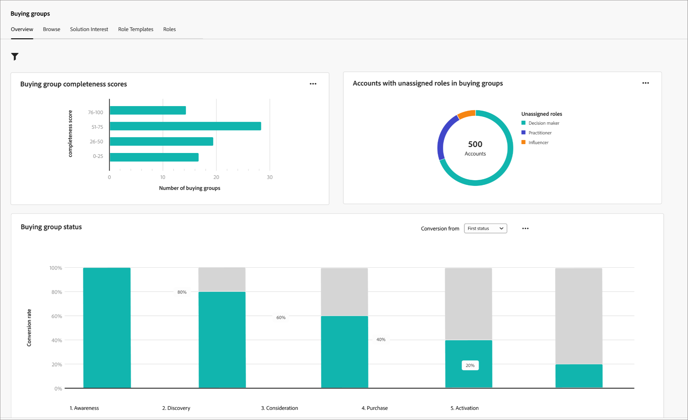

# Panel de información general de grupos de compra

El tablero Información general para grupos de compra está diseñado para el proceso de transferencia de ventas B2B. Permite que el equipo de mercadotecnia comparta _listos_ para la compra de grupos y sus miembros, así como datos esenciales, con el equipo de ventas para su ejecución. Este proceso garantiza una transición optimizada del marketing a las ventas.

El traspaso de ventas incluye:

* **Entrega de datos**: el marketing identifica los datos de destino _listos_ y los hace accesibles para las ventas en formato CSV. 
* **Aceptación de ventas**: Las ventas revisan manualmente e incorporan los objetivos _listos_ en su canalización.

Para acceder a este panel, expande **[!UICONTROL Cuentas]** en el panel de navegación izquierdo y, a continuación, selecciona **[!UICONTROL Grupos compradores]**. Seleccione la ficha **[!UICONTROL Información general]** si no se muestra de manera predeterminada.

{width="800" zoomable="yes"}
<!--
## Buying Group Status

Gain insights into your buying groups' progression with the Buying Group Status view. This visualization showcases the distribution of your buying groups categorized by their most recent status update within a specified time frame.

{width="800" zoomable="yes"}

**[!UICONTROL Status]** (y-axis): Track the journey of buying groups through various stages.
**[!UICONTROL Number of Buying Groups]** (x-axis): Quantify the number of buying groups at each status, providing a clear metric of your funnel's health and activity.

To generate a shareable PDF of your current view, click **[!UICONTROL Export]** at the top-right corner of the page. -->

## Distribución de la puntuación de finalización del grupo de compras

Esta visualización ilustra la distribución de los grupos de compra en función de las puntuaciones de finalización y se clasifica en cuatro bandas de puntuación distintas. La cifra central representa el número total de grupos de compra y proporciona una visión rápida del progreso general. Los colores segmentados indican la proporción de grupos de compra dentro de cada rango de puntuación, lo que le permite evaluar las tendencias de finalización de un vistazo.

Para ver información más detallada, haga clic en el icono de menú **...** en la parte superior derecha.

{width="500"}

## Distribución de la puntuación de participación del grupo de compras

Esta visualización ilustra la distribución de los grupos de compra en función de sus puntuaciones de participación y se clasifica en cuatro bandas de puntuación distintas. La cifra central representa el número total de grupos de compra y proporciona una visión rápida del progreso general. Los colores segmentados indican la proporción de grupos de compra dentro de cada rango de puntuación, lo que le permite evaluar las tendencias de finalización de un vistazo.

Para ver información más detallada, haga clic en el icono de menú **...** en la parte superior derecha.

{width="500"}

## Grupos de compras por interés de la solución

Esta visualización ilustra la distribución de grupos de compra por interés de solución y le ayuda a identificar qué soluciones generan el mayor interés. Cada barra representa una solución específica, con su longitud que indica el número de grupos de compra asociados con ese interés. Este gráfico de barras proporciona una comprensión clara e inmediata de las tendencias de demanda de soluciones.

Para ver información más detallada, haga clic en el icono de menú **...** en la parte superior derecha. Elija **Obtener detalles** o **Ver más**.

{width="500"}

## Filtrado de datos

Haga clic en el icono _Filtro_ (  ) en la parte superior izquierda para filtrar los datos mostrados mediante cualquiera de estos atributos:

* Fase actual
* Industria
* Región
* Interés de la solución

{width="500"}

Seleccione tantos valores para cada atributo que desee usar para filtrar los datos y haga clic en **[!UICONTROL Aplicar]**.

## Interactúe con los datos

Para interactuar con los datos, usa el menú _Más_ (**...**) en la parte superior derecha de cada gráfico.

### [!UICONTROL Obtener detalles]

Elija **[!UICONTROL Obtener detalles]** para obtener un análisis detallado de las puntuaciones o distribuciones de cada grupo.

{width="700" zoomable="yes"}

Los filtros globales aplicados al panel se transfieren. Haga clic en el icono _Filtro_ (  ) en la parte superior izquierda para [cambiar los filtros de atributo](#filter-the-data) para la vista de obtención de detalles.

Puede hacer clic en el menú _Más_ (**...**) en la parte superior derecha y elegir **[!UICONTROL Ver más]** para [ver datos extendidos](#view-more).

### [!UICONTROL Ver más]

Elija **[!UICONTROL Ver más]** para ver datos y perspectivas ampliados.

{width="700" zoomable="yes"}

La ventana emergente que se muestra incluye un gráfico y una tabla que muestran el desglose de la distribución del grupo de compra.

Para descargar los datos, haga clic en **[!UICONTROL Descargar CSV]** en la parte superior derecha de la tabla de datos. Para volver al panel Información general, haga clic en **[!UICONTROL Cerrar]**.
