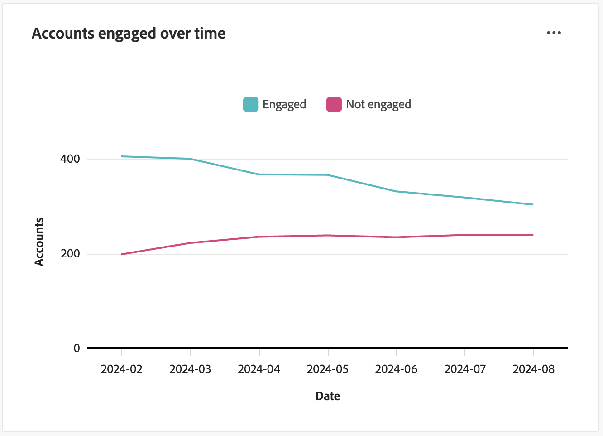
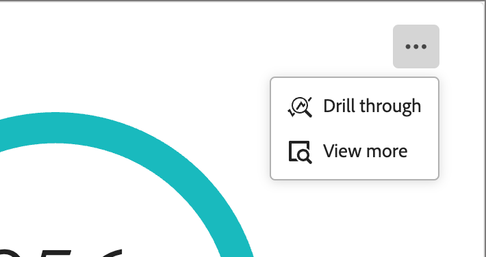

# Panel de información general de participación

Este panel proporciona una vista completa de la participación y muestra métricas en tiempo real de interacciones de cuenta e individuales a través de gráficos circulares de instantáneas y gráficos de líneas que revelan tendencias a lo largo del tiempo. Le ayuda a monitorizar y a diseñar estrategias para sus esfuerzos de participación de forma eficaz.

Para acceder al _panel de participación_, seleccione el elemento **[!UICONTROL panel]** en el panel de navegación izquierdo. A continuación, seleccione la pestaña **[!UICONTROL Participación]** en la parte superior de la página.

<!-- To generate a shareable PDF of your current view, click **[!UICONTROL Export]** at the top-right corner of the page. To engage with the data, use the action menu in the top-right corner. -->

{width="800" zoomable="yes"}

## Participación por cuentas / grupo de compra / personas

Los gráficos de círculos dividen cuentas, grupos de compra o personas en categorías comprometidas y no comprometidas. La figura central muestra el recuento total dentro de cada categoría, lo que proporciona una comprensión rápida de la participación general.

{width="500"}

## Cuentas / comprar grupos / personas comprometidas a lo largo del tiempo

Estos gráficos de líneas muestran los niveles de participación de cuentas o personas a lo largo del tiempo. Con líneas distintas para &quot;Participado&quot; y &quot;No implicado&quot;, visualizadas junto a un eje horizontal con marca de tiempo, puede localizar tendencias y patrones. Puede situarse sobre una línea para mostrar métricas precisas para cualquier fecha determinada.

{width="500"}

## Filtrado de datos

Puede filtrar los datos mostrados por intervalo de fechas y atributos.

### Filtro de intervalo de fechas

Use el _[!UICONTROL filtro de intervalo de fechas]_ en la parte superior derecha para filtrar los datos según el intervalo de fechas.

{width="380"}

Para el rango **[!UICONTROL Custom]**, puede usar la herramienta de calendario para especificar una fecha de inicio y una de finalización. La fecha de finalización toma como valor predeterminado el día actual.

{width="380"}

### Filtro de atributos

Haga clic en el icono _Filtro_ (  ) en la parte superior izquierda para filtrar los datos mostrados mediante cualquiera de estos atributos:

* Interés de la solución
* Tipo de participación
* Región
* Industria
* Función de abonado del grupo de compras

{width="500"}

Seleccione tantos valores para cada atributo que desee usar para filtrar los datos y haga clic en **[!UICONTROL Aplicar]**.

## Interactúe con los datos

Para interactuar con los datos, utilice el menú **...** en la parte superior derecha de cada gráfico.

{width="300"}

### Explorar en profundidad

Para un gráfico circular, elige **[!UICONTROL Obtener detalles]** para obtener un análisis detallado de los datos de participación de cada grupo.

Los filtros globales (rango de datos y atributos) aplicados al panel se transfieren. Haga clic en el icono _Filtro_ (  ) en la parte superior izquierda para [cambiar los filtros de atributo](#filter-the-data) para la vista de obtención de detalles. Use el selector de intervalo de fechas en la parte superior derecha para [cambiar el intervalo de fechas](#date-range-filter) para la vista de obtención de detalles.

{width="700" zoomable="yes"}

| Participación por cuentas | Participación por grupos de compras | Participación por personas |
| ---------------------- | --------------------------- | -------------------- |
| <li>Nombre de la cuenta <li>Estado <li>Personas comprometidas (número)<li>Actividades de participación (número) <li>Último compromiso (fecha) | <li>Grupo de compras <li>Cuenta <li>Interés de la solución <li>Estado <li>Actividades de participación (número) | <li>Nombre <li>Estado <li>Correo electrónico (dirección) <li>Actividades de participación (número) <li>Último compromiso (fecha) |

Puede hacer clic en el icono de menú **...** en la parte superior derecha y elegir **[!UICONTROL Ver más]** para [ver datos y perspectivas ampliados](#view-more).

### Ver más

Elija **[!UICONTROL Ver más]** para obtener datos y perspectivas ampliados.

{width="700" zoomable="yes"}

Según el gráfico, hay datos ampliados para lo siguiente:

| Participación por cuentas / comprar grupos / personas | Cuentas/grupos de compra/personas comprometidas a lo largo del tiempo |
| ----------------------------------------------- | -------------------------------------------------- | 
| <li>Comprometido <li>Sin participación | <li>Fecha <li>Cuentas / Grupos de compra / Personas (número) <li>Comprometido/No comprometido |

Para copiar los datos extendidos, haga clic en **[!UICONTROL Descargar CSV]** en la parte superior derecha.
