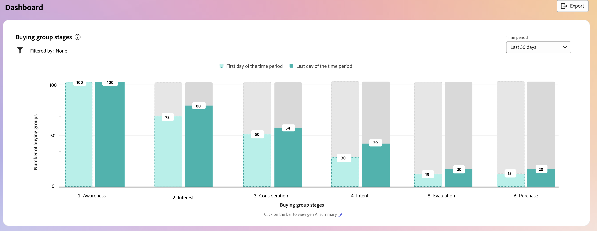
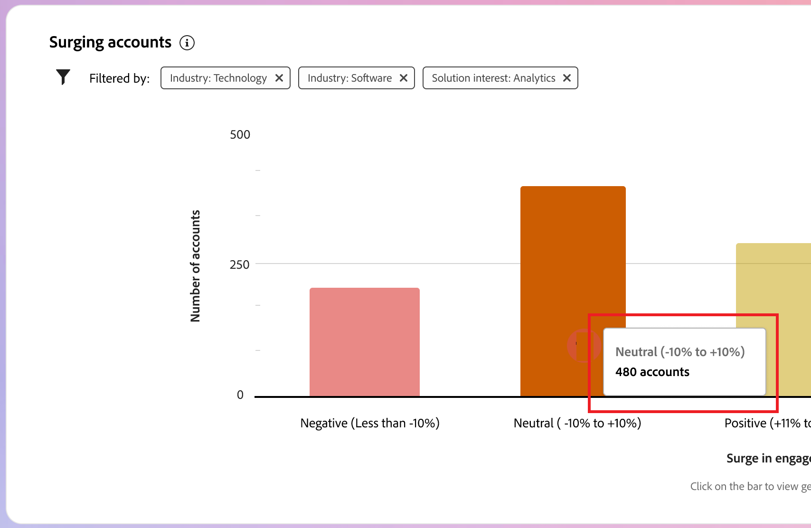

# Panel de control inteligente

El panel inteligente proporciona una vista completa de las métricas de grupos de compras y cuentas, lo que le ayuda a monitorizar y estratégicamente sus esfuerzos de marketing de forma más eficaz.

Para acceder al _Tablero inteligente_, seleccione el elemento **[!UICONTROL Tablero]** en el panel de navegación izquierdo.

{width="800" zoomable="yes"}

El Intelligent Dashboard también proporciona acceso a las páginas de detalles de cuenta y grupo de compra que incluyen dos tipos de funciones de IA generativa:

* Resúmenes de cuentas y grupos de compra
* Detección de intención de persona, grupo de compra y cuenta

{{intent-data-note}}

Para utilizar la información y las perspectivas proporcionadas por el Intelligent Dashboard, la instancia de Journey Optimizer B2B edition debe disponer de los elementos necesarios:

| Tipo | Requisito |
| ---- | ----------- |
| [Fases de grupos de compras](#buying-group-stages) | Configure las fases del grupo de compra **y** para agregar a los grupos de compra creados. |
| [Puntos destacados del grupo de compra](#buying-group-highlights) | Configure las fases del grupo de compra **y** para agregar a los grupos de compra creados. |
| [Aumento de cuenta](#surging-accounts) | Uno o más recorridos publicados **o** crearon grupos de compra. |
| [Aspectos destacados de la cuenta](#account-highlights) | Uno o más recorridos publicados **o** crearon grupos de compra. |
| [Cobertura de contacto](#contact-coverage) | Uno o más grupos de compra creados (etapas no necesarias). |
| [Superposición de contactos](#contact-overlap) | Uno o más grupos de compra creados (etapas no necesarias). |
| [Página de detalles de la cuenta](../accounts/account-details.md) | Uno o más recorridos publicados. |
| [Página de detalles del grupo de compra](../buying-groups/buying-group-details.md) | Uno o más grupos de compra creados (etapas no necesarias). |

## Fases del grupo de compras {#buying-group-stages}

>[!CONTEXTUALHELP]
>id="ajo-b2b_intelligent_dashboard_buying_group_stages"
>title="Fases del grupo de compras"
>abstract="Este gráfico proporciona una visión general de la progresión del grupo de compras en diferentes fases en función de las reglas de transición configuradas. La primera barra indica el número de grupos de compras de una fase específica en la primera fecha del lapso de tiempo seleccionado en comparación con la última fecha del lapso de tiempo seleccionado."

El gráfico _[!UICONTROL Fases del grupo de compra]_ proporciona una descripción general de la progresión del grupo de compra en diferentes etapas ([según las reglas de transición configuradas por un administrador](../buying-groups/buying-group-stages.md)).

>[!NOTE]
>
>La disponibilidad de las fases del grupo de compra requiere la configuración de las fases del grupo de compra. Consulte [Fases de grupos de compras](../buying-groups/buying-group-stages.md) para obtener información detallada sobre las fases y cómo definir y habilitar las fases para los grupos de compras.

{width="800" zoomable="yes"}

El gráfico utiliza las fases del grupo de compra de la versión publicada más recientemente del modelo de fases del grupo de compra. Hay dos bares para cada escenario. La primera barra indica el número de grupos de compra en la primera fecha del lapso de tiempo seleccionado. Y el segundo (en comparación) es el número de grupos de compra en la última fecha del lapso de tiempo. Puede pasar el ratón sobre cada barra para ver el número de grupos de compra en cada etapa.

{width="400"}

### Resumen de IA generativa

Haga clic en una barra para que aparezca un resumen de IA generativa de los grupos de compra en esa fase durante el período de tiempo seleccionado.

{width="500"}

El resumen generado proporciona una visión general de la progresión del grupo de compra en diferentes etapas según las reglas de transición configuradas.

### Período de tiempo {#time-period-stages}

Utilice el filtro de fecha en la parte superior derecha para cambiar el intervalo de fechas en las visualizaciones de datos. Haga clic en la flecha hacia abajo para establecer un intervalo de fechas relativo o para establecer fechas de inicio y finalización personalizadas.

<!-- {width="300"} -->

### Filtro de atributos {#attribute-filter-stages}

Haga clic en el icono _Filtro_ (  ) en la parte superior izquierda para filtrar la visualización de datos con cualquiera de estos atributos:

* Interés de solución
* Cuenta
* Nombre de fase

<!-- Add screen when the UI is available {width="500"} -->

## Características destacadas del grupo de compras {#buying-group-highlights}

>[!CONTEXTUALHELP]
>id="ajo-b2b_intelligent_dashboard_buying_group_highlights_engagement"
>title="5 principales grupos de compras por participación"
>abstract="Los principales grupos de compra comprometidos en función de su puntuación de participación normalizada."

>[!CONTEXTUALHELP]
>id="ajo-b2b_intelligent_dashboard_buying_group_highlights_velocity"
>title="5 principales grupos de compra de alta velocidad"
>abstract="Grupos de compra en función de la velocidad a la que avanzan por las etapas."

>[!CONTEXTUALHELP]
>id="ajo-b2b_intelligent_dashboard_buying_group_highlights_stagnant"
>title="5 principales grupos de compradores estancados"
>abstract="Los grupos de compra estancados que no avanzan por las etapas a pesar de la alta puntuación de completitud."

La sección _[!UICONTROL Aspectos destacados del grupo de compra]_ está organizada en tres filas para obtener información sobre los grupos de compra de interés para su organización.

{width="800" zoomable="yes"}

* **Principales 5 grupos compradores por participación**: esta fila muestra los grupos compradores más comprometidos en función de su puntuación de participación normalizada.
* **Principales 5 grupos de compra de alta velocidad**: esta fila muestra los grupos de compra principales en función de la velocidad con la que progresan en las fases de grupo de compra.
* **Principales 5 grupos de compras estancadas**: esta fila muestra los grupos de compras más estancados que no progresan a través de fases a pesar de una puntuación de integridad alta.

Cada tarjeta incluye los siguientes datos:

* **_Nombre del grupo de compra_**. Haga clic en el nombre para abrir la página de detalles del grupo de compra.
* **_Nombre de cuenta_**. Haga clic en el nombre para abrir la página de detalles de la cuenta (con el hipervínculo a la página de detalles de la cuenta).
* **_Fase actual_** para el grupo comprador.
* **_Puntuación de participación_** (normalizada en todos los grupos compradores). Si todos los grupos compradores tienen la misma puntuación superior, se muestra la última puntuación actualizada.
* **_Puntuación de integridad_** (va del 1 al 100). Si todos los grupos compradores tienen la misma puntuación superior, se muestra la última puntuación actualizada.
* **_Intento de categoría_**. Haga clic en _[!UICONTROL Ver detalles]_ para ver los datos de intención:

  {width="500" zoomable="yes"}

   * La ventana emergente de detalles muestra el nombre de la categoría con el nivel de intención en la parte superior.
   * Los datos de cada fila se organizan en columnas: el nombre del producto, la intensidad de la intención del producto y las palabras clave principales por la intensidad de la intención.
   * El orden de clasificación es de mayor a menor para la categoría, el producto y las palabras clave. Si uno o varios de los tipos tienen la misma seguridad de intención, la ordenación utiliza el orden alfabético.

  {{intent-data-note}}

En la parte superior derecha del panel _Aspectos destacados del grupo de compra_, haz clic en **[!UICONTROL Ver todo]** para navegar a la página de la lista Grupos de compra.

### Filtro de atributos {#attribute-filter-bg-highlights}

Haga clic en el icono _Filtro_ (  ) en la parte superior izquierda para filtrar la visualización de datos con cualquiera de estos atributos:

* Interés de la solución
* Grupo de compras
* Cuenta

<!-- Add screen when the UI is available {width="500"} -->

### Período de tiempo {#time-period-bg-highlights}

Utilice el filtro de fecha en la parte superior derecha para cambiar el intervalo de fechas en las visualizaciones de datos. Haga clic en la flecha hacia abajo para establecer un intervalo de fechas relativo o para establecer fechas de inicio y finalización personalizadas.

<!-- {width="300"} -->

## Cuentas en auge {#account-surge}

>[!CONTEXTUALHELP]
>id="ajo-b2b_intelligent_dashboard_account_surge"
>title="Auge de la cuenta"
>abstract="Cuentas con un cambio significativo en el impulso de la participación dentro del lapso de tiempo seleccionado."

La sección _[!UICONTROL Cuentas emergentes]_ muestra una visualización de las cuentas con un cambio significativo en el momento de participación dentro del lapso de tiempo seleccionado.

>[!NOTE]
>
>Los datos de aumento de cuentas solo incluyen cuentas que Journey Optimizer B2B edition ingiere a través de recorridos de cuenta o grupos de compra.

{width="800" zoomable="yes"}

Pase el ratón sobre cada barra para ver el número de cuentas de cada categoría.

{width="400"}

Haga clic en una barra para que aparezca un resumen de IA generativa de las cuentas en la categoría para el lapso de tiempo seleccionado.

{width="500"}

### Filtro de atributos {#attribute-filter-acct-surge}

Haga clic en el icono _Filtro_ (  ) en la parte superior izquierda para filtrar la visualización de datos con cualquiera de estos atributos:

* Interés de la solución
* Industria
* Región

<!-- Add screen when the UI is available {width="500"} -->

### Período de tiempo {#time-period-acct-surge}

Utilice el filtro de fecha en la parte superior derecha para cambiar el intervalo de fechas en las visualizaciones de datos. Haga clic en la flecha hacia abajo para establecer un intervalo de fechas relativo o para establecer fechas de inicio y finalización personalizadas.

<!-- {width="300"} -->

## Características destacadas de la cuenta {#account-highlights}

>[!CONTEXTUALHELP]
>id="ajo-b2b_intelligent_dashboard_account_highlights_surging"
>title="Cuentas en auge"
>abstract="Cuentas con un aumento significativo del impulso de la participación en el lapso de tiempo seleccionado "

>[!CONTEXTUALHELP]
>id="ajo-b2b_intelligent_dashboard_account_highlights_at_risk"
>title="Cuentas en riesgo"
>abstract="Cuentas con una disminución significativa del impulso de participación en el lapso de tiempo seleccionado."

La sección _[!UICONTROL Aspectos destacados de la cuenta]_ está organizada en dos filas para obtener información sobre las cuentas de interés para su organización.

>[!NOTE]
>
>Los datos de resaltados de cuenta solo incluyen cuentas que Journey Optimizer B2B edition ingiere a través de recorridos de cuentas o grupos de compras.

{width="800" zoomable="yes"}

* **Cuentas emergentes**: esta fila muestra las cuentas con un aumento significativo en el momento de participación durante el lapso de tiempo seleccionado.
* **Cuentas en riesgo**: esta fila muestra las cuentas con una disminución significativa en el momento de participación durante el lapso de tiempo seleccionado.

Cada tarjeta incluye los siguientes datos:

* **_Nombre de cuenta_**. Haga clic en el nombre para abrir la página de detalles de la cuenta.
* **_Resumen de IA generativo_** de la cuenta.
* **_Intento de palabra clave_**. Haga clic en _[!UICONTROL Ver detalles]_ para ver los datos de intención:

  {width="500" zoomable="yes"}

   * La ventana emergente de detalles muestra el nombre de la categoría con el nivel de intención en la parte superior.
   * Los datos de cada fila se organizan en columnas: el nombre del producto, la intensidad de la intención del producto y las palabras clave principales por la intensidad de la intención.
   * El orden de clasificación es de mayor a menor para la categoría, el producto y las palabras clave. Si uno o varios de los tipos tienen la misma seguridad de intención, la ordenación utiliza el orden alfabético.

  {{intent-data-note}}
<!-- 
At the top right of the _Buying group highlights_ panel, click **[!UICONTROL View All]** to navigate to the Buying groups list page. -->

### Filtro de atributos {#attribute-filter-acct-highlights}

Haga clic en el icono _Filtro_ (  ) en la parte superior izquierda para filtrar la visualización de datos con cualquiera de estos atributos:

* Interés de la solución
* Grupo de compras

<!-- Add screen when the UI is available {width="500"} -->

### Período de tiempo {#time-period-acct-highlights}

Utilice el filtro de fecha en la parte superior derecha para cambiar el intervalo de fechas en las visualizaciones de datos. Haga clic en la flecha hacia abajo para establecer un intervalo de fechas relativo o para establecer fechas de inicio y finalización personalizadas.

<!-- {width="300"} -->

## Cobertura de contactos {#contact-coverage}

>[!CONTEXTUALHELP]
>id="ajo-b2b_intelligent_dashboard_contact_coverage"
>title="Cobertura de contactos"
>abstract="Muestra el número de contactos con una función específica asociada a un interés de solución. La asignación de la función y el interés de la solución se basan en la plantilla de grupo de compra."

La sección _[!UICONTROL Cobertura de contactos]_ muestra una visualización del número de contactos con una función específica asociada con un interés de solución. La asignación de la función y el interés de la solución se basan en la plantilla de grupo de compra.

>[!NOTE]
>
>Los datos de cobertura de contactos se basan en los grupos de compra creados en la instancia de Journey Optimizer B2B edition.

{width="800" zoomable="yes"}

Pase el ratón sobre cada celda para ver el número de contactos que le interesan en el rol o la solución.

{width="400"}

Haga clic en una celda para ver información detallada de los contactos en el rol o solución de interés.

{width="700" zoomable="yes"}

### Filtro de atributos {#attribute-filter-contact-coverage}

Haga clic en el icono _Filtro_ (  ) en la parte superior izquierda para filtrar la visualización de datos con cualquiera de estos atributos:

* Interés de la solución
* Cuentas

<!-- Add screen when the UI is available {width="500"} -->

## Solapamiento de contactos {#contact-overlap}

>[!CONTEXTUALHELP]
>id="ajo-b2b_intelligent_dashboard_contact_overlap"
>title="Solapamiento de contactos"
>abstract="Lista de contactos que forman parte de más de un grupo de compras como resultado de estar asociados a múltiples intereses de la solución."

La sección _[!UICONTROL Superposición de contactos]_ muestra una lista de contactos que forman parte de más de un grupo de compras como resultado de estar asociados con varios intereses de soluciones.

>[!NOTE]
>
>Los datos de superposición de contactos se basan en los grupos de compras creados en la instancia de Journey Optimizer B2B edition.

{width="800" zoomable="yes"}

Haga clic en _Información_ (  ) para mostrar una tabla con los siguientes detalles:

* Nombre del grupo de compra (pulsa el nombre para abrir la página de detalles del grupo de compra)
* Función
* Interés de la solución
* Intención del producto
* Producto

{width="600" zoomable="yes"}

### Filtro de atributos {#attribute-filter-contact-overage}

Haga clic en el icono _Filtro_ (  ) en la parte superior izquierda para filtrar la visualización de datos con cualquiera de estos atributos:

* Interés de la solución
* Funciones
* Cuentas

<!-- Add screen when the UI is available {width="500"} -->
