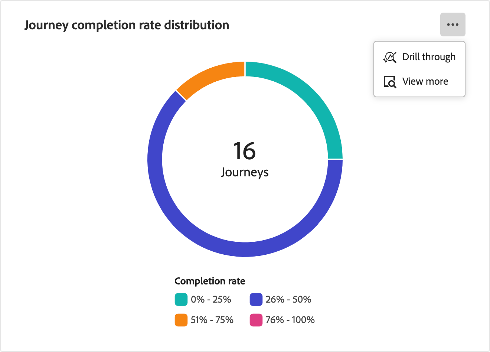

# Panel general de Recorridos de cuenta

Este tablero proporciona una visión general completa de los recorridos activos de la cuenta, en la que se detalla el progreso de la cuenta mediante los diagramas de círculos y barras que categorizan y cuantifican las finalizaciones y las actividades de participación. Ayuda a los especialistas en marketing a evaluar la eficacia de los canales de correo electrónico y SMS a través de métricas clave de envío y participación.

Esta descripción general está disponible para los recorridos de cuentas publicadas y los datos tardan aproximadamente cuatro horas en empezar a rellenar los gráficos y tablas.

{width="700" zoomable="yes"}

## Distribución de tasa de finalización del recorrido

Este gráfico ilustra la distribución de los recorridos según su tasa de finalización y se clasifica en cuatro bandas de puntuación distintas. La cifra central representa el número total de recorridos y proporciona una instantánea rápida del progreso general. Los colores segmentados indican la proporción de recorridos dentro de cada rango de puntuación, lo que le permite evaluar las tendencias de finalización de un vistazo.

Para ver información más detallada, haga clic en el icono de menú **...** en la parte superior derecha.

{width="500"}

## Recorridos por tipo de participación

Este gráfico de barras muestra la distribución de los recorridos en función del tipo de participación y le ayuda a identificar qué participaciones se utilizaron más en los distintos recorridos. Cada barra representa un tipo de participación específico, con su longitud que indica el número de recorridos con actividades de ese tipo. Esta visualización proporciona una comprensión clara e inmediata de las tendencias de participación dentro de los recorridos de la cuenta.

Para ver información más detallada, haga clic en el icono de menú **...** en la parte superior derecha.

{width="500"}

## Interactúe con los datos

Para interactuar con los datos, utilice el menú **...** en la parte superior derecha de cada gráfico.

### [!UICONTROL Obtener detalles]

Para el gráfico circular, elija **[!UICONTROL Obtener detalles]** para obtener un análisis detallado de los datos.

{width="700" zoomable="yes"}

Puede hacer clic en el menú _Más_ (**...**) en la parte superior derecha y elegir **[!UICONTROL Ver más]** para [ver datos extendidos](#view-more).

### [!UICONTROL Ver más]

Elija **[!UICONTROL Ver más]** para ver datos y perspectivas ampliados.

{width="700" zoomable="yes"}

La ventana emergente que se muestra incluye un gráfico y una tabla que muestran el desglose de los datos del recorrido.

Para descargar los datos, haga clic en **[!UICONTROL Descargar CSV]** en la parte superior derecha de la tabla de datos. Para volver al panel _Información general_, haga clic en **[!UICONTROL Cerrar]**.
