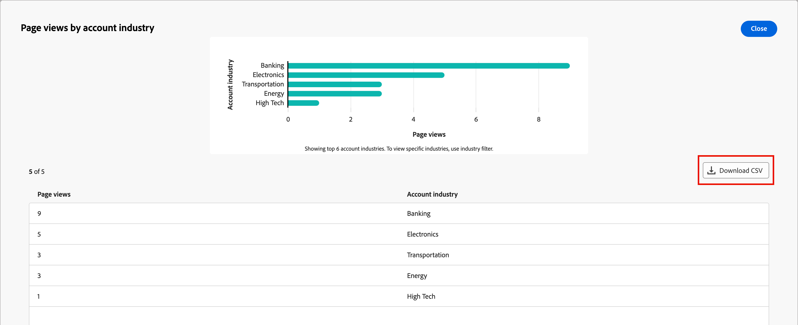

# Panel de participación web

El panel de participación web proporciona visibilidad sobre cómo los visitantes web interactúan con el contenido clave. Segmenta los datos en los sectores y regiones de las cuentas para ayudarle a comprender las tendencias de participación. Utilice este tablero para apoyar la toma de decisiones estratégicas mediante la aparición de patrones de comportamiento web que informan la estrategia de contenido y la segmentación de cuentas.

Para acceder al _panel de participación en la web_, seleccione el elemento **[!UICONTROL panel]** en el panel de navegación izquierdo. A continuación, seleccione la pestaña **[!UICONTROL Participación web]** en la parte superior de la página.

{width="700" zoomable="yes"}

## Filtrado de datos

Haga clic en el icono _Filtro_ (  ) en la parte superior izquierda para filtrar los datos mostrados mediante cualquiera de los atributos siguientes:

* **[!UICONTROL Región de la cuenta]**: filtra los datos por una o más regiones geográficas seleccionadas que están asociadas a cuentas.
* **[!UICONTROL Sector de la cuenta]**: filtra los datos según una o más clasificaciones del sector seleccionadas asociadas a las cuentas.
* **[!UICONTROL Intervalo de fechas]**: filtra los datos por el intervalo de fechas seleccionado. El intervalo predeterminado es la fecha actual.

{width="500"}

Seleccione tantos valores para cada atributo que desee usar para filtrar los datos y haga clic en **[!UICONTROL Aplicar]**.

## [!UICONTROL Vistas de la página principal] {#top-page-views}

>[!CONTEXTUALHELP]
>id="ajo-b2b_web_engagement_top_page_views"
>title="Vistas de la página principal"
>abstract="Las páginas vistas con más frecuencia en su sitio web, esto le ayuda a identificar qué contenido genera la mayor cantidad de tráfico."

Esta tabla muestra las 10 páginas web más visitadas, lo que le ayuda a identificar qué contenido resuena más con los visitantes. Los datos incluyen:

| Columna | Descripción |
| ------ | ----------- |
| Nombre de la página | Nombre o título de la página web. |
| Vistas totales | Número total de veces que se vio la página. |
| Visitantes conocidos (%) | El porcentaje de vistas de página que se atribuyen a visitantes conocidos (identificados). |
| Visitantes desconocidos (%) | El porcentaje de vistas de página atribuido a visitantes desconocidos (anónimos). |

{width="650" zoomable="yes"}

## [!UICONTROL Vistas de página por región de cuenta] {#page-views-by-region}

>[!CONTEXTUALHELP]
>id="ajo-b2b_web_engagement_page_views_by_region"
>title="Vistas de página por región de cuenta"
>abstract="Distribución de visitantes web segmentada por la región geográfica de las cuentas asociadas."

Esta visualización muestra los recuentos de visitantes segmentados por la región de la cuenta. Muestra cómo el tráfico web varía según la región geográfica, lo que permite adaptar el contenido y las campañas a la audiencia regional. Pase el ratón sobre una barra del gráfico para ver los detalles, incluidos los siguientes:

* Nombre de la región de cuenta
* Recuento de vistas de página

{width="500" zoomable="yes"}

## [!UICONTROL Vistas de página por sector de la cuenta] {#page-views-by-industry}

>[!CONTEXTUALHELP]
>id="ajo-b2b_web_engagement_page_views_by_industry"
>title="Vistas de página por sector de la cuenta"
>abstract="Distribución de visitantes web segmentada por la clasificación sectorial de las cuentas asociadas."

Esta visualización muestra los recuentos de visitantes segmentados por el sector de las cuentas. Utilice este gráfico para comprender cómo varía el tráfico web entre las distintas industrias, lo que le permite desarrollar estrategias de contenido específicas del sector. Pase el ratón sobre una barra del gráfico para ver los detalles, incluidos los siguientes:

* Nombre del sector de la cuenta
* Recuento de vistas de página

{width="500" zoomable="yes"}

## Interactúe con los datos

Para interactuar con los datos, use _Más_ (**...**) en la parte superior derecha de cada gráfico y elija **[!UICONTROL Ver más]** para ver datos y perspectivas ampliados.

La ventana emergente que se muestra incluye un gráfico y una tabla que muestran el desglose de los datos.

Para descargar los datos, haga clic en **[!UICONTROL Descargar CSV]** en la parte superior derecha de la tabla de datos.

{width="700" zoomable="yes"}
