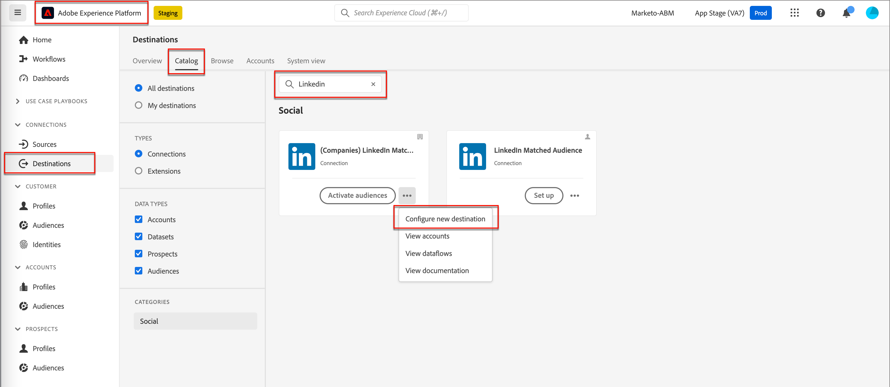

# Audiencias coincidentes de cuenta de LinkedIn

Journey Optimizer B2B edition ofrece la capacidad de generar audiencias de anuncios de LinkedIn a través de audiencias coincidentes con la cuenta y está diseñado para ayudarle a completar funciones vacías en sus grupos de compra. Al definir un conjunto de filtros de grupo de compra, puede mantener una audiencia coincidente de LinkedIn para segmentar a los posibles clientes que coincidan con los parámetros del grupo de compra. Esta función aprovecha los destinos de Experience Platform para administrar algunos aspectos de la integración. Hay un límite de diez flujos de datos.

Antes de iniciar un flujo de datos desde Journey Optimizer B2B edition, debe tener al menos una instancia del [(Empresas) conector de destino de audiencia coincidente de LinkedIn](https://experienceleague.adobe.com/es/docs/experience-platform/destinations/catalog/social/linkedin#connect){target="_blank"} con una cuenta de Administrador de campañas de LinkedIn configurada en la aplicación de Experience Platform.

## Configure una nueva conexión de cuenta de LinkedIn {#linkedin-destination-setup}

>[!CONTEXTUALHELP]
>id="ajo-b2b_linkedin_destination_setup"
>title="Se requiere la configuración de destino de LinkedIn"
>abstract="Envíe cuentas filtradas por grupos de compra a un destino de LinkedIn para interactuar con posibles miembros del grupo de compras. Puede crear hasta 10 flujos de datos para 10 grupos diferentes de cuentas filtradas. Para empezar a usar esta función, primero añada un destino de LinkedIn."

1. En Experience Platform, vaya a **[!UICONTROL Conexiones]** > **[!UICONTROL Destinos]** en el panel de navegación izquierdo y seleccione la pestaña **[!UICONTROL Catálogo]**.

1. En el catálogo, busque el conector **[!UICONTROL (Companies) LinkedIn Matched Audience]**.

   >[!TIP]
   >
   >Puede encontrar rápidamente el conector ingresando `LinkedIn` en el cuadro de búsqueda.

1. En la tarjeta del conector, haga clic en el icono _Más_ (**...**) y elija **[!UICONTROL Configurar nuevo destino]**.

   {width="800" zoomable="yes"}

1. Seleccione **[!UICONTROL Nueva cuenta]** y haga clic en **[!UICONTROL Conectar con destino]**.

   {width="500"}

1. Proporcione sus credenciales de LinkedIn e inicie sesión.

   Después de la autenticación, la cuenta de LinkedIn se conecta como destino en Experience Platform.

   {width="400"}

   >[!IMPORTANT]
   >
   >En este momento, **no** escribe los _[!UICONTROL detalles del destino]_. Solo se necesita la conexión.

## Actualizar los detalles de la cuenta

El nombre y la descripción de la cuenta de LinkedIn son visibles para los grupos de compra en Journey Optimizer B2B edition. Se recomienda actualizar esta información para que sea fácilmente identificable para los especialistas en marketing que trabajan con grupos de compra. Puede cambiar los detalles de la cuenta en la interfaz de usuario de Experience Platform o Journey Optimizer B2B edition.

1. Vaya a **[!UICONTROL Conexiones]** > **[!UICONTROL Destinos]** en el panel de navegación izquierdo y seleccione la pestaña **[!UICONTROL Cuentas]**.

1. Para la nueva cuenta que creó, haga clic en el menú _Más_ (**...**) y elija **[!UICONTROL Editar detalles]**.

   {width="800" zoomable="yes"}

1. En el cuadro de diálogo, actualice el nombre y la descripción.

   {width="500"}

1. Haga clic en **[!UICONTROL Guardar]**.

## Activar la cuenta para comprar grupos

>[!NOTE]
>
>Si ya tiene diez flujos de datos, no puede crear otro. Si se encuentra en el máximo, elimine uno en Experience Platform antes de crear uno nuevo en Journey Optimizer B2B edition.

1. En Journey Optimizer B2B Edition, vaya a **[!UICONTROL Cuentas]** > **[!UICONTROL Grupos de compra]** en el panel de navegación izquierdo.

1. Seleccione la pestaña **[!UICONTROL Examinar]**. 

1. Haga clic en **[!UICONTROL Activar en destino de LinkedIn]** en la parte superior derecha.

   {width="800" zoomable="yes"}

1. Asigne un nombre descriptivo al flujo de datos y una descripción (opcional).

   Después de guardarlo, el nombre que especifique para el flujo de datos se agregará con _AJOB2B_ para ayudar a identificar el flujo de datos en Experience Platform.

1. Escriba el [identificador de cuenta de su cuenta de administrador de LinkedIn Campaign](https://www.linkedin.com/help/lms/answer/a424270).

   Puede encontrar su ID de cuenta por nombre de cuenta en la interfaz de usuario de Campaign Manager.

   {width="700" zoomable="yes"}

1. Haga clic en **[!UICONTROL Seleccionar filtros de grupo de compra]** y defina los parámetros de la audiencia de la cuenta.

   >[!IMPORTANT]
   >
   >En este momento, los filtros no se pueden editar después de activar el flujo de datos. Compruebe su trabajo antes de activar el flujo de datos.

   {width="400"}

   Para la **[!UICONTROL puntuación de participación]**, el operador `Between` es inclusivo, al igual que los intervalos de porcentaje. Por ejemplo, 5.1 y 5 son ambos _entre_ 5 y 6.

   Las condiciones vacías se tratan como `Is Any`.

   Haga clic en **[!UICONTROL Guardar]** para agregar los filtros especificados.

1. Haga clic en **[!UICONTROL Seleccionar destino de LinkedIn]** y elija el destino de LinkedIn configurado que desee utilizar.

   Tras la activación, esta configuración crea el flujo de datos utilizando la configuración de destino y un segmento virtual correspondiente.

1. Comprueba tu configuración y haz clic en **[!UICONTROL Activar]** en la parte superior derecha.

   Vuelva a hacer clic en **[!UICONTROL Activar]** en el cuadro de diálogo de confirmación.

   Se muestra un banner con un vínculo al menú de flujos de datos en Experience Platform para que pueda comprobar el registro de flujo de datos.

## Organizar participación de medios de pago

Puede interactuar con los miembros de su cuenta a través de un canal de medios de pago, como audiencias de publicidad de LinkedIn, para adquirirlos, nutrirlos y calificarlos para ventas. Use un nodo _Realizar una acción_ en un recorrido de cuentas para automatizar la participación con los miembros clave de una cuenta a través de un canal externo que sea más adecuado para los distintos miembros de la cuenta.

>[!VIDEO](https://video.tv.adobe.com/v/3448675/?learn=on&captions=spa)