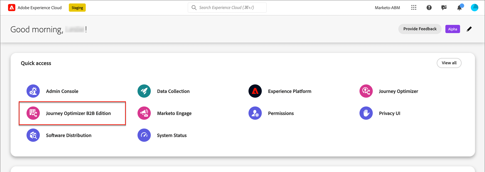

# Inicio de sesión y página de inicio

Con Adobe Journey Optimizer B2B Edition, puede orquestar recorridos de cuenta y de grupo de compra mediante IA generativa integrada y automatización líder del sector para maximizar la demanda de ofertas específicas mediante grupos de compra cualificados para marketing.

<!-- Requirements?
-->
Para acceder a [!DNL Adobe Journey Optimizer B2B Edition], conéctese a Adobe Experience Cloud con su Adobe ID y seleccione [!DNL Journey Optimizer B2B Edition].

{width="800" zoomable="yes"}

La página de inicio se muestra al iniciar sesión en Adobe Experience Platform y seleccionar la aplicación Adobe Journey Optimizer B2B Edition. Esta página proporciona una visión general del estado actual de las iniciativas B2B de Journey Optimizer en forma de perspectivas refinadas y acceso rápido a los módulos relevantes. También proporciona información sobre la siguiente acción ideal que debe realizarse y dónde encontrar el conjunto completo de tutoriales y documentación.

Journey Optimizer B2B Edition tiene dos perfiles de usuario principales: un experto en marketing y un administrador. Cada persona tiene una página de inicio específica para diferentes etapas de madurez (nuevas o avanzadas). El contenido de la página se basa en lo que cada persona necesita en términos de información y en las siguientes acciones que debe realizar. Estas páginas también incluyen acceso a **Asistente de IA**, que ayuda a los usuarios a obtener información rápida sobre cualquier pregunta o tema específico que necesiten<!-- and to obtain specific recommendations for their challenges or objectives-->.

## Especialista en marketing - nuevo usuario

La página de inicio del especialista en marketing de un nuevo usuario consta de tres filas que ayudan al especialista en marketing a acostumbrarse a Journey Optimizer B2B y a sus funcionalidades. También proporciona una vista de los recorridos más recientes que se han creado, que pueden servir como punto de partida para un nuevo usuario.

La primera fila consiste en una guía guiada para que el nuevo experto en marketing obtenga una guía de incorporación para que pueda comprender los matices del sistema y ser eficiente en el desarrollo de estrategias e iniciativas de marketing B2B.

La segunda fila consiste en los recorridos B2B recientes de AJO que se han creado en toda la plataforma para que el experto en marketing pueda inspirarse en las prácticas recomendadas para crear un recorrido de cuenta.

La tercera fila consiste en recursos de aprendizaje que pueden ayudar a un experto en marketing a obtener más información sobre un tema específico.

## Especialista en marketing: usuario avanzado

La página de inicio del especialista en marketing para un experto en marketing avanzado consta de cuatro filas que ayudan al especialista en marketing a obtener más información sobre el progreso actual de las iniciativas y sobre acciones específicas, así como sobre la siguiente mejor acción que debe realizarse junto con un acceso rápido a las secciones relevantes.

La primera fila consiste en el siguiente conjunto de acciones que un experto en marketing B2B puede realizar en función de las acciones anteriores realizadas y del estado actual de la iniciativa, lo que permite al usuario realizar el siguiente movimiento que se ajuste al objetivo de las iniciativas y le ayude a alcanzar los objetivos rápidamente.

La segunda fila consiste en los recursos más recientes a los que ha accedido el especialista en marketing para facilitar su localización y la realización de actualizaciones sobre los mismos.

La tercera fila consta de los indicadores de rendimiento clave que pueden ayudar al experto en marketing a medir el rendimiento general de las iniciativas de marketing.

La cuarta fila consiste en recursos de aprendizaje que pueden ayudar a un experto en marketing a obtener más información sobre un tema específico.

## Administrador - nuevo usuario

La página de inicio de _Admin_ para un administrador nuevo consta de tres filas que le ayudan a acostumbrarse a Journey Optimizer B2B Edition y sus funcionalidades, y le proporcionan una vista de los recorridos más recientes que se han creado y que pueden servir como punto de partida para un usuario nuevo.

La primera fila consiste en una guía guiada para el nuevo experto en marketing a fin de obtener un recorrido de incorporación paso a paso para comprender los matices del sistema y ser eficiente en el desarrollo de estrategias e iniciativas de marketing B2B con AJO B2B.

La segunda fila consiste en los recursos recientes utilizados por los especialistas en marketing B2B en una sola tabla para facilitar al administrador saber qué recursos están actualmente bajo foco.

La tercera fila consta de recursos de aprendizaje que ayudan a un administrador a obtener más información sobre un tema específico.

## Administrador - usuario avanzado

La página de inicio _Admin_ de un administrador avanzado consta de cuatro filas que ayudan al administrador a obtener más información sobre el estado actual de la instancia y sobre las acciones específicas que se pueden realizar para que sea más eficiente y eficaz para los especialistas en marketing.

La primera fila consta del siguiente conjunto de acciones que un administrador puede realizar en función de las acciones anteriores realizadas y del estado actual de la instancia. Sirve como mensaje para que el administrador realice las actualizaciones necesarias en los parámetros de las instancias, como permisos de usuario o cualquier configuración de módulo específica.

La segunda fila consiste en los recursos recientes utilizados por los especialistas en marketing B2B en una sola tabla para facilitar al administrador saber qué recursos están actualmente bajo foco.

La tercera fila consta de los indicadores de rendimiento clave que ayudarían a los administradores a medir el progreso de la instancia en términos de parámetros operativos como usuarios y uso.

La cuarta fila consta de recursos de aprendizaje que ayudan al administrador a obtener más información sobre un tema específico.
