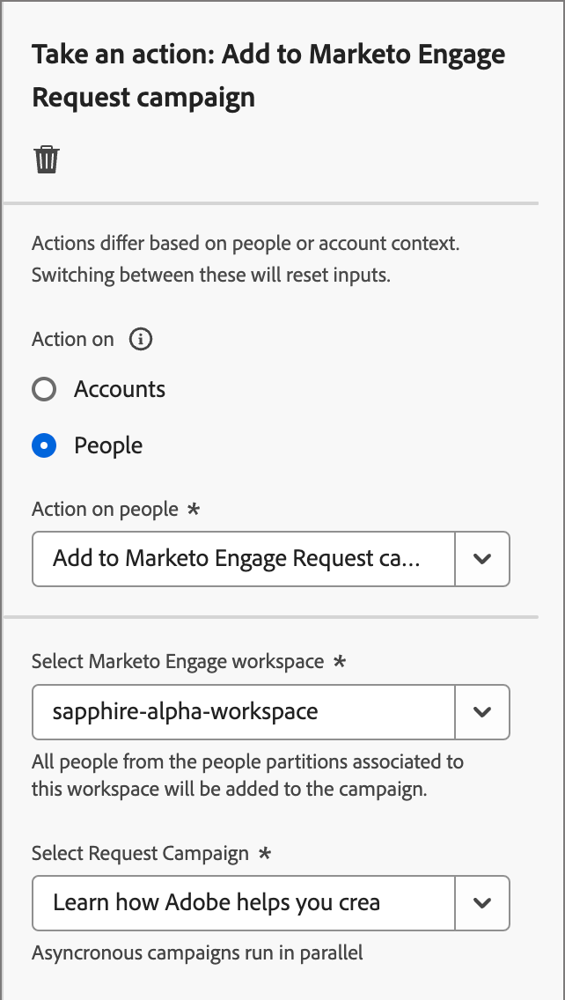

# Iniciar una acción

En el recorrido de su cuenta, puede agregar un nodo _[!UICONTROL Realizar una acción]_ para ejecutar una acción, como enviar un mensaje de correo electrónico, cambiar una puntuación, asignar a un grupo comprador, etc. Las acciones suelen ser lo que desea que ocurra como resultado de algún tipo de déclencheur, como un evento o una acción anterior.

{width="30"} [Vea el vídeo de información general](#overview-video)

## Acciones de cuenta

Utilice una acción en las cuentas cuando desee aplicar un cambio a todas las personas que forman parte de cuentas en la ruta del nodo.

### Acciones y restricciones {#account-action-constraints}

| Acción | Restricciones |
| ------ | ----------- |
| [!UICONTROL Valor de datos de cambio de cuenta] | Seleccionar atributo Nuevo valor |
| [!UICONTROL Momento interesante de la cuenta] | Escriba (correo electrónico, hito o web) Descripción (opcional) |
| [!UICONTROL Agregar cuenta a (otro) Recorrido] | Seleccionar recorrido de cuenta activa |
| [!UICONTROL Agregar a la lista de cuentas] | Seleccionar lista de cuentas estáticas activas |
| [!UICONTROL Quitar cuenta del Recorrido] | Seleccionar recorrido de cuenta activa |
| [!UICONTROL Quitar de la lista de cuentas] | Seleccione una lista de cuentas estáticas activas |
| [!UICONTROL Enviar alerta de ventas] | Seleccionar interés de solución Enviar correo electrónico a |
| [!UICONTROL Actualizar fase del grupo de compra] | Seleccione el interés de la solución Seleccione la fase de compra del grupo |
| [!UICONTROL Actualizar estado del grupo de compra] | Seleccione el interés de la solución Estado (obligatorio, máximo 50 caracteres) |

### Añadir una acción basada en cuentas

1. Vaya al mapa del recorrido.

1. Haga clic en el icono de signo más ( **+** ) en una ruta y elija **[!UICONTROL Realizar una acción]**.

   {width="400"}

1. En las propiedades del nodo a la derecha, elija **[!UICONTROL Cuentas]** para la acción.

1. Seleccione una acción de la lista y defina los valores que desee para la acción.

   {width="700" zoomable="yes"}

## Acciones de personas

Utilice una acción en personas cuando desee aplicar un cambio a todas las personas de la ruta del nodo. Este tipo de nodo se puede utilizar dentro de la ruta dividida por personas o por cuentas.

### Acciones y restricciones {#people-action-constraints}

| Contexto | Acción | Restricciones |
| ------- | ------ | ----------- |
| [Journey Optimizer B2B](#journey-optimizer-b2b-actions) | [!UICONTROL Agregar a la audiencia de cliente externa] | Seleccionar el público externo del cliente |
| | [!UICONTROL Asignar a grupo de compra] | Seleccionar interés de solución Seleccionar rol |
| | [!UICONTROL Cambiar valor de datos] | Seleccionar atributo de persona Establecer nuevo valor |
| | [!UICONTROL Cambiar puntuación] | Nombre de puntuación Cambio en la puntuación |
| | [!UICONTROL Momento interesante para la persona] | Escriba Descripción |
| | [!UICONTROL Quitar del grupo de compra] | Seleccionar interés de la solución |
| | [!UICONTROL Enviar correo electrónico] | Crear nuevo correo electrónico Seleccione un correo electrónico de Marketo Engage |
| | [!UICONTROL Enviar SMS] | Creación de un SMS |
| [Marketo Engage](#marketo-engage-actions) | [!UICONTROL Agregar a lista] | Seleccionar el espacio de trabajo de Marketo Engage Nombre de lista |
| | [!UICONTROL Agregar a la campaña de solicitudes de Marketo Engage] | Seleccione el espacio de trabajo de Marketo Engage Seleccionar campaña de solicitud |
| | [!UICONTROL Cambiar la partición de personas en Marketo Engage] | Nueva partición |
| | [!UICONTROL Quitar de la lista] | Seleccionar el espacio de trabajo de Marketo Engage Nombre de lista |

### Añadir una acción basada en personas

1. Vaya al mapa del recorrido.

1. Haga clic en el icono de signo más ( **+** ) en una ruta y elija **[!UICONTROL Realizar una acción]**.

1. En las propiedades del nodo a la derecha, elija **[!UICONTROL Personas]** para la acción.

1. Seleccione una acción de la lista y defina los valores que desee para la acción.

{width="700" zoomable="yes"}

### Acciones B2B de Journey Optimizer

Las acciones basadas en personas de Journey Optimizer B2B están diseñadas para administrar las comunicaciones a través de los canales configurados y administrar la categorización de personas dentro de los grupos y cuentas de compra. El recorrido aplica la acción cuando una cuenta correspondiente con perfiles de persona llega al nodo.

+++[!UICONTROL Agregar a la audiencia de cliente externa]

Utilice esta acción para dirigir a las personas a una audiencia externa que se puede activar en un canal de medios de pago para dirigirse aún más a los miembros de los grupos compradores. Esta acción se ejecuta mediante Real-Time CDP B2B/P Edition.

>[!NOTE]
>
>Cuando una cuenta correspondiente con perfiles de persona alcanza el nodo _Agregar a la audiencia de cliente externa_ en un recorrido publicado, esos perfiles pueden tardar hasta 48 horas en rellenarse en la audiencia externa.

{width="300"}

Al seleccionar esta acción basada en personas, puede crear una audiencia externa nueva o seleccionar una de ellas. Para las audiencias existentes, puede elegir entre audiencias de clientes externos creadas únicamente en Journey Optimizer B2B edition. Cuando cree una audiencia y la utilice para esta acción de recorrido, asegúrese de conectar el destino. Para obtener más información, consulte [Crear una nueva conexión de destino](https://experienceleague.adobe.com/es/docs/experience-platform/destinations/ui/connect-destination){target="_blank"} y [Descripción general de la activación](https://experienceleague.adobe.com/es/docs/experience-platform/destinations/ui/activate/activation-overview#activate-audiences-from-the-destinations-catalog){target="_blank"} en la documentación de Experience Platform.

{width="30"} [Vea un vídeo de información general sobre la orquestación de medios de pago](../data/linkedin-account-matched-audiences.md#orchestrate-paid-media-engagement)

_Para crear una audiencia externa :_

1. Elija **[!UICONTROL Crear nuevo]**.

1. Haga clic en **[!UICONTROL Crear audiencia de cliente externa]**.

1. Escriba **[!UICONTROL Name]** (obligatorio) y **[!UICONTROL Description]** (opcional) para la nueva audiencia externa.

   {width="300"}

1. Haga clic en **[!UICONTROL Crear]**.

   El sistema crea la nueva audiencia y muestra un mensaje de confirmación. A continuación, puede utilizarla como audiencia existente para la acción del nodo.

   >[!NOTE]
   >
   >Cuando se crea una nueva audiencia de cliente externa desde Journey Optimizer B2B edition, se predefine con un registro ficticio (`test@email.com`). Este registro se sobrescribe en cuanto se añade el primer perfil real a la audiencia externa desde el recorrido.

_Para usar una audiencia existente :_

1. Haga clic en **[!UICONTROL Seleccionar audiencia de cliente externo]**.

1. En el cuadro de diálogo, seleccione la audiencia que desee utilizar.

   {width="700" zoomable="yes"}

1. Haga clic en **[!UICONTROL Agregar audiencia]**.

+++

+++[!UICONTROL Asignar a grupo de compra]

Utilice esta acción para agregar perfiles de personas a un [grupo de compra](../buying-groups/buying-groups-overview.md) según el rol y el interés de una solución seleccionados.

{width="300"}

+++

+++[!UICONTROL Cambiar valor de datos]

Utilice esta acción para cambiar el valor de un atributo de perfil de [personas](../data/field-mapping.md#xdm-business-person-attributes). Seleccione el atributo y, a continuación, establezca el nuevo valor.

{width="300"}

+++

+++[!UICONTROL Cambiar puntuación]

Utilice esta acción para cambiar la puntuación de la persona en Marketo Engage. [Más información](https://experienceleague.adobe.com/es/docs/marketo-learn/tutorials/lead-and-data-management/lead-scoring-learn){target="_blank"}

{width="300"}

+++

+++[!UICONTROL Momento interesante para la persona]

Utilice esta acción para registrar un momento interesante para las personas. Elija un tipo (correo electrónico, hito o web) y añada una descripción (opcional).

{width="300"}

+++

+++[!UICONTROL Quitar del grupo de compra]

Utilice esta acción para quitar perfiles de personas de un [grupo de compra](../buying-groups/buying-groups-overview.md) según el interés de una solución seleccionada.

{width="300"}

+++

+++[!UICONTROL Enviar correo electrónico]

Utilice esta acción para enviar un correo electrónico. Después de [crear el correo electrónico](../content/add-email.md#add-an-email-to-your-journey) para el nodo, puede diseñar, personalizar y previsualizar mensajes de correo electrónico en el espacio de diseño de correo electrónico (consulte [Creación de correo electrónico](../content/email-authoring.md)). También puedes enviar un [correo electrónico desde Marketo Engage](https://experienceleague.adobe.com/es/docs/marketo/using/product-docs/email-marketing/general/creating-an-email/create-an-email){target="_blank"}. Seleccione el espacio de trabajo de Marketo Engage y, a continuación, el correo electrónico que desea enviar.

{width="300"}

+++

+++[!UICONTROL Enviar SMS]

Utilice esta acción para enviar un mensaje SMS. Puede crear, personalizar y previsualizar mensajes SMS en el espacio de diseño visual (consulte [Creación de SMS](../content/sms-authoring.md)).

{width="300"}

+++

### Acciones de Marketo Engage

Las acciones basadas en personas de Marketo Engage están diseñadas para coordinar la orquestación de marketing basada en cuentas en Journey Optimizer B2B edition con los esfuerzos de marketing basados en posibles clientes en Marketo Engage. Utilice estas acciones para organizar la pertenencia a listas, las particiones de personas y las campañas de solicitud.

+++[!UICONTROL Agregar a lista]

Utilice esta acción para agregar personas a una [lista estática](https://experienceleague.adobe.com/es/docs/marketo/using/product-docs/core-marketo-concepts/smart-lists-and-static-lists/static-lists/understanding-static-lists){target="_blank"} en Marketo Engage.

En primer lugar, seleccione el espacio de trabajo en la instancia de Marketo Engage conectada. A continuación, seleccione el nombre de la lista.

{width="300"}

+++

+++[!UICONTROL Agregar a la campaña de solicitudes de Marketo]

Utilice esta acción para agregar perfiles de personas a una [campaña de solicitudes](https://experienceleague.adobe.com/es/docs/marketo/using/product-docs/core-marketo-concepts/smart-campaigns/flow-actions/request-campaign){target="_blank"} en Marketo Engage.

En primer lugar, seleccione el espacio de trabajo en la instancia de Marketo Engage conectada. A continuación, seleccione el nombre de la campaña de solicitud.

{width="300"}

+++

+++[!UICONTROL Cambiar la partición de personas en Marketo Engage]

Utilice esta acción para cambiar la [partición de persona](https://experienceleague.adobe.com/es/docs/marketo/using/product-docs/administration/workspaces-and-person-partitions/understanding-workspaces-and-person-partitions#person-partitions){target="_blank"} en Marketo Engage.

{width="300"}

+++

+++[!UICONTROL Quitar de la lista]

Use esta acción para quitar personas de una [lista estática](https://experienceleague.adobe.com/es/docs/marketo/using/product-docs/core-marketo-concepts/smart-lists-and-static-lists/static-lists/understanding-static-lists){target="_blank"} en Marketo Engage. En primer lugar, seleccione el espacio de trabajo en la instancia de Marketo Engage conectada. A continuación, seleccione el nombre de la lista.

{width="300"}

Si el perfil de la persona no era miembro de la lista inteligente, se omite la acción.

+++

## Vídeo de información general

>[!VIDEO](https://video.tv.adobe.com/v/3443207/?learn=on)
