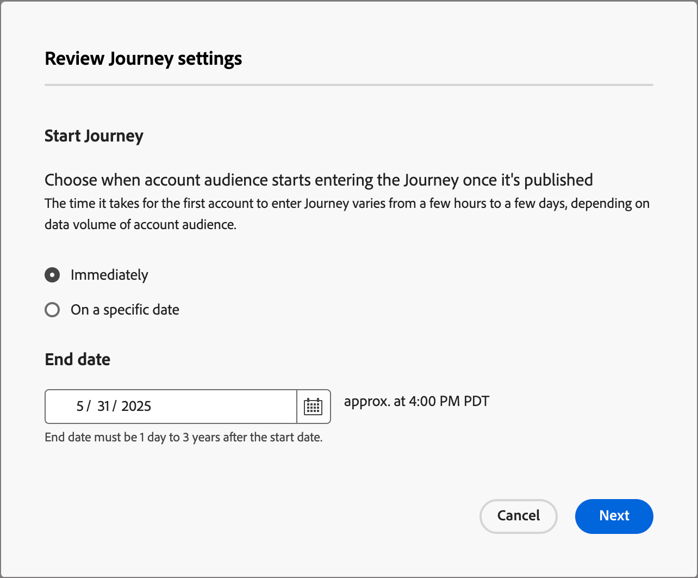

# Creación y publicación de un recorrido

Para empezar con un recorrido, cree el recorrido y, a continuación, construya los nodos y el flujo de recorrido en el mapa de recorrido.

{width="30"} [Vea el vídeo de información general](#overview-video)

## Crear un recorrido

En **[!UICONTROL Administración de Recorrido]** en el panel de navegación izquierdo, seleccione el tipo de recorrido que desea crear:

* **[!UICONTROL recorridos de cuenta]**
* **[!UICONTROL recorridos de personas]** (Beta)

_Para agregar un nuevo recorrido :_

+++Recorrido de cuenta

1. Haga clic en **[!UICONTROL Crear Recorrido de cuenta]** en la parte superior derecha de la página.

1. En el cuadro de diálogo, escriba un **[!UICONTROL Nombre]** único (obligatorio) y **[!UICONTROL Descripción]** (opcional).

   {width="400"}

1. Haga clic en **[!UICONTROL Crear]**.

+++

+++Recorrido de personas (Beta)

1. Haga clic en **[!UICONTROL Crear Recorrido]** en la parte superior derecha de la página.

1. En el cuadro de diálogo, escriba un **[!UICONTROL Nombre]** único (obligatorio) y **[!UICONTROL Descripción]** (opcional).

   {width="400"}

1. Haga clic en **[!UICONTROL Crear]**.

+++

## Bloques de creación para el diseño de recorridos

El _mapa de recorrido_ es la zona central del área de trabajo de recorrido. Es en esta zona donde puede agregar nodos de recorrido y configurarlos. Haga clic en un nodo para abrir su panel de propiedades a la derecha del lienzo y establecerlo según el diseño. Un recorrido siempre comienza con un nodo de audiencia, donde puede definir la entrada para el recorrido:

* [Nodo de audiencia de cuenta](./account-audience-nodes.md)
* [Nodo de audiencia de persona](./person-audience-nodes.md)

Después de crear un recorrido de cuentas y agregar la audiencia, diseñe el recorrido con los nodos. El mapa de recorrido proporciona un lienzo en el que puede crear sus casos de uso de marketing B2B de varios pasos utilizando los siguientes tipos de nodos para crear un recorrido de cuentas:

* [Iniciar una acción](./action-nodes.md)
* [Escuchar un evento](./listen-for-event-nodes.md)
* [Dividir rutas](./split-merge-paths-nodes.md)
* [Rutas divididas de variantes](./variant-split-paths-nodes.md)
* [Siguiente mejor ruta](./next-best-path-node.md)
* [Espera](./wait-nodes.md)
* [Combinar rutas](./split-merge-paths-nodes.md)

## Mecanismos de protección

Para ayudarle a crear un recorrido sin que se produzcan errores, se han implementado los siguientes carriles de protección:

* _Eliminando un nodo de ruta dividida_: para eliminar un nodo se deben eliminar todos los nodos subsiguientes de cada ruta.
* _Eliminando un nodo de combinación_: un nodo de combinación solo se puede eliminar cuando hay una ruta conectada a él. Para eliminar un nodo de combinación, deje solo una ruta seleccionada.
* _Cambiar entre cuenta y personas_: al cambiar la selección de cuentas a personas se eliminan todos los nodos subsiguientes de cada ruta.

## Añadir un nodo

1. Vaya al mapa del recorrido.

1. Haga clic en el icono de signo más ( **+** ) en la ruta y seleccione el tipo de nodo.

1. Establezca las propiedades del nodo a la derecha.

## Eliminación de un nodo

1. Vaya al mapa del recorrido.

1. En las propiedades del nodo, a la derecha, haga clic en el icono _Eliminar_ (  ).

1. En el cuadro de diálogo de confirmación, haga clic en **[!UICONTROL Eliminar]**.

## Adición y eliminación de una ruta

1. Vaya al mapa del recorrido.

1. Haga clic en el icono de signo más (**+** ) en la ruta y agregue el [nodo de ruta dividida](./split-merge-paths-nodes.md#split-paths).

1. En las propiedades del nodo a la derecha, seleccione **[!UICONTROL Cuenta]**.

1. Para agregar más rutas, haga clic en **[!UICONTROL Agregar ruta]**.

   Con cada ruta creada en el recorrido, aparece una nueva tarjeta de ruta en las propiedades.

1. Vaya a una de las rutas del recorrido y agregue los nodos [action](./action-nodes.md) o [event](./listen-for-event-nodes.md) a esta ruta mediante el icono más.

1. Seleccione el nodo [ruta dividida](./split-merge-paths-nodes.md) para abrir las propiedades a la derecha.

   Las rutas que tienen nodos no se pueden eliminar.

1. Para eliminar estas rutas, primero debe eliminar todos los nodos de esa ruta.

## Programar un recorrido

Cuando publica un recorrido, puede comenzar inmediatamente o en una fecha futura programada. La fecha de finalización puede ser un máximo de tres años desde la fecha de inicio. Después de publicar un recorrido (estado _Activo_), puede actualizar la fecha de finalización del recorrido, pero no la fecha de inicio.

1. Vaya al mapa del recorrido.

1. Programe su recorrido haciendo clic en **[!UICONTROL Configuración de Recorrido]** en el encabezado.

1. En el cuadro de diálogo, defina las opciones de programación:

   * Elija un tipo de programación.

     Para activar el recorrido en el momento de la publicación, elija **[!UICONTROL Inmediatamente]**.

     Para activar el recorrido en una fecha futura, elige **[!UICONTROL En una fecha específica]** y haz clic en el icono _Calendario_ para seleccionar la fecha.

     {width="400" zoomable="no"}

   * Especifique la **[!UICONTROL fecha de finalización]** del recorrido. Puede ser un máximo de tres años desde la fecha de inicio (este campo es obligatorio para publicar).

1. Haga clic en **[!UICONTROL Guardar]**.

   Cuando esté listo para publicar el recorrido, puede revisar esta configuración al hacer clic en _[!UICONTROL Publicar]_.

## Publicación de un recorrido

Puede publicar un recorrido si no hay errores de bloqueador. Cuando se publique, el estado del recorrido cambiará a _Activo_. Si el recorrido tiene errores, el botón _[!UICONTROL Publicar]_ aparece atenuado con información de contenido: `Resolve errors before publishing`.

>[!NOTE]
>
>Después de publicar un recorrido de cuenta, hay un retraso de hasta 24 horas para que las cuentas que cumplen los requisitos ingresen al recorrido.

1. En la parte superior derecha del mapa de recorrido, haga clic en **[!UICONTROL Publicar]**.

1. En el cuadro de diálogo _[!UICONTROL Revisar configuración de recorrido]_, establezca las opciones de inicio de recorrido.

   Si ya ha establecido la configuración de recorrido para definir una programación, revise la configuración.

   Si necesita configurar la activación del recorrido, elija un tipo de programación:

   * Para activar el recorrido en el momento de la publicación, elija **[!UICONTROL Inmediatamente]**.

   * Para activar el recorrido en una fecha futura, elige **[!UICONTROL En una fecha específica]** y haz clic en el icono _Calendario_ para seleccionar la fecha.

1. Si es necesario, especifique la **[!UICONTROL fecha de finalización]** del recorrido.

   {width="400" zoomable="no"}

   Puede ser un máximo de tres años desde la fecha de inicio (este campo es obligatorio para publicar).

1. Haga clic en **[!UICONTROL Next]**.

1. En el diálogo de confirmación, haga clic en **[!UICONTROL Publicar]**.

## Vídeo resumen

>[!VIDEO](https://video.tv.adobe.com/v/3443204/?learn=on)
