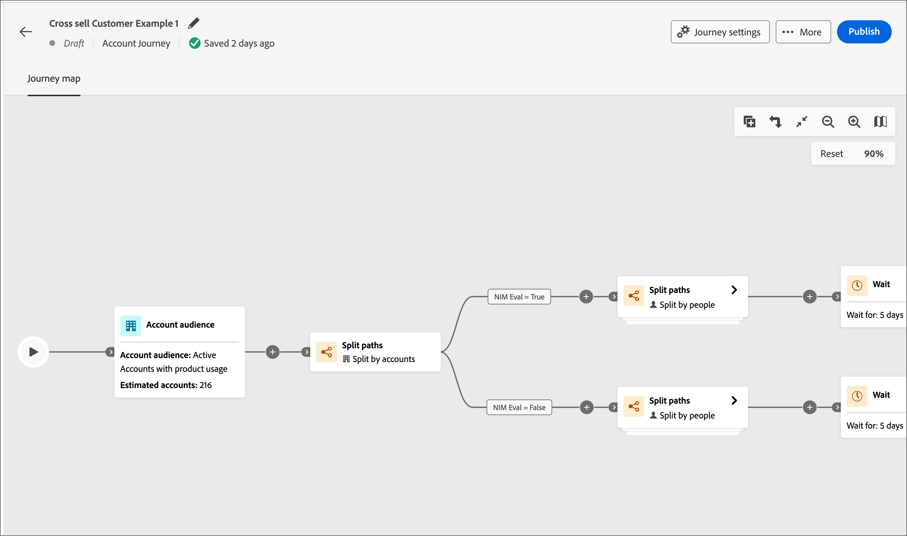

# Recorridos de cuenta

Cree y ejecute recorridos personalizados para cada grupo comprador y miembro del grupo comprador mediante la participación automatizada en correos electrónicos, SMS, eventos y mucho más. Con los recorridos de cuenta, puede optimizar la generación de demanda y la calificación del grupo de compra, así como impulsar una demanda más cualificada para sus programas de adquisición, ampliación de ventas/ventas cruzadas y retención.

Defina un compromiso basado en las ventas que incluya correo electrónico, SMS y más recorridos de cuenta interna para coordinar el marketing entrante con las actividades de ventas salientes de cada miembro del grupo comprador.

## Acceso y exploración de recorridos de cuenta

1. En la página de inicio de Adobe Experience Platform, haga clic en Adobe Journey Optimizer B2B edition.

1. En el panel de navegación izquierdo, haga clic en **[!UICONTROL recorridos de cuenta]**.

   {width="800" zoomable="yes"}

   La página de recorridos mostrada incluye las siguientes columnas:

   * [!UICONTROL Nombre] (haga clic en el nombre para abrir el recorrido de la cuenta y editarlo)
   * [!UICONTROL Estado]
   * [!UICONTROL Descripción]
   * [!UICONTROL Creado por]
   * [!UICONTROL Última actualización el]
   * [!UICONTROL Última actualización por]
   * [!UICONTROL Publicado el]
   * [!UICONTROL Publicado por]

Esta tabla incluye la capacidad de búsqueda por nombre y creado por. Ordenar no está disponible actualmente.

Puede personalizar la tabla mostrada si hace clic en el icono _Columnas_ en la esquina superior derecha y activa o desactiva las casillas de verificación.

{width="800" zoomable="yes"}

## Estructura de un recorrido de cuentas

Haga clic en el nombre (mostrado como un vínculo) en la lista _[!UICONTROL recorridos de la cuenta]_ para revisar los detalles, realizar cambios y realizar acciones.

{width="800" zoomable="yes"}

El encabezado del editor de cada recorrido de cuenta incluye:

* nombre del recorrido
* Capacidad para editar el nombre (icono _Editar_)
* Estado del recorrido

Las siguientes acciones están disponibles en el encabezado:

* **Publish**: puede publicar un recorrido si no hay errores de bloqueador. Cuando se publique, el estado del recorrido cambiará a _Activo_. Si el recorrido tiene errores, el botón aparece atenuado con información de contenido: `Resolve errors before publishing`.
* **Duplicado**: esta acción es similar a una función de clonación, pero el recorrido duplicado no incluye ningún recurso.
* **Cerca de nuevas entradas**: si cierra un recorrido, las cuentas que se encuentran actualmente en el recorrido continuarán su ruta de acceso en el recorrido y no podrá haber más entradas al recorrido. No se puede reiniciar un recorrido cerrado. Puede duplicar un recorrido cerrado.
* **Anular**: si detiene un recorrido, las cuentas del recorrido detienen inmediatamente su progreso y no puede producirse ninguna otra entrada al recorrido. Un recorrido detenido no se puede reiniciar. Si bloquea nuevas entradas sin detener el progreso de la gente, considere en su lugar cerrar el recorrido.
* **Eliminar**: esta acción elimina permanentemente el recorrido.

El estado de un Recorrido cambia según las acciones que aplique. En función del estado de un recorrido, ciertas acciones no están disponibles en el encabezado.

| Estado | Descripción | Acciones disponibles |
| ------ | ----------- | ----------------- |
| _**Borrador**_ | Un recorrido sin publicar editable. | <ul><li>Publicar</li><li>Duplicado </li><li>Eliminar </li></ul> |
| _**Activo**_ | El estado del recorrido cambia de Borrador a Activo cuando se publica un recorrido. En este estado, ya no se puede editar. | <ul><li>Duplicado </li><li>Cerca de nuevas entradas </li><li>Anular </li></ul> |
| _**Cerrado a nuevas entradas**_ | El estado del recorrido cambia de _Activo_ a _Cerrado a nuevas entradas_ al hacer clic en [!UICONTROL Cerca de nuevas entradas] en la barra de navegación superior. | <ul><li>Duplicado </li><li>Anular </li></ul> |
| _**Anulado**_ | El estado del recorrido cambia de _Activo_ o _Cerrado a nuevas entradas_ cuando se anula un recorrido. No se puede reiniciar un recorrido anulado. | <ul><li>Duplicado </li><li>Eliminar </li></ul> |
| _**Finalizado**_ | Cuando todas las cuentas de un recorrido completan el recorrido, el estado cambia de Activo o Cerrado a nuevas entradas a Finalizado. | <ul><li>Duplicado </li><li>Eliminar </li></ul> |

## Introducción a un recorrido

Para empezar con un recorrido de cuentas, cree el recorrido y, a continuación, construya los nodos y el flujo de recorrido en el editor de recorridos.

### Crear un recorrido de cuenta

1. En el panel de navegación izquierdo, haga clic en **[!UICONTROL recorridos de cuenta]**.

1. Haga clic en **[!UICONTROL Crear Recorrido de cuenta]** en la parte superior derecha de la página.

1. En el cuadro de diálogo, escriba un **[!UICONTROL Nombre]** único (obligatorio) y **[!UICONTROL Descripción]** (opcional).

   {width="400"}

1. Haga clic en **[!UICONTROL Crear]**.

### Componentes básicos de un recorrido

El _mapa de recorrido_ es la zona central del diseñador de recorridos. Es en esta zona donde puede agregar nodos de recorrido y configurarlos. Haga clic en un nodo para abrir su panel de propiedades a la derecha del lienzo y establecerlo según el diseño. Un recorrido de cuenta siempre comienza con un [nodo de audiencia de cuenta](./account-audience-nodes.md) donde puede agregar datos a su recorrido.

Después de crear un recorrido de cuentas y agregar la audiencia, genere el recorrido con los nodos. El mapa de recorrido proporciona un lienzo en el que puede crear sus casos de uso de marketing B2B de varios pasos utilizando los siguientes tipos de nodos para crear un recorrido de cuentas:

* [Realizar una acción](./action-nodes.md)
* [Escuchar un evento](./listen-for-event-nodes.md)
* [Dividir rutas](./split-merge-paths-nodes.md)
* [Espera](./wait-nodes.md)
* [Combinar rutas](./split-merge-paths-nodes.md)

### Mecanismos de protección

Para ayudarle a crear un recorrido sin que se produzcan errores, se han implementado los siguientes carriles de protección:

* _Eliminando un nodo de ruta dividida_: no puede eliminar un nodo sin eliminar todos los nodos subsiguientes de cada ruta.
* _Eliminando un nodo de combinación_: un nodo de combinación solo se puede eliminar cuando hay una ruta conectada a él. Para eliminar un nodo de combinación, deje solo una ruta seleccionada.
* _Cambio entre cuentas y personas_: no puede cambiar la selección de cuentas a personas sin eliminar todos los nodos subsiguientes de cada ruta.

### Añadir un nodo

1. Vaya al editor de recorrido.

1. Haga clic en el icono de signo más ( **+** ) en la ruta y seleccione el tipo de nodo.

1. Establezca las propiedades del nodo a la derecha.

### Eliminación de un nodo

1. Vaya al editor de recorrido.

1. En las propiedades del nodo, a la derecha, haga clic en el icono _Eliminar_ (  ).

1. En el cuadro de diálogo de conformación, haga clic en **[!UICONTROL Eliminar]**.

### Adición y eliminación de una ruta

1. Vaya al editor de recorrido.

1. Haga clic en el icono de signo más (**+** ) en la ruta y agregue el [nodo de ruta dividida](./split-merge-paths-nodes.md#split-paths).

1. En las propiedades del nodo a la derecha, seleccione **[!UICONTROL Cuenta]**.

1. Para agregar más rutas, haga clic en **[!UICONTROL Agregar ruta]**.

   Con cada ruta creada en el recorrido, aparece una nueva tarjeta de ruta en las propiedades.

1. Vaya a una de las rutas del recorrido y agregue los nodos [action](./action-nodes.md) o [event](./listen-for-event-nodes.md) a esta ruta mediante el icono más.

1. Seleccione el nodo [ruta dividida](./split-merge-paths-nodes.md) para abrir las propiedades a la derecha.

   Las rutas que tienen nodos no se pueden eliminar.

1. Para eliminar estas rutas, primero debe eliminar todos los nodos de esa ruta.

### Programar un recorrido

Cuando publica un recorrido, puede comenzar inmediatamente o en una fecha futura programada. La fecha de finalización puede ser un máximo de tres años desde la fecha de inicio. Después de publicar un recorrido (estado _Activo_), puede actualizar la fecha de finalización del recorrido, pero no la fecha de inicio.

1. Vaya al editor de recorrido.

1. Programe su recorrido haciendo clic en [!UICONTROL Configuración de Recorrido] en el encabezado.

1. En el cuadro de diálogo, defina las opciones de programación:

   * Elija un tipo de programación.

     Para activar el recorrido en el momento de la publicación, elija **[!UICONTROL Inmediatamente]**.

     Para activar el recorrido en una fecha futura, elige **[!UICONTROL En una fecha específica]** y haz clic en el icono _Calendario_ para seleccionar la fecha.

     {width="400" zoomable="no"}

   * Especifique la **[!UICONTROL fecha de finalización]** del recorrido. Puede ser un máximo de tres años desde la fecha de inicio (este campo es obligatorio).

1. Haga clic en **[!UICONTROL Guardar]**.

   Cuando estés listo para publicar tu recorrido, puedes revisar esta configuración cuando hagas clic en _[!UICONTROL Publish]_.

### Publish y un recorrido de cuentas

