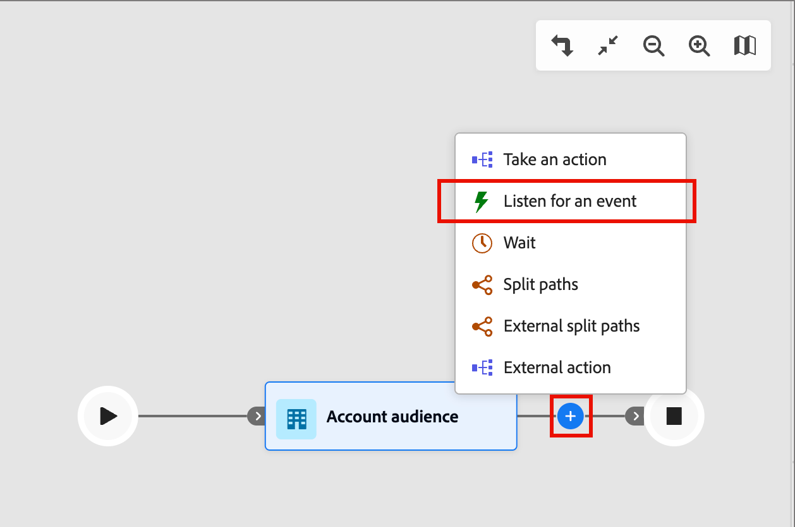
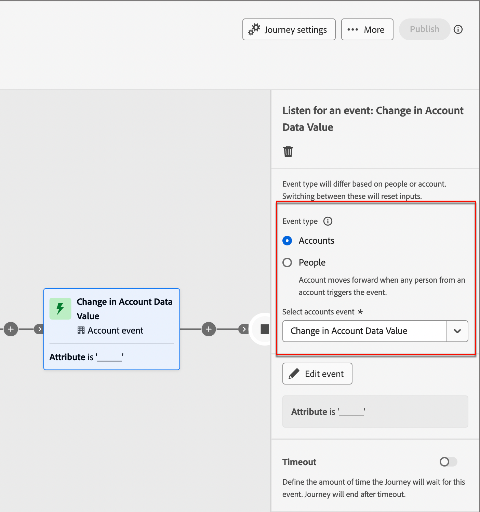
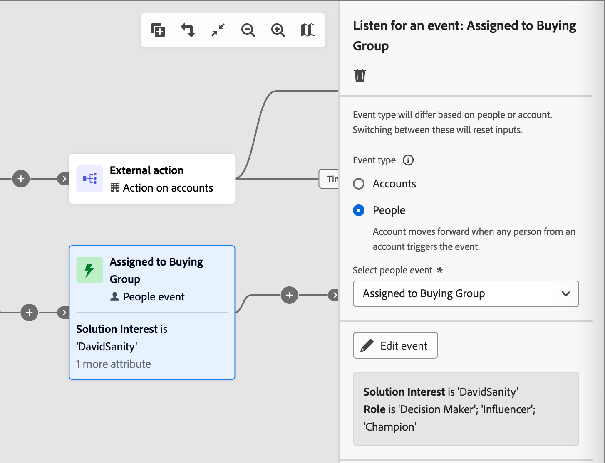
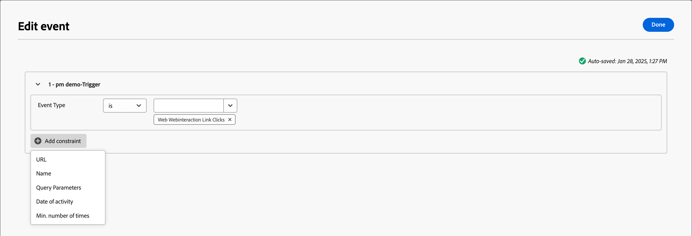
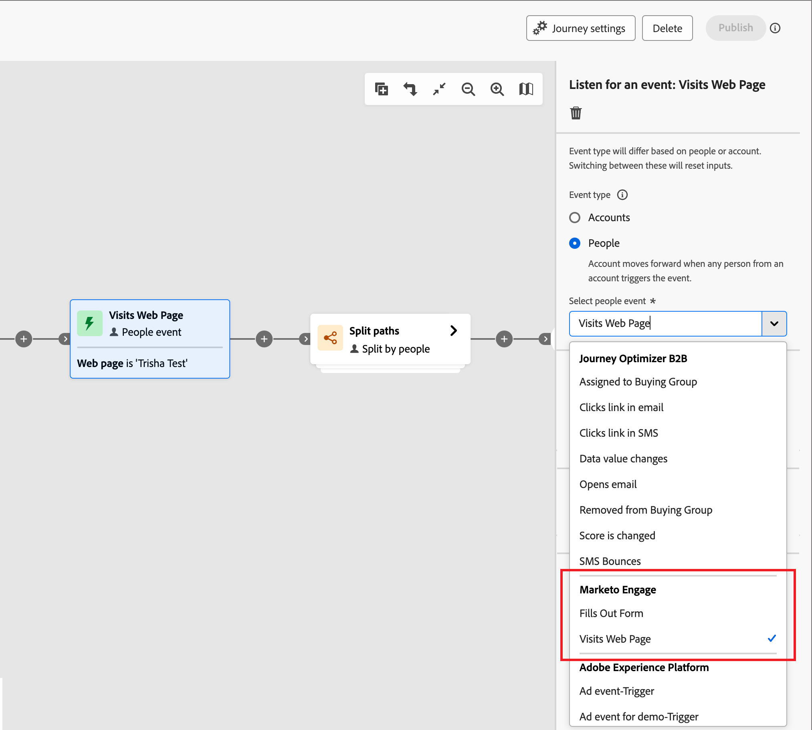

# Escuchar un evento

Para mover la audiencia al siguiente paso del [recorrido](./journeys-overview.md) cuando se produzca un evento, agrega el nodo _Escuchar un evento_. Según el tipo de recorrido, puede utilizar este nodo para almacenar en déclencheur el siguiente nodo de la recorrido según los eventos de personas o cuentas.

<!--
{width="30", vertical-align="middle"} [Watch the overview video](#overview-video)
-->

## Recorridos de la cuenta {#account-journeys}

>[!NOTE]
>
>Para un recorrido de cuenta, no se puede agregar el tipo de nodo _[!UICONTROL Escuchar un evento]_ en una ruta dividida por personas.

1. Abra el lienzo del recorrido de la cuenta.

1. Haga clic en el icono de signo más (**+** ) en una ruta y elija **[!UICONTROL Escuchar un evento]**.

   {width="400"}

1. En las propiedades del nodo de la derecha, use el selector _Tipo de evento_ para elegir entre **[!UICONTROL Cuentas]** y **[!UICONTROL Personas]**.

1. Seleccione un evento de la lista.

   * Para el tipo de evento _Personas_, elija el evento [Personas](#people-events) que desee usar para el déclencheur.

     {width="500" zoomable="yes"}

   * Para el tipo de evento _Cuentas_, elija el [evento de cuenta](#account-events) que desee usar para el déclencheur.

     {width="500" zoomable="yes"}

1. Haga clic en **[!UICONTROL Editar evento]** y defina los detalles del evento.

   Según el tipo de evento y el evento seleccionados, defina los criterios coincidentes del evento.

   * [Eventos de personas](#people-events)
   * [Eventos de cuenta](#account-events)

   También puede incluir [filtros](#filters-people-event) para el evento.

1. Haga clic en **[!UICONTROL Finalizado]**.

   Las definiciones de evento y filtro se muestran en el nodo y en las propiedades del nodo.

   {width="500"}

### Eventos de personas para recorridos de cuenta {#people-events}

En un recorrido de cuentas, puede detectar un evento basado en personas cuando desee mover la cuenta hacia adelante en el recorrido según los eventos activados por la actividad de personas. También puede filtrar eventos según el historial de eventos y los atributos de las personas.

>[!TIP]
>
>Los eventos de experiencia pueden ocurrir _antes de que_ personas ingresen al recorrido (como un clic previo en un correo electrónico o una interacción web). Para enrutar a las personas según estos eventos, usa el filtro [!UICONTROL Historial de eventos] en un nodo [Dividir rutas entre personas](./split-merge-paths-nodes.md#experience-event-history-filtering).

#### Eventos B2B de Journey Optimizer {#events-account-people}

| Evento | Restricciones |
| ----- | ----------- |
| [!UICONTROL Asignado a grupo comprador] | Interés en la solución (obligatorio)  Restricciones adicionales (opcional): <li>Función</li><li>Fecha de la actividad</li> Tiempo de espera (opcional) |
| [!UICONTROL Cambios de perfil de persona] | Atributo (obligatorio) Fecha de actividad (opcional) Nuevo valor (opcional) Valor anterior (opcional) Motivo (opcional) Source (opcional) |
| [!UICONTROL Eliminado del grupo de compra] | Interés de la solución (obligatorio) Fecha de la actividad (opcional) Tiempo de espera (opcional) |

1. Configure el valor necesario para que coincida con el evento.

   Si es necesario, establezca el operador para la evaluación.

1. Para cada restricción opcional que desee incluir para la coincidencia de eventos, haga clic en **[!UICONTROL Agregar restricción]** y seleccione una restricción en la lista.

   {width="700" zoomable="yes"}

1. (Opcional) Seleccione la ficha **[!UICONTROL Filtros]** para [agregar filtros para el evento](#filters-people-event).

1. Haga clic en **[!UICONTROL Finalizado]**.

#### Eventos de experiencia {#experience-events-account-people}

>[!PREREQUISITES]
>
>Los administradores configuran [Eventos de experiencia de Adobe Experience Platform (AEP)](https://experienceleague.adobe.com/es/docs/experience-platform/xdm/classes/experienceevent){target="_blank"}, que permite a los especialistas en marketing crear recorridos de persona y cuenta que reaccionan a los eventos en tiempo casi real.
>
>Para que los eventos de experiencia estén disponibles para los recorridos, un administrador de productos debe [agregar primero los tipos de eventos y los campos de interés](../admin/configure-aep-events.md#add-an-event) en [!DNL Journey Optimizer B2B Edition].

1. Haga clic en **[!UICONTROL Agregar restricción]** y elija el campo que desee utilizar para la restricción.

   Las restricciones disponibles se definen como campos administrados para la configuración del evento.

1. Complete la condición de la restricción.

   Puede usar el operador predeterminado **[!UICONTROL is]** para que coincida con uno o más valores de campo. O puede usar el operador **[!UICONTROL is not]** para que coincida en todos los valores con la exclusión de uno o más valores especificados.

   {width="700" zoomable="yes"}

1. (Opcional) Seleccione la ficha **[!UICONTROL Filtros]** para [agregar filtros para el evento](#filters-people-event).

1. Haga clic en **[!UICONTROL Finalizado]**.

### Eventos de cuenta {#account-events}

En un recorrido de cuenta, puede detectar un evento basado en la cuenta cuando desee mover la cuenta hacia adelante en el recorrido según los eventos activados por la actividad de la cuenta.

| Evento | Restricciones |
| ----- | ----------- |
| [!UICONTROL La cuenta tuvo un momento interesante] | Escriba (correo electrónico, hito o web) restricciones adicionales (opcionales): <li>Descripción</li><li>Origen</li><li>Fecha de la actividad</li>  Tiempo de espera (opcional) |
| [!UICONTROL Cambio en el valor de datos de la cuenta] | Atributo Restricciones adicionales (opcional): <li>Nuevo valor</li><li>Valor anterior</li><li>Fecha de la actividad</li>  Tiempo de espera (opcional) |
| [!UICONTROL Cambio en la fase de grupo de compra] | Interés en la solución Restricciones adicionales (opcional): <li>Nueva fase</li><li>Fase anterior</li><li>Fecha de la actividad</li>Tiempo de espera de   (opcional) |
| [!UICONTROL Cambio en el estado del grupo de compra] | Interés en la solución Restricciones adicionales (opcional): <li>Nuevo estado</li><li>Estado anterior</li><li>Fecha de la actividad</li>Tiempo de espera de   (opcional) |
| [!UICONTROL Cambio en la puntuación de integridad] | Interés en la solución Restricciones adicionales (opcional): <li>Nuevo puntaje</li><li>Puntuación anterior</li><li>Fecha de la actividad</li>Tiempo de espera de   (opcional) |
| [!UICONTROL Cambio en la puntuación de participación] | Interés en la solución Restricciones adicionales (opcional): <li>Nuevo puntaje</li><li>Puntuación anterior</li><li>Fecha de la actividad</li>Tiempo de espera de   (opcional) |

1. Establezca la restricción necesaria para que coincida con el evento.

1. Para cada restricción opcional que desee incluir para la coincidencia de eventos, haga clic en **[!UICONTROL Agregar restricción]** y seleccione el campo.

   {width="700" zoomable="yes"}

   Establezca el operador y el valor para la evaluación.

1. Haga clic en **[!UICONTROL Finalizado]**.

<!--

Removed from AJO B2B people events 

| [!UICONTROL Clicks link in email] | Email  Additional constraints (optional): <li>Link</li><li>Link ID</li><li>Is mobile device</li><li>Device</li><li>Platform</li><li>Browser</li><li>Is predictive content</li><li>Is bot activity</li><li>Bot activity pattern</li><li>Browser</li><li>Date of activity</li><li>Min. number of times</li> Timeout (optional) |
| [!UICONTROL Clicks link in SMS] | Email  Additional constraints (optional): <li>Link</li><li>Device</li><li>Platform</li><li>Date of activity</li><li>Min. number of times</li> Timeout (optional) |
| [!UICONTROL Data value changes] | Person attribute  Additional constraints (optional): <li>New value</li><li>Previous value</li><li>Reason</li><li>Source</li><li>Date of activity</li><li>Min. number of times</li> Timeout (optional) |
| [!UICONTROL Opens email] | Email  Additional constraints (optional): <li>Link</li><li>Link ID</li><li>Is mobile device</li><li>Device</li><li>Platform</li><li>Browser</li><li>Is predictive content</li><li>Is bot activity</li><li>Bot activity pattern</li><li>Browser</li><li>Date of activity</li><li>Min. number of times</li> Timeout (optional) |
| [!UICONTROL Score is changed] | Score name  Additional constraints (optional):<li>Change</li><li>New score</li><li>Urgency</li><li>Priority</li><li>Relative score</li><li>Relative urgency</li><li>Date of activity</li><li>Min. number of times</li> Timeout (optional) |
| [!UICONTROL SMS Bounces]| SMS message  Additional constraints (optional): <li>Date of activity</li><li>Min number of times</li> Timeout (optional) |

### Listen for a Marketo Engage event {#listen-for-marketo-engage-event}

| Marketo Engage | [!UICONTROL Visits Web Page] | Web page   Select one or more Marketo Engage pages to match.   Additional constraints (optional): <li>Querystring</li><li>Client IP address</li><li>Referrer</li><li>User Agent</li><li>Search engine</li><li>Search query</li><li>Token</li><li>Browser</li><li>Platform</li><li>Device</li><li>Date of activity</li> |
| | [!UICONTROL Fills out form] | Form   Select one or more Marketo Engage forms to match.   Additional constraints (optional): <li>Date of activity</li><li>Querystring</li><li>Client IP address</li><li>Referrer</li><li>User agent</li><li>Platform</li><li>Device</li> Timeout (optional) |
| Adobe Experience Platform | [!UICONTROL Event definition] | Event type   Additional constraints (optional): <li>Fields</li>  Additional constraints (not supported): <li>Date of activity</li><li>Min. number of times</li>  Timeout (optional) |

If you have web pages in your connected Marketo Engage instance, you can trigger an event based on a visit/no visit to these web pages, as well as Marketo Engage forms that were/were not filled. 

1. Use the **[!UICONTROL Select people event]** selector and scroll the menu to the **[!UICONTROL Marketo Engage]** section.

1. Select a Marketo Engage activity type:

   * **[!UICONTROL Visits Web Page]**.
   * **[!UICONTROL Fills Out Form]**

   {width="700" zoomable="yes"}

1. Click **[!UICONTROL Edit event]** and define one or more web pages to match and any additional constraints for the event.

   * (Required) In the _[!UICONTROL Edit event]_ dialog, define the **[!UICONTROL Web page]** or **[!UICONTROL Fills out form]** constraint. Use **[!UICONTROL is]** (default) to match on one or more selected pages or forms. Use **[!UICONTROL is not]** to match on all page visits/forms with the exclusion of one or more selected pages/forms. Or, use the **[!UICONTROL is any]** operator to match on any Marketo Engage web page visit or filled form.

   * (Optional) Click **[!UICONTROL Add constraint]** and choose the field that you want to use for the constraint. Set the operator and the value for the field.

     {width="700" zoomable="yes"}

     To include additional field constraints as needed, repeat this action.

   * If needed, select the **[!UICONTROL Filters]** tab to [add filters for the event](#add-a-filter-to-the-people-event).

   * When the constraints and filters are defined, click **[!UICONTROL Done]**.

1. If needed, set the **[!UICONTROL Timeout]** option to limit the time period to listen for the event (see [Add a timeout to an event node](#add-a-timeout-to-an-event-node)). 

1. In the journey canvas, add the next node to execute when the event occurs.

-->

## Recorridos de persona {#person-journeys}

1. Abra el lienzo del recorrido de personas.

1. Haga clic en el icono de signo más (**+** ) en una ruta y elija **[!UICONTROL Escuchar un evento]**.

   {width="350"}

1. En las propiedades del nodo, a la derecha, haga clic en **[!UICONTROL Agregar criterios de evento]**.

   {width="450"}

1. Añada un evento y defina las restricciones que desee que coincidan con el déclencheur.

   Puede usar [Eventos de experiencia](#experience-events-person) y [cambios de perfil de persona](#person-profile-changes) para definir el déclencheur del evento.

   Arrastre y suelte el déclencheur de evento en el espacio del generador y establezca la definición. Haga clic en **[!UICONTROL Agregar restricción]** para cada restricción que desee usar para restringir la coincidencia de eventos.

   Puede añadir varios eventos para que coincidan. El primer evento de calificación hace avanzar el perfil de la persona en el recorrido.

1. (Opcional) Seleccione la ficha **[!UICONTROL Filtros]** para [agregar filtros para el evento](#filters-people-event).

1. Haga clic en **[!UICONTROL Finalizado]**.

   Las definiciones de evento y filtro se muestran en el nodo y en las propiedades del nodo.

   {width="450"}

### Eventos de experiencia para recorridos de personas {#experience-events-person}

>[!PREREQUISITES]
>
>Los administradores configuran [Eventos de experiencia de Adobe Experience Platform (AEP)](https://experienceleague.adobe.com/es/docs/experience-platform/xdm/classes/experienceevent){target="_blank"}, que permite a los especialistas en marketing crear recorridos de persona y cuenta que reaccionan a los eventos en tiempo casi real.
>
>Para que los eventos de experiencia estén disponibles para los recorridos, un administrador de productos debe [agregar primero los tipos de eventos y los campos de interés](../admin/configure-aep-events.md#add-an-event) en [!DNL Journey Optimizer B2B Edition].

Puede usar Eventos de experiencia para almacenar en déclencheur el nodo en los recorridos de persona en el cuadro de diálogo _[!UICONTROL Editar evento]_.

1. Expanda **[!UICONTROL Eventos de Sapphire AEP]** en la lista de _[!UICONTROL Déclencheur]_ de la izquierda.

1. Arrastre y suelte el evento de experiencia en el espacio del generador de coincidencias de evento.

   Puede usar el campo _Buscar_ para filtrar por una palabra clave en el nombre del evento, como `email`.

1. Haga clic en **[!UICONTROL Agregar restricción]** y elija el campo que desee usar para restringir la coincidencia de eventos.

   Las restricciones disponibles se definen como campos administrados para la configuración del evento.

   {width="700" zoomable="yes"}

1. Configure el operador y los valores para que coincidan con el campo de evento.

1. (Opcional) Agregue otro evento de experiencia o un [cambio de perfil de persona](#person-profile-changes).

   Cuando se añaden varios eventos para que coincidan. El primer evento de calificación hace avanzar el perfil de la persona en el recorrido.

1. (Opcional) Seleccione la ficha **[!UICONTROL Filtros]** para [agregar filtros para el evento](#filters-people-event).

1. Haga clic en **[!UICONTROL Finalizado]**.

### Cambios en el perfil de la persona {#person-profile-changes}

Puede usar un cambio en los atributos del perfil de persona B2B para almacenar en déclencheur el nodo en los recorridos de persona en el cuadro de diálogo _[!UICONTROL Editar evento]_.

1. Arrastre y suelte **[!UICONTROL cambio de perfil de persona]**&#x200B;s de la lista de _[!UICONTROL Déclencheur]_ en el espacio del generador de coincidencia de eventos.

1. Haga clic en **[!UICONTROL Agregar restricción]** y seleccione el cambio de atributo que desee usar para el déclencheur de evento.

   Establezca el valor del campo según el cambio que desee hacer coincidir.

   {width="700" zoomable="yes"}

1. (Opcional) Agregue otro atributo _Cambio de perfil de persona_ que desee usar como déclencheur de eventos o un [Evento de experiencia](#experience-events-person).

   Cuando se añaden varios eventos para que coincidan. El primer evento de calificación hace avanzar el perfil de la persona en el recorrido.

1. (Opcional) Seleccione la ficha **[!UICONTROL Filtros]** para [agregar filtros para el evento](#filters-people-event).

1. Haga clic en **[!UICONTROL Finalizado]**.

## Filtros para eventos {#filters-people-event}

Cuando define un evento de [personas en un recorrido de cuenta](#people-events) o un [evento en un recorrido de persona](#person-journeys), puede incluir el filtrado para limitar los déclencheur de evento coincidentes en función de varios criterios:

| Filtros | Descripción |
| ------------ | ----------- |
| [!UICONTROL Historial de eventos] | Eventos de experiencia configurados por un administrador. Consulte _[Seleccionar eventos de experiencia y campos](../admin/configure-aep-events.md)_. |
| [!UICONTROL Atributos de persona] | Atributos del perfil de persona B2B, incluidos: <li>Ciudad <li>País <li>Fecha de nacimiento <li>Dirección de correo electrónico <li>Email no válido <li>Email suspendido <li>Nombre <li>Región del estado inferida<li>Cargo <li>Apellido <li>Número de teléfono móvil <li>Puntuación de participación de personas <li>Número de teléfono <li>Código postal <li>Estado <li>Suscripción cancelada <li>Razón de la cancelación de la suscripción |
| [!UICONTROL Atributos de persona] | (Solo recorridos de persona) Valor de atributo |
| [!UICONTROL Filtros especiales] > [!UICONTROL Miembro del grupo comprador] | La persona es o no un miembro del grupo comprador evaluado según uno o más de los siguientes criterios: <li>Interés de solución</li><li>Estado del grupo de compra</li><li>Puntuación de integridad</li><li>Puntaje de participación</li><li>Se ha eliminado</li><li>Función</li> |

<!--
| [!UICONTROL Special filters] > [!UICONTROL Member of List] | The person is or is not a member of one or more Marketo Engage lists. |
| [!UICONTROL Special filters] > [!UICONTROL Member of Program] | The person is or is not a member of one or more Marketo Engage programs. |
-->

1. Después de definir el déclencheur del evento, seleccione la ficha **[!UICONTROL Filtros]** en el cuadro de diálogo _[!UICONTROL Editar evento]_.

   {width="700" zoomable="yes"}

1. Para filtrar las coincidencias del evento, agregue uno o más criterios de filtro.

   * Arrastre y suelte cualquiera de los filtros de la navegación izquierda y complete la definición de la coincidencia.

     >[!NOTE]
     >
     >Si tiene campos de persona personalizados definidos en el esquema de audiencia de cuenta en Experience Platform, estos campos también están disponibles en **[!UICONTROL Atributos]** para usarlos como atributos de persona en los filtros.

   * Refine el filtro aplicando la **[!UICONTROL lógica de filtro]** en la parte superior. Puede elegir hacer coincidir todos los filtros o cualquier filtro.

     {width="600" zoomable="yes"}

1. Una vez completadas las definiciones de eventos y filtros, haga clic en **[!UICONTROL Listo]**.

## Añadir un tiempo de espera a un nodo de evento {#timeouts}

Si es necesario, defina la cantidad de tiempo que el recorrido espera el evento. El recorrido finaliza después de un tiempo de espera a menos que defina una ruta de tiempo de espera, donde puede agregar otros nodos.

Habilite la opción **[!UICONTROL Timeout]** en las propiedades del nodo para especificar un tiempo de espera para el nodo _Escuchar evento_.

1. Con las opciones habilitadas, elija _Type_ y especifique los parámetros para el tiempo de espera:

   * **[!UICONTROL Duración]**: utilice este tipo para especificar un período de tiempo para el déclencheur de eventos. Si el evento no entra en déclencheur dentro de ese período, la persona o cuenta no continúa en el recorrido.

     Seleccione el periodo de tiempo durante el cual el recorrido espera a que se produzca un evento antes de que se agote el tiempo de espera. Especifique el número de minutos, horas, días, semanas o meses.

     {width="500" zoomable="yes"}

     Si desea que el período de tiempo finalice en un día específico de la semana, habilite la opción **[!UICONTROL Debe finalizar el]**. **[!UICONTROL Cualquier día]** está seleccionado de forma predeterminada, con todos los días seleccionados. Desactive la casilla de verificación y, a continuación, seleccione uno o varios días para una fecha de finalización. A continuación, seleccione **Hora** y **[!UICONTROL Zona horaria]**.

     {width="300"}

   * **[!UICONTROL Fecha]** - Use este tipo para establecer una fecha de caducidad para el nodo. Si el evento no entra en déclencheur en la fecha/hora especificada, la persona o cuenta no continúa en el recorrido.

     Haga clic en el icono _Calendario_ para establecer la fecha y la hora del tiempo de espera.

     {width="500" zoomable="yes"}

1. Defina la ruta de tiempo de espera.

   La opción **[!UICONTROL Establecer ruta de tiempo de espera]** está seleccionada de manera predeterminada. Puede utilizar esta ruta para definir qué sucede si se agota el tiempo de espera del nodo Escuchar evento. Puede añadir acciones y eventos alternativos que se apliquen a los perfiles de persona cuando el evento no se produzca.

   {width="600" zoomable="yes"}

   Si no desea definir la ruta de acceso, puede desactivar la casilla de verificación _[!UICONTROL Establecer ruta de acceso de tiempo de espera]_.

<!--
 ## Overview video

>[!VIDEO](https://video.tv.adobe.com/v/3443237/?captions=spa&learn=on) 
-->
