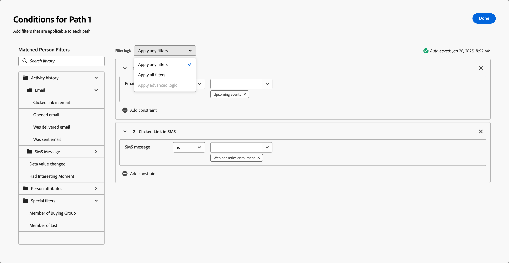

# Escuchar un evento

Agregue el nodo _Escuchar un evento_ para mover la audiencia al siguiente paso en el recorrido de la cuenta cuando se produzca un evento.

{width=&quot;30&quot;, vertical-align=&quot;middle&quot;} [Vea el vídeo de información general](#overview-video)

>[!NOTE]
>
>No puede agregar este tipo de nodo en la ruta dividida por personas.

## Eventos de cuenta

Escuche un evento basado en la cuenta cuando desee mover la cuenta hacia adelante en el recorrido según los eventos activados por la actividad de la cuenta.

### Eventos y restricciones

| Evento | Restricciones |
| ----- | ----------- |
| [!UICONTROL La cuenta tuvo un momento interesante] | Escriba (correo electrónico, hito o web) restricciones adicionales (opcionales): <li>Descripción</li><li>Origen</li><li>Fecha de la actividad</li>  Tiempo de espera (opcional) |
| [!UICONTROL Cambio en el valor de datos de la cuenta] | Atributo Restricciones adicionales (opcional): <li>Nuevo valor</li><li>Valor anterior</li><li>Fecha de la actividad</li>  Tiempo de espera (opcional) |
| [!UICONTROL Cambio en la fase de grupo de compra] | Interés en la solución Restricciones adicionales (opcional): <li>Nueva fase</li><li>Fase anterior</li><li>Fecha de la actividad</li>Tiempo de espera de   (opcional) |
| [!UICONTROL Cambio en el estado del grupo de compra] | Interés en la solución Restricciones adicionales (opcional): <li>Nuevo estado</li><li>Estado anterior</li><li>Fecha de la actividad</li>Tiempo de espera de   (opcional) |
| [!UICONTROL Cambio en la puntuación de integridad] | Interés en la solución Restricciones adicionales (opcional): <li>Nuevo puntaje</li><li>Puntuación anterior</li><li>Fecha de la actividad</li>Tiempo de espera de   (opcional) |
| [!UICONTROL Cambio en la puntuación de participación] | Interés en la solución Restricciones adicionales (opcional): <li>Nuevo puntaje</li><li>Puntuación anterior</li><li>Fecha de la actividad</li>Tiempo de espera de   (opcional) |

### Agregar un evento de cuenta

1. Vaya al mapa del recorrido.

1. Haga clic en el icono de signo más (**+** ) en una ruta y elija **[!UICONTROL Escuchar un evento]**.

1. En las propiedades del nodo de la derecha, elija **[!UICONTROL Cuentas]** para el tipo de evento.

   {width="700" zoomable="yes"}

1. Seleccione un evento de la lista.

1. Haga clic en **[!UICONTROL Editar evento]** y defina los detalles del evento.

## Eventos de personas

Escuche un evento basado en personas cuando desee mover la cuenta hacia adelante en el recorrido según los eventos activados por la actividad de personas. También puede filtrar eventos según los atributos de las personas,

### Eventos y restricciones

| Tipo de entrada | Evento | Restricciones |
| ---------- | ----- | ----------- |
| Edición B2B de Journey Optimizer | [!UICONTROL Asignado a grupo comprador] | Interés en la solución  Restricciones adicionales (opcional): <li>Función</li><li>Fecha de la actividad</li> Tiempo de espera (opcional) |
| | [!UICONTROL Clics en el vínculo del correo electrónico] | Correo electrónico  Restricciones adicionales (opcional): <li>Vínculo</li><li>Identificación del vínculo</li><li>Es un dispositivo móvil</li><li>Device</li><li>Plataforma</li><li>Explorador</li><li>Es contenido predictivo</li><li>Es actividad del bot</li><li>Patrón de actividad de bot</li><li>Explorador</li><li>Fecha de la actividad</li><li>Mín. número de veces</li> Tiempo de espera (opcional) |
| | [!UICONTROL Clics en el vínculo de SMS] | Correo electrónico  Restricciones adicionales (opcional): <li>Vínculo</li><li>Device</li><li>Plataforma</li><li>Fecha de la actividad</li><li>Mín. número de veces</li> Tiempo de espera (opcional) |
| | [!UICONTROL Cambios en el valor de los datos] | Atributo de persona  Restricciones adicionales (opcional): <li>Nuevo valor</li><li>Valor anterior</li><li>Razón</li><li>Origen</li><li>Fecha de la actividad</li><li>Mín. número de veces</li> Tiempo de espera (opcional) |
| | [!UICONTROL Abre el correo electrónico] | Correo electrónico  Restricciones adicionales (opcional): <li>Vínculo</li><li>Identificación del vínculo</li><li>Es un dispositivo móvil</li><li>Device</li><li>Plataforma</li><li>Explorador</li><li>Es contenido predictivo</li><li>Es actividad del bot</li><li>Patrón de actividad de bot</li><li>Explorador</li><li>Fecha de la actividad</li><li>Mín. número de veces</li> Tiempo de espera (opcional) |
| | [!UICONTROL Eliminado del grupo de compra] | Interés de la solución Fecha de la actividad (opcional) Tiempo de espera (opcional) |
| | [!UICONTROL La puntuación ha cambiado] | Nombre de puntuación  Restricciones adicionales (opcional):<li>Cambiar</li><li>Nuevo puntaje</li><li>Urgencia</li><li>Prioridad</li><li>Puntaje relativo</li><li>Urgencia relativa</li><li>Fecha de la actividad</li><li>Mín. número de veces</li> Tiempo de espera (opcional) |
| | [!UICONTROL Devoluciones de SMS] | Mensaje SMS  Restricciones adicionales (opcional): <li>Fecha de la actividad</li><li>Número mínimo de veces</li> Tiempo de espera (opcional) |
| Marketo Engage | [!UICONTROL Visita la página web] | Página web   Seleccione una o más páginas de Marketo Engage para que coincidan.   Restricciones adicionales (opcional): <li>Querystring</li><li>Dirección IP del cliente</li><li>Referente</li><li>Agente de usuario</li><li>Motor de búsqueda</li><li>Consulta de búsqueda</li><li>Token</li><li>Explorador</li><li>Plataforma</li><li>Device</li><li>Fecha de la actividad</li> |
| | [!UICONTROL Rellena el formulario] | Formulario  : seleccione uno o varios formularios de Marketo Engage para que coincidan.   Restricciones adicionales (opcional): <li>Fecha de la actividad</li><li>Querystring</li><li>Dirección IP del cliente</li><li>Referente</li><li>Agente de usuario</li><li>Plataforma</li><li>Device</li> Tiempo de espera (opcional) |
| Adobe Experience Platform | [!UICONTROL Definición de evento] | Tipo de evento   Restricciones adicionales (opcional): <li>Campos</li>  Restricciones adicionales (no admitidas): <li>Fecha de la actividad</li><li>Mín. número de veces</li>Tiempo de espera de   (opcional) |

### Filtros de eventos de personas

| Filtros | Descripción |
| ------------ | ----------- |
| [!UICONTROL Historial de actividades] > [!UICONTROL Correo electrónico] | Actividades de correo electrónico basadas en condiciones que se evalúan utilizando uno o más mensajes de correo electrónico seleccionados de anteriormente en el recorrido: <li>[!UICONTROL Se hizo clic en el vínculo del correo electrónico] <li>Correo electrónico abierto <li>Se envió por correo electrónico <li>Se envió el correo electrónico <!--  **[!UICONTROL Switch to inactivity filter]** - Use this option to filter based on lack of activity (a person did not have the email activity).--> |
| [!UICONTROL Historial de actividades] > [!UICONTROL Mensaje SMS] | Actividades de SMS basadas en condiciones que se evalúan utilizando uno o más mensajes SMS seleccionados de anteriormente en el recorrido: <li>[!UICONTROL Se hizo clic en un vínculo en SMS] <li>[!UICONTROL SMS devuelto] <!--   **[!UICONTROL Switch to inactivity filter]** - Use this option to filter based on lack of activity (a person did not have the SMS activity). --> |
| [!UICONTROL Historial de actividades] > [!UICONTROL Se ha cambiado el valor de los datos] | Se ha producido un cambio de valor en un atributo de persona seleccionado. Estos tipos de cambio incluyen: <li>Nuevo valor<li>Valor anterior<li>Razón<li>Origen<li>Fecha de la actividad<li>Mín. número de veces <!--   **[!UICONTROL Switch to inactivity filter]** - Use this option to filter based on lack of activity (a person did not have a data value change). --> |
| [!UICONTROL Historial de actividades] > [!UICONTROL Ha tenido un momento interesante] | Actividad de momento interesante que se define en la instancia de Marketo Engage asociada. Las restricciones incluyen: <li>Hito<li>Correo electrónico<li>Web <!--  **[!UICONTROL Switch to inactivity filter]** - Use this option to filter based on lack of activity (a person did not have an interesting moment).--> |
| [!UICONTROL Historial de actividades] > [!UICONTROL Página web visitada] | Actividad de página web que se utiliza para una o varias páginas web administradas por la instancia de Marketo Engage asociada. Las restricciones incluyen: <li>Página web (obligatorio)<li>Fecha de la actividad<li>Dirección IP del cliente <li>Querystring <li>Referente <li>Agente de usuario <li>Motor de búsqueda <li>Consulta de búsqueda <li>URL personalizada <li>Token <li>Explorador <li>Plataforma <li>Device <li>Mín. número de veces <!--  **[!UICONTROL Switch to inactivity filter]** - Use this option to filter based on lack of activity (a person did not visit the web page). --> |
| [!UICONTROL Atributos de persona] | Atributos del perfil de la persona, incluidos: <li>Ciudad <li>País <li>Fecha de nacimiento <li>Dirección de correo electrónico <li>Email no válido <li>Email suspendido <li>Nombre <li>Región del estado inferida<li>Cargo <li>Apellido <li>Número de teléfono móvil <li>Puntuación de participación de persona <li>Número de teléfono <li>Código postal <li>Estado <li>Suscripción cancelada <li>Razón de la cancelación de la suscripción |
| [!UICONTROL Filtros especiales] > [!UICONTROL Miembro del grupo comprador] | La persona es o no un miembro del grupo comprador evaluado según uno o más de los siguientes criterios: <li>Interés de solución</li><li>Estado del grupo de compra</li><li>Puntuación de integridad</li><li>Puntaje de participación</li><li>Función</li> |
| [!UICONTROL Filtros especiales] > [!UICONTROL Miembro de la lista] | La persona es o no es miembro de una o más listas de Marketo Engage. |
| [!UICONTROL Filtros especiales] > [!UICONTROL Miembro del programa] | La persona es o no es miembro de uno o más programas de Marketo Engage. |

### Añadir un evento de personas

1. Vaya al mapa del recorrido.

1. Haga clic en el icono de signo más (**+** ) en una ruta y elija **[!UICONTROL Escuchar un evento]**.

1. En las propiedades del nodo a la derecha, elija **[!UICONTROL Personas]** para el tipo de evento.

   {width="700" zoomable="yes"}

1. Seleccione un evento de la lista.

1. Haga clic en **[!UICONTROL Editar evento]** y defina los detalles del evento.

### Escuchar un evento de Marketo Engage

Si tiene páginas web en la instancia de Marketo Engage conectada, puede almacenar en déclencheur un evento basado en una visita o no visita a estas páginas web, así como formularios de Marketo Engage que se rellenaron o no.

1. Seleccione un nodo **[!UICONTROL Listen for an event]** del mapa de recorrido.

1. En las propiedades del nodo a la derecha, elija **[!UICONTROL Personas]** para el tipo de evento.

1. Haga clic en la flecha del selector **[!UICONTROL Seleccionar evento de personas]** y desplace el menú a la sección **[!UICONTROL Marketo Engage]**.

1. Seleccione un tipo de actividad de participación en el mercado:

   * **[!UICONTROL Visita La Página Web]**.
   * **[!UICONTROL Rellena El Formulario]**

   {width="700" zoomable="yes"}

1. Haga clic en **[!UICONTROL Editar evento]** y defina una o más páginas web para que coincidan y cualquier restricción adicional para el evento.

   * (Obligatorio) En el cuadro de diálogo _[!UICONTROL Editar evento]_, defina la restricción **[!UICONTROL Página web]** o **[!UICONTROL Rellena el formulario]**. Use **[!UICONTROL is]** (predeterminado) para hacer coincidir una o más páginas o formularios seleccionados. Use **[!UICONTROL no es]** para hacer coincidir en todas las visitas/formularios de página con la exclusión de una o más páginas/formularios seleccionados. O bien, use el operador **[!UICONTROL is any]** para que coincida en cualquier visita a una página web de Marketo Engage o formulario rellenado.

   * (Opcional) Haga clic en **[!UICONTROL Agregar restricción]** y elija el campo que desea utilizar para la restricción. Establezca el operador y el valor del campo.

     {width="700" zoomable="yes"}

     Puede repetir esta acción para incluir restricciones de campo adicionales según sea necesario.

   * Si es necesario, seleccione la ficha **[!UICONTROL Filtros]** para [agregar filtros para el evento](#add-a-filter-to-the-people-event).

   * Cuando se definan las restricciones y los filtros, haga clic en **[!UICONTROL Listo]**.

1. Si es necesario, establezca la opción **[!UICONTROL Tiempo de espera]** para limitar el período de tiempo para escuchar el evento (consulte [Agregar un tiempo de espera a un nodo de evento](#add-a-timeout-to-an-event-node)).

1. En el mapa de recorrido, añada el siguiente nodo que se ejecutará cuando se produzca el evento.

### Escuchar un evento de experiencia

Los administradores pueden seleccionar [Eventos de experiencia de Adobe Experience Platform (AEP)](https://experienceleague.adobe.com/es/docs/experience-platform/xdm/classes/experienceevent){target="_blank"}, que permiten a los especialistas en marketing crear recorridos que reaccionen a los eventos en tiempo casi real. El uso de eventos de experiencia en recorrido es un proceso de dos pasos:

1. Un administrador [selecciona los tipos de eventos y los campos de interés](../admin/configure-aep-events.md#select-an-event) para que estén disponibles en los recorridos.

2. En un recorrido, agrega un nodo _Escuchar un evento_ y selecciona un tipo de evento de Experience Platform para un evento basado en personas.

<!--
{width="30", vertical-align="middle"} [Watch the video overview](../admin/configure-aep-events.md#overview-video) -->

_Para incluir un evento de experiencia en el recorrido :_

1. Seleccione un nodo **[!UICONTROL Listen for an event]** del mapa de recorrido.

1. En las propiedades del nodo a la derecha, elija **[!UICONTROL Personas]** para el tipo de evento.

1. Haga clic en la flecha del selector **[!UICONTROL Seleccionar evento de personas]** y desplace el menú a la sección **[!UICONTROL Adobe Experience Platform]**.

   {width="700" zoomable="yes"}

1. Seleccione el evento.

   El tipo de evento se muestra vacío en los detalles del nodo.

   {width="400" zoomable="yes"}

1. Haga clic en **[!UICONTROL Editar evento]** y defina una o más restricciones para el evento.

   Las restricciones disponibles se definen como campos administrados para la configuración del evento.

   * Haga clic en **[!UICONTROL Agregar restricción]** y elija el campo que desee utilizar para la restricción.

   * Complete la condición de la restricción.

     Puede usar el operador predeterminado **[!UICONTROL is]** para que coincida con uno o más valores de campo. O puede usar el operador **[!UICONTROL is not]** para que coincida en todos los valores con la exclusión de uno o más valores especificados.

     {width="700" zoomable="yes"}

   * Si es necesario, seleccione la ficha **[!UICONTROL Filtros]** para [agregar filtros para el evento](#add-a-filter-to-the-people-event).

   * (Opcional) Haga clic en **[!UICONTROL Agregar restricción]** y repita estos pasos para incluir restricciones de campo adicionales según sea necesario.

   * Cuando se definan las restricciones y los filtros, haga clic en **[!UICONTROL Listo]**.

1. Si es necesario, establezca la opción **[!UICONTROL Tiempo de espera]** para limitar el período de tiempo para escuchar el evento (consulte [Agregar un tiempo de espera a un nodo de evento](#add-a-timeout-to-an-event-node)).

1. En el mapa de recorrido, añada el siguiente nodo que se ejecutará cuando se produzca el evento.

1. Complete los nodos restantes del recorrido y [publíquelo](./journey-overview.md).

   Cuando el recorrido está activo (publicado) y llega al nodo _Escuchar un evento_, comienza a escuchar eventos de experiencia de AEP.

### Añadir filtros al evento de personas

1. Después de definir el evento, seleccione la ficha **[!UICONTROL Filtros]** en el cuadro de diálogo _[!UICONTROL Editar evento]_.

   {width="700" zoomable="yes"}

1. Añada uno o más filtros para dirigirse a las personas del evento.

   * Arrastre y suelte cualquiera de los [filtros de personas](#people-event-filters) de la navegación izquierda y complete la definición de la coincidencia.

     >[!NOTE]
     >
     >Si tiene campos de persona personalizados definidos en el esquema de audiencia de cuenta en Experience Platform, estos campos también están disponibles en **[!UICONTROL Atributos]** para usarlos como atributos de persona en los filtros.

   * Ajuste el filtro aplicando la **[!UICONTROL lógica de filtro]** en la parte superior. Puede elegir hacer coincidir todos los filtros o cualquier filtro.

     {width="700" zoomable="yes"}

   * Haga clic en **[!UICONTROL Finalizado]**.

## Añadir un tiempo de espera a un nodo de evento

Si es necesario, defina la cantidad de tiempo que el recorrido espera el evento. El recorrido finaliza después de un tiempo de espera a menos que defina una ruta de tiempo de espera, donde puede agregar otros nodos.

1. Habilite la opción **[!UICONTROL Tiempo de espera]**.

1. Seleccione el periodo de tiempo durante el cual el recorrido espera a que se produzca un evento antes de que se agote el tiempo de espera.

   Puede optar por finalizar la ruta aquí o realizar una acción diferente estableciendo otra ruta.

1. Para crear una nueva ruta en el recorrido donde se puedan agregar acciones y eventos aplicables a las cuentas cuando no se produzca el evento, active la casilla de verificación **[!UICONTROL Establecer ruta de tiempo de espera]**.

   {width="700" zoomable="yes"}

<!-- ## Overview video

>[!VIDEO](https://video.tv.adobe.com/v/3443237/?captions=spa&learn=on) -->
