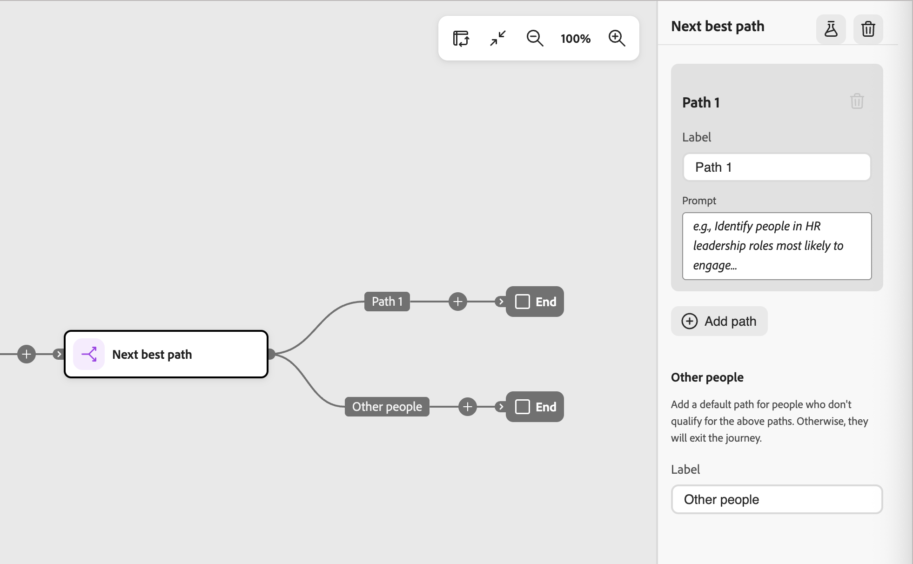

# Siguiente nodo de mejor ruta

El nodo _Siguiente mejor ruta_ incorpora la toma de decisiones de ruta dividida impulsada por IA directamente en el lienzo de recorrido. En lugar de configurar las condiciones de filtro en un nodo [rutas divididas](./split-merge-paths-nodes.md), describirá la intención en lenguaje natural y permitirá que el sistema determine la ruta más relevante para cada persona.

>[!NOTE]
>
>Los nodos de ruta recomendada siguientes solo están disponibles en recorridos de persona. No son compatibles con los recorridos de cuenta.

En las compras B2B, un perfil puede parecer un tipo de comprador, pero su comportamiento, los datos firmográficos y el contexto de participación revelan una historia con más matices. El siguiente nodo de mejor ruta evalúa ese contexto para tomar una decisión de enrutamiento inteligente, al tiempo que le permite revisar, modificar o anular cualquier recomendación de IA antes de activar el recorrido.

La inteligencia artificial evalúa a cada persona según sus indicadores de ruta definidos mediante una combinación de entradas:

* **Historial de participación**: aperturas de correo electrónico, clics en vínculos, visitas a páginas web y otras señales de comportamiento de los recorridos actuales y anteriores
* **Señales en tiempo real**: eventos de alta intención, como rellenos de formularios y visitas a la página de precios
* **Atributos de perfil** - Datos demográficos, de puesto, personales y firmográficos
* **Atributos de cuenta**: datos firmográficos y tecnológicos asociados con la cuenta de la persona

Cuando una persona llega al nodo, el sistema obtiene el contexto de perfil, aplica restricciones y utiliza un LLM para seleccionar la ruta que mejor se ajuste. Cada decisión se registra con una puntuación de confianza y un razonamiento en lenguaje natural para la transparencia y la observabilidad.

Si ninguna ruta es una coincidencia sólida o si el mensaje hace referencia a datos no disponibles para un perfil, la persona se enruta a la ruta de reserva predeterminada.

## Añadir un siguiente nodo de mejor ruta {#add-next-best-path-node}

1. Abra el recorrido de persona y vaya al mapa del recorrido.

1. Haga clic en el icono de signo más ( **+** ) en una ruta y elija **[!UICONTROL Siguiente mejor ruta]**.

   {width="350" zoomable="no"}

   El nodo se añade al lienzo y el panel de configuración de la división AI se muestra a la derecha. Comienza con una ruta y una ruta predeterminada _Otras personas_ para dirigir a las personas que no cumplen los requisitos para ninguna de las rutas definidas.

   {width="500"}

## Configuración de rutas {#configure-paths}

Para cada ruta, defina un nombre y una petición de datos en lenguaje natural que describa a quién se debe dirigir allí. La entrada del mensaje reemplaza por completo la interfaz de usuario de la condición de filtro; no hay condiciones de atributo que configurar.

1. Haga clic en **[!UICONTROL Agregar ruta]** para cada ruta adicional que desee incluir para el nodo.

   Para quitar una ruta, haga clic en el icono _Eliminar_ (  ) de la tarjeta de ruta.

1. Para cada tarjeta de ruta del panel derecho:

   * Escriba una **[!UICONTROL Etiqueta]** que refleje la audiencia o la intención de ese segmento.

   * Escriba un **[!UICONTROL indicador]** en lenguaje natural que describa quién pertenece a esta ruta. Céntrese en la intención y el resultado, no en los valores de atributo específicos.

     <!-- To get prompt ideas, click **[!UICONTROL Suggest prompts]**. The system provides several example prompts tailored to the path context that you can use as-is or adapt. -->

     {width="500"}

     **El ejemplo solicita una división de tres rutas:**

      * _Ruta 1 - Líderes de RRHH :_Identifique a las personas en roles de liderazgo de RRHH que tienen más probabilidades de involucrarse con la administración de talentos y el contenido de experiencia del empleado.
      * _Ruta 2 - Evaluadores técnicos :_: identifique las partes interesadas técnicas que tienen más probabilidades de interactuar con la arquitectura del producto, las integraciones y el contenido de implementación.
      * _Ruta 3 - Tomadores de decisiones empresariales :_Identifique a las partes interesadas empresariales que tienen más probabilidades de interactuar con el retorno de la inversión, los resultados empresariales y el contenido de los estudios de casos.

1. Si es necesario, reordene las rutas para establecer el orden de prioridad de las coincidencias.

   El filtrado de rutas se evalúa en orden descendente. Cada persona continúa por el primer camino que coincida.

   Haga clic en las flechas arriba y abajo en la parte superior derecha de cada tarjeta de ruta para moverla hacia arriba o hacia abajo en la lista de rutas.

   {width="500"}

1. Revise la ruta predeterminada (la última de la lista de rutas) y cambie la etiqueta si es necesario.

   La ruta predeterminada se utiliza cuando la IA no puede asignar una persona con seguridad a ninguna ruta definida o cuando los datos relevantes no están disponibles. Cuando una solicitud hace referencia a datos que no existen en el conjunto de datos para un perfil determinado, el sistema enruta ese perfil a la ruta predeterminada e indica el intervalo de datos.

### Controles &quot;humanos en el bucle&quot; {#human-in-the-loop}

Las recomendaciones de IA no son vinculantes. Antes de activar el recorrido, puede:

* Edite cualquier petición de ruta para restringir la lógica de enrutamiento.
* Agregar, quitar o reordenar rutas.
* Anule las sugerencias de IA con condiciones personalizadas según sea necesario.

Las asignaciones de rutas controladas por IA no surtirán efecto hasta que publique el recorrido.

## Solicitar ejemplos por caso de uso {#examples}

Los siguientes ejemplos muestran cómo escribir indicadores de ruta efectivos en casos de uso comunes de marketing B2B. Utilícelos como punto de partida y adapte el idioma para que coincida con el contexto de recorrido y los datos de audiencia.

### Señales activas de investigación y compra {#active-research}

+++Ruta 1 - Investigadores activos de productos

_Identifique a las personas que investigan activamente el software CRM. Busque visitas repetidas a la página del producto, participación con contenido de comparación, visitas frecuentes de retorno y señales de intención de terceros elevadas durante los últimos 30 días._

+++

+++Ruta 2 - Comportamiento de comparación de precios

_Identifique a los usuarios que hayan visto páginas de comparación de precios o planes varias veces en los últimos 14 días, especialmente a los que alternan entre páginas de precios y de documentación de características._

+++

+++Ruta 3: alta intención, sin conversión

_Identifique a los visitantes con intenciones altas que hayan participado en demostraciones de productos, páginas de precios o documentación de integración en los últimos 21 días, pero que no hayan enviado un formulario ni se hayan convertido._

+++

+++Ruta 4: Comportamiento de cierre de compra dudoso

_Identifique a los usuarios que iniciaron flujos de reservas de cierre de compra o de demostración, pero no los completaron y que regresaron al menos una vez después sin realizar la conversión._

+++

### Riesgo de pérdida y retención {#churn-retention}

+++Ruta 1 - Señales de riesgo de pérdida

_Identifique a los clientes que muestran signos de pérdida en función del menor uso del producto, la menor frecuencia de inicio de sesión, los picos en los tickets de asistencia y la disminución de la participación de marketing en los últimos 60 días._

+++

+++Ruta 2: Separación de usuarios avanzados

_Identifique a los usuarios comprometidos anteriormente cuya velocidad de interacción ha disminuido significativamente en los últimos 30 días en comparación con su línea de base histórica._

+++

### Educación a las brechas de evaluación {#education-evaluation}

+++Ruta 1: Investigación de la secuencia de precios

_Identifique a los usuarios que descargaron un libro electrónico y luego visitaron la página de precios en un plazo de 7 días, pero que no solicitaron una demostración._

+++

+++Ruta 2 - Seminario web sin seguimiento

_Identifique a las personas que asistieron a un seminario web y posteriormente regresaron a las páginas de productos, pero nunca reservaron una demostración ni contactaron con las ventas._

+++

+++Ruta 3: Evaluación basada en comparación

_Identifique a los visitantes que vieron un artículo de comparación de competidores y luego visitaron la documentación de integración o migración en un plazo de 14 días._

+++

### Secuencias de participación de correo electrónico {#email-engagement}

+++Ruta 1: se abre sin clics

_Identifique a los posibles clientes que abrieron tres o más correos electrónicos de marketing en un plazo de 30 días pero que nunca hicieron clic en el sitio web._

+++

+++Ruta 2: se hizo clic pero sin participación más profunda

_Identifique a los usuarios que hicieron clic desde un correo electrónico hasta una página de producto, pero que no exploraron páginas adicionales ni regresaron en un plazo de 7 días._

+++

### Patrones de prueba y conversión {#trial-conversion}

+++Ruta 1 - Convertidores rápidos

_Identifique a los clientes que se actualizaron dentro de los 30 días posteriores al inicio de una prueba y que mostraron una alta participación en el producto durante el período de prueba._

+++

+++Ruta 2: Usuarios con prueba bloqueada

_Identifique a los usuarios de prueba que iniciaron sesión durante la primera semana pero mostraron una actividad mínima posteriormente y no se convirtieron antes de la caducidad de la prueba._

+++

### Compradores multicanal {#multi-channel}

+++Ruta 1 - Convergencia publicitaria y orgánica

_Identifique a los usuarios que primero se comprometieron a través de anuncios pagados y luego regresaron a través de canales directos u orgánicos en un plazo de 14 días._

+++

+++Ruta 2 - Evaluación del evento al producto

_Identifique las cuentas que participaron en un evento personal o virtual y que posteriormente aumentaron el comportamiento de la investigación de productos en un plazo de 30 días._

+++

+++Ruta 3 - Investigadores sociales a domicilio

_Identifique a los usuarios que interactuaron con el contenido social y que más tarde visitaron páginas de alta intención, como precios o reservas de demostración._

+++

### Señales de compra regionales {#regional-buying}

+++Ruta 1 - Marejada en una región específica

_Identifique cuentas en Norteamérica que muestren una mayor actividad de investigación de productos y señales de intención de terceros elevadas en los últimos 30 días en comparación con su línea de base histórica._

+++

+++Ruta 2 - Impulso de los mercados emergentes

_Identifique las cuentas en APAC donde la velocidad de participación haya aumentado significativamente en los últimos 14 días, incluso si el volumen de participación general sigue siendo moderado._

+++

+++Ruta 3 - Interés empresarial específico de la región

_Identifique las cuentas de tamaño empresarial en EMEA que se involucren con la documentación de cumplimiento, residencia de datos o seguridad en los últimos 21 días._

+++

+++Ruta 4 - Territorio subpenetrado

_Identificar cuentas de alta adecuación en territorios de ventas asignados que han mostrado señales de intención pero que las ventas aún no han contactado._

+++

### Señales de temporización de comportamiento {#behavioral-timing}

+++Ruta 1 - Investigadores fuera de horario

_Identifique a los usuarios que interactúan repetidamente con las páginas de productos y precios fuera del horario laboral normal en su huso horario local._

+++

+++Ruta 2 - Ventana de investigación comprimida

_Identifique las cuentas que muestren una densidad de participación inusualmente alta en un breve período de 72 horas en varias áreas de productos._

+++

+++Ruta 3: pico de actividad al final del trimestre

_Identificar cuentas con un aumento en la actividad de la fase de evaluación durante los últimos 30 días del trimestre fiscal._

+++

## Simular la toma de decisiones antes de publicar {#simulate}

Utilice la simulación para probar cómo la IA evalúa los indicadores con respecto a una audiencia real antes de que el recorrido se active. Solo está disponible mientras el recorrido esté en estado _Borrador_ y no tiene efecto en ningún recorrido publicado. Utilícela para validar la lógica de enrutamiento y generar confianza en las recomendaciones de IA.

### Ejecución de una simulación {#run-simulation}

1. Seleccione el siguiente nodo de mejor ruta y haga clic en el icono _Simular_ (  ) en la parte superior del panel derecho.

   {width="500"}

1. En el cuadro de diálogo, elija la audiencia que desea utilizar para la simulación:

   * **[!UICONTROL Listas de personas originales]**: use la audiencia del nodo de audiencia. Especifique un tamaño de muestra cuando la audiencia completa supere el umbral de simulación.
   * **[!UICONTROL Listas dinámicas y estáticas]** - Usar una lista estática o dinámica [!DNL Marketo Engage].
   * **[!UICONTROL Registros de pruebas]** - Usar perfiles de prueba sugeridos por IA.

   {width="300"}

   >[!NOTE]
   >
   >Si la audiencia seleccionada supera el umbral de simulación, el sistema ejecuta la simulación en una muestra de 100 perfiles. Un indicador en la IU muestra que los resultados se basan en muestras.
   >
   >Si la audiencia seleccionada aún no se ha materializado, la simulación se bloquea. Una advertencia en línea le indica que primero debe materializar la audiencia.

1. Haga clic en **[!UICONTROL Simular]**.

### Revisar resultados de simulación {#review-simulation-results}

Después de ejecutar la simulación, el panel derecho muestra cómo se distribuyeron los perfiles en cada ruta y el razonamiento de IA detrás de esas asignaciones:

| Resultado | Descripción |
| ------ | ----------- |
| **Perfiles** | El número de perfiles enrutados a la ruta. |
| **División** | El porcentaje de perfiles enrutados a la ruta. |
| **Confianza** | Nivel de confianza de IA para la asignación de ruta. La confianza refleja la actualización de los datos, la intensidad y la coherencia de la señal y el éxito histórico de patrones de enrutamiento similares. |
| **Mensaje** | El indicador que se evaluó para la ruta. |
| **Razonamiento de IA** | Una explicación en lenguaje natural de por qué los perfiles se asignaron colectivamente a esta ruta. |

{width="400"}

>[!NOTE]
>
>Cuando los datos disponibles o el alcance limitan una decisión, los resultados incluyen información sobre la limitación. Por ejemplo, cuando un atributo requerido no está presente en el conjunto de datos, los resultados incluyen un indicador explícito que explica cómo los datos que faltan afectaron a los resultados.

Utilice los resultados para restringir las peticiones de datos y confirmar que la ruta refleja el resultado deseado. Puede modificar los indicadores de ruta y volver a ejecutar la simulación tantas veces como sea necesario antes de publicar.

## Publicación y monitorización del recorrido {#publish-and-monitor}

Después de validar los resultados de la simulación:

1. Conecte la audiencia de personas al nodo de entrada de recorrido.

1. [Publicación del recorrido](./create-publish-journey.md#publish-a-journey).

Una vez que el recorrido está activo, el siguiente nodo de mejor ruta se ejecuta en el momento de la ejecución. A medida que cada persona llega al nodo, la IA los evalúa en tiempo real utilizando las señales más recientes y los enruta hacia la ruta más relevante.

Para un recorrido publicado, abra el mapa del recorrido y seleccione el siguiente nodo de mejor ruta para ver la sección **[!UICONTROL Resultados en directo]** en el panel derecho. Los resultados en directo muestran:

* La distribución porcentual de perfiles en cada ruta
* La puntuación de confianza para cada asignación de ruta
* Razonamiento a nivel de ruta y de perfil, con detalles ampliables para perfiles individuales

Los resultados en vivo también están disponibles en la consola de Recorrido y a través de la [habilidad de observación de Recorrido](../agents/journey-agent.md#journey-observability-skill) en el centro de IA.
