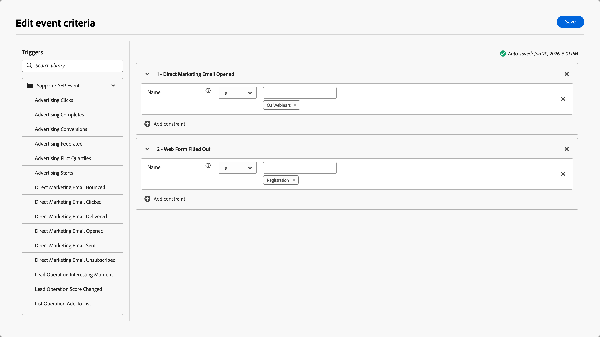

# Nodos del recorrido de audiencia de persona

El nodo _audiencia de persona_ especifica qué perfiles de persona entran en el recorrido. Cuando [crea un recorrido de persona](./create-publish-journey.md#create-a-journey), el recorrido siempre comienza con un nodo de audiencia de persona que define su entrada. El nodo de audiencia de persona puede tener uno de estos dos tipos de entrada de audiencia: segmentos CDP o suscripción basada en eventos. Las definiciones de audiencia basadas en segmentos y eventos no se pueden combinar.

Utilice una de las siguientes opciones de entrada para el nodo del recorrido de audiencia de persona:

* **Audiencia de perfil**: use las audiencias de segmento definidas en una CDP. Todos los perfiles aptos para la audiencia se añaden como miembros al recorrido. Los perfiles recién calificados para el segmento se agregan al recorrido durante las tareas diarias de [ingesta de perfiles](#profile-ingestion). Si un perfil ya no cumple los requisitos para el segmento, **_no_** se eliminará del recorrido.

* **Audiencia de eventos** - Use eventos calificadores para definir la audiencia. Estos eventos se definen en la configuración del nodo y deben usar [eventos XDM configurados en la configuración de administración](../admin/configure-aep-events.md). Se admiten hasta 10 eventos para la pertenencia a audiencias basadas en eventos. Un perfil se califica inmediatamente para el recorrido después del primer evento coincidente que toma su perfil.

  >[!NOTE]
  >
  >Los eventos no se pueden combinar con atributos de perfil para reducir las definiciones de audiencia. Se han planificado mejoras para resolver esta limitación en futuras versiones.

## Ingesta de perfil

En Journey Optimizer B2B edition, una tarea de ingesta de audiencia nocturna mantiene los perfiles sincronizados con Experience Platform. Aunque los recorridos de persona basados en eventos pueden calificar perfiles que no forman parte de un perfil o audiencia de cuenta que Journey Optimizer B2B edition incorpora o utiliza, el resultado es que los perfiles incorporados permanecen obsoletos a menos que formen parte de una audiencia que utiliza un recorrido de persona, un recorrido de cuenta o un grupo comprador. Si se incorpora un perfil y se añade posteriormente a una audiencia, se realiza la unión de perfiles y el perfil permanece sincronizado con Experience Platform. Se han planificado mejoras en esta sincronización de datos de perfil para futuras versiones.

Es posible que un perfil recién creado que ha introducido un recorrido de persona basado en eventos no tenga la información de perfil actualizada en el momento de la ingesta. Por ejemplo, si se crea un perfil a través de un evento de rellenado de formulario y un recorrido de personas lo ingiere desde el evento de rellenado de formulario correspondiente, es posible que los datos enviados en el formulario aún no se sincronicen con el perfil cuando el recorrido los ingirió. El resultado podría ser datos incompletos para la personalización (como en el contenido del correo electrónico). Se han planificado mejoras en esta sincronización de datos de evento de perfil para futuras versiones.

Los recorridos de persona basados en eventos pueden calificar perfiles que siguen siendo anónimos/sin direcciones de correo electrónico y que solo contienen ECID. Sucede normalmente cuando tiene lógica de calificación para la actividad de la página web. Una lógica de audiencia basada en eventos demasiado amplia podría provocar que la instancia alcance el límite de 40 millones de perfiles si se clasifican demasiados perfiles. Limite el posible ámbito de la audiencia para evitar este escenario.

>[!IMPORTANT]
>
>Durante el programa beta actual, el uso ideal de los recorridos de persona es clasificar solo los perfiles a los que también está dirigiendo en los recorridos de cuenta y en las definiciones de grupos de compra. Este uso garantiza un perfil completo que permanece sincronizado con Experience Platform.

## Definición de la audiencia para el nodo de audiencia de la persona

1. Haga clic en el nodo **[!UICONTROL Audiencia de personas]**.

   Esta acción muestra las propiedades del nodo a la derecha.

   {width="700" zoomable="yes"}

1. Elija el tipo de entrada para las personas que entran en el recorrido:

   * **[!UICONTROL Audiencia de perfil]**

     Elija la opción _[!UICONTROL Audiencia de perfil]_. A continuación, haga clic en **[!UICONTROL Agregar audiencia de perfil]**.

     En el cuadro de diálogo _[!UICONTROL Agregar audiencia]_, seleccione un segmento de audiencia creado anteriormente. A continuación, haga clic en **[!UICONTROL Agregar audiencia]**.

     {width="700" zoomable="yes"}

   * **[!UICONTROL Audiencia de eventos]**

     Elija la opción _[!UICONTROL Audiencia de eventos]_. A continuación, haga clic en **[!UICONTROL Agregar criterios de evento]**.

     En el cuadro de diálogo _[!UICONTROL Editar criterios de evento]_, agregue uno o más eventos que desee usar para la calificación de miembros de audiencia. Para cada evento que agregue, haga clic en **[!UICONTROL Agregar restricción]** para elegir un atributo de evento para una coincidencia. Establezca la evaluación que desee utilizar para una coincidencia. Puede añadir varias restricciones para que coincidan con el evento.

     {width="700" zoomable="yes"}

     Cuando se definan los criterios del evento, haga clic en **[!UICONTROL Guardar]**.

     Para obtener más información acerca de la configuración de los eventos compatibles con el recorrido, consulte [Administrar eventos de experiencia](../admin/configure-aep-events.md#manage-experience-events).
