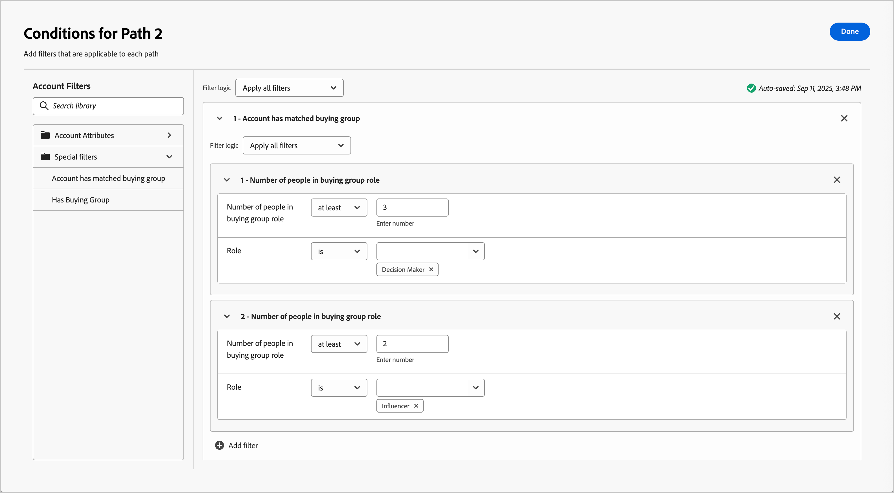

# Dividir y combinar rutas

Utilice los nodos de ruta divididos y combinados para segmentar personas o cuentas según las condiciones que defina. Cree rutas para la audiencia o la lista de cuentas según las condiciones, defina cada ruta con nodos de acción y evento para el segmento y, a continuación, combine las rutas y continúe con el recorrido.

{width="30"} [Vea el vídeo de información general](#overview-video)

Un nodo _Split paths_ define una o más rutas segmentadas en función de la cuenta de **_o bien_** o de los filtros de personas. Una división basada en un filtro de personas se cierra automáticamente con un nodo de rutas de combinación para que todas las personas puedan pasar al siguiente paso sin perder el contexto de su cuenta.

>[!NOTE]
>
>Se admite un máximo de 25 rutas.

## Dividir rutas por cuentas

(Solo recorridos de cuenta)

Dividir por rutas de cuentas puede incluir acciones y eventos de cuenta y personas. Estas rutas se pueden dividir más.

_&#x200B;**Funcionamiento de un nodo de ruta dividida por cuentas**&#x200B;_

* Cada ruta que agregue incluirá un nodo final con la capacidad de agregar nodos a cada borde.
* Dividir por nodos de cuenta se puede anidar (puede dividir la ruta por cuentas repetidamente).
* La evaluación de cada ruta es de arriba abajo. Si una cuenta coincide para la primera y la segunda ruta, solo continúa en la primera ruta.
* Se pueden combinar dos o más rutas mediante un nodo de combinación.
* El nodo admite la definición de una ruta de acceso de _[!UICONTROL Otras cuentas]_, donde puede agregar acciones o eventos para cuentas que no coincidan con uno de los segmentos o rutas definidos.

{width="700" zoomable="yes"}

### Condiciones de ruta de cuenta

| Condiciones de ruta | Descripción |
| --------------- | ----------- |
| Atributos de la cuenta | Atributos del perfil de cuenta, incluidos: <li>Ingresos anuales <li>Ciudad <li>País <li>Cantidad de empleados <li>Industria <li>Nombre <li>Código SIC <li>Estado <li>Tiene `<relational schema>` (consulte [Filtrado de datos personalizados](#custom-data-filtering)) |
| [!UICONTROL Filtros especiales] > [!UICONTROL La cuenta ha coincidido con el grupo comprador] | La cuenta coincide con uno o más grupos compradores. Se puede evaluar con una o más de las siguientes restricciones para un grupo comprador coincidente: <li>Interés de solución <li>Fase de grupo de compra <li>Estado del grupo de compra <li>Puntaje de participación <li>Puntuación de integridad <li> Número de personas en la función de grupo de compras |
| [!UICONTROL Filtros especiales] > [!UICONTROL Tiene grupo de compra] | La cuenta tiene o no miembros de grupos compradores. También puede evaluarse con uno o más de los siguientes criterios: <li>Interés de solución <li>Fase de grupo de compra <li>Estado del grupo de compra <li>Puntaje de participación <li>Puntuación de integridad |

>[!NOTE]
>
>El filtro _[!UICONTROL Tiene un grupo de compra]_ está marcado para una futura obsolescencia. Para nuevos recorridos, usa el filtro _[!UICONTROL La cuenta ha encontrado coincidencias con el grupo de compras]_, que incluye todas las mismas restricciones.

### Adición de una ruta dividida por nodo de cuenta

1. Vaya al mapa del recorrido.

1. Haga clic en el icono de signo más ( **+** ) en una ruta y elija **[!UICONTROL Dividir rutas]**.

   {width="300" zoomable="no"}

1. En las propiedades del nodo a la derecha, elija **[!UICONTROL Cuentas]** para la división.

1. Para definir una condición aplicable a _[!UICONTROL Ruta 1]_, haga clic en **[!UICONTROL Aplicar condición]**.

   {width="500" zoomable="yes"}

1. En el editor de condiciones, añada uno o más filtros para definir la ruta dividida.

   * Arrastre y suelte los atributos de filtro desde la navegación izquierda y complete la definición de la coincidencia.

   * Ajuste las condiciones aplicando la **[!UICONTROL lógica de filtro]** en la parte superior. Puede elegir hacer coincidir todos los filtros o cualquier filtro.

     {width="700" zoomable="yes"}

   * Haga clic en **[!UICONTROL Finalizado]**.

1. Para agregar más rutas, haga clic en **[!UICONTROL Agregar ruta]** y repita los pasos anteriores para agregar las condiciones aplicables a esta ruta.

   También puede etiquetar cada ruta en función de estas condiciones o utilizar las etiquetas predeterminadas.

1. Si es necesario, reordene las rutas según la prioridad que desee para la división.

   El filtrado de rutas se evalúa en orden descendente. Cada cuenta procede por la primera ruta que coincida.

   Haga clic en las flechas arriba y abajo en la parte superior derecha de cada tarjeta de ruta para moverla hacia arriba o hacia abajo en la lista de rutas.

   {width="500" zoomable="yes"}

1. Habilite la opción **[!UICONTROL Otras cuentas]** para definir la ruta predeterminada de las cuentas que no coinciden con los segmentos o rutas definidos.

   Cuando esta opción no está habilitada, el recorrido finaliza para las cuentas que no coinciden con un segmento o ruta definida dentro de la división.

### Filtrado de grupos de compra para cuentas {#buying-group-filtering-accounts}

Puede definir una ruta para las cuentas asociadas con grupos de compra y filtrar la ruta según los criterios de grupo de compra. Use el filtro **[!UICONTROL La cuenta ha coincidido con el grupo de compra]** para definir el segmento de ruta de acceso usando un grupo de compra coincidente. Este filtro también incluye esa opción para identificar las cuentas en función del número de funciones asignadas dentro de un grupo comprador coincidente.

Por ejemplo, es posible que desee evaluar la preparación del grupo de compra en función de la profundidad (número de personas) que tiene en diferentes funciones, como tres responsables de la toma de decisiones y dos influyentes. En este caso, establezca la condición en cuentas de destino con un mínimo de tres (3) responsables de la toma de decisiones y dos (2) influyentes en un grupo de compra coincidente:

1. Haga clic en **[!UICONTROL Agregar filtro]** y elija el filtro **[!UICONTROL Número de personas en el rol de grupo que compra]**.

   {width="700" zoomable="yes"}

1. Defina el primer parámetro de rol.

   * Establezca el número de personas de la evaluación en `at least` con un valor de `3`.
   * Establezca la evaluación de funciones en `is` y elija `Decision Maker` en la lista de funciones.

1. Repita el paso 1 para agregar otro parámetro de rol de grupo de compra.

1. Defina el segundo parámetro de rol.

   * Establezca el número de personas de la evaluación en `at least` con un valor de `2`.
   * Establezca la evaluación de funciones en `is` y elija `Influencer` en la lista de funciones.

   {width="700" zoomable="yes"}

1. Haga clic en **[!UICONTROL Listo]** cuando haya definido todas las condiciones para la ruta.

Para las cuentas identificadas, es posible que desee añadir un nodo de acción en la ruta para actualizar el estado del grupo o fase de compra o para enviar un correo electrónico de alerta de ventas.

### Filtrado de datos personalizado

[!BADGE Beta]{type=Informative url="/help/user/admin/engagement-score-weighting.md" tooltip="Disponible como función beta en la arquitectura simplificada"}

Puede utilizar esquemas relacionales (clases basadas en modelos) para dividir rutas de acceso por cuenta. Los objetos personalizados se definen en _esquemas relacionales_, y un administrador de productos puede [configurar campos de esquema relacionales](../admin/xdm-field-management.md#relational-schemas) en [!DNL Journey Optimizer B2B Edition]. Los campos de esquema seleccionados están disponibles en el editor de condiciones para su uso en rutas divididas por nodos de cuenta.

{width="700" zoomable="yes"}

<!-- SPHR-23746

Note: These are currently going under Account Attributes folder, which is a bug (SPHR-21734). This will move to Special filters when resolved (January release).

This will also be available for split paths by people (under special filters) for the M 1.5 GA release.
-->

## Dividir rutas por personas

Dividir por rutas de personas solo puede incluir acciones de personas. Estas rutas no se pueden volver a dividir y se vuelven a unir automáticamente.

_&#x200B;**Funcionamiento de un nodo de ruta dividida por personas**&#x200B;_

* Dividido por nodos de personas funciona dentro de una combinación de _nodo agrupado_ de combinación dividida. Las rutas divididas se combinan automáticamente para que todas las personas puedan pasar al siguiente paso sin perder el contexto de su cuenta.
* No se pueden anidar nodos divididos por personas (no se puede agregar una ruta dividida para personas en una ruta que se encuentre en este nodo agrupado).
* La evaluación de cada ruta es de arriba abajo. Si una persona coincide para la primera y la segunda ruta, solo continúa por la primera ruta.
* El nodo admite el uso de _relaciones cuenta-persona_, lo que le permite filtrar a las personas según su función (como contratista o empleado a tiempo completo) según se defina en la relación.
* El nodo admite la definición de una ruta de acceso de _[!UICONTROL Otras personas]_, donde puede agregar acciones o eventos para las personas que no coincidan con uno de los segmentos o rutas definidos.

{width="700" zoomable="yes"}

### Filtros de ruta de personas

| Filtros | Descripción |
| ------------ | ----------- |
| [!UICONTROL Historial de actividades] > [!UICONTROL Correo electrónico] | Actividades de correo electrónico basadas en condiciones que se evalúan utilizando uno o más mensajes de correo electrónico seleccionados de anteriormente en el recorrido: <li>[!UICONTROL Se hizo clic en el vínculo del correo electrónico] <li>Correo electrónico abierto <li>Se entregó el email <li>Se envió el correo electrónico  **[!UICONTROL Cambiar al filtro de inactividad &#x200B;]**. Use esta opción para filtrar según la falta de actividad (una persona no tuvo la actividad de correo electrónico). |
| [!UICONTROL Historial de actividades] > [!UICONTROL Mensaje SMS] | Actividades de SMS basadas en condiciones que se evalúan utilizando uno o más mensajes SMS seleccionados de anteriormente en el recorrido: <li>[!UICONTROL Se hizo clic en un vínculo en SMS] <li>[!UICONTROL SMS rechazado]  **[!UICONTROL Cambiar al filtro de inactividad &#x200B;]**: use esta opción para filtrar según la falta de actividad (una persona no tuvo la actividad de SMS). |
| [!UICONTROL Historial de actividades] > [!UICONTROL Se ha cambiado el valor de los datos] | Se ha producido un cambio de valor en un atributo de persona seleccionado. Estos tipos de cambio incluyen: <li>Nuevo valor<li>Valor anterior<li>Razón<li>Origen<li>Fecha de la actividad<li>Mín. número de veces  **[!UICONTROL Cambiar al filtro de inactividad &#x200B;]**: utilice esta opción para filtrar según la falta de actividad (una persona no tuvo un cambio de valor de datos). |
| [!UICONTROL Historial de actividades] > [!UICONTROL Ha tenido un momento interesante] | Actividad de momento interesante que se define en la instancia [!DNL Marketo Engage] asociada. Las restricciones incluyen: <li>Hito<li>Correo electrónico<li>Web  **[!UICONTROL Cambiar al filtro de inactividad &#x200B;]**: utilice esta opción para filtrar según la falta de actividad (una persona no ha tenido un momento interesante). |
| [!UICONTROL Historial de actividades] > [!UICONTROL Página web visitada] | Actividad de la página web que corresponde a una o varias páginas web administradas por la instancia de [!DNL Marketo Engage] asociada. Las restricciones incluyen: <li>Página web (obligatorio)<li>Fecha de la actividad<li>Dirección IP del cliente <li>Querystring <li>Referente <li>Agente de usuario <li>Motor de búsqueda <li>Consulta de búsqueda <li>URL personalizada <li>Token <li>Explorador <li>Plataforma <li>Device <li>Mín. número de veces  **[!UICONTROL Cambiar al filtro de inactividad &#x200B;]**: utilice esta opción para filtrar según la falta de actividad (una persona no visitó la página web). |
| [!UICONTROL Atributos de persona] | Atributos del perfil de la persona, incluidos: <li>Ciudad <li>País <li>Fecha de nacimiento <li>Dirección de correo electrónico <li>Email no válido <li>Email suspendido <li>Nombre <li>Región del estado inferida<li>Cargo <li>Apellido <li>Número de teléfono móvil <li>Puntuación de participación de persona <li>Número de teléfono <li>Código postal <li>Estado <li>Suscripción cancelada <li>Razón de la cancelación de la suscripción |
| [!UICONTROL Filtros especiales] > [!UICONTROL Miembro del grupo comprador] | La persona es o no un miembro del grupo comprador evaluado según uno o más de los siguientes criterios: <li>Interés de solución</li><li>Estado del grupo de compra</li><li>Puntuación de integridad</li><li>Puntaje de participación</li><li>Se ha eliminado</li><li>Función</li> |
| [!UICONTROL Filtros especiales] > [!UICONTROL Miembro de la lista] | La persona es o no es miembro de una o más listas [!DNL Marketo Engage]. |
| [!UICONTROL Filtros especiales] > [!UICONTROL Miembro del programa] | La persona es o no es miembro de uno o más [!DNL Marketo Engage] programas. |

### Condiciones de ruta de persona-cuenta

| Condiciones de ruta | Descripción |
| --------------- | ----------- |
| [!UICONTROL Rol en la cuenta] | La persona tiene o no una función asignada en la cuenta. Restricciones opcionales: <li>Nombre de la función |

### Agregar un nodo de ruta dividida por personas

>[!NOTE]
>
>Cuando divide las rutas por personas, se inserta automáticamente un nodo _Cerrar rutas divididas_ para finalizar la división. Una ruta dividida por personas solo permite _realizar una acción_ en los nodos de personas.

1. Vaya al mapa del recorrido.

1. Haga clic en el icono de signo más ( **+** ) en una ruta y elija **[!UICONTROL Dividir rutas]**.

   {width="300" zoomable="no"}

1. En las propiedades del nodo a la derecha, elija **[!UICONTROL Personas]** para la división.

1. (Solo recorridos de cuenta) Establezca los **[!UICONTROL Atributos utilizados para las condiciones]**.

   * Elija **[!UICONTROL Solo atributos de personas]** para usar condiciones relacionadas con el perfil de la persona.
   * Elija **[!UICONTROL Solo atributos de cuenta-persona]** para usar condiciones relacionadas con la pertenencia a funciones de la persona en una cuenta.

1. Para definir una condición aplicable a _[!UICONTROL Ruta 1]_, haga clic en **[!UICONTROL Aplicar condición]**.

1. En el editor de condiciones, añada uno o más filtros para definir la ruta dividida.

   * Arrastre y suelte cualquiera de los filtros de personas desde la navegación izquierda y complete la definición de la coincidencia.

     >[!NOTE]
     >
     >Si tiene campos de persona personalizados definidos en el esquema de audiencia de cuenta en Experience Platform, estos campos también están disponibles para usarlos como atributos de persona en condiciones.

   * Ajuste las condiciones aplicando la **[!UICONTROL lógica de filtro]** en la parte superior. Puede elegir hacer coincidir todas las condiciones de atributo o cualquier condición.

     {width="700" zoomable="yes"}

   * Haga clic en **[!UICONTROL Finalizado]**.

1. Para agregar más rutas, haga clic en **[!UICONTROL Agregar ruta]** y repita los pasos anteriores para agregar las condiciones aplicables a esta ruta.

   También puede etiquetar cada ruta en función de estas condiciones o utilizar las etiquetas predeterminadas.

1. Si es necesario, reordene las rutas según la prioridad que desee para la división.

   El filtrado de rutas se evalúa en orden descendente. Cada persona continúa por el primer camino que coincida.

   Haga clic en las flechas arriba y abajo en la parte superior derecha de cada tarjeta de ruta para moverla hacia arriba o hacia abajo en la lista de rutas.

   {width="500" zoomable="yes"}

1. Habilite la opción **[!UICONTROL Otras personas]** para agregar una ruta predeterminada para las personas que no coinciden con las rutas definidas.

   Cuando esta opción no está habilitada, las personas que no coinciden con un segmento o ruta definida pasan la división y continúan con el siguiente paso del recorrido.

   Cuando haya definido condiciones para cada ruta para dividir la audiencia en personas, puede agregar las acciones que desee realizar con las personas.

### Filtrado de actividades

Para una ruta dividida por personas, puede definir una ruta según la actividad de la persona relacionada con lo siguiente:

* Mensajes de correo electrónico de versiones anteriores del recorrido
* Mensajes SMS de anteriores versiones del recorrido
* Cambio en el valor de los datos en el perfil de la persona
* Un momento interesante (rastreado en [!DNL Marketo Engage]) asociado con un correo electrónico, página web o hito
* Visita a una página web (rastreada en [!DNL Marketo Engage])

>[!BEGINSHADEBOX &quot;Filtro de inactividad&quot;]

Para cada uno de los filtros _[!UICONTROL Historial de actividades]_, puede habilitar la opción **[!UICONTROL Cambiar al filtro de inactividad]**. Esta opción cambia el filtro a una evaluación para una ausencia de ese tipo de actividad. Por ejemplo, agregue el filtro _[!UICONTROL Correo electrónico]_ > _[!UICONTROL Correo electrónico abierto]_ para crear una ruta para las personas que _&#x200B;**no**&#x200B;_ abrieron un correo electrónico desde antes en el recorrido. Active la opción de inactividad y especifique el correo electrónico. Se recomienda usar la restricción _[!UICONTROL Fecha de actividad]_ para definir un período de tiempo para la inactividad.

{width="700" zoomable="yes"}

>[!ENDSHADEBOX]

### Filtrado de pertenencia

Dentro de la sección _[!UICONTROL Filtros especiales]_, hay varios filtros que puedes usar para evaluar la pertenencia de una persona a un grupo comprador o a una lista de [!DNL Marketo Engage].

Por ejemplo, si desea crear una ruta para las personas que son miembros de un grupo comprador y se les asigna una función en particular, agregue el filtro _[!UICONTROL Filtros especiales]_ > _[!UICONTROL Miembro del grupo comprador]_. Para el filtro, establezca la pertenencia como _true_, seleccione un _[!UICONTROL interés de solución]_ que esté asociado con uno o más grupos compradores y establezca la _[!UICONTROL función]_ con la que desee hacer coincidir.

{width="700" zoomable="yes"}

También puede incluir restricciones adicionales de pertenencia a grupos de compra:

* _[!UICONTROL Fase de grupo de compra]_
* _[!UICONTROL Estado del grupo de compra]_
* _[!UICONTROL Puntuación de integridad]_
* _[!UICONTROL Puntuación de participación]_
* _[!UICONTROL Se Ha Eliminado]_

>[!TIP]
>
>Para excluir a los miembros que se eliminaron de un grupo de compras, use la restricción _[!UICONTROL Se ha eliminado]_ establecida en `false`. También puede incluir explícitamente miembros eliminados estableciendo esta restricción en `true`.

>[!BEGINSHADEBOX &quot;Lista de Marketo Engage y suscripción al programa&quot;]

En [!DNL Marketo Engage], _Campañas inteligentes_ comprueba la pertenencia de los programas para asegurarte de que los posibles clientes no reciban correos electrónicos duplicados y no sean miembros de varios flujos de correos electrónicos al mismo tiempo. En Journey Optimizer B2B, puede comprobar la pertenencia de [!DNL Marketo Engage] a la lista como condición para que las personas de su ruta de acceso dividida ayuden a eliminar la duplicación en las actividades de recorrido.

Para usar la pertenencia a una lista en una condición dividida, expanda **[!UICONTROL Filtros especiales]** y arrastre la condición **[!UICONTROL Miembro de la lista]** o **[!UICONTROL Miembro del programa]** al espacio de filtro. Complete la definición del filtro para evaluar la pertenencia a una o varias listas de [!DNL Marketo Engage].

![Condición de división de ruta por personas para [!DNL Marketo Engage] pertenencia a lista](./assets/node-split-paths-conditions-people-member-of-list.png){width="700" zoomable="yes"}

>[!ENDSHADEBOX]

## Combinar rutas

Agregue un nodo _Combinar rutas_ para combinar diferentes rutas divididas por cuenta en el recorrido.

1. Vaya al mapa del recorrido.

1. Haga clic en el icono de signo más ( **+** ) en una ruta y elija **[!UICONTROL Dividir rutas]**.

1. Haga clic en el nodo dividido para abrir sus propiedades a la derecha.

1. Haga clic en [!UICONTROL Agregar ruta] para crear tres rutas.

1. Agregue una combinación de acciones y eventos a cada ruta.

1. Haga clic en el icono de signo más ( **+** ) de cualquiera de estas rutas y elija **[!UICONTROL Combinar]** de las opciones que se muestran.

   {width="400" zoomable="no"}

1. En las propiedades del nodo de rutas de combinación, seleccione las rutas que desee combinar.

   {width="600" zoomable="yes"}

   En este punto, las rutas se combinan para que las cuentas de las rutas seleccionadas se combinen en una sola ruta que pueda continuar avanzando a través del recorrido.

1. Si es necesario, puede anular la combinación de rutas volviendo a las propiedades del nodo de rutas de combinación y desactivando la casilla de verificación de las rutas que desee eliminar.

## Vídeo resumen

>[!VIDEO](https://video.tv.adobe.com/v/3443231/?learn=on)
